# 1.2 Free Options & Zero-Cost Start <DifficultyBadge level="beginner" /> <CostBadge cost="$0" />

> Prerequisites: [1.1 Your First AI Conversation](/01-first-experience/)

### Why Do You Need It? (Problem)

In the previous section, we used OpenAI API to complete our first AI conversation. But you might immediately have questions:

- "API calls cost money, I'm still learning and don't want to incur costs"
- "My company's network has unstable access to OpenAI"
- "Company data is sensitive and cannot be sent to overseas cloud services"

Good news: there are **multiple free or extremely low-cost options** to solve these problems.

### What Is It? (Concept)

LLM usage methods can be divided into three categories:

```mermaid
graph TD
    A["How to Use LLM?"] --> B["Direct Provider<br/>OpenAI / Claude / Gemini"]
    A --> C["Aggregator Platform<br/>OpenRouter / ZenMux"]
    A --> D["Local Deployment<br/>Ollama / LM Studio"]

    B -->|"Pros: Highest quality"| B1["💰 Mostly paid"]
    C -->|"Pros: One codebase<br/>for all models"| C1["🆓 Has free models"]
    D -->|"Pros: Completely free,<br/>data stays local"| D1["🆓 Completely free"]
```



| Option | Cost | Advantages | Suitable Scenarios |
|------|------|------|---------|
| **Google AI Studio** | Generous free tier | Gemini models, Google quality | First choice for learning |
| **OpenRouter Free Models** | $0 | One API for multiple free models | Want to try various models |
| **DeepSeek** | Very low (~1/10 of OpenAI) | Domestic model, strong Chinese capability | Budget-sensitive, Chinese scenarios |
| **Ollama (Local)** | $0 | Data stays local, fully offline | Sensitive data, offline environments |

### Try It Yourself (Practice)

#### Option 1: Google AI Studio (Recommended for Beginners)

```bash
pip install google-genai
```

```python
from google import genai

client = genai.Client(api_key="YOUR_GOOGLE_API_KEY")
response = client.models.generate_content(
    model="gemini-2.0-flash",
    contents="Explain what an API is in one sentence",
)
print(response.text)
```

::: tip Get API Key
Go to [Google AI Studio](https://aistudio.google.com/apikey) to get it for free, no credit card required.
:::

#### Option 2: OpenRouter Free Models

OpenRouter is a model aggregation platform offering multiple free models. The best part: it's compatible with OpenAI's API format—**just change two lines of code**:

```python
from openai import OpenAI

client = OpenAI(
    base_url="https://openrouter.ai/api/v1",
    api_key="YOUR_OPENROUTER_API_KEY",
)
response = client.chat.completions.create(
    model="deepseek/deepseek-chat-v3-0324:free",
    messages=[{"role": "user", "content": "Explain what an API is in one sentence"}],
)
print(response.choices[0].message.content)
```

::: tip Get API Key
Go to [OpenRouter](https://openrouter.ai/keys) to register, free models don't require top-up.
:::

#### Option 3: DeepSeek (Extremely Low Cost)

DeepSeek is a high-quality domestic model with prices about 1/10 of OpenAI's, excellent Chinese capability:

```python
from openai import OpenAI

client = OpenAI(
    base_url="https://api.deepseek.com",
    api_key="YOUR_DEEPSEEK_API_KEY",
)
response = client.chat.completions.create(
    model="deepseek-chat",
    messages=[{"role": "user", "content": "Explain what an API is in one sentence"}],
)
print(response.choices[0].message.content)
```

::: tip Price Comparison
- OpenAI GPT-4o-mini: $0.15 / million input tokens
- DeepSeek Chat: ~¥0.1 / million input tokens (less than 1/10 of OpenAI)
:::

#### Option 4: Ollama Local Running (Completely Free)

Ollama lets you run open-source LLMs on your own computer, data completely stays local:

```bash
# 1. Install Ollama (macOS)
brew install ollama

# 2. Start and download model (first time requires download, ~4GB)
ollama run qwen2.5:7b
```

After installation, Ollama automatically provides a local API compatible with OpenAI format:

```python
from openai import OpenAI

client = OpenAI(
    base_url="http://localhost:11434/v1",
    api_key="ollama",
)
response = client.chat.completions.create(
    model="qwen2.5:7b",
    messages=[{"role": "user", "content": "Explain what an API is in one sentence"}],
)
print(response.choices[0].message.content)
```

::: warning Hardware Requirements
- 7B models: at least 8GB RAM
- 14B models: at least 16GB RAM
- 70B models: require 64GB+ RAM or professional GPU
:::

#### Core Discovery: Unified API Format

You may have noticed: the code for all 4 options above is almost identical—all use the `OpenAI` client, just changing `base_url` and `api_key`.

This is not a coincidence. OpenAI's Chat Completions API format has become the de facto industry standard, with almost all platforms being compatible. This means you can **write one codebase and switch model providers anytime**.

```python
import os
from openai import OpenAI

PROVIDERS = {
    "openai":    {"base_url": "https://api.openai.com/v1",       "model": "gpt-4o-mini"},
    "deepseek":  {"base_url": "https://api.deepseek.com",        "model": "deepseek-chat"},
    "openrouter":{"base_url": "https://openrouter.ai/api/v1",    "model": "deepseek/deepseek-chat-v3-0324:free"},
    "ollama":    {"base_url": "http://localhost:11434/v1",        "model": "qwen2.5:7b"},
}

provider = os.getenv("LLM_PROVIDER", "openrouter")
config = PROVIDERS[provider]

client = OpenAI(base_url=config["base_url"], api_key=os.getenv("LLM_API_KEY", "ollama"))
response = client.chat.completions.create(
    model=config["model"],
    messages=[{"role": "user", "content": "Explain what an API is in one sentence"}],
)
print(response.choices[0].message.content)
```

<ColabBadge path="demos/01-first-experience/free_options.ipynb" />

### Summary (Reflection)

- **What Did This Solve**: Can learn AI programming without spending money, multiple options for different needs
- **What Remains Unsolved**: So many models, big differences in capabilities, how to systematically understand them? → Chapter 2: AI Landscape & Model Platforms
- **Key Points**:
  1. Google AI Studio and OpenRouter free models are the best entry points for zero-cost learning
  2. Ollama local deployment suits sensitive data and offline scenarios
  3. OpenAI API format is the industry standard—learn once, use everywhere

---

## Getting Started Checkpoint (Chapter 1 Part)

Complete the following tasks to confirm you've mastered Chapter 1 core knowledge:

- [ ] Complete AI conversations using at least 2 different options (e.g., OpenAI + Ollama, or Google AI Studio + OpenRouter)
- [ ] Implement a simple script that supports multi-turn conversation
- [ ] Can explain the roles of `system/user/assistant` three message types

---

*Last Updated: 2026-02-20*
