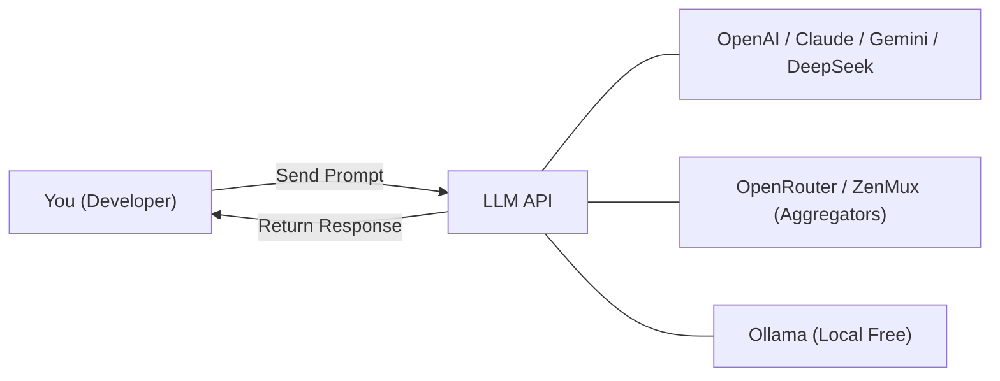
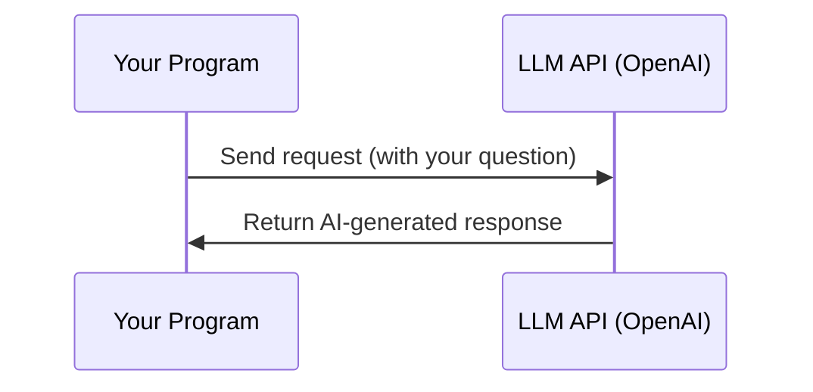

# Chapter 1: Experience AI in 3 Minutes

> After completing this chapter, you will: use 3 lines of Python code to complete your first AI conversation, understand free/low-cost options



## 1.1 Your First AI Conversation <DifficultyBadge level="beginner" /> <CostBadge cost="$0.001" />

> Prerequisites: Basic Python syntax

### Why Do You Need It? (Problem)

Imagine you encounter this scenario at work: you need your program to **understand natural language input** and intelligently generate responses. For example:

- User inputs "Help me summarize this meeting minutes"
- User asks "What bugs are in this code?"
- User says "Translate this English email to Chinese"

In the traditional NLP era, you would need to **collect labeled data → train a model → deploy an inference service**, which could take weeks to months.

Now, by calling an LLM API, you can do it with **3 lines of Python code**.

### What Is It? (Concept)

Large Language Models (LLMs) are AI models trained on massive amounts of text that can understand and generate natural language. You don't need to train a model—just call it via API:



**Before LLMs** vs **After LLMs**:

| Dimension | Traditional NLP | LLM API |
|------|---------|---------|
| Development Cycle | Weeks to months | Minutes |
| Data Required | Large amounts of labeled data | None |
| GPU Required | Training and inference | None (cloud processing) |
| Capability Range | Single task | General (translation, summarization, coding, Q&A...) |

### Try It Yourself (Practice)

We'll use OpenAI's API to complete your first AI conversation. The entire process takes only 3 steps:

**Step 1: Install SDK**

```bash
pip install openai
```

**Step 2: Get API Key**

Go to [OpenAI Platform](https://platform.openai.com/api-keys) to register and create an API Key.

::: tip Don't Have an OpenAI Account?
No worries, the next section [1.2 Free Options & Zero-Cost Start](/01-first-experience/free-options) will introduce multiple free alternatives. You can also skip there first, get a free API Key, and come back.
:::

**Step 3: 3 Lines of Code, Start Chatting**

```python
from openai import OpenAI

client = OpenAI()  # Automatically reads OPENAI_API_KEY environment variable
response = client.chat.completions.create(
    model="gpt-4.1-mini",
    messages=[{"role": "user", "content": "Explain what an API is in one sentence"}],
)
print(response.choices[0].message.content)
```

Run result (example):

```
An API (Application Programming Interface) is a set of rules and protocols that define 
how different software components can interact with each other, allowing applications 
to communicate and share data.
```

That's it! You've completed your first AI conversation.

**Expanding a Bit—Multi-Turn Conversation:**

```python
from openai import OpenAI

client = OpenAI()

messages = [
    {"role": "system", "content": "You are a friendly AI assistant skilled at explaining technical concepts with simple analogies."},
    {"role": "user", "content": "What is an API?"},
]

response = client.chat.completions.create(model="gpt-4.1-mini", messages=messages)
reply = response.choices[0].message.content
print(f"AI: {reply}\n")

messages.append({"role": "assistant", "content": reply})
messages.append({"role": "user", "content": "Can you explain it with a real-life example?"})

response = client.chat.completions.create(model="gpt-4.1-mini", messages=messages)
print(f"AI: {response.choices[0].message.content}")
```

::: info Core Understanding
- `system` message: Sets the AI's role and behavior guidelines
- `user` message: What you say
- `assistant` message: AI's reply (must include conversation history for multi-turn dialogue)
:::

<ColabBadge path="demos/01-first-experience/hello_llm.ipynb" />

### Summary (Reflection)

- **What Did This Solve**: Only 3 lines of code to give your program natural language understanding and generation capabilities, no model training needed
- **What Remains Unsolved**: APIs cost money, different models have varying prices and capabilities—how to use them for free/low-cost? Next section answers this
- **Key Points**:
  1. LLM APIs are "calls" not "training", extremely low barrier to entry
  2. Conversations are passed via the `messages` array, containing three roles: `system/user/assistant`
  3. `gpt-4.1-mini` is currently the most cost-effective entry-level model (OpenAI's GPT-4.1 series launched April 2025, offering the best price-performance ratio; for the latest flagship, see GPT-5)

> *"3 lines of code to talk to an AI. Your grandparents needed 3 years of grad school to do worse. What a time to be alive."*

---

*Last Updated: 2026-02-22*
