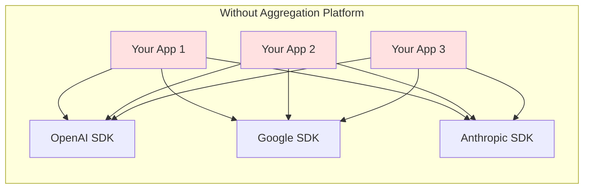
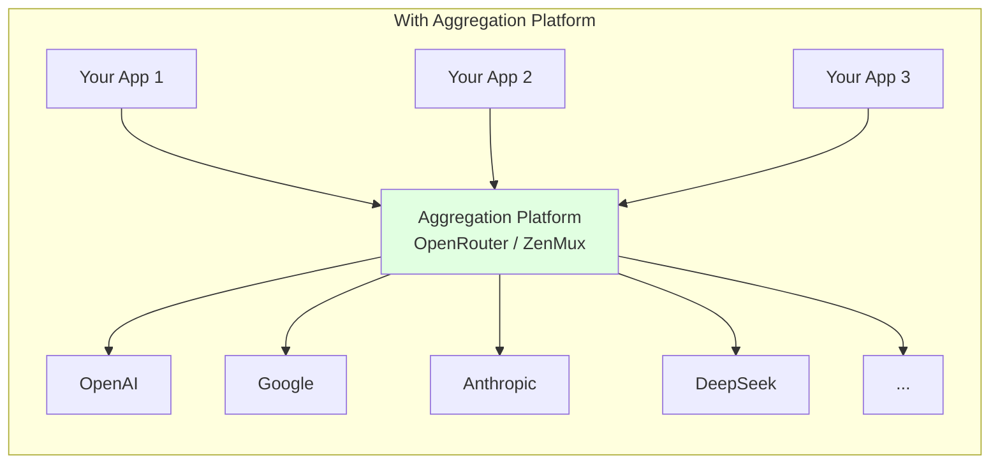
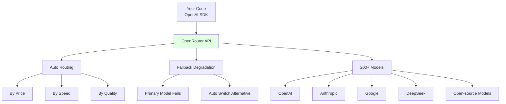

# 2.3 Aggregators & Gateways <DifficultyBadge level="intermediate" /> <CostBadge cost="$0" />

> Prerequisites: 1.2 Free Options & Zero-Cost Start, 2.2 Mainstream Model Providers

### Why Do You Need It? (Problem)

In the previous section, we compared models from OpenAI, Google, and DeepSeek. But you'll find a problem: **each provider's API format is different**.

```python
# OpenAI / DeepSeek (OpenAI-compatible)
from openai import OpenAI
client = OpenAI()
response = client.chat.completions.create(
    model="gpt-4.1-mini",
    messages=[{"role": "user", "content": "Hello"}],
)

# Google Gemini
from google import genai
client = genai.Client()
response = client.models.generate_content(
    model="gemini-2.0-flash",
    contents="Hello",
)

# Anthropic Claude
import anthropic
client = anthropic.Anthropic()
response = client.messages.create(
    model="claude-opus-4.6",
    max_tokens=1024,
    messages=[{"role": "user", "content": "Hello"}],
)
```

**This causes three problems:**

1. **High code maintenance cost**: Switching model providers requires changing lots of code
2. **Difficult model fallback**: When GPT-4o call fails, wanting automatic fallback to GPT-4o-mini requires manual try-except logic
3. **Troublesome multi-model comparison**: Wanting to compare 10 models' responses requires writing 10 sets of code

This is the **N × M problem** in software engineering:



If you have **N applications** and **M model providers**, you need to maintain **N × M** sets of code!

**Aggregation platforms solve this problem:**



You only need to interface with **1 unified interface** to call all models, reducing complexity from **N × M** to **N + M**.

### What Is It? (Concept)

Aggregation platforms are "API gateways for AI models", providing a unified interface format (usually OpenAI API compatible) to call multiple providers' models.

**Mainstream Aggregation Platform Comparison:**

| Platform | Type | Supported Models | Core Advantages | Payment Model |
|-----|------|-----------|---------|---------|
| **OpenRouter** | Third-party aggregator | 200+ | Auto-select optimal model, transparent pricing | Pay-per-use (no markup) |
| **ZenMux** | Third-party aggregator | 50+ | Available in China, supports Alipay | Pay-per-use |
| **Azure OpenAI** | Cloud platform | 10+ | Enterprise SLA, data compliance | Subscription + usage |
| **AWS Bedrock** | Cloud platform | 15+ | AWS ecosystem integration | Pay-per-use |
| **GCP Vertex AI** | Cloud platform | 10+ | GCP ecosystem integration | Pay-per-use |

**Three Core Capabilities of Aggregation Platforms:**

1. **Unified Interface**: One codebase calls all models
2. **Smart Routing**: Automatically select optimal model or fallback alternatives
3. **Cost Optimization**: Compare prices, auto-select most cost-effective models

**OpenRouter Core Features:**



**Cloud Platforms vs Third-Party Aggregators:**

| Dimension | OpenRouter / ZenMux | Azure / AWS / GCP |
|-----|---------------------|-------------------|
| **Model Count** | 200+ | 10-20 |
| **Access Barrier** | Low (register and use) | High (need cloud account) |
| **Price** | Same as official | Usually slightly higher |
| **Enterprise Compliance** | General | Strong (SLA, data compliance) |
| **Suitable Scenarios** | Individual developers, startups | Large enterprises, high compliance scenarios |

### Try It Yourself (Practice)

We'll use OpenRouter to implement "one codebase calling multiple models" and "automatic model fallback".

**Step 1: Get OpenRouter API Key**

1. Go to [OpenRouter](https://openrouter.ai/) to register
2. Create API Key on the [Keys](https://openrouter.ai/keys) page
3. Top up (minimum $5, credit card accepted)

**Step 2: Call OpenRouter with OpenAI SDK**

```python
from openai import OpenAI

# OpenRouter is fully compatible with OpenAI API format
client = OpenAI(
    api_key="YOUR_OPENROUTER_API_KEY",
    base_url="https://openrouter.ai/api/v1",
)

# Call GPT-4o-mini
response = client.chat.completions.create(
    model="openai/gpt-4o-mini",  # Format: provider/model-name
    messages=[{"role": "user", "content": "Introduce Python in one sentence"}],
)
print("【GPT-4o-mini】")
print(response.choices[0].message.content)

# Call Claude Sonnet
response = client.chat.completions.create(
    model="anthropic/claude-sonnet-4.6",
    messages=[{"role": "user", "content": "Introduce Python in one sentence"}],
)
print("\n【Claude Sonnet】")
print(response.choices[0].message.content)

# Call DeepSeek-V3
response = client.chat.completions.create(
    model="deepseek/deepseek-chat",
    messages=[{"role": "user", "content": "Introduce Python in one sentence"}],
)
print("\n【DeepSeek-V3】")
print(response.choices[0].message.content)
```

**Key Points:**
- Just change `base_url` and `model` parameters, rest of code stays the same
- Model name format: `provider/model-name` (e.g., `openai/gpt-4o-mini`, `anthropic/claude-sonnet-4.6`)

**Step 3: Auto Fallback**

```python
from openai import OpenAI

client = OpenAI(
    api_key="YOUR_OPENROUTER_API_KEY",
    base_url="https://openrouter.ai/api/v1",
)

def chat_with_fallback(user_message):
    """
    Prioritize high-quality model, auto fallback to alternatives on failure
    """
    models = [
        "openai/gpt-4o",           # Primary: highest quality but most expensive
        "openai/gpt-4o-mini",      # Backup 1: cost-effective
        "google/gemini-2.0-flash", # Backup 2: large free tier
        "deepseek/deepseek-chat",  # Backup 3: cheapest
    ]
    
    for model in models:
        try:
            print(f"Trying: {model}")
            response = client.chat.completions.create(
                model=model,
                messages=[{"role": "user", "content": user_message}],
                timeout=10,  # 10 second timeout
            )
            print(f"✅ Success! Using model: {model}\n")
            return response.choices[0].message.content
        
        except Exception as e:
            print(f"❌ Failed: {e}\n")
            continue
    
    return "All models failed"

# Test
result = chat_with_fallback("Explain recursion in one sentence")
print("Response:", result)
```

**Step 4: Smart Routing (Auto-Select Optimal Model)**

OpenRouter supports using `model` parameter to specify routing strategy:

```python
# Auto-select cheapest model
response = client.chat.completions.create(
    model="openrouter/auto",  # Auto routing
    messages=[{"role": "user", "content": "Hello"}],
    extra_body={
        "route": "cheapest",  # By price (cheapest / fastest / best)
    },
)
print("Model used:", response.model)

# Auto-select fastest model
response = client.chat.completions.create(
    model="openrouter/auto",
    messages=[{"role": "user", "content": "Hello"}],
    extra_body={
        "route": "fastest",
    },
)
print("Model used:", response.model)
```

**Advanced Technique: Compare Multiple Models' Responses**

```python
import asyncio
from openai import AsyncOpenAI

async def compare_models_async(question, models):
    """
    Concurrently call multiple models, compare responses
    """
    client = AsyncOpenAI(
        api_key="YOUR_OPENROUTER_API_KEY",
        base_url="https://openrouter.ai/api/v1",
    )
    
    async def call_model(model):
        response = await client.chat.completions.create(
            model=model,
            messages=[{"role": "user", "content": question}],
        )
        return {
            "model": model,
            "answer": response.choices[0].message.content,
            "tokens": response.usage.total_tokens,
        }
    
    tasks = [call_model(model) for model in models]
    results = await asyncio.gather(*tasks, return_exceptions=True)
    
    return results

# Test: Compare 5 models simultaneously
models = [
    "openai/gpt-4o-mini",
    "anthropic/claude-sonnet-4.6",
    "google/gemini-2.0-flash",
    "deepseek/deepseek-chat",
    "qwen/qwen-2.5-72b-instruct",
]

results = asyncio.run(compare_models_async(
    "Explain Docker in one sentence",
    models
))

for result in results:
    if isinstance(result, dict):
        print(f"\n【{result['model']}】")
        print(result['answer'])
        print(f"Tokens: {result['tokens']}")
```

<ColabBadge path="demos/02-ai-landscape/openrouter_demo.ipynb" />

**Using ZenMux (Domestic Alternative):**

ZenMux is similar to OpenRouter but supports domestic payment methods:

```python
from openai import OpenAI

client = OpenAI(
    api_key="YOUR_ZENMUX_API_KEY",
    base_url="https://api.zenmux.com/v1",
)

response = client.chat.completions.create(
    model="gpt-4.1-mini",  # ZenMux model names don't need prefix
    messages=[{"role": "user", "content": "Hello"}],
)
print(response.choices[0].message.content)
```

### Summary (Reflection)

- **What Did This Solve**: Through aggregation platforms, use one codebase (OpenAI SDK) to call all models, easily implement model switching and fallback
- **What Remains Unsolved**: Aggregation platforms still need internet and cost money. What if you want zero-cost, offline operation? Next section introduces local model deployment
- **Key Points**:
  1. **Aggregation platforms solve N×M problem**: Reduce from N×M to N+M complexity
  2. **OpenRouter recommended**: Supports 200+ models, transparent pricing, auto routing
  3. **Cloud platforms for enterprises**: Azure / AWS / GCP provide SLA and compliance guarantees
  4. **Core technology**: Unified interface (OpenAI SDK) + auto fallback (try-except)

---

*Last Updated: 2026-02-20*
