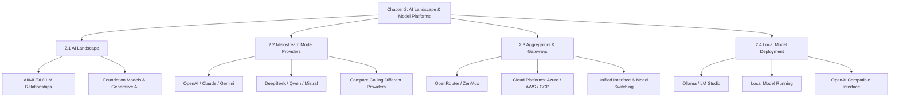
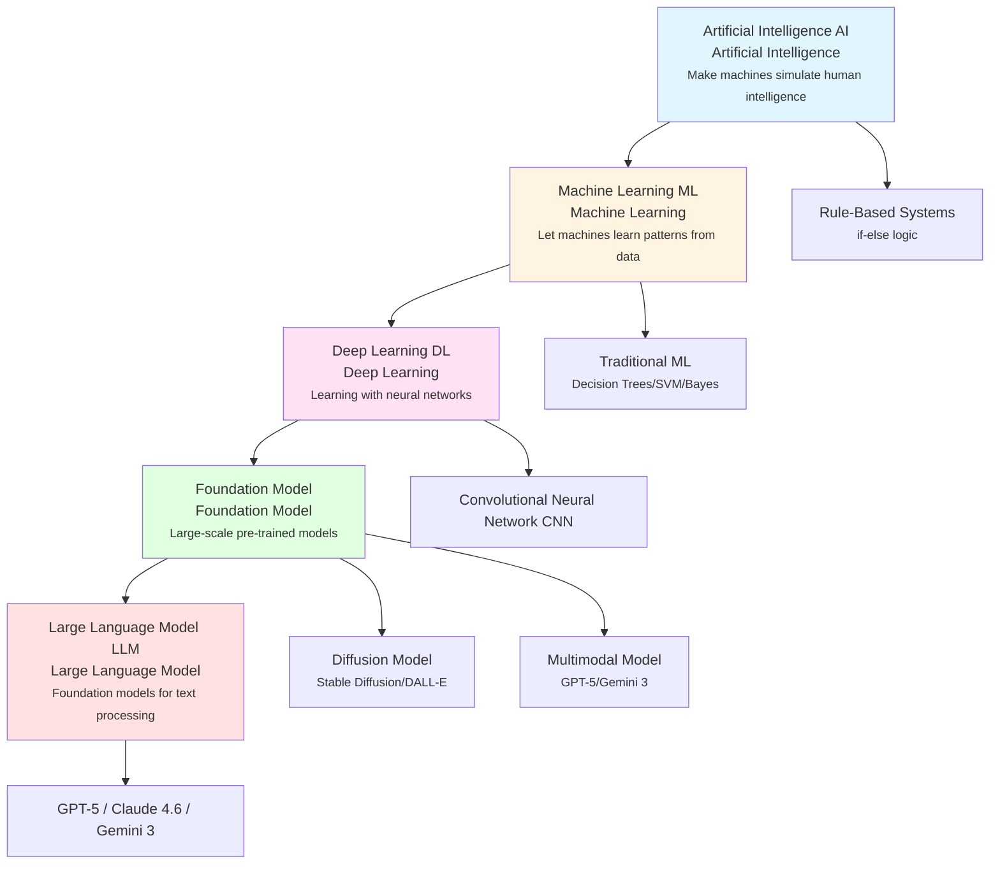
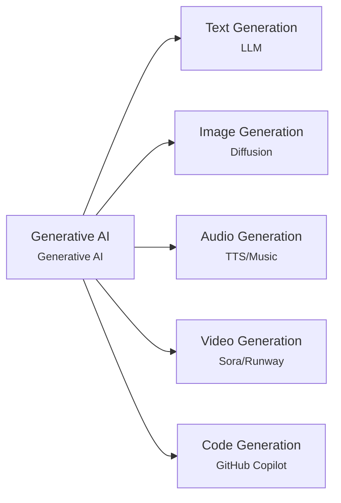

# Chapter 2: AI Landscape & Model Platforms

> After completing this chapter, you will: understand AI technology hierarchy relationships, master mainstream model platforms and aggregation gateways, understand local deployment options

## 2.1 AI Landscape <DifficultyBadge level="beginner" /> <CostBadge cost="$0" />

> Prerequisites: None

### Why Do You Need It? (Problem)

When you start getting into AI programming, you'll encounter a bunch of confusing abbreviations:

- "We use **AI** for intelligent customer service"
- "This project is based on **ML** algorithms"
- "Now everyone uses **DL**, traditional ML is outdated"
- "**LLM** is the hottest direction"
- "**Generative AI** has changed the entire industry"

What's the relationship between these terms? Are they different names for the same thing, or completely different technologies?

**If you don't clarify these concept hierarchies, you'll face these problems:**

1. **Communication barriers**: When someone says "our LLM system," you don't know what they're talking about
2. **Selection confusion**: Don't know which technology category your needs fall into
3. **Learning confusion**: Don't know whether to learn ML, DL, or go straight to LLM

### What Is It? (Concept)

AI, ML, DL, and LLM are **progressively nested relationships**, like "fruit → citrus → orange → navel orange":

**Key Understanding:**

| Level | Definition | Examples |
|-----|------|------|
| **AI (Artificial Intelligence)** | All technologies that make machines simulate human intelligence | Game AI, expert systems, recommendation systems, chatbots |
| **ML (Machine Learning)** | Let machines automatically learn patterns from data, not hand-written rules | Spam filtering, house price prediction, user profiling |
| **DL (Deep Learning)** | Machine learning implemented with multi-layer neural networks | Image recognition, speech recognition, machine translation |
| **Foundation Model** | General-purpose models pre-trained on large-scale data, adaptable to multiple downstream tasks | GPT, BERT, CLIP, Stable Diffusion |
| **LLM (Large Language Model)** | Foundation models specialized for text processing (tens of billions to trillions of parameters) | GPT-5, Claude Opus 4.6, Gemini 3.1 Pro, DeepSeek-V3.2 |

**Position of Generative AI:**

Generative AI **is not a technology level**, but a **capability label**, referring to AI that can "generate" new content:

- **Text generation**: LLM (ChatGPT, Claude)
- **Image generation**: Diffusion Model (Stable Diffusion, Midjourney, DALL-E)
- **Audio generation**: TTS, music generation (Suno, Udio)
- **Video generation**: Sora, Runway, Pika

**Major AI Subfields:**

| Subfield | English | Application Scenarios | Is it Generative AI |
|-------|------|---------|-----------------|
| Natural Language Processing | NLP | Translation, Q&A, text classification | Partially (LLM) |
| Computer Vision | CV | Face recognition, object detection, image classification | Partially (image generation) |
| Speech Recognition | ASR | Speech-to-text | No |
| Text-to-Speech | TTS | Text-to-speech | Yes |
| Recommendation Systems | RecSys | E-commerce recommendations, video recommendations | No |
| Reinforcement Learning | RL | Game AI, robot control | No |

### Try It Yourself (Practice)

This section is purely conceptual, with no code demonstrations. But you can use these knowledge points to verify your understanding:

**Quiz: Determine if the following statements are correct**

1. "All ML is DL" ❌ (ML includes traditional algorithms, DL is just a subset of ML)
2. "All LLMs are foundation models" ✅ (LLMs are a type of foundation model)
3. "ChatGPT is a type of AI" ✅ (LLM → Foundation Model → DL → ML → AI)
4. "Generative AI can only generate text" ❌ (Can also generate images, audio, video, etc.)
5. "Traditional ML is outdated" ❌ (Still mainstream in tabular data, recommendation systems, etc.)

::: tip Fun Fact
GPT-5's "unified routing" architecture quietly routes simple questions to a cheaper/faster sub-model — OpenAI is secretly saving you money. It's like ordering a premium burger and the kitchen decides your simple question only needs a regular patty. You still get charged premium prices though... so maybe not THAT generous.
:::

**Knowledge Card: Why Are They Called "Large" Language Models?**

"Large" refers to **parameter count** (the model's learning capacity):

| Model | Parameters | Analogy |
|-----|-------|-----|
| GPT-2 (2019) | 1.5B (1.5 billion) | Elementary student |
| GPT-3 (2020) | 175B (175 billion) | College student |
| GPT-4 (2023) | 1.76T (1.76 trillion, rumored) | Expert |
| DeepSeek-V3.2 (2025) | 671B (671 billion, 37B activated via MoE) | Graduate student |
| GPT-5 (2025) | Unified routing architecture (auto-routes to fast or deep reasoning model) | Expert team |

Larger parameter counts usually mean stronger capabilities, but also more expensive and slower.

::: tip 2025-2026 AI Model Landscape Shifts
Three major trends are reshaping the model landscape:
1. **Rise of Reasoning Models**: OpenAI o1/o3, DeepSeek-R1 introduced "thinking" capabilities — models that spend extra compute to reason step-by-step before answering, dramatically improving complex problem-solving
2. **Open-Source Closing the Gap**: DeepSeek-V3.2, Qwen 2.5, Llama 4 now rival proprietary models in many benchmarks, with DeepSeek offering API pricing 10-50x cheaper than OpenAI
3. **Unified Routing Architecture**: GPT-5 pioneered the concept of a "unified system" that automatically routes simple queries to a fast model and complex problems to a deep reasoning model — blurring the line between model tiers
:::

### Summary (Reflection)

- **What Did This Solve**: Clarified the hierarchy relationships of AI/ML/DL/LLM, understand generative AI is a capability label not a technology level
- **What Remains Unsolved**: Now know the concepts, but with so many model providers (OpenAI, Claude, Gemini...), how to choose? Next section answers this
- **Key Points**:
  1. AI ⊃ ML ⊃ DL ⊃ Foundation Model ⊃ LLM (progressively nested)
  2. LLM is currently the hottest AI direction, and the focus of this guide
  3. Generative AI is a capability that includes text, image, audio, and video generation

---

*Last Updated: 2026-02-20*
