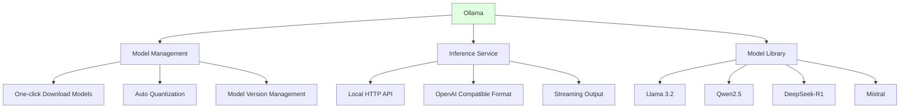

# 2.4 Local Model Deployment <DifficultyBadge level="intermediate" /> <CostBadge cost="$0" />

> Prerequisites: 1.2 Free Options & Zero-Cost Start

### Why Do You Need It? (Problem)

The solutions introduced in previous sections all require **online access to cloud APIs**. But in actual work, you may encounter these scenarios:

1. **Data privacy requirements**: Company doesn't allow sensitive data uploaded to cloud (e.g., healthcare, finance, legal)
2. **Cost control**: High-volume API calls are expensive, want zero-cost operation
3. **Network restrictions**: Offline environments (e.g., airplanes, internal networks) cannot access external networks
4. **Learning research**: Want to deeply understand model principles, need local experimentation

**Cloud API vs Local Deployment Comparison:**

| Dimension | Cloud API | Local Deployment |
|-----|---------|---------|
| **Cost** | Pay-per-use ($0.15~$60/1M tokens) | Hardware cost (one-time), then free |
| **Latency** | 100~2000ms (depends on network) | 10~500ms (depends on hardware) |
| **Data Privacy** | Data uploaded to cloud | Data stays local |
| **Model Selection** | Closed-source models (GPT/Claude/Gemini) | Open-source models (Llama/Qwen/Mistral) |
| **Hardware Requirements** | None | Medium-high (recommend 16GB+ RAM) |
| **Maintenance Cost** | None | Need to update models yourself |

**Scenarios Suitable for Local Deployment:**
- 💰 **Cost-sensitive**: High-volume calls, high API costs
- 🔒 **Data privacy**: Cannot upload to cloud
- ⚡ **Low latency**: Need extremely fast response (<100ms)
- 🛠️ **Deep customization**: Need to fine-tune models or modify inference logic

### What Is It? (Concept)

Local model deployment means running open-source LLMs (like Llama, Qwen, DeepSeek) on your own computer/server, no internet required.

**Mainstream Local Deployment Tool Comparison:**

| Tool | Positioning | Advantages | Disadvantages | Recommended Scenarios |
|-----|-----|------|------|---------|
| **Ollama** | Command-line tool | Simple, fast, open-source | Basic interface | Developers, script calling |
| **LM Studio** | Desktop application | User-friendly GUI, supports quantization | Limited features | Non-technical users |
| **llama.cpp** | Low-level engine | Best performance, supports all platforms | Requires compilation | Advanced users, production |
| **vLLM** | Server framework | High concurrency, batch optimization | Complex configuration | Production, multi-user scenarios |

**Model Size vs Hardware Requirements:**

| Parameters | Memory Usage (FP16) | Memory Usage (4-bit Quantized) | Recommended Hardware | Typical Models |
|-------|----------------|---------------------|---------|---------|
| **7B** | ~14GB | ~4GB | 8GB RAM | Llama 3.2, Qwen2.5-7B |
| **14B** | ~28GB | ~8GB | 16GB RAM | Qwen2.5-14B |
| **32B** | ~64GB | ~16GB | 32GB RAM | DeepSeek-V3 |
| **70B** | ~140GB | ~35GB | 64GB RAM | Llama 3.1-70B |

::: tip Quantization Technology
Quantization is compressing model weights from 16-bit to 4-bit/8-bit, reducing memory usage by 70%, with 1-5% precision loss. In most scenarios, 4-bit quantized models are sufficient.
:::

**Ollama Core Features:**



**Significance of OpenAI Compatible Interface:**

Ollama's local API format is fully compatible with OpenAI, meaning you can **switch from cloud API to local with zero code changes**:

```python
# Cloud API (OpenAI)
from openai import OpenAI
client = OpenAI(api_key="sk-...")
response = client.chat.completions.create(
    model="gpt-4.1-mini",
    messages=[{"role": "user", "content": "Hello"}],
)

# Local API (Ollama) - just change two lines
from openai import OpenAI
client = OpenAI(
    base_url="http://localhost:11434/v1",  # Change here
    api_key="ollama",                       # Can be anything (Ollama doesn't verify)
)
response = client.chat.completions.create(
    model="qwen2.5:7b",                    # Change here
    messages=[{"role": "user", "content": "Hello"}],
)
```

### Try It Yourself (Practice)

We'll use Ollama to deploy a 7B model locally and call it with OpenAI SDK.

**Step 1: Install Ollama**

**macOS / Linux:**

```bash
curl -fsSL https://ollama.com/install.sh | sh
```

**Windows:**

Go to [Ollama official site](https://ollama.com/download) to download installer.

**Verify installation:**

```bash
ollama --version
# Output: ollama version is 0.4.0
```

**Step 2: Download and Run Model**

Ollama provides one-command download and run:

```bash
# Download Qwen2.5-7B (~4.7GB, quantized)
ollama run qwen2.5:7b
```

First run will auto-download model, then enter interactive chat:

```
>>> Hello
Hello! How can I help you today?

>>> Explain Docker in one sentence
Docker is an open-source containerization platform for automating application deployment, scaling, and management.

>>> /bye
```

::: tip Common Commands
- `ollama list`: View downloaded models
- `ollama rm <model>`: Delete model
- `ollama pull <model>`: Download only, don't run
- `ollama serve`: Start API service (background)
:::

**Step 3: Call Local Model via API**

Ollama automatically starts HTTP service in background (default port 11434), we can call it with OpenAI SDK:

```python
from openai import OpenAI

# Connect to local Ollama service
client = OpenAI(
    base_url="http://localhost:11434/v1",
    api_key="ollama",  # Ollama doesn't verify key, can be anything
)

# Call local model
response = client.chat.completions.create(
    model="qwen2.5:7b",  # Model name must match ollama list
    messages=[
        {"role": "system", "content": "You are a professional Python programming assistant"},
        {"role": "user", "content": "Write a function to check if a number is prime"},
    ],
)

print(response.choices[0].message.content)
```

**Run Result:**

```python
def is_prime(n):
    """Check if a number is prime"""
    if n <= 1:
        return False
    if n <= 3:
        return True
    if n % 2 == 0 or n % 3 == 0:
        return False
    i = 5
    while i * i <= n:
        if n % i == 0 or n % (i + 2) == 0:
            return False
        i += 6
    return True

# Test
print(is_prime(17))  # True
print(is_prime(18))  # False
```

**Step 4: Streaming Output (Real-time Display of Generated Content)**

```python
from openai import OpenAI

client = OpenAI(
    base_url="http://localhost:11434/v1",
    api_key="ollama",
)

response = client.chat.completions.create(
    model="qwen2.5:7b",
    messages=[{"role": "user", "content": "Introduce Python's history in 100 words"}],
    stream=True,  # Enable streaming
)

print("AI: ", end="", flush=True)
for chunk in response:
    if chunk.choices[0].delta.content:
        print(chunk.choices[0].delta.content, end="", flush=True)
print()
```

**Effect: Character-by-character output, like ChatGPT.**

**Step 5: Compare Local Model with Cloud Model**

```python
import time
from openai import OpenAI

def benchmark_model(client, model, question):
    """Test model speed and quality"""
    start = time.time()
    
    response = client.chat.completions.create(
        model=model,
        messages=[{"role": "user", "content": question}],
    )
    
    latency = time.time() - start
    answer = response.choices[0].message.content
    tokens = response.usage.total_tokens
    
    return {
        "model": model,
        "latency": f"{latency:.2f}s",
        "tokens": tokens,
        "answer": answer[:100] + "...",  # Show first 100 chars only
    }

# Local model
local_client = OpenAI(base_url="http://localhost:11434/v1", api_key="ollama")
local_result = benchmark_model(local_client, "qwen2.5:7b", "What is recursion?")

# Cloud model (requires OPENAI_API_KEY)
cloud_client = OpenAI()
cloud_result = benchmark_model(cloud_client, "gpt-4o-mini", "What is recursion?")

print("【Local Model】Qwen2.5-7B")
print(f"Latency: {local_result['latency']} | Tokens: {local_result['tokens']}")
print(f"Response: {local_result['answer']}\n")

print("【Cloud Model】GPT-4o-mini")
print(f"Latency: {cloud_result['latency']} | Tokens: {cloud_result['tokens']}")
print(f"Response: {cloud_result['answer']}")
```

**Typical Result (MacBook Pro M2, 16GB):**

```
【Local Model】Qwen2.5-7B
Latency: 1.23s | Tokens: 87
Response: Recursion is a programming technique where a function calls itself during execution. It's typically used to solve problems that can be broken down into similar subproblems...

【Cloud Model】GPT-4o-mini
Latency: 0.86s | Tokens: 92
Response: Recursion is a programming concept where a function calls itself in its definition. This method is commonly used to solve tasks that can be broken down into smaller, similar problems...
```

**Advanced Technique: Customize Models Using Modelfile**

Ollama supports creating custom models with `Modelfile` (like Dockerfile):

```bash
# Create Modelfile
cat > Modelfile <<EOF
FROM qwen2.5:7b

# Set system prompt
SYSTEM """
You are a professional Python programming assistant, skilled at:
1. Writing clear, efficient Python code
2. Explaining complex programming concepts
3. Providing best practice recommendations
"""

# Set parameters
PARAMETER temperature 0.7
PARAMETER top_p 0.9
EOF

# Create custom model
ollama create my-python-assistant -f Modelfile

# Use custom model
ollama run my-python-assistant
```

**Recommended Models:**

| Model | Parameters | Specialization | Download Command |
|-----|-------|---------|---------|
| **qwen2.5:7b** | 7B | Chinese, code, general | `ollama run qwen2.5:7b` |
| **llama3.2:3b** | 3B | English, fast, low resources | `ollama run llama3.2:3b` |
| **deepseek-r1:7b** | 7B | Reasoning, math, logic | `ollama run deepseek-r1:7b` |
| **codellama:7b** | 7B | Code generation, completion | `ollama run codellama:7b` |
| **mistral:7b** | 7B | Multilingual, general | `ollama run mistral:7b` |

<ColabBadge path="demos/02-ai-landscape/ollama_demo.ipynb" />

**Using LM Studio (GUI Alternative):**

If you don't like command-line, use LM Studio:

1. Go to [LM Studio](https://lmstudio.ai/) to download desktop app
2. Download models in "Model Search" (e.g., `qwen2.5-7b`)
3. Click "Start Server", starts API at `http://localhost:1234`
4. Connect with OpenAI SDK: `base_url="http://localhost:1234/v1"`

### Summary (Reflection)

- **What Did This Solve**: Use Ollama to run open-source LLMs locally for free, data doesn't go to cloud, zero API cost, offline-capable
- **What Remains Unsolved**: Local models' capabilities (7B/14B) are weaker than cloud flagship models (GPT-4o/Claude). How to deeply understand LLM working principles and use them better? Next chapter (Chapter 3: LLM Core Principles) answers this
- **Key Points**:
  1. **Ollama recommended**: Command-line tool, one-click download and run, supports OpenAI compatible API
  2. **Hardware requirements**: 7B models need 8GB+ RAM, 14B need 16GB+, quantization reduces usage by 70%
  3. **Model recommendations**: Qwen2.5-7B (Chinese+code), Llama3.2-3B (fast), DeepSeek-R1 (reasoning)
  4. **Zero-code switching**: Local API compatible with OpenAI format, just change `base_url` and `model`
  5. **Suitable scenarios**: Data privacy, cost control, offline environments, learning research

---

**Chapter 2 Complete!**

You've now mastered:
1. ✅ Hierarchy relationships of AI/ML/DL/LLM
2. ✅ Characteristics and selection strategies of mainstream model providers
3. ✅ Using aggregation platforms (OpenRouter)
4. ✅ Local model deployment (Ollama)

In the next chapter, we'll dive into **LLM working principles**, learning how to improve AI response quality through parameter tuning and Prompt Engineering.

---

*Last Updated: 2026-02-20*
