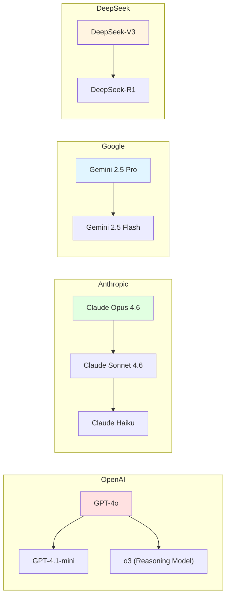

# 2.2 Mainstream Model Providers <DifficultyBadge level="beginner" /> <CostBadge cost="$0.01" />

> Prerequisites: 1.1 Your First AI Conversation

### Why Do You Need It? (Problem)

When you decide to start building AI applications, the first question is: **which model provider to use?**

Mainstream model providers on the market include:

- **OpenAI**: The company behind ChatGPT, first to commercialize LLMs
- **Anthropic**: Claude series, emphasizes safety and long-context
- **Google**: Gemini series, strong multimodal capabilities
- **DeepSeek**: Domestic open-source, extremely cost-effective
- **Alibaba**: Qwen (Tongyi Qianwen) series
- **Mistral**: European open-source LLM

Everyone claims to be the best, but in actual scenarios:

- **Huge price differences**: Some $0.15/1M tokens, others $60/1M tokens (400x difference)
- **Each excels differently**: Some excel at coding, some at long-text, some at multiple languages
- **Different API interfaces**: OpenAI uses `openai` SDK, Google uses `google-genai`, switching models requires code changes

**Your dilemma:**
- Don't know which model suits your scenario
- Worried about high switching costs after choosing wrong
- Want to compare effects of different models, but need to write several sets of code

### What Is It? (Concept)

**Mainstream Model Provider Comparison:**

| Provider | Flagship Models | Core Advantages | Price Range | Suitable Scenarios |
|-------|---------|---------|---------|---------|
| **OpenAI** | GPT-5, GPT-4.1-mini, o3 | Strongest overall capability, most complete ecosystem | 💰💰💰 High | High-quality requirement scenarios |
| **Anthropic** | Claude Opus 4.6, Sonnet 4.6, Haiku | Long-context (200k tokens), good safety alignment | 💰💰💰 High | Legal documents, academic research, enterprise knowledge bases |
| **Google** | Gemini 2.5 Flash, Gemini 2.5 Pro | Multimodal (image/video), large free tier | 💰💰 Medium | Image understanding, video analysis, real-time interaction |
| **DeepSeek** | DeepSeek-V3, DeepSeek-R1 | Extremely cost-effective (open-source), strong reasoning | 💰 Low | Coding, math, logical reasoning |
| **Alibaba** | Qwen2.5, Qwen2.5-Coder | Strong Chinese capability, good code generation | 💰 Low | Chinese applications, code generation |
| **Mistral** | Mistral Large 2, Mistral Small | European open-source, supports function calling | 💰💰 Medium | EU compliance, multilingual applications |

**Price Comparison (Input / Output, Unit: $/1M tokens):**

| Model | Input Price | Output Price | Cost-Effectiveness |
|-----|---------|---------|--------|
| GPT-4o | $2.50 | $10.00 | ⭐⭐ |
| GPT-4.1-mini | $0.40 | $1.60 | ⭐⭐⭐⭐⭐ |
| Claude Opus 4.6 | $15.00 | $75.00 | ⭐ |
| Claude Sonnet 4.6 | $3.00 | $15.00 | ⭐⭐⭐ |
| Gemini 2.5 Flash | $0.075 | $0.30 | ⭐⭐⭐⭐⭐ |
| Gemini 2.5 Pro | $1.25 | $5.00 | ⭐⭐⭐⭐ |
| DeepSeek-V3 | $0.27 | $1.10 | ⭐⭐⭐⭐⭐ |
| Qwen2.5 | $0.12 | $0.40 | ⭐⭐⭐⭐⭐ |

::: tip Price Fluctuation Notice
AI model prices change frequently, the above data is from February 2026 for reference. For latest prices, check each platform's official website.
:::

**Model Generations & Naming Patterns:**



**Naming Pattern Interpretation:**

- **OpenAI**: `GPT-4o` (omni, multimodal), `mini` (lightweight), `o3` (reasoning-enhanced)
- **Anthropic**: `Opus` (strongest), `Sonnet` (balanced), `Haiku` (fast)
- **Google**: `Pro` (professional), `Flash` (fast), version numbers (2.0/2.5)
- **DeepSeek**: `V3` (version 3), `R1` (Reasoning model)

### Try It Yourself (Practice)

We'll use the same question to call models from OpenAI, Google, and DeepSeek, comparing their responses.

**Scenario: Have AI explain a programming concept**

```python
# Install dependencies
# pip install openai google-genai

import os
from openai import OpenAI
from google import genai

# Test question
question = "Use a real-life analogy to explain what an API is. Requirements: concise, interesting, easy to understand"

print("=" * 60)
print("Question:", question)
print("=" * 60)

# 1. OpenAI GPT-4.1-mini
print("\n【OpenAI GPT-4.1-mini】")
openai_client = OpenAI(api_key=os.getenv("OPENAI_API_KEY"))
response = openai_client.chat.completions.create(
    model="gpt-4.1-mini",
    messages=[{"role": "user", "content": question}],
)
print(response.choices[0].message.content)
print(f"💰 Cost: input {response.usage.prompt_tokens} tokens, output {response.usage.completion_tokens} tokens")

# 2. Google Gemini 2.5 Flash
print("\n【Google Gemini 2.5 Flash】")
google_client = genai.Client(api_key=os.getenv("GOOGLE_API_KEY"))
response = google_client.models.generate_content(
    model="gemini-2.0-flash",
    contents=question,
)
print(response.text)
print(f"💰 Cost: input {response.usage_metadata.prompt_token_count} tokens, output {response.usage_metadata.candidates_token_count} tokens")

# 3. DeepSeek-V3 (using OpenAI SDK, because DeepSeek is OpenAI API compatible)
print("\n【DeepSeek-V3】")
deepseek_client = OpenAI(
    api_key=os.getenv("DEEPSEEK_API_KEY"),
    base_url="https://api.deepseek.com",
)
response = deepseek_client.chat.completions.create(
    model="deepseek-chat",
    messages=[{"role": "user", "content": question}],
)
print(response.choices[0].message.content)
print(f"💰 Cost: input {response.usage.prompt_tokens} tokens, output {response.usage.completion_tokens} tokens")
```

**Run Result Comparison (Example):**

```
============================================================
Question: Use a real-life analogy to explain what an API is. Requirements: concise, interesting, easy to understand
============================================================

【OpenAI GPT-4.1-mini】
An API is like a restaurant menu: you don't need to know how the kitchen prepares food, you just 
need to tell the waiter what you want, the waiter passes the order to the kitchen, and when ready, 
the waiter brings it to you. You just need to "order", without understanding back-of-house operations.
💰 Cost: input 28 tokens, output 67 tokens

【Google Gemini 2.5 Flash】
Imagine you go to a coffee shop for coffee. You don't need to know how the coffee machine works, 
you just tell the barista "I want a latte", and the barista will make it for you. The API is like 
the barista—you request a service through it, it handles complex operations, then returns results.
💰 Cost: input 29 tokens, output 59 tokens

【DeepSeek-V3】
An API is like a hotel reception: when you want to book a room, check bills or call room service, 
you don't need to run directly to the warehouse or kitchen, just tell reception. Reception coordinates 
various departments and gives you results. You only need to know "how to talk to reception", without 
understanding the hotel's internal operations.
💰 Cost: input 30 tokens, output 81 tokens
```

**Comparative Analysis:**

| Dimension | OpenAI | Google | DeepSeek |
|-----|--------|--------|----------|
| Analogy Quality | Restaurant menu (common) | Coffee shop (common) | Hotel reception (more systematic) |
| Clarity | ⭐⭐⭐⭐ | ⭐⭐⭐⭐ | ⭐⭐⭐⭐⭐ |
| Output Length | 67 tokens | 59 tokens | 81 tokens |
| Estimated Cost | $0.00005 | $0.000004 | $0.00010 |

::: tip Practical Usage Recommendations
- **High-quality scenarios** (content creation, customer service): OpenAI GPT-4o / Claude Opus
- **Cost-effective scenarios** (internal tools, batch processing): GPT-4.1-mini / Gemini Flash / DeepSeek
- **Multimodal scenarios** (image understanding, video analysis): Gemini 2.5 Flash / GPT-4o
- **Chinese scenarios** (Chinese Q&A, Chinese writing): Qwen / DeepSeek / Gemini
:::

**Advanced Technique: Model Comparison Tool**

```python
def compare_models(question, models_config):
    """
    Compare responses from multiple models
    
    models_config format:
    [
        {"name": "GPT-4.1-mini", "client": openai_client, "model": "gpt-4.1-mini"},
        {"name": "Gemini Flash", "client": google_client, "model": "gemini-2.0-flash"},
    ]
    """
    results = []
    
    for config in models_config:
        start_time = time.time()
        
        if "openai" in str(type(config["client"])):
            response = config["client"].chat.completions.create(
                model=config["model"],
                messages=[{"role": "user", "content": question}],
            )
            answer = response.choices[0].message.content
            tokens = response.usage.total_tokens
        else:  # Google
            response = config["client"].models.generate_content(
                model=config["model"],
                contents=question,
            )
            answer = response.text
            tokens = response.usage_metadata.total_token_count
        
        latency = time.time() - start_time
        
        results.append({
            "model": config["name"],
            "answer": answer,
            "tokens": tokens,
            "latency": f"{latency:.2f}s",
        })
    
    return results
```

<ColabBadge path="demos/02-ai-landscape/compare_providers.ipynb" />

### Summary (Reflection)

- **What Did This Solve**: Learned characteristics, pricing, and suitable scenarios of mainstream model providers, can choose appropriate models based on needs
- **What Remains Unsolved**: Each provider's API format is different, wanting to switch models or implement model fallback requires code changes—what to do? Next section introduces aggregation platforms
- **Key Points**:
  1. **OpenAI / Claude**: Highest quality, highest price, suitable for high-value scenarios
  2. **Gemini / DeepSeek / Qwen**: Cost-effective, suitable for large-scale applications
  3. **Different models excel at different tasks**: Selection requires actual testing and comparison
  4. **DeepSeek is OpenAI API compatible**: Can use `openai` SDK, just change `base_url`

---

*Last Updated: 2026-02-20*
