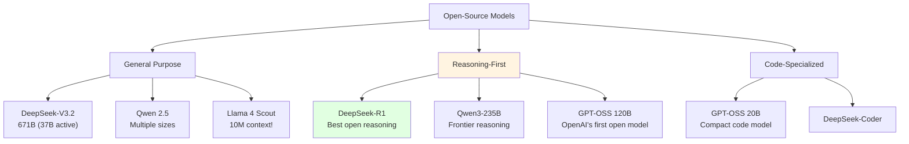
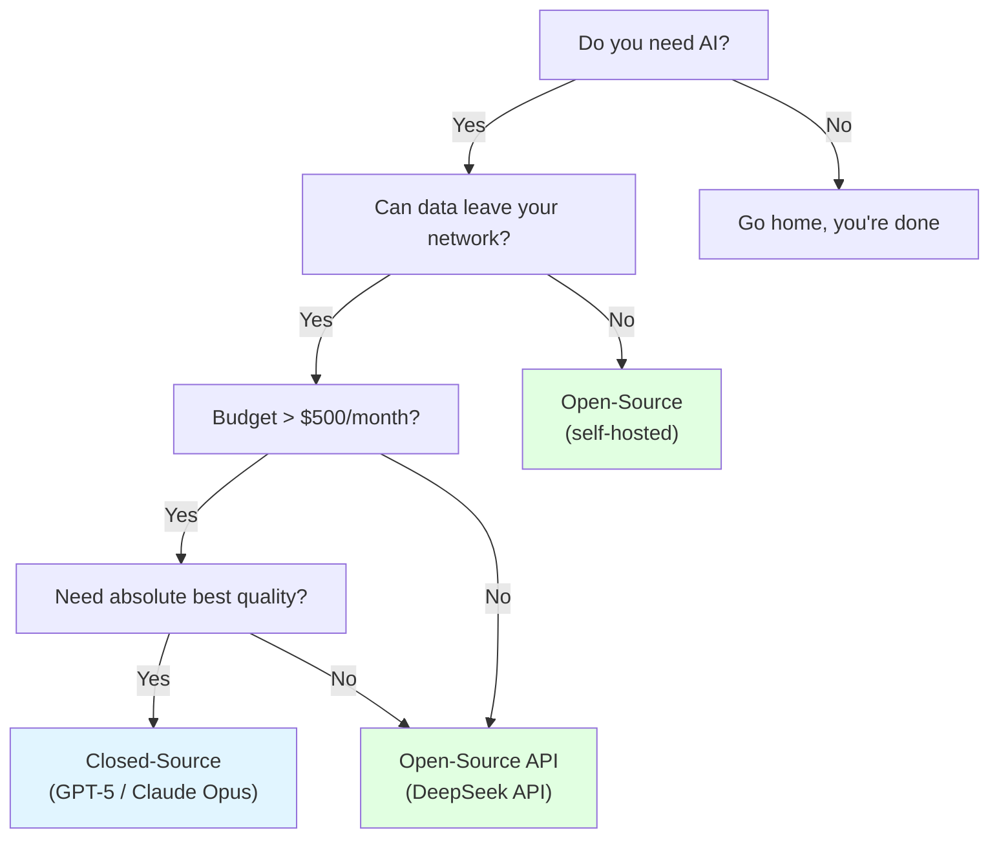

# 2.5 Open-Source Reasoning Models

<DifficultyBadge level="beginner" />
<CostBadge cost="$0" />

> Prerequisites: 2.1 AI Landscape

### Why Do We Need It? (Problem)

You've been happily calling GPT-5 and Claude Opus 4.6 APIs when your boss walks in:

> "The monthly AI bill is HOW MUCH?! Can't we just run something locally?"

Or maybe you work in healthcare / finance / government where **data cannot leave the building**. Sending patient records to OpenAI's API? That's not a career move, that's a career-ending move.

**Open-source models solve three problems:**

1. **Cost** — Run locally, pay only for electricity (and your GPU's therapy bills)
2. **Privacy** — Data never leaves your infrastructure
3. **Customization** — Fine-tune for your specific domain without asking permission

::: tip Fun Fact
DeepSeek-V3.2 matches GPT-5 on many benchmarks while costing 10-50x less via their API. The open-source AI revolution isn't coming — it already happened while we were arguing about which proprietary model is better.
:::

### What Is It? (Concept)

**The 2026 Open-Source Model Landscape:**



**Key Players:**

| Model | Params | Strengths | Context | Vibe Check |
|-------|--------|-----------|---------|------------|
| **DeepSeek-V3.2** | 671B (37B active, MoE) | GPT-5 level general performance, absurdly cheap API | 128K | "The model that made OpenAI nervous" |
| **DeepSeek-R1** | 671B | Best open-source reasoning, shows thinking process | 128K | "Watches the AI think out loud — fascinating and terrifying" |
| **Qwen 2.5 / Qwen3** | 0.5B-235B | Multi-size lineup, excellent Chinese support | 128K | "China's Swiss Army knife of AI" |
| **Llama 4 Scout** | MoE | 10 MILLION token context window | 10M | "Could read every Harry Potter book at once" |
| **GPT-OSS 120B** | 120B | OpenAI's first open model, strong reasoning | varies | "OpenAI finally said 'fine, have some open source'" |
| **GPT-OSS 20B** | 20B | Compact, runs on a single GPU, great for code | varies | "The model you can actually run on your laptop" |

::: warning Common Mistake
"Open-source = free to run" is misleading. Running DeepSeek-R1 at full precision requires ~1.3TB of VRAM. That's roughly 16 A100 GPUs. Most people use **quantized versions** (GGUF/GPTQ) that fit on consumer hardware with some quality trade-off.
:::

**Open-Source vs Closed-Source Decision Tree:**



::: info Soul-Searching Question
If DeepSeek's API costs $0.28 per million input tokens (vs GPT-5's $1.25), and the quality is "close enough" for 80% of tasks... why are you still paying 5x more? Is it the brand name? The familiar API? Be honest.
:::

### How to Run Locally

**Option 1: Ollama (Easiest)**

```bash
# Install
curl -fsSL https://ollama.ai/install.sh | sh

# Run a model
ollama run deepseek-r1:8b

# Or run with API
ollama serve  # Starts OpenAI-compatible API on localhost:11434
```

**Option 2: LM Studio (GUI)**
- Download from [lmstudio.ai](https://lmstudio.ai)
- Browse and download models from the UI
- One-click local API server

### Summary (Reflection)

- **What we solved**: Understood open-source model options for cost savings, privacy, and customization
- **What remains**: Know the models, but when should you fine-tune vs use RAG vs prompt engineering? — Chapter 3.4 covers Fine-tuning
- **Key takeaways**:
  1. Open-source models in 2026 rival proprietary ones in many tasks
  2. DeepSeek-R1 = best open reasoning; Llama 4 Scout = largest context; Qwen = best multilingual
  3. Running locally requires significant hardware — quantized versions are your friend
  4. The real question isn't "open vs closed" but "what's the cheapest option that meets my quality bar"

> *"The best model is the one that solves your problem without bankrupting your department."*

---

*Last updated: 2026-02-22*
