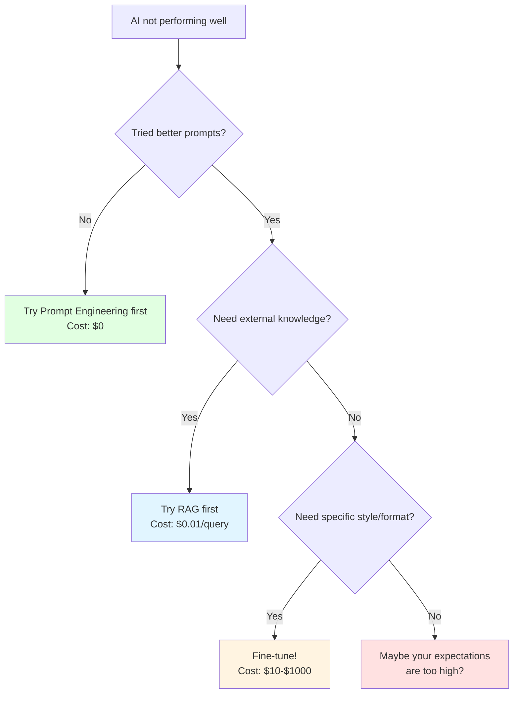
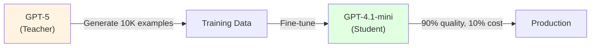

# 3.4 Fine-tuning & Model Distillation

<DifficultyBadge level="advanced" />
<CostBadge cost="$10-$100+" />

> Prerequisites: 3.1 Tokens, 12.1 RAG Basics

### Why Do We Need It? (Problem)

You've tried everything:
- Prompt engineering? Check. ("You are an expert in medical billing codes...")
- RAG? Check. (Stuffed 10,000 documents into a vector database)
- Still getting mediocre results? **Check.**

Sometimes the model just doesn't "get" your domain. It's like hiring a brilliant generalist to do a specialist's job — they can fake it for a while, but eventually you need someone who actually went to medical school.

**When to Fine-tune (and When NOT To):**



::: warning Common Mistake
Fine-tuning is NOT a magic fix. "My chatbot gives wrong answers" → Fine-tuning won't help if the training data is bad. Garbage in, expensive garbage out.
:::

### What Is It? (Concept)

**Fine-tuning** = Taking a pre-trained model and continuing its training on YOUR data, so it learns your domain's patterns, terminology, and style.

| Approach | Analogy | Cost | When to Use |
|----------|---------|------|------------|
| **Prompt Engineering** | Giving instructions to a smart intern | $0 | First attempt at any task |
| **RAG** | Giving the intern a reference book | $0.01/query | Need external/updated knowledge |
| **Fine-tuning** | Sending the intern to specialized training | $10-$1000 | Need consistent style, format, or domain expertise |
| **Distillation** | Having the senior teach the junior | $50-$500 | Want a smaller, cheaper model with big-model quality |

**Model Distillation** = Using a large powerful model (teacher) to generate training data, then fine-tuning a smaller model (student) on that data.



::: tip Fun Fact
This is literally how DeepSeek built some of their models — using outputs from larger models to train smaller, more efficient ones. The student can sometimes even beat the teacher on specific tasks. Education really does pay off.
:::

### Hands-On: OpenAI Fine-tuning API

**Step 1: Prepare Training Data (JSONL format)**

```python
# training_data.jsonl
{"messages": [{"role": "system", "content": "You are a medical billing code assistant."}, {"role": "user", "content": "Patient had a knee replacement surgery"}, {"role": "assistant", "content": "CPT Code: 27447 - Total knee arthroplasty"}]}
{"messages": [{"role": "system", "content": "You are a medical billing code assistant."}, {"role": "user", "content": "Patient received a flu vaccine"}, {"role": "assistant", "content": "CPT Code: 90686 - Influenza vaccine, quadrivalent"}]}
```

**Step 2: Upload & Train**

```python
from openai import OpenAI

client = OpenAI()

# Upload training file
file = client.files.create(
    file=open("training_data.jsonl", "rb"),
    purpose="fine-tune"
)

# Start fine-tuning
job = client.fine_tuning.jobs.create(
    training_file=file.id,
    model="gpt-4.1-mini"  # Base model to fine-tune
)

print(f"Fine-tuning job started: {job.id}")
```

**Step 3: Use Your Fine-tuned Model**

```python
response = client.chat.completions.create(
    model="ft:gpt-4.1-mini:my-org:medical-codes:abc123",
    messages=[{"role": "user", "content": "Patient had cataract surgery"}]
)
print(response.choices[0].message.content)
# "CPT Code: 66984 - Extracapsular cataract removal with IOL insertion"
```

**Cost Comparison:**

| Method | Setup Cost | Per-Query Cost | Quality | Latency |
|--------|-----------|---------------|---------|---------|
| Prompt Engineering (GPT-5) | $0 | $1.25/M input | High | Normal |
| RAG + GPT-4.1-mini | $5 (embeddings) | $0.40/M input | High (with docs) | +200ms |
| Fine-tuned GPT-4.1-mini | $50-$500 | $0.80/M input | Very High (domain) | Normal |
| Distilled small model | $100-$1000 | $0.10/M input | Good | Fast |

### Summary (Reflection)

- **What we solved**: Know when and how to fine-tune models for domain-specific tasks
- **Key takeaways**:
  1. **Try prompt engineering and RAG first** — fine-tuning is the last resort, not the first
  2. **Fine-tuning teaches style, not facts** — use RAG for knowledge, fine-tuning for behavior
  3. **Distillation is the cost optimization endgame** — big model generates data, small model learns from it
  4. **Budget reality check**: Fine-tuning GPT-4.1-mini costs $50-500, fine-tuning GPT-4.1 costs $500-5000

> *"Fine-tuning is like getting a tailored suit — it fits perfectly, but you need to know your measurements first. Otherwise you've paid a tailor to make an expensive ill-fitting suit."*

---

*Last updated: 2026-02-22*
