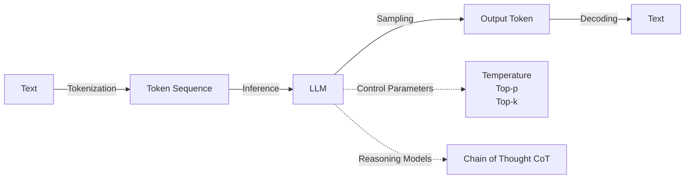
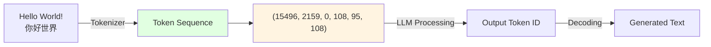
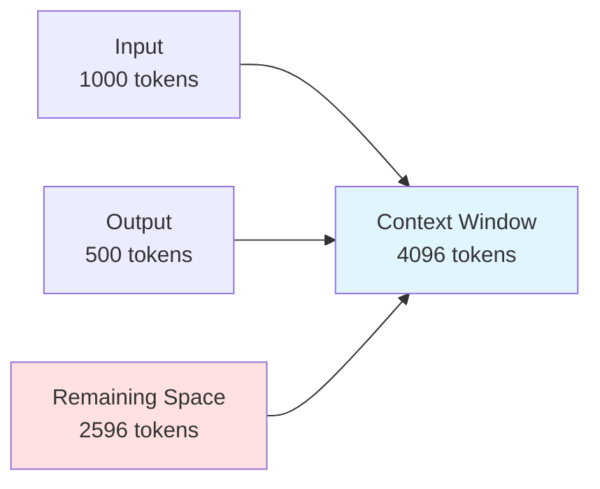

# Chapter 3: LLM Core Principles

> After completing this chapter, you will: Understand Token/tokenization/parameter tuning principles, master usage scenarios for reasoning models



## 3.1 Tokens and Tokenization <DifficultyBadge level="beginner" /> <CostBadge cost="$0.001" />

> Prerequisites: 1.1 Your First AI Conversation

### Why Do We Need It? (Problem)

When you start using LLM APIs, you'll encounter these strange phenomena:

1. **The same question costs 3x more in Chinese than in English**
   - Question: "What is Python?" → 4 tokens
   - Question: "什么是 Python？" → 12 tokens
   - Pricing is by token, Chinese costs 3 times more!

2. **Response suddenly gets truncated**
   - Error message: `Error: This model's maximum context length is 4096 tokens`
   - The question was only 100 characters, why does it exceed the limit?

3. **Token count doesn't match character count**
   - "Hello World" → 2 tokens
   - "你好世界" → 6 tokens
   - Why isn't it calculated by character count?

**Root cause: LLMs don't see text, they see Tokens.**

### What Is It? (Concept)

**A token is the basic unit for LLM text processing**, similar to "word chunks" or "byte segments". A token can be:
- A complete English word (e.g., `hello`)
- A Chinese character (e.g., `你`)
- A punctuation mark (e.g., `!`)
- Part of a word (e.g., `playing` = `play` + `ing`)



**Why do we need Tokens?**

LLMs are neural networks and cannot directly process text; they must first convert it to numbers:
1. **Text** → **Token (word chunks)** → **Token ID (numbers)** → **Model processing** → **Output Token ID** → **Decode to text**

**BPE Tokenization Algorithm (Byte-Pair Encoding):**

This is the tokenization method used by mainstream LLMs (GPT, Claude, Gemini), core approach:
1. Combine high-frequency words into a single token (e.g., `the`, `ing`, `ed`)
2. Split low-frequency words into smaller segments
3. Chinese characters typically = 1-3 tokens each (depending on frequency in training data)

**Example: English vs Chinese Token Count Differences**

| Text | Token Count | Split Result |
|-----|----------|---------|
| `Hello World` | 2 | `["Hello", " World"]` |
| `你好世界` | 6 | `["你", "好", "世", "界"]` |
| `What is API?` | 4 | `["What", " is", " API", "?"]` |
| `什么是 API？` | 8 | `["什", "么", "是", " API", "？"]` |

::: tip Why is Chinese more expensive?
GPT models' training data is primarily in English. High-frequency English words are encoded as single tokens, while Chinese characters appear less frequently in the training data and typically require 1-3 tokens per character. This causes Chinese text with the same meaning to require 2-4 times more tokens than English.

**Good news:** Chinese-optimized models like Qwen and DeepSeek are more efficient at Chinese tokenization, with token counts approaching English.
:::

**Context Window:**

The LLM's "working memory", including the total token count of input and output.



**Context Windows of Different Models:**

| Model | Context Window | Suitable Scenarios |
|-----|----------|---------|
| GPT-5 | 400k tokens | Complex reasoning, large codebase understanding |
| GPT-4.1 | 1M tokens | Long document analysis, codebase understanding |
| GPT-4.1-mini | 1M tokens | Daily conversations, cost-effective long-context tasks |
| Claude Opus 4.6 | 200k tokens (Beta 1M) | Academic papers, legal documents |
| Claude Sonnet 4.6 | 200k tokens (Beta 1M) | Coding, general-purpose tasks |
| Gemini 2.5 Pro | 1M tokens | Ultra-long text, entire book analysis |
| DeepSeek-V3.2 | 128k tokens | Code generation, long conversations |

**Token Pricing Logic:**

```
Cost = (input tokens × input price) + (output tokens × output price)
```

Example: GPT-4.1-mini pricing
- Input: $0.40 / 1M tokens
- Output: $1.60 / 1M tokens (output is 4x more expensive)

```python
# Assume conversation:
# Input: 1000 tokens
# Output: 500 tokens

cost = (1000 * 0.40 + 500 * 1.60) / 1_000_000
print(f"Cost: ${cost:.6f}")  # $0.001200
```

::: warning Note
Output tokens are typically 3-5 times more expensive than input! If you have AI generate long text (like writing articles or generating code), costs will increase significantly.
:::

::: tip Reasoning Models & Token Costs
Starting with OpenAI o1 and DeepSeek-R1, a new category of **reasoning models** emerged. These models produce internal "thinking tokens" (Chain-of-Thought) before generating the final answer. Key differences:
- **Thinking tokens are billed separately** and can be 5-20x the visible output length
- GPT-5 uses a unified routing architecture that automatically decides when to "think deeper"
- DeepSeek-V3.2 offers a `deepseek-reasoner` mode with up to 64K output tokens
- Always check if your task actually needs reasoning — simple queries don't benefit from it
:::

### Hands-On Practice (Practice)

We'll use the `tiktoken` library to visualize the tokenization process and understand how tokens work.

**Step 1: Install tiktoken**

```bash
pip install tiktoken
```

**Step 2: Visualize Tokenization**

```python
import tiktoken

# Load GPT-4o's tokenizer
encoding = tiktoken.encoding_for_model("gpt-4o")

# Test texts
texts = [
    "Hello World!",
    "你好世界",
    "What is API?",
    "什么是 API？",
    "The quick brown fox jumps over the lazy dog",
    "人工智能正在改变世界",
]

print("=" * 80)
print("Text Tokenization Comparison")
print("=" * 80)

for text in texts:
    # Encode to tokens
    tokens = encoding.encode(text)
    
    # Decode each token
    token_strings = [encoding.decode([token]) for token in tokens]
    
    print(f"\nText: {text}")
    print(f"Token Count: {len(tokens)}")
    print(f"Token List: {token_strings}")
    print(f"Token IDs: {tokens}")
```

**Output:**

```
================================================================================
Text Tokenization Comparison
================================================================================

Text: Hello World!
Token Count: 3
Token List: ['Hello', ' World', '!']
Token IDs: [9906, 4435, 0]

Text: 你好世界
Token Count: 6
Token List: ['你', '好', '世', '界']
Token IDs: [108, 95, 108, 244]

Text: What is API?
Token Count: 4
Token List: ['What', ' is', ' API', '?']
Token IDs: [3923, 374, 5446, 30]

Text: 什么是 API？
Token Count: 8
Token List: ['什', '么', '是', ' API', '？']
Token IDs: [108, 245, 108, 120, 101, 5446, 108, 253]
```

**Step 3: Estimate API Cost**

```python
def estimate_cost(text, model="gpt-4.1-mini"):
    """
    Estimate the cost of calling the API
    """
    encoding = tiktoken.encoding_for_model("gpt-4o")
    
    input_tokens = len(encoding.encode(text))
    
    # Assume output is 1.5x the input (actual depends on the question)
    output_tokens = int(input_tokens * 1.5)
    
    # GPT-4.1-mini pricing ($/1M tokens)
    input_price = 0.40
    output_price = 1.60
    
    cost = (input_tokens * input_price + output_tokens * output_price) / 1_000_000
    
    return {
        "input_tokens": input_tokens,
        "output_tokens": output_tokens,
        "total_tokens": input_tokens + output_tokens,
        "cost": cost,
    }

# Test
question = "Please summarize the core viewpoints of this article in 200 words..."

result = estimate_cost(question)
print(f"Input tokens: {result['input_tokens']}")
print(f"Estimated output tokens: {result['output_tokens']}")
print(f"Total tokens: {result['total_tokens']}")
print(f"Estimated cost: ${result['cost']:.6f}")
```

**Step 4: Test Context Window Limit**

```python
from openai import OpenAI

client = OpenAI()

# Construct an ultra-long input (simulating exceeding context window)
long_text = "This is a very long text." * 5000  # About 30k Chinese tokens

try:
    response = client.chat.completions.create(
        model="gpt-4.1-mini",  # Context window 1M tokens, but very long input still costs a lot
        messages=[{"role": "user", "content": long_text}],
    )
    print("Call successful")
except Exception as e:
    print(f"Call failed: {e}")
    # Output: Error: This model's maximum context length is 16384 tokens
```

**Step 5: Optimize Token Usage**

```python
def truncate_to_token_limit(text, max_tokens=1000, model="gpt-4o"):
    """
    Truncate text to specified token count
    """
    encoding = tiktoken.encoding_for_model(model)
    tokens = encoding.encode(text)
    
    if len(tokens) <= max_tokens:
        return text
    
    # Truncate and decode
    truncated_tokens = tokens[:max_tokens]
    return encoding.decode(truncated_tokens) + "..."

# Test
long_article = "This is a very long article..." * 1000
truncated = truncate_to_token_limit(long_article, max_tokens=500)

print(f"Original length: {len(long_article)} characters")
print(f"Truncated length: {len(truncated)} characters")
```

<ColabBadge path="demos/03-llm-fundamentals/tokenization.ipynb" />

### Summary (Reflection)

- **What was solved**: Understood why Chinese is more expensive than English, why responses get truncated, how to estimate API costs
- **What wasn't solved**: Now we know token counts, but still don't know how to control AI's "creativity" and "determinism" - next section covers inference parameters
- **Key takeaways**:
  1. **Tokens are the basic unit for LLM text processing**, not characters or words
  2. **Chinese tokens are typically 2-4x English**, choosing Chinese-optimized models can reduce costs
  3. **Context window limit**: input + output cannot exceed the model's maximum token count
  4. **Output is 3-5x more expensive than input**: avoid having AI generate overly long text
  5. **Use tiktoken to estimate costs**: estimate token count and cost before calling the API

> *"Remember: Tokens are not characters. Chinese is especially 'token-expensive' — it's like packing for a move: you THINK it's just a few boxes, then the moving truck isn't big enough."*

---

*Last updated: 2026-02-20*
