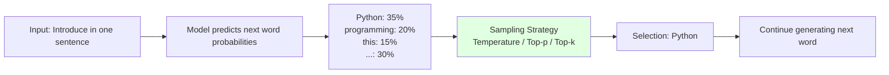

# 3.2 Inference Parameters Explained <DifficultyBadge level="intermediate" /> <CostBadge cost="$0.01" />

> Prerequisites: 1.1 Your First AI Conversation, 3.1 Tokens and Tokenization

### Why Do We Need It? (Problem)

When you call an LLM multiple times with the same prompt, you'll notice an interesting phenomenon: **every response is different**.

```python
from openai import OpenAI

client = OpenAI()

prompt = "Introduce Python in one sentence"

for i in range(3):
    response = client.chat.completions.create(
        model="gpt-4.1-mini",
        messages=[{"role": "user", "content": prompt}],
    )
    print(f"Try {i+1}: {response.choices[0].message.content}")
```

**Output:**

```
Try 1: Python is a high-level, interpreted, general-purpose programming language known for its concise and readable syntax.
Try 2: Python is a concise, easy-to-learn yet powerful programming language widely used in web development, data science, and automation.
Try 3: Python is a widely-used high-level programming language known for its simple syntax and powerful library support.
```

**Why is every response different? How can we control this "randomness"?**

In practical applications, you'll encounter these needs:

| Scenario | Requirement | Example |
|-----|------|------|
| **Structured data extraction** | Deterministic, stable output | Extract amounts and dates from invoices |
| **Creative writing** | Diversity, innovation | Generate ad copy, story continuation |
| **Code generation** | Accuracy, reliability | Generate SQL queries, API calls |
| **Brainstorming** | Divergent thinking | Product naming, marketing ideas |

This requires **Inference Parameters** to precisely control AI behavior.

### What Is It? (Concept)

Inference parameters control the "sampling strategy" when LLMs generate text, determining how to select the next token.

**Core concept: The LLM text generation process**



LLMs don't "recite answers", they **predict probability distributions token by token, then sample and select**.

**Main inference parameters:**

| Parameter | Function | Range | Default | Effect |
|-----|------|---------|-------|------|
| **Temperature** | Controls randomness | 0 ~ 2 | 1 | Lower = more deterministic, higher = more random |
| **Top-p** | Nucleus sampling (probability accumulation) | 0 ~ 1 | 1 | Only consider tokens with cumulative probability top-p |
| **Top-k** | Limit candidate count | 1 ~ 100+ | - | Only consider top k tokens by probability |
| **Frequency Penalty** | Penalize repeated words | -2 ~ 2 | 0 | Reduce word repetition |
| **Presence Penalty** | Penalize appeared words | -2 ~ 2 | 0 | Encourage introducing new topics |

---

### 1. Temperature

**Temperature controls the "flatness" of the probability distribution**:
- `temperature = 0`: Almost deterministic output (select highest probability)
- `temperature = 1`: Sample according to original probability distribution
- `temperature > 1`: More random, more "wild" output

**Mathematical principle:**

Assuming the model predicts next token probability distribution as $P(w_i)$, after applying temperature:

$$P_{\text{new}}(w_i) = \frac{\exp(\log P(w_i) / T)}{\sum_j \exp(\log P(w_j) / T)}$$

**Intuitive understanding: Compare different temperatures with a table**

Assuming the model predicts next word probabilities:

| Word | Original Probability | T=0.1 | T=0.7 | T=1.0 | T=1.5 |
|----|---------|-------|-------|-------|-------|
| Python | 40% | ~100% | 55% | 40% | 30% |
| programming | 30% | ~0% | 28% | 30% | 28% |
| language | 20% | ~0% | 13% | 20% | 24% |
| other | 10% | ~0% | 4% | 10% | 18% |

**Code example: Compare different temperatures**

```python
from openai import OpenAI

client = OpenAI()

prompt = "Introduce Python in one sentence"

temperatures = [0, 0.3, 0.7, 1.0, 1.5]

for temp in temperatures:
    response = client.chat.completions.create(
        model="gpt-4.1-mini",
        messages=[{"role": "user", "content": prompt}],
        temperature=temp,
    )
    print(f"\nTemperature = {temp}")
    print(response.choices[0].message.content)
```

**Typical output:**

```
Temperature = 0
Python is a high-level, interpreted, general-purpose programming language known for its concise and readable syntax.

Temperature = 0.3
Python is a high-level programming language known for its simple syntax and powerful library support.

Temperature = 0.7
Python is a concise, easy-to-learn yet powerful programming language widely used in web development and data science.

Temperature = 1.0
Python is a widely popular high-level programming language known for its readability and rich ecosystem.

Temperature = 1.5
Python, born in 1991 as an elegant language, combines simple syntax with infinite possibilities - the developer's Swiss Army knife!
```

**Usage recommendations:**

| Scenario | Recommended Temperature | Reason |
|-----|----------------|------|
| Data extraction, classification | 0 ~ 0.3 | Needs deterministic, reproducible output |
| Code generation | 0 ~ 0.5 | Avoid random errors |
| Customer service dialogue | 0.5 ~ 0.7 | Balance naturalness and accuracy |
| Creative writing | 0.8 ~ 1.2 | Encourage diversity and innovation |
| Brainstorming | 1.2 ~ 1.5 | Generate unexpected ideas |

---

### 2. Top-p (Nucleus Sampling)

**Top-p limits the sampling range**: only consider the minimum set of words with cumulative probability reaching p.

**How it works:**

1. Sort all candidate words by probability from high to low
2. Accumulate probabilities until the sum reaches p
3. Only sample from these words

**Example:**

Assuming predicted probabilities:

| Word | Probability | Cumulative Probability |
|----|------|---------|
| Python | 40% | 40% |
| programming | 30% | 70% |
| language | 20% | 90% |
| other | 10% | 100% |

- `top_p = 0.5`: Only consider "Python" (cumulative 40% < 50%, need to add "programming" to reach 70% > 50%)
- `top_p = 0.9`: Consider "Python", "programming", "language" (cumulative 90%)
- `top_p = 1.0`: Consider all words

**Code example:**

```python
from openai import OpenAI

client = OpenAI()

prompt = "Continue the story: Late at night, the detective pushed open the mysterious door and discovered"

top_ps = [0.1, 0.5, 0.9, 1.0]

for top_p in top_ps:
    response = client.chat.completions.create(
        model="gpt-4.1-mini",
        messages=[{"role": "user", "content": prompt}],
        temperature=1.0,
        top_p=top_p,
    )
    print(f"\nTop-p = {top_p}")
    print(response.choices[0].message.content)
```

**Usage recommendations:**

| Scenario | Recommended Top-p | Reason |
|-----|-----------|------|
| Factual answers | 0.1 ~ 0.3 | Only select high-probability words, reduce "hallucination" |
| General conversation | 0.7 ~ 0.9 | Balance naturalness and accuracy |
| Creative generation | 0.95 ~ 1.0 | Allow low-probability words, increase diversity |

::: tip Temperature vs Top-p
- **Temperature**: Changes the shape of the entire probability distribution
- **Top-p**: Truncates low-probability words, doesn't change distribution shape
- **Usually used together**: `temperature=0.7, top_p=0.9` is a common combination
:::

---

### 3. Top-k

**Top-k limits the number of candidate words**: only consider the k words with highest probability.

**Example:**

Assuming predicted probabilities:

| Word | Probability |
|----|------|
| Python | 40% |
| programming | 30% |
| language | 20% |
| code | 5% |
| tool | 5% |

- `top_k = 1`: Only consider "Python" (deterministic)
- `top_k = 3`: Only consider "Python", "programming", "language"
- `top_k = 5`: Consider all 5 words

::: warning OpenAI API doesn't support Top-k
OpenAI's API doesn't provide a `top_k` parameter, but Google Gemini, Hugging Face, etc. support it.
:::

---

### 4. Frequency Penalty & Presence Penalty

These two parameters are used to reduce repetition.

**Frequency Penalty:**
- Penalizes based on the **number of times** a word appears in already generated text
- Range: `-2.0 ~ 2.0`
- Positive value: reduce repetition; negative value: encourage repetition

**Presence Penalty:**
- Penalizes based on whether a word has **ever appeared** (regardless of how many times)
- Range: `-2.0 ~ 2.0`
- Positive value: encourage introducing new topics; negative value: encourage staying on the same topic

**Code example:**

```python
from openai import OpenAI

client = OpenAI()

prompt = "List 10 programming languages"

# No penalty
response = client.chat.completions.create(
    model="gpt-4.1-mini",
    messages=[{"role": "user", "content": prompt}],
)
print("【No Penalty】")
print(response.choices[0].message.content)

# High frequency penalty (reduce repetition)
response = client.chat.completions.create(
    model="gpt-4.1-mini",
    messages=[{"role": "user", "content": prompt}],
    frequency_penalty=1.5,
)
print("\n【Frequency Penalty = 1.5】")
print(response.choices[0].message.content)

# High presence penalty (encourage new topics)
response = client.chat.completions.create(
    model="gpt-4.1-mini",
    messages=[{"role": "user", "content": prompt}],
    presence_penalty=1.5,
)
print("\n【Presence Penalty = 1.5】")
print(response.choices[0].message.content)
```

---

### Common Parameter Combinations

| Scenario | Temperature | Top-p | Frequency Penalty | Presence Penalty |
|-----|------------|-------|------------------|------------------|
| **Data extraction** | 0 | 0.1 | 0 | 0 |
| **Customer service** | 0.7 | 0.9 | 0.3 | 0.3 |
| **Code generation** | 0.2 | 0.5 | 0 | 0 |
| **Creative writing** | 1.0 | 0.95 | 0.5 | 0.8 |
| **Brainstorming** | 1.2 | 1.0 | 1.0 | 1.5 |

### Hands-On Practice (Practice)

Create an interactive tool to adjust parameters in real-time and observe effects.

```python
from openai import OpenAI

client = OpenAI()

def test_parameters(prompt, temperature=0.7, top_p=1.0, freq_penalty=0, pres_penalty=0):
    """
    Test the effects of different parameter combinations
    """
    response = client.chat.completions.create(
        model="gpt-4.1-mini",
        messages=[{"role": "user", "content": prompt}],
        temperature=temperature,
        top_p=top_p,
        frequency_penalty=freq_penalty,
        presence_penalty=pres_penalty,
    )
    return response.choices[0].message.content

# Test: Compare extreme parameters
prompt = "Introduce artificial intelligence in one sentence"

print("=== Deterministic (T=0) ===")
for i in range(3):
    print(f"{i+1}. {test_parameters(prompt, temperature=0)}")

print("\n=== Random (T=1.5) ===")
for i in range(3):
    print(f"{i+1}. {test_parameters(prompt, temperature=1.5)}")
```

<ColabBadge path="demos/03-llm-fundamentals/parameters.ipynb" />

### Summary (Reflection)

- **What was solved**: Learned to control AI's determinism vs creativity, selecting appropriate parameters based on scenarios
- **What wasn't solved**: Even with parameter tuning, regular models still make mistakes on complex reasoning tasks (math, logic) - next section covers reasoning models
- **Key takeaways**:
  1. **Temperature = 0**: Deterministic output, suitable for data extraction, code generation
  2. **Temperature = 0.7~1.0**: Balance creativity and accuracy, suitable for dialogue, writing
  3. **Temperature > 1.0**: High creativity, high randomness, suitable for brainstorming
  4. **Top-p**: Usually set to 0.9, used together with temperature
  5. **Frequency/Presence Penalty**: Reduce repetition, encourage diversity

---

*Last updated: 2026-02-20*
