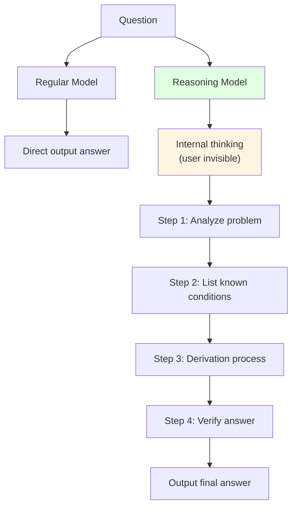
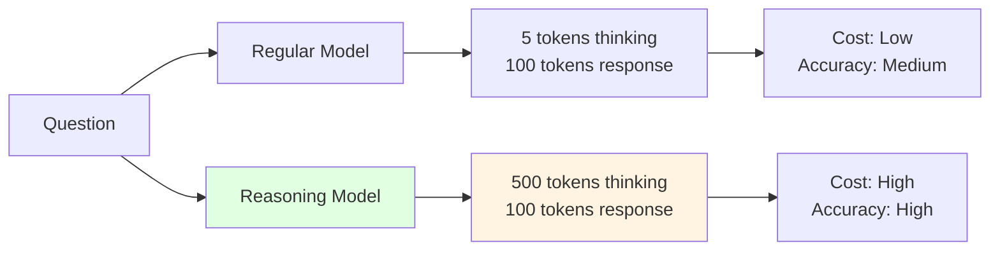

# 3.3 Reasoning Models and Chain-of-Thought <DifficultyBadge level="intermediate" /> <CostBadge cost="$0.05" />

> Prerequisites: 3.1 Tokens and Tokenization, 3.2 Inference Parameters Explained

### Why Do We Need It? (Problem)

When you use GPT-4o-mini or Claude Sonnet for simple tasks, the results are good. But when encountering complex reasoning tasks, regular models often make mistakes:

**Test: Have GPT-4o-mini solve a math problem**

```python
from openai import OpenAI

client = OpenAI()

question = """
Xiaoming has 15 apples. He gave 1/3 to Xiaohong, then bought 8 more.
After that, he gave 1/4 of the remaining apples to Xiaogang.
How many apples does Xiaoming have now?
"""

response = client.chat.completions.create(
    model="gpt-4.1-mini",
    messages=[{"role": "user", "content": question}],
)

print("【GPT-4o-mini's Answer】")
print(response.choices[0].message.content)
```

**Typical incorrect answer:**

```
Xiaoming has 15 apples, gave Xiaohong 5 (15 × 1/3), leaving 10.
After buying 8, he has 18.
Gave Xiaogang 4.5 (18 × 1/4), finally leaving 13.5.
```

**The correct answer should be:**
1. 15 × 1/3 = 5, after giving to Xiaohong, 10 remain
2. After buying 8: 10 + 8 = 18
3. 18 × 1/4 = 4.5, after giving to Xiaogang: 18 - 4.5 = **13.5** (this answer is actually correct)

But if the question is more complex, regular models easily make calculation errors.

**Root cause of the problem:**

Regular LLMs use "fast thinking" (System 1), tending to **give answers directly in one step**, not good at:
- Multi-step reasoning (requires step-by-step breakdown)
- Complex mathematical calculations
- Problems with long logical chains
- Scenarios requiring "think first, then answer"

**Reasoning Models solve this problem**, through a "slow thinking" (System 2) approach, first reasoning internally, then providing answers.

### What Is It? (Concept)

**Reasoning Models** are LLMs specifically optimized for complex reasoning capabilities, core features:
1. **Think then answer**: Internally generate a "thinking process", then output the final answer
2. **Inference-Time Compute**: Spend more time reasoning to improve accuracy
3. **Chain-of-Thought (CoT)**: Break down problems step by step, like humans "making drafts"



**Mainstream reasoning model comparison:**

| Model | Provider | Core Features | Price | Open Source |
|-----|-------|---------|------|------|
| **o1** | OpenAI | First-gen reasoning model, fixed thinking budget | 💰💰💰 High | ❌ |
| **o3** | OpenAI | Second-gen, supports adjustable thinking budget | 💰💰💰 Very High | ❌ |
| **DeepSeek R1** | DeepSeek | Open-source reasoning model, very cost-effective | 💰 Low | ✅ |
| **Claude Extended Thinking** | Anthropic | Extended thinking mode (Opus 4.6) | 💰💰💰 High | ❌ |
| **Gemini 2.5 Flash Thinking** | Google | Experimental reasoning mode | 💰 Low | ❌ |

**Reasoning models vs Regular models:**

| Dimension | Regular Model | Reasoning Model |
|-----|---------|---------|
| **Reasoning method** | Fast thinking (one step) | Slow thinking (think then answer) |
| **Good at tasks** | Dialogue, writing, translation | Math, logic, programming, strategy |
| **Speed** | Fast (1-3 seconds) | Slow (5-30 seconds) |
| **Cost** | Low | High (3-10x) |
| **Thinking process** | Invisible | Partially visible (depends on model) |

**Inference-Time Compute:**

This is the core concept of reasoning models: **spend more computational resources during the inference stage**, similar to:
- During exams, answer easy questions quickly (regular model)
- For hard questions, make drafts, verify calculations, then write answer (reasoning model)



**Thinking Budget:**

The o3 model supports adjusting "thinking time":
- **Low**: Fast reasoning, suitable for simple problems
- **Medium**: Balanced reasoning, general scenarios
- **High**: Deep reasoning, complex problems (extremely high cost)

---

### When to Use Reasoning Models?

| Scenario | Recommended Model | Reason |
|-----|---------|------|
| **Math problems** | DeepSeek R1 / o1 | Requires multi-step calculation and verification |
| **Programming competitions** | o3 / DeepSeek R1 | Requires algorithm design and optimization |
| **Logical reasoning** | o1 / Claude Extended Thinking | Requires rigorous reasoning chains |
| **Strategy planning** | o3 / DeepSeek R1 | Requires weighing multiple factors |
| **Scientific research** | o3 / Claude Opus 4.6 | Requires deep analysis |
| **Daily conversation** | ❌ Not recommended | Wastes cost and time |
| **Simple copywriting** | ❌ Not recommended | Regular models are sufficient |

::: tip Selection recommendations
- **Cost-sensitive + complex reasoning**: DeepSeek R1 (open-source, cheap)
- **Pursuit of ultimate accuracy**: o3 High (most expensive but strongest)
- **Balanced scenarios**: o1 / DeepSeek R1
:::

### Hands-On Practice (Practice)

We'll compare DeepSeek R1 and GPT-4o-mini to see the reasoning model's "thinking process".

**Step 1: Prepare API Keys**

```python
import os
from getpass import getpass

if not os.environ.get("OPENAI_API_KEY"):
    os.environ["OPENAI_API_KEY"] = getpass("OpenAI API Key: ")

if not os.environ.get("DEEPSEEK_API_KEY"):
    os.environ["DEEPSEEK_API_KEY"] = getpass("DeepSeek API Key: ")
```

**Step 2: Test regular model**

```python
from openai import OpenAI

openai_client = OpenAI()

question = """
There are 3 switches and 3 lights in different rooms. You can only enter the light room once.
How do you determine which switch controls which light?
"""

response = openai_client.chat.completions.create(
    model="gpt-4.1-mini",
    messages=[{"role": "user", "content": question}],
)

print("【GPT-4o-mini (Regular Model)】")
print(response.choices[0].message.content)
print(f"\nTokens: {response.usage.total_tokens}")
```

**Step 3: Test reasoning model**

```python
# DeepSeek R1 is a reasoning model
deepseek_client = OpenAI(
    api_key=os.environ["DEEPSEEK_API_KEY"],
    base_url="https://api.deepseek.com",
)

response = deepseek_client.chat.completions.create(
    model="deepseek-reasoner",  # DeepSeek R1 reasoning model
    messages=[{"role": "user", "content": question}],
)

print("\n【DeepSeek R1 (Reasoning Model)】")
print(response.choices[0].message.content)
print(f"\nTokens: {response.usage.total_tokens}")

# DeepSeek R1 will return thinking process (if available)
if hasattr(response.choices[0].message, "reasoning_content"):
    print("\n【Thinking Process】")
    print(response.choices[0].message.reasoning_content)
```

**Typical output comparison:**

**GPT-4o-mini (Regular Model):**
```
Turn on switch 1 and switch 2, wait 10 minutes.
Turn off switch 2, enter the room:
- Light that's on → switch 1
- Hot but not on → switch 2
- Cold and not on → switch 3

Tokens: 87
```

**DeepSeek R1 (Reasoning Model):**
```
【Thinking Process】(internal reasoning, partially visible)
First, I need to understand the problem constraints: can only enter the room once, but can control switches multiple times.
The key is to use "time" and "temperature" as two additional dimensions...

【Final Answer】
1. Turn on switch 1, wait 5-10 minutes (let the bulb heat up)
2. Turn off switch 1, immediately turn on switch 2
3. Enter the room and check:
   - Light that's currently on → switch 2
   - Hot but not on → switch 1
   - Cold and not on → switch 3

Tokens: 523 (including thinking process)
```

::: tip Observation points
- **Regular model**: Gives answer directly, fast but possibly incomplete
- **Reasoning model**: First analyzes problem, lists constraints, derives logic, then gives answer
- **Token count**: Reasoning models consume more tokens (3-5x), but higher accuracy
:::

**Step 4: Test mathematical reasoning**

```python
math_question = """
A pool has an inlet pipe and an outlet pipe.
Opening only the inlet pipe can fill it in 6 hours, opening only the outlet pipe can empty it in 10 hours.
If both pipes are opened simultaneously, how long will it take to fill?
"""

# Regular model
response_normal = openai_client.chat.completions.create(
    model="gpt-4.1-mini",
    messages=[{"role": "user", "content": math_question}],
)

# Reasoning model
response_reasoning = deepseek_client.chat.completions.create(
    model="deepseek-reasoner",
    messages=[{"role": "user", "content": math_question}],
)

print("【GPT-4o-mini】")
print(response_normal.choices[0].message.content)

print("\n【DeepSeek R1】")
print(response_reasoning.choices[0].message.content)
```

**Correct answer:**
- Inlet speed: 1/6 pool/hour
- Outlet speed: 1/10 pool/hour
- Net speed: 1/6 - 1/10 = 5/30 - 3/30 = 2/30 = 1/15 pool/hour
- Fill time: 1 ÷ (1/15) = **15 hours**

Reasoning models typically provide correct step-by-step derivation processes.

---

### Chain-of-Thought (CoT) Prompting Techniques

Even regular models can activate "chain-of-thought" through prompt techniques:

**Technique 1: Request "step-by-step thinking"**

```python
question = "Xiaoming has 15 apples, gave Xiaohong 1/3, bought 8 more, then gave Xiaogang 1/4, how many left?"

# Regular Prompt
response_normal = openai_client.chat.completions.create(
    model="gpt-4.1-mini",
    messages=[{"role": "user", "content": question}],
)

# CoT Prompt
response_cot = openai_client.chat.completions.create(
    model="gpt-4.1-mini",
    messages=[
        {
            "role": "user",
            "content": f"{question}\n\nPlease think step by step and list the calculation process for each step."
        }
    ],
)

print("【Regular Prompt】")
print(response_normal.choices[0].message.content)

print("\n【CoT Prompt】")
print(response_cot.choices[0].message.content)
```

**Technique 2: Provide examples (Few-Shot CoT)**

```python
few_shot_prompt = """
Example:
Question: Xiaohong has 10 oranges, ate 2, bought 5 more, how many are left?
Thinking process:
1. Initial: 10
2. Ate 2: 10 - 2 = 8
3. Bought 5: 8 + 5 = 13
Answer: 13

Now solve:
Question: Xiaoming has 15 apples, gave Xiaohong 1/3, bought 8 more, then gave Xiaogang 1/4 of remaining, how many left?
"""

response = openai_client.chat.completions.create(
    model="gpt-4.1-mini",
    messages=[{"role": "user", "content": few_shot_prompt}],
)

print(response.choices[0].message.content)
```

---

### Cost Comparison

| Scenario | Regular Model | Reasoning Model | Cost Difference |
|-----|---------|---------|---------|
| Simple conversation | $0.0001 | $0.0005 | 5x |
| Complex reasoning | $0.0003 | $0.002 | 7x |
| Math proof | $0.0005 | $0.01 | 20x |

::: warning Cost alert
Reasoning models' token consumption includes the "thinking process", typically 3-10x the final answer.
Only use for complex tasks requiring high accuracy!
:::

<ColabBadge path="demos/03-llm-fundamentals/reasoning-models.ipynb" />

### Summary (Reflection)

- **What was solved**: Learned to use reasoning models for complex reasoning tasks to improve accuracy
- **What wasn't solved**: Even with reasoning models, how to guide AI through better prompts? - Chapter 4 (Prompt Engineering) explains in detail
- **Key takeaways**:
  1. **Reasoning models = slow thinking + chain-of-thought**: reason first, then answer
  2. **Suitable scenarios**: math, logic, programming, strategic planning
  3. **Unsuitable scenarios**: daily conversation, simple copywriting (wastes cost)
  4. **Recommended models**: DeepSeek R1 (cost-effective), o3 (strongest)
  5. **CoT Prompt**: Regular models can also use "step-by-step thinking" prompts to improve reasoning ability
  6. **Cost**: Reasoning models are 3-20x more expensive, use cautiously

---

**Chapter 3 Complete!**

You have now mastered:
1. ✅ Token and tokenization principles, understand why Chinese is expensive, how to estimate costs
2. ✅ Inference parameters (Temperature, Top-p, etc.), controlling AI's creativity and determinism
3. ✅ Usage scenarios for reasoning models, when to use "slow thinking" mode

Next chapter, we'll learn **Prompt Engineering**, mastering how to write high-quality prompts so AI can more accurately understand your intentions.

---

*Last updated: 2026-02-20*
