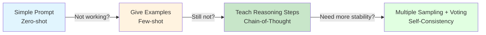
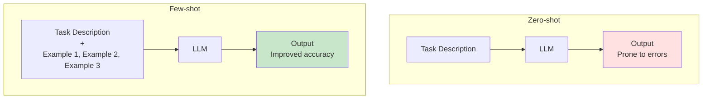
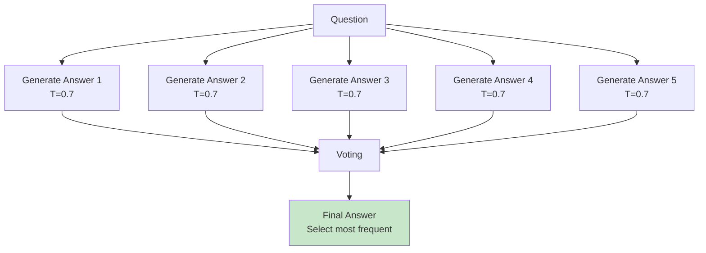
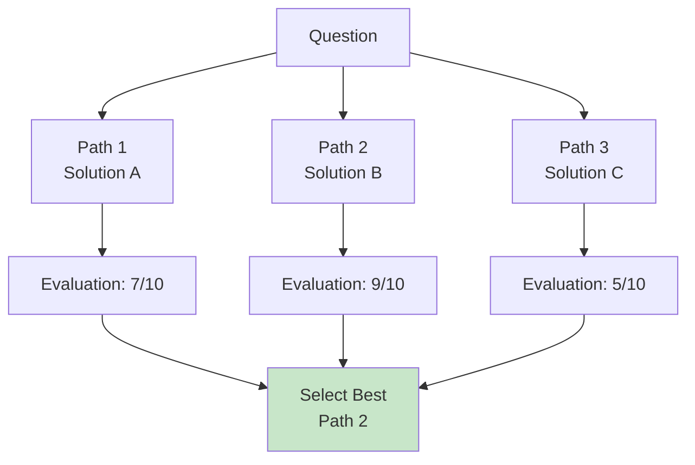

# 4.2 Advanced Prompt Techniques <DifficultyBadge level="intermediate" /> <CostBadge cost="$0.02" />

> Prerequisites: 4.1 Prompt Fundamentals

### Why Do We Need It? (Problem)

When you start using AI for more complex tasks, you'll encounter these problems:

**Problem 1: AI doesn't generalize well**

```python
# Task: Extract sentiment from user reviews
prompt = "Determine if this review is positive or negative: 'This product is amazing!'"
# AI replies: Positive

# Try another one
prompt = "Determine if this review is positive or negative: 'It's okay, works fine'"
# AI replies: Positive (❌ Wrong! Should be neutral)
```

**Problem 2: AI easily makes mistakes in mathematical reasoning**

```python
prompt = "Xiaoming has 15 apples, gave Xiaohong 3, bought 8 more, how many now?"
# AI replies: 20 (❌ Correct answer is 20, but often miscalculates)

prompt = "A number multiplied by 3 plus 7 equals 28, what is the number?"
# AI replies: 9 (❌ Correct answer is 7, often gets wrong)
```

**Problem 3: Complex tasks easily "go off track"**

```python
prompt = "Help me design a database for an e-commerce system"
# AI replies: Directly outputs CREATE TABLE SQL (❌ Didn't analyze requirements first)
```

**Root cause: Simple prompts don't provide enough "thinking framework".**

Advanced techniques solve these problems by **providing examples** and **guiding the thinking process**.

### What Is It? (Concept)

Advanced prompt techniques are a set of methods to "teach AI how to think".



**Four core techniques:**

| Technique | Scenario | Principle | Cost |
|-----|------|------|------|
| **Few-shot** | Classification, formatting | Give 2-5 examples | Medium |
| **Chain-of-Thought (CoT)** | Math, logical reasoning | Request reasoning steps | High |
| **Self-Consistency** | Need high accuracy | Generate multiple answers and vote | Very High |
| **Tree-of-Thought (ToT)** | Complex planning | Explore multiple reasoning paths | Extremely High |

---

## Technique 1: Few-shot Prompting (Learning from Examples)

**Principle: "Teach" AI the task pattern through 2-5 examples.**

**Zero-shot vs Few-shot comparison:**



**Practical case: Sentiment classification**

**❌ Zero-shot (unstable results):**

```python
prompt = "Determine review sentiment (positive/negative/neutral): 'It's okay, works fine'"
```

**✅ Few-shot (improved accuracy):**

```python
prompt = """
Determine review sentiment (positive/negative/neutral).

Examples:
Review: This product is amazing! Used it for a week, very satisfied.
Sentiment: positive

Review: Quality is terrible, broke after two days, very disappointed.
Sentiment: negative

Review: It's okay, works fine, nothing special.
Sentiment: neutral

Now determine this one:
Review: A bit expensive, but quality is indeed good.
Sentiment:
"""
```

**Few-shot best practices:**

| Principle | Description |
|-----|------|
| **Number of examples** | Usually 3-5 is enough, too many wastes tokens |
| **Example quality** | Cover different types of inputs (edge cases) |
| **Consistent format** | Strictly align input-output format |
| **Order matters** | Last example has most impact (place most typical) |

---

## Technique 2: Chain-of-Thought (CoT)

**Principle: Make AI "write out the thinking process", reasoning step by step.**

**Why it works?**
- LLMs generate one token at a time, complex calculations need "draft paper"
- Explicit reasoning steps reduce skipping errors

**Compare effects:**

**❌ Direct question (easily miscalculates):**

```python
prompt = "A number multiplied by 3 plus 7 equals 28, what is the number?"
# AI replies: 9 (❌ Wrong)
```

**✅ Chain-of-Thought (significantly improved accuracy):**

```python
prompt = """
A number multiplied by 3 plus 7 equals 28, what is the number?

Please think step by step:
1. Write the equation
2. Solve step by step
3. Verify the answer
"""
# AI replies:
# 1. Let the number be x, equation: 3x + 7 = 28
# 2. Transpose: 3x = 28 - 7 = 21
# 3. Solve: x = 21 / 3 = 7
# 4. Verify: 3×7 + 7 = 21 + 7 = 28 ✓
# Answer: 7
```

**Two forms of CoT:**

| Form | Description | Example |
|-----|------|------|
| **Zero-shot CoT** | Just add "let's think step by step" | "Let's think step by step." |
| **Few-shot CoT** | Provide examples, each includes reasoning process | See code below |

**Few-shot CoT example:**

```python
prompt = """
Please solve the math problem and write out reasoning steps.

Problem: Xiaoming has 15 apples, gave Xiaohong 3, bought 8 more, how many now?
Reasoning:
- Initial: 15
- Gave out: 15 - 3 = 12
- Bought: 12 + 8 = 20
Answer: 20

Problem: A shirt costs 200 yuan, 20% discount then 20 yuan off, what's the final price?
Reasoning:
- Discount: 200 × 0.8 = 160 yuan
- Then subtract: 160 - 20 = 140 yuan
Answer: 140 yuan

Now solve this problem:
Problem: A number multiplied by 3 plus 7 equals 28, what is the number?
Reasoning:
"""
```

**CoT applicable scenarios:**

| Scenario | Effect |
|-----|------|
| Math calculations | ⭐⭐⭐⭐⭐ |
| Logical reasoning | ⭐⭐⭐⭐⭐ |
| Multi-step tasks | ⭐⭐⭐⭐ |
| Code debugging | ⭐⭐⭐⭐ |
| Simple classification | ⭐⭐ (wastes tokens) |

---

## Technique 3: Self-Consistency

**Principle: Generate multiple answers, vote for the most common one.**



**Code implementation:**

```python
from openai import OpenAI
from collections import Counter

client = OpenAI()

def self_consistency(question: str, n: int = 5) -> str:
    """
    Self-Consistency: Generate multiple answers and vote
    """
    prompt = f"{question}\n\nLet's think step by step."
    
    answers = []
    for i in range(n):
        response = client.chat.completions.create(
            model="gpt-4.1-mini",
            messages=[{"role": "user", "content": prompt}],
            temperature=0.7,  # Increase diversity
        )
        answer = response.choices[0].message.content
        
        # Extract final answer (usually in last line)
        final_answer = answer.strip().split('\n')[-1]
        answers.append(final_answer)
        
        print(f"Answer {i+1}: {final_answer}")
    
    # Vote
    counter = Counter(answers)
    most_common = counter.most_common(1)[0]
    
    print(f"\nVoting results: {dict(counter)}")
    print(f"Final answer: {most_common[0]} (appears {most_common[1]}/{n} times)")
    
    return most_common[0]

# Test
question = "A number multiplied by 3 plus 7 equals 28, what is the number?"
self_consistency(question, n=5)
```

**Pros and cons:**

| Pros | Cons |
|-----|------|
| ✅ Significantly improved accuracy | ❌ API cost multiplies by 5-10x |
| ✅ Suitable for high-risk scenarios | ❌ Response time slows down |
| ✅ Can discover when model "hesitates" | ❌ Not suitable for open-ended questions |

**Applicable scenarios: Multiple choice, calculations, tasks requiring high accuracy.**

---

## Technique 4: Tree-of-Thought (ToT)

**Principle: Explore multiple reasoning paths, evaluate quality of each path, select optimal solution.**



**Simplified implementation (suitable for planning tasks):**

```python
from openai import OpenAI

client = OpenAI()

def tree_of_thought(problem: str):
    """
    Tree-of-Thought: Generate multiple solutions and evaluate
    """
    # Step 1: Generate multiple solutions
    prompt1 = f"""
{problem}

Please propose 3 different solutions, describe the core idea of each in one paragraph.

Solution 1:
Solution 2:
Solution 3:
"""
    
    response = client.chat.completions.create(
        model="gpt-4.1-mini",
        messages=[{"role": "user", "content": prompt1}],
        temperature=0.8,
    )
    solutions = response.choices[0].message.content
    print("=== Generated Solutions ===")
    print(solutions)
    
    # Step 2: Evaluate each solution
    prompt2 = f"""
{problem}

These are the 3 generated solutions:
{solutions}

Please evaluate the feasibility of each solution, give a 1-10 score and reason, then recommend the best solution.

Evaluation format:
Solution 1: [score] - [reason]
Solution 2: [score] - [reason]
Solution 3: [score] - [reason]

Recommendation: Solution X, because...
"""
    
    response = client.chat.completions.create(
        model="gpt-4.1-mini",
        messages=[{"role": "user", "content": prompt2}],
        temperature=0.3,
    )
    evaluation = response.choices[0].message.content
    print("\n=== Solution Evaluation ===")
    print(evaluation)

# Test
problem = "Design an enterprise knowledge base system that needs to support document search, version management, and permission control."
tree_of_thought(problem)
```

**ToT applicable scenarios:**
- System design
- Technology selection
- Complex planning tasks
- Scenarios requiring comparison of multiple solutions

::: warning Cost warning
ToT requires multiple API calls, costs are high. Only use for scenarios truly requiring "deep thinking".
:::

---

### Hands-On Practice (Practice)

**Experiment: Compare Zero-shot vs Few-shot vs CoT**

```python
from openai import OpenAI

client = OpenAI()

# Test task: Sentiment classification
test_case = "A bit expensive, but quality is indeed good, overall quite satisfied."

# Zero-shot
prompt_zero = f"Determine review sentiment (positive/negative/neutral): {test_case}"

response = client.chat.completions.create(
    model="gpt-4.1-mini",
    messages=[{"role": "user", "content": prompt_zero}],
)
print("=== Zero-shot ===")
print(response.choices[0].message.content)

# Few-shot
prompt_few = f"""
Determine review sentiment (positive/negative/neutral).

Examples:
Review: This product is amazing!
Sentiment: positive

Review: Quality is terrible, very disappointed.
Sentiment: negative

Review: It's okay, works fine.
Sentiment: neutral

Now determine:
Review: {test_case}
Sentiment:
"""

response = client.chat.completions.create(
    model="gpt-4.1-mini",
    messages=[{"role": "user", "content": prompt_few}],
)
print("\n=== Few-shot ===")
print(response.choices[0].message.content)

# Chain-of-Thought
prompt_cot = f"""
Determine review sentiment (positive/negative/neutral).

Examples:
Review: This product is amazing!
Analysis: Words "amazing" express strong positive emotion, "very satisfied" confirms positive evaluation.
Sentiment: positive

Review: Quality is terrible, very disappointed.
Analysis: Words "terrible" and "disappointed" are both negative, no positive content.
Sentiment: negative

Review: It's okay, works fine.
Analysis: Words "okay" and "works fine" indicate reluctant acceptance, not clearly positive or negative.
Sentiment: neutral

Now determine:
Review: {test_case}
Analysis:
"""

response = client.chat.completions.create(
    model="gpt-4.1-mini",
    messages=[{"role": "user", "content": prompt_cot}],
)
print("\n=== Chain-of-Thought ===")
print(response.choices[0].message.content)
```

<ColabBadge path="demos/04-prompt-engineering/advanced_techniques.ipynb" />

### Summary (Reflection)

- **What was solved**: Improved accuracy of complex tasks through Few-shot / CoT / Self-Consistency, especially classification and reasoning scenarios
- **What wasn't solved**: AI replies are natural language, but your program needs structured data like JSON - next section covers structured outputs
- **Key takeaways**:
  1. **Few-shot**: Give 3-5 examples, suitable for classification, formatting tasks
  2. **Chain-of-Thought**: Add "let's think step by step", math reasoning accuracy improves 30%-50%
  3. **Self-Consistency**: Generate 5-10 answers and vote, suitable for high-risk scenarios
  4. **Tree-of-Thought**: Explore multiple paths, suitable for planning, design tasks
  5. **Cost tradeoff**: Advanced techniques significantly increase token consumption and response time

---

*Last updated: 2026-02-20*
