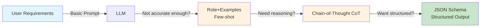
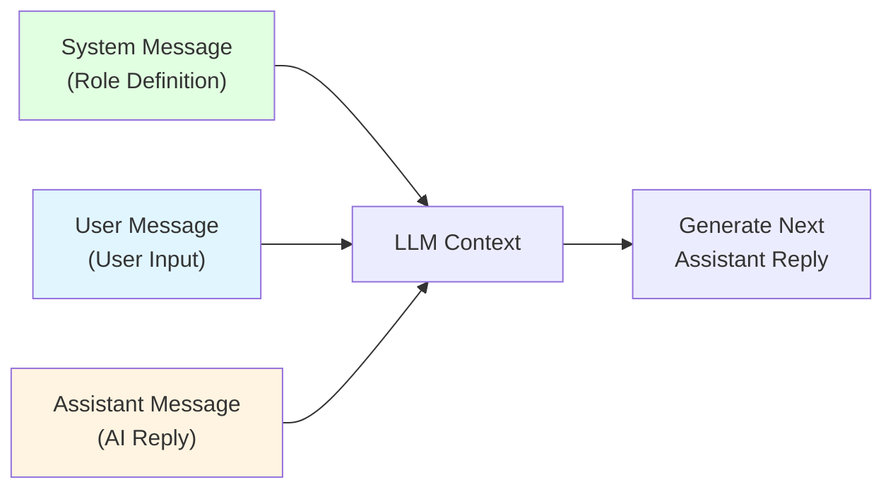
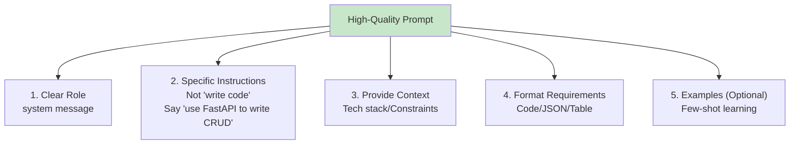

# Chapter 4: Prompt Engineering

> After completing this chapter, you will: Master fundamental prompt techniques and advanced methods, reliably obtain structured outputs



**Chapter Guide:**

- **4.1 Prompt Fundamentals**: Master System/User/Assistant roles, write high-quality prompts
- **4.2 Advanced Techniques**: Few-shot, Chain-of-Thought, Self-consistency to make models smarter
- **4.3 Structured Outputs**: Make LLMs output reliable JSON, seamlessly integrate with your code

---

## 4.1 Prompt Fundamentals <DifficultyBadge level="beginner" /> <CostBadge cost="$0.01" />

> Prerequisites: 1.1 Your First AI Conversation

### Why Do We Need It? (Problem)

**The same question, asked by different people, produces vastly different results:**

**Bad Prompt:**

```
Write a user management system
```

**AI Response:**
> "Sure, I can help you design a user management system. What features do you need?"

**Good Prompt:**

```
You are an experienced Python backend engineer.

Please generate API code for a user management system with requirements:
- Use FastAPI framework
- Implement CRUD functionality (Create, Read, Update, Delete users)
- User fields: id, username, email, created_at
- Include input validation and error handling
- Add detailed comments

Output format: Complete runnable code, do not omit anything.
```

**AI Response:**
> [Directly outputs complete FastAPI code, including all CRUD endpoints, Pydantic models, validation logic]

**The root of the difference: Prompts are the LLM's "task specification", quality determines output.**

Common problems:
1. **Too vague**: "write code", "optimize performance" - AI doesn't know what you want
2. **Lacks context**: Doesn't specify use case, tech stack, constraints
3. **No examples**: Complex tasks without input/output examples
4. **Ignores role**: Doesn't use system message to define AI's professional identity

### What Is It? (Concept)

**A prompt is the instruction you give to an LLM**, composed of three types of role messages:



**Functions of three roles:**

| Role | Function | Example |
|-----|------|------|
| **system** | Sets AI's identity, domain expertise, response style | "You are an experienced Python developer, good at writing concise and efficient code" |
| **user** | User's question or instruction | "Help me write a quicksort algorithm" |
| **assistant** | AI's historical replies (for multi-turn dialogue) | "OK, here's the quicksort implementation..." |

**Why do we need system messages?**

System messages are like "job descriptions", making AI enter a specific professional role. Compare effects:

**Without system message:**

```python
messages = [
    {"role": "user", "content": "Explain what a closure is"}
]
```

**AI Response:**
> "A closure is a combination of a function bundled together with references to its surrounding state..." (textbook definition, abstract)

**With system message:**

```python
messages = [
    {"role": "system", "content": "You are a patient programming tutor, good at explaining technical concepts with real-life examples, targeting beginners."},
    {"role": "user", "content": "Explain what a closure is"}
]
```

**AI Response:**
> "Imagine you work at a coffee shop, your job is to record each customer's order number. Each time a new customer comes, the number increases by 1...
> 
> A closure is like this scenario: the function remembers the external 'number counter', even when the coffee shop closes (outer function finishes executing), this counter still exists..."

**Elements of high-quality prompts:**



**Common prompt techniques:**

| Technique | Description | Example |
|-----|------|------|
| **Be specific** | Avoid vague terms, give clear metrics | ❌ "Write concise code" → ✅ "Functions under 20 lines, variable names in English" |
| **Give constraints** | Clearly state what not to do | "Don't use third-party libraries, only Python standard library" |
| **Step-by-step instructions** | Break complex tasks into steps | "Step 1: Extract fields; Step 2: Validate format; Step 3: Save to database" |
| **Output format** | Specify return structure | "Return in JSON format, include name, age, email fields" |
| **Thinking process** | Request analysis before answering | "First analyze the time complexity of this code, then suggest optimizations" |

**Common pitfalls:**

| Pitfall | Problem | Improvement |
|-----|------|------|
| **Imperative vs Descriptive** | "Generate code" | "You are a backend expert, help me implement with FastAPI..." |
| **Asking too much at once** | 10 questions in one prompt | Split into multiple rounds of dialogue |
| **Ignoring format** | Not specifying output format | "Output in Markdown table format" |
| **Over-reliance** | Giving all logic to AI | Provide clear business rules and boundary conditions |

::: warning Common Pitfall
"I told the AI to build a TODO app and it used a framework I've never heard of, added blockchain storage, and deployed to three cloud providers. Total overkill."

Lesson: AI is an eager intern. Without constraints, it will over-engineer everything. Always specify what NOT to use.
:::

### Hands-On Practice (Practice)

We'll use comparison experiments to see the effect differences of different prompts.

**Experiment 1: Compare "Bad Prompt" vs "Good Prompt"**

```python
from openai import OpenAI

client = OpenAI()

# Bad Prompt
bad_prompt = "Write a function to calculate Fibonacci sequence"

response = client.chat.completions.create(
    model="gpt-4.1-mini",
    messages=[{"role": "user", "content": bad_prompt}],
)
print("=== Bad Prompt ===")
print(response.choices[0].message.content)

# Good Prompt
good_prompt = """
You are a Python algorithm expert, good at writing high-performance code.

Task: Implement Fibonacci sequence calculation function

Requirements:
1. Use dynamic programming (avoid recursion)
2. Time complexity O(n), space complexity O(1)
3. Function signature: def fibonacci(n: int) -> int
4. Include parameter validation (n >= 0)
5. Add type annotations and docstring
6. Include 3 test cases

Output: Complete Python code, directly runnable.
"""

response = client.chat.completions.create(
    model="gpt-4.1-mini",
    messages=[{"role": "user", "content": good_prompt}],
)
print("\n=== Good Prompt ===")
print(response.choices[0].message.content)
```

**Experiment 2: The magic of System messages**

```python
from openai import OpenAI

client = OpenAI()

question = "Explain what an API is"

# Without system message
response1 = client.chat.completions.create(
    model="gpt-4.1-mini",
    messages=[{"role": "user", "content": question}],
)
print("=== No System Message (Default) ===")
print(response1.choices[0].message.content)

# Technical expert role
response2 = client.chat.completions.create(
    model="gpt-4.1-mini",
    messages=[
        {"role": "system", "content": "You are a rigorous computer science professor, explaining concepts in academic language."},
        {"role": "user", "content": question},
    ],
)
print("\n=== System: Technical Expert ===")
print(response2.choices[0].message.content)

# Humorous tutor role
response3 = client.chat.completions.create(
    model="gpt-4.1-mini",
    messages=[
        {"role": "system", "content": "You are a humorous programming tutor who likes explaining technical concepts with analogies and jokes, targeting elementary school students."},
        {"role": "user", "content": question},
    ],
)
print("\n=== System: Humorous Tutor ===")
print(response3.choices[0].message.content)
```

**Experiment 3: Practical prompt templates**

Create reusable prompt templates for common tasks:

```python
from openai import OpenAI

client = OpenAI()

# Code review template
def code_review_prompt(code: str, language: str = "Python"):
    return f"""
You are an experienced {language} code review expert, good at finding problems in code and suggesting improvements.

Please review the following code and output in this structure:

1. **Code Quality Score** (1-10)
2. **Issues Found** (sorted by severity)
   - For each issue explain: problem + impact + suggested fix
3. **Strengths**
4. **Improved Code** (optional, if there are major issues)

Code:
```{language.lower()}
{code}
```

Please provide detailed analysis.
"""

# Test
code = '''
def process_users(users):
    result = []
    for user in users:
        if user['age'] > 18:
            result.append(user['name'])
    return result
'''

response = client.chat.completions.create(
    model="gpt-4.1-mini",
    messages=[{"role": "user", "content": code_review_prompt(code)}],
)
print(response.choices[0].message.content)
```

**Experiment 4: Context management in multi-turn dialogue**

```python
from openai import OpenAI

client = OpenAI()

# Initialize conversation
messages = [
    {"role": "system", "content": "You are a Python programming assistant, good at debugging code."}
]

def chat(user_input):
    messages.append({"role": "user", "content": user_input})
    response = client.chat.completions.create(
        model="gpt-4.1-mini",
        messages=messages,
    )
    reply = response.choices[0].message.content
    messages.append({"role": "assistant", "content": reply})
    return reply

# Round 1: Present problem
print("User: What's wrong with this code?\n```python\nfor i in range(10):\n  print(i)\ntime.sleep(1)\n```")
print(f"AI: {chat('What\\'s wrong with this code?\\n```python\\nfor i in range(10):\\n  print(i)\\ntime.sleep(1)\\n```')}\n")

# Round 2: Follow-up (AI remembers previous code)
print("User: How should I import the time module?")
print(f"AI: {chat('How should I import the time module?')}\n")

# Round 3: Continue follow-up
print("User: Is there a more elegant way to write this?")
print(f"AI: {chat('Is there a more elegant way to write this?')}")
```

<ColabBadge path="demos/04-prompt-engineering/prompt_basics.ipynb" />

### Summary (Reflection)

- **What was solved**: Learned to write high-quality prompts, control AI role through system messages, understand the function of three message types
- **What wasn't solved**: Simple prompts can handle regular tasks, but what about complex tasks (classification, reasoning)? - Next section covers advanced techniques
- **Key takeaways**:
  1. **System messages define roles**: expert vs tutor vs assistant, completely different effects
  2. **Specific instructions**: Not "write code", say "implement CRUD with FastAPI"
  3. **Provide context**: tech stack, constraints, output format
  4. **Multi-turn dialogue needs manual history management**: API is stateless
  5. **Use templates for efficiency**: Build reusable prompt templates for common tasks

---

*Last updated: 2026-02-20*
