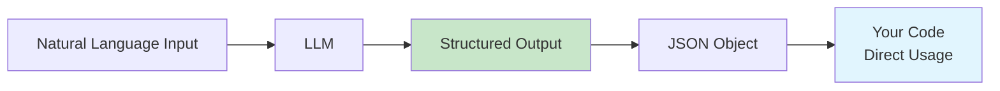
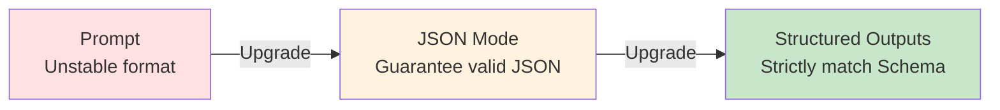
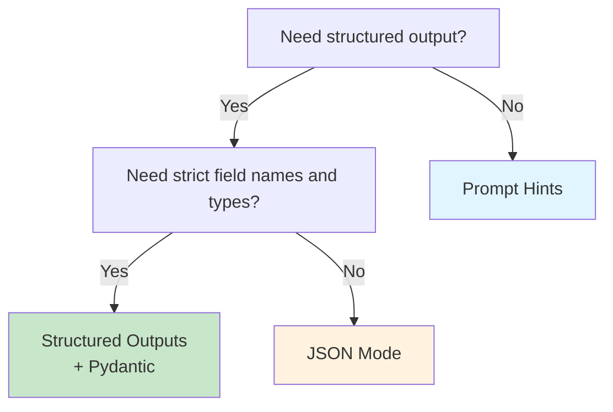

# 4.3 Structured Outputs <DifficultyBadge level="intermediate" /> <CostBadge cost="$0.01" />

> Prerequisites: 4.1 Prompt Fundamentals

### Why Do We Need It? (Problem)

When you use AI to build applications, you'll encounter this awkwardness:

**Scenario: Extract invoice information**

```python
from openai import OpenAI

client = OpenAI()

invoice_text = """
Invoice to: Beijing Technology Co., Ltd.
Amount: ¥12,580.00
Date: 2026-02-15
Invoice No: 20260215001
"""

response = client.chat.completions.create(
    model="gpt-4.1-mini",
    messages=[
        {"role": "user", "content": f"Extract from invoice: company name, amount, date, invoice number\n\n{invoice_text}"}
    ],
)

print(response.choices[0].message.content)
```

**AI might return:**

```
Company name: Beijing Technology Co., Ltd.
Amount is 12580 yuan
Date is February 15, 2026
Invoice number: 20260215001
```

**Problems:**
1. ❌ Inconsistent format (some add "is", some don't)
2. ❌ Messy amount format ("12580 yuan" vs "¥12,580.00")
3. ❌ Can't parse directly with code (you want JSON!)

**What you really need:**

```json
{
  "company": "Beijing Technology Co., Ltd.",
  "amount": 12580.00,
  "date": "2026-02-15",
  "invoice_number": "20260215001"
}
```

**Pain points of traditional approaches:**

| Method | Problem |
|-----|------|
| **Prompt hints** | "Please return in JSON format" → AI might return ```json...```, indentation might be messy, field names might be inconsistent |
| **Regular expressions** | Need to write complex regex to parse natural language, error-prone |
| **Manual parsing** | Large code volume, high maintenance cost |

**Fundamental need: Make LLMs output reliable, strictly formatted structured data.**

---

### What Is It? (Concept)

Structured outputs are a set of techniques that ensure LLM returns content conforming to your specified format (JSON Schema).



**Three solution comparison:**

| Solution | Principle | Reliability | Cost | OpenAI Support |
|-----|------|-------|------|------------|
| **Prompt hints** | Specify "return JSON" in prompt | ⭐⭐ | Low | ✅ |
| **JSON Mode** | Force model to return valid JSON | ⭐⭐⭐⭐ | Low | ✅ |
| **Structured Outputs** | Strictly generate according to JSON Schema | ⭐⭐⭐⭐⭐ | Low | ✅ (gpt-4o-mini+) |

**Evolution path:**



---

## Solution 1: Prompt Hints (Basic)

**Approach: Explicitly request JSON format in the prompt.**

```python
from openai import OpenAI
import json

client = OpenAI()

invoice_text = """
Invoice to: Beijing Technology Co., Ltd.
Amount: ¥12,580.00
Date: 2026-02-15
Invoice No: 20260215001
"""

prompt = f"""
Extract information from invoice and return in JSON format.

Required fields:
- company: Company name
- amount: Amount (number, no symbols)
- date: Date (YYYY-MM-DD format)
- invoice_number: Invoice number

Invoice content:
{invoice_text}

Please return JSON directly, no other text.
"""

response = client.chat.completions.create(
    model="gpt-4.1-mini",
    messages=[{"role": "user", "content": prompt}],
)

result = response.choices[0].message.content
print("AI returned:")
print(result)

# Try to parse
try:
    data = json.loads(result)
    print("\nParsed successfully:")
    print(data)
except json.JSONDecodeError as e:
    print(f"\nParsing failed: {e}")
```

**Potential problems:**

| Problem | Example |
|-----|------|
| Returns Markdown code block | ```json\n{...}\n``` |
| Inconsistent field names | `companyName` vs `company` |
| Extra explanatory text | "OK, here's the extracted information: {...}" |
| Format errors | Single quotes instead of double quotes |

**Improvement: Stricter Prompt**

```python
prompt = f"""
Extract information from invoice, output must be **pure JSON object**, no Markdown code blocks, no explanatory text.

JSON Schema:
{ {
  "company": "string",
  "amount": number,
  "date": "string (YYYY-MM-DD)",
  "invoice_number": "string"
} }

Invoice content:
{invoice_text}
"""
```

::: tip Applicable scenarios
- Quick prototypes
- Scenarios with low accuracy requirements
- Models not supporting JSON Mode
:::

---

## Solution 2: JSON Mode (Recommended)

**Principle: OpenAI forces valid JSON output at the model layer.**

```python
from openai import OpenAI
import json

client = OpenAI()

invoice_text = """
Invoice to: Beijing Technology Co., Ltd.
Amount: ¥12,580.00
Date: 2026-02-15
Invoice No: 20260215001
"""

response = client.chat.completions.create(
    model="gpt-4.1-mini",
    messages=[
        {
            "role": "system",
            "content": "You are a data extraction assistant, output format is JSON."
        },
        {
            "role": "user",
            "content": f"""
Extract information from invoice, return JSON object with fields: company, amount, date, invoice_number.

Invoice content:
{invoice_text}
"""
        }
    ],
    response_format={"type": "json_object"},  # Key: Enable JSON Mode
)

result = response.choices[0].message.content
print("AI returned:")
print(result)

# Parse JSON
data = json.loads(result)  # Guaranteed to parse successfully
print("\nExtracted data:")
print(f"Company: {data['company']}")
print(f"Amount: {data['amount']}")
print(f"Date: {data['date']}")
print(f"Invoice No: {data['invoice_number']}")
```

**Advantages of JSON Mode:**

| Feature | Description |
|-----|------|
| ✅ Guarantees valid JSON | Won't have format errors |
| ✅ Doesn't return Markdown | Directly JSON string |
| ✅ No complex Prompt needed | Simplifies prompts |
| ⚠️ Doesn't guarantee field names | Might return `companyName` instead of `company` |

::: warning Note
JSON Mode only guarantees **valid JSON format**, doesn't guarantee field names and structure exactly match your expectations. If you need strict matching, use Structured Outputs.
:::

---

## Solution 3: Structured Outputs (Strongest)

**Principle: Use JSON Schema to clearly define output structure, model guarantees 100% match.**

**Features:**
- ✅ Strictly match JSON Schema (field names, types, required items)
- ✅ Supports nested objects, arrays, enums
- ✅ Seamless integration with Pydantic

**Basic usage: Define JSON Schema**

```python
from openai import OpenAI
import json

client = OpenAI()

invoice_text = """
Invoice to: Beijing Technology Co., Ltd.
Amount: ¥12,580.00
Date: 2026-02-15
Invoice No: 20260215001
"""

# Define JSON Schema
invoice_schema = {
    "type": "object",
    "properties": {
        "company": {"type": "string", "description": "Company name"},
        "amount": {"type": "number", "description": "Amount (number)"},
        "date": {"type": "string", "description": "Date, format YYYY-MM-DD"},
        "invoice_number": {"type": "string", "description": "Invoice number"}
    },
    "required": ["company", "amount", "date", "invoice_number"],
    "additionalProperties": False
}

response = client.chat.completions.create(
    model="gpt-4o-2024-08-06",  # Must be a model supporting Structured Outputs
    messages=[
        {
            "role": "system",
            "content": "You are a data extraction assistant."
        },
        {
            "role": "user",
            "content": f"Extract information from invoice:\n\n{invoice_text}"
        }
    ],
    response_format={
        "type": "json_schema",
        "json_schema": {
            "name": "invoice_extraction",
            "schema": invoice_schema,
            "strict": True  # Strict mode
        }
    }
)

result = json.loads(response.choices[0].message.content)
print("Extraction result:")
print(json.dumps(result, indent=2, ensure_ascii=False))
```

**Output guarantee:**

```json
{
  "company": "Beijing Technology Co., Ltd.",
  "amount": 12580.0,
  "date": "2026-02-15",
  "invoice_number": "20260215001"
}
```

**Field names 100% match, types 100% correct, no extra fields!**

---

## Advanced: Integration with Pydantic

**Pydantic is Python's data validation library, perfectly paired with Structured Outputs.**

```python
from openai import OpenAI
from pydantic import BaseModel, Field
import json

client = OpenAI()

# Define data model with Pydantic
class Invoice(BaseModel):
    company: str = Field(description="Company name")
    amount: float = Field(description="Amount (number)")
    date: str = Field(description="Date, format YYYY-MM-DD")
    invoice_number: str = Field(description="Invoice number")

invoice_text = """
Invoice to: Beijing Technology Co., Ltd.
Amount: ¥12,580.00
Date: 2026-02-15
Invoice No: 20260215001
"""

# Pydantic automatically generates JSON Schema
response = client.beta.chat.completions.parse(
    model="gpt-4o-2024-08-06",
    messages=[
        {
            "role": "system",
            "content": "You are a data extraction assistant."
        },
        {
            "role": "user",
            "content": f"Extract information from invoice:\n\n{invoice_text}"
        }
    ],
    response_format=Invoice,  # Pass Pydantic model directly
)

# Returns Pydantic object, can use directly
invoice = response.choices[0].message.parsed
print(f"Company: {invoice.company}")
print(f"Amount: {invoice.amount}")
print(f"Date: {invoice.date}")
print(f"Invoice No: {invoice.invoice_number}")

# Convert to dict
print("\nJSON:")
print(invoice.model_dump_json(indent=2))
```

**Advantages of Pydantic:**

| Feature | Description |
|-----|------|
| ✅ Auto-generate Schema | No need to manually write JSON Schema |
| ✅ Type hints | IDE auto-completion |
| ✅ Data validation | Automatically validates types, ranges |
| ✅ Nested models | Supports complex data structures |

**Complex example: Nested objects and arrays**

```python
from openai import OpenAI
from pydantic import BaseModel, Field
from typing import List

client = OpenAI()

class OrderItem(BaseModel):
    name: str = Field(description="Product name")
    quantity: int = Field(description="Quantity")
    price: float = Field(description="Unit price")

class Order(BaseModel):
    order_id: str = Field(description="Order number")
    customer: str = Field(description="Customer name")
    items: List[OrderItem] = Field(description="Order details")
    total: float = Field(description="Total amount")

order_text = """
Order No: ORD-20260215-001
Customer: Zhang San
Product details:
1. Python Intro Book × 2 @ ¥89.00
2. JavaScript Advanced Programming × 1 @ ¥128.00
Total: ¥306.00
"""

response = client.beta.chat.completions.parse(
    model="gpt-4o-2024-08-06",
    messages=[
        {
            "role": "user",
            "content": f"Extract information from order:\n\n{order_text}"
        }
    ],
    response_format=Order,
)

order = response.choices[0].message.parsed
print(f"Order No: {order.order_id}")
print(f"Customer: {order.customer}")
print(f"Products:")
for item in order.items:
    print(f"  - {item.name} × {item.quantity} @ ¥{item.price}")
print(f"Total: ¥{order.total}")
```

---

## Three Solution Selection Guide



| Scenario | Recommended Solution |
|-----|---------|
| **Production data extraction** | Structured Outputs + Pydantic |
| **Simple JSON output** | JSON Mode |
| **Quick prototype** | Prompt Hints |
| **Models not supporting new API** | Prompt Hints + manual parsing |

---

### Hands-On Practice (Practice)

**Practical: Extract structured information from user reviews**

```python
from openai import OpenAI
from pydantic import BaseModel, Field
from typing import Literal

client = OpenAI()

class Review(BaseModel):
    sentiment: Literal["positive", "negative", "neutral"] = Field(description="Sentiment")
    rating: int = Field(description="Rating (1-5 stars)", ge=1, le=5)
    aspects: dict[str, str] = Field(description="Aspect evaluations, e.g. {'quality': 'good', 'price': 'expensive'}")
    summary: str = Field(description="One-sentence summary")

review_text = """
Bought this phone used for a week, overall pretty good.
Screen is very clear, photo quality is also good, just a bit expensive.
Battery life is average, if playing games need to charge twice a day.
Overall worth the money, giving 4 stars.
"""

response = client.beta.chat.completions.parse(
    model="gpt-4o-2024-08-06",
    messages=[
        {
            "role": "system",
            "content": "You are a review analysis assistant, good at extracting structured information from user reviews."
        },
        {
            "role": "user",
            "content": f"Analyze this review:\n\n{review_text}"
        }
    ],
    response_format=Review,
)

review = response.choices[0].message.parsed
print(f"Sentiment: {review.sentiment}")
print(f"Rating: {review.rating} stars")
print(f"Aspect evaluations: {review.aspects}")
print(f"Summary: {review.summary}")
```

<ColabBadge path="demos/04-prompt-engineering/structured_output.ipynb" />

---

### Summary (Reflection)

- **What was solved**: Make LLMs output reliable, directly consumable structured data (JSON)
- **What wasn't solved**: AI can only "read data", can't "do things" (call APIs, query databases) - Chapter 7 Function Calling solves this
- **Key takeaways**:
  1. **Prompt hints**: Simplest, but unreliable, suitable for prototypes
  2. **JSON Mode**: Guarantees valid JSON, doesn't guarantee field names
  3. **Structured Outputs**: Strictly matches JSON Schema, first choice for production
  4. **Pydantic integration**: Auto-generates Schema, type-safe, best development experience
  5. **Selection principle**: Use Structured Outputs for production, JSON Mode for quick prototypes

---

## 🎉 Beginner Section Checkpoint

Congratulations on completing the **Beginner Section** (Chapters 1-4)! You have mastered:

- ✅ 3 lines of code to call LLM API (Chapter 1)
- ✅ Understanding mainstream models and platform selection (Chapter 2)
- ✅ Understanding Token, parameters, reasoning model principles (Chapter 3)
- ✅ Mastering prompt fundamentals and advanced techniques (Chapter 4)

**You can now:**
- Call OpenAI / Claude / Gemini APIs
- Write high-quality prompts
- Control model behavior (temperature / top-p)
- Get structured outputs (JSON)

**Next stop: Tools Section (Chapters 5-6)**

Learn how to use AI coding tools (Cursor / GitHub Copilot) to improve development efficiency, master Context Engineering to make AI understand your project.

👉 [Chapter 5: AI Coding Tools Landscape](/05-ai-coding-tools/)

---

*Last updated: 2026-02-20*
