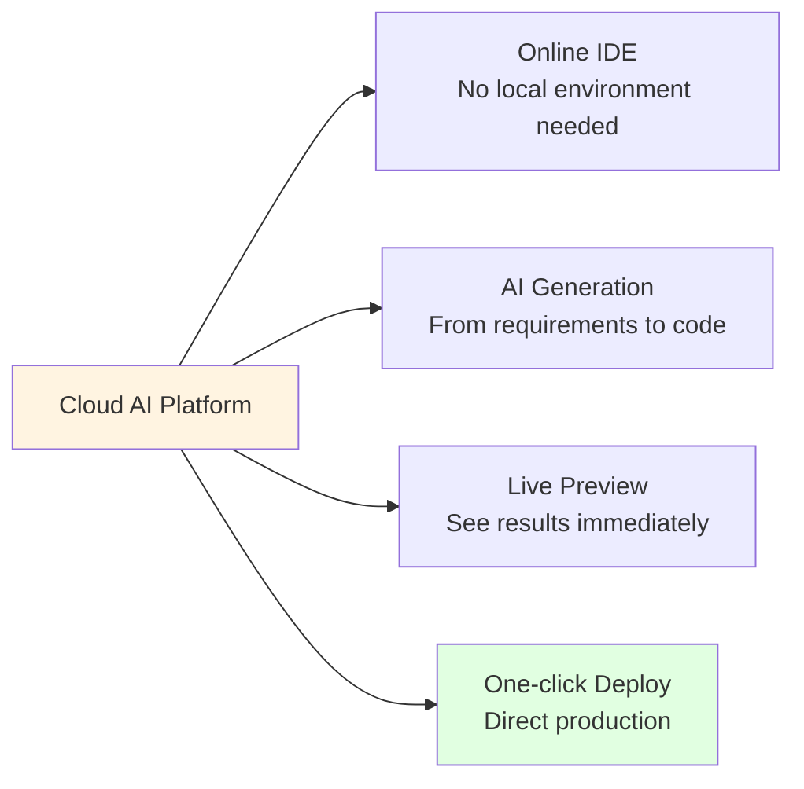

# 5.3 Cloud AI Development <DifficultyBadge level="beginner" /> <CostBadge cost="$0" />

> Prerequisites: None

### Why Do We Need It? (Problem)

Even with powerful IDE tools and terminal tools, traditional development workflows still have these pain points:

1. **Configuration Hell**
   - New project: install Node.js, Python, database, dependency packages...
   - Version conflicts: Project A needs Python 3.9, Project B needs 3.11
   - Spend 2 hours configuring environment, write code for 5 minutes

2. **Cross-device Collaboration Difficulties**
   - Wrote halfway at the office, want to continue at home?
   - Need to: push Git → pull code → reconfigure environment
   - Want to fix a bug on iPad? Sorry, can't install IDE

3. **High Learning Curve**
   - Want to try AI programming, but need to:
     - Learn VS Code / terminal
     - Configure API Keys
     - Understand project structure
   - Too high a barrier for beginners

4. **Quick Prototype Validation**
   - Want to test an idea: "Can I build XXX?"
   - Traditional process: create project → write code → configure deployment
   - Spend a day, find out the idea isn't feasible

**The Promise of Cloud AI Development Platforms: Open in browser, enter requirements, get deployable complete application in minutes.**

### What Is It? (Concept)

**Cloud AI Development Platforms** integrate development environment, AI coding assistant, and deployment services into the browser, achieving "zero-configuration development."



**Core Capability Comparison:**

| Platform | Core Scenario | AI Capabilities | Deployment | Pricing | Best For |
|-----|---------|---------|------|------|---------|
| **Replit AI** | Full-stack app development | Code generation + completion + Agent | Auto deploy | Free / $20/month | Learning programming, team collaboration |
| **v0 (Vercel)** | UI/frontend components | Prompt → React component | Export code | Free (200 credits/month) | Frontend developers, designers |
| **bolt.new** | Full-stack prototype | Prompt → Complete application | Preview + export | Free trial / $20/month | Quick idea validation |

---

## Replit AI - Online Full-stack Development Platform

**Complete Linux environment + AI assistant in browser**

### Core Features

1. **Zero-configuration Development Environment**


**Supported Tech Stacks:**
- Frontend: React, Vue, Next.js, Svelte
- Backend: Python (Flask/Django), Node.js (Express), Go
- Database: PostgreSQL, SQLite, MongoDB
- Full-stack: MERN, PERN, Django + React

**No need to install any tools, run directly in browser.**

2. **Replit AI Agent**

```
User input:
"Create a blog system with:
- User login and registration
- Publish, edit, delete articles
- Markdown editor
- Comment functionality"

Replit AI executes:
1. ✅ Create Next.js + TypeScript project
2. ✅ Configure Prisma + SQLite database
3. ✅ Generate user authentication (NextAuth.js)
4. ✅ Create article CRUD API
5. ✅ Integrate react-markdown editor
6. ✅ Implement comment system
7. ✅ Add TailwindCSS styling

Done! Click Run to preview.
```

3. **Real-time Collaboration** (like Google Docs)

- Multiple people editing the same file simultaneously
- Real-time cursor position display
- Voice/video calls (built-in)
- Suitable for pair programming, remote interviews

4. **One-click Deployment**

```bash
# Replit automatically provides:
https://your-app-username.replit.app

# Features:
- Automatic HTTPS
- Auto-scaling
- Custom domain (paid version)
```

### Usage Flow

**Step 1: Create Project**

1. Visit https://replit.com
2. Click "Create Repl"
3. Select template (e.g., "Next.js")

**Step 2: Use AI to Generate Code**

```
# Open AI Chat (right panel)
Prompt: Create a TODO app with add, delete, and mark complete functionality

AI: I will create:
- app/page.tsx - Main page
- components/TodoList.tsx - TODO list component
- app/api/todos/route.ts - API routes
- lib/db.ts - Database operations (SQLite)

[Apply] Click to have AI automatically create all files
```

**Step 3: Run and Preview**

1. Click top "Run" button
2. Preview window opens automatically on the right
3. Modify code, automatic hot reload

**Step 4: Deploy**

1. Click "Deploy" button
2. Select deployment method:
   - Static: Static website (free)
   - Autoscale: Auto-scaling ($20/month and up)
3. Get public URL

### Pricing

| Plan | Price | AI Quota | Private Projects | Computing Power |
|-----|------|---------|---------|------|
| Free | $0 | Basic (100 requests/day) | 3 | 0.5 vCPU |
| Hacker | $7/month | Enhanced (1000 requests/day) | Unlimited | 2 vCPU |
| Pro | $20/month | Unlimited AI | Unlimited | 4 vCPU + priority support |

### Suitable Scenarios

✅ **Learning Programming**: No environment setup, code directly
✅ **Quick Prototypes**: Validate ideas, go live in minutes
✅ **Remote Collaboration**: Team real-time pair programming
✅ **Technical Interviews**: Shared editor + real-time execution

❌ **Production Environment**: Performance and stability not as good as professional cloud services
❌ **Large Projects**: Editor features not as good as local IDE

---

## v0 (Vercel) - AI-generated UI Components

**From design description to React code, 10 seconds to generate**

### Core Features

1. **Prompt → UI Generation**

```
User input:
"Design a pricing page with 3 pricing plans (Free, Pro, Enterprise),
each plan displays: price, feature list, CTA button. Use modern design style."

v0 output:
- ✅ React + TypeScript code
- ✅ TailwindCSS styling
- ✅ Responsive design (mobile-friendly)
- ✅ Dark mode support
- ✅ Live preview

[Copy Code] [Edit in Playground] [Add to Project]
```

**Actual Generation Example:**

```tsx
// v0 generated code (simplified)
import { Check } from 'lucide-react'

export default function PricingPage() {
  const plans = [
    {
      name: 'Free',
      price: '$0',
      features: ['10 projects', 'Basic support', '1 GB storage'],
    },
    {
      name: 'Pro',
      price: '$20',
      features: ['Unlimited projects', 'Priority support', '100 GB storage', 'Advanced analytics'],
      popular: true,
    },
    {
      name: 'Enterprise',
      price: 'Custom',
      features: ['Unlimited everything', '24/7 support', 'Custom integrations', 'SLA'],
    },
  ]

  return (
    <div className="min-h-screen bg-gradient-to-br from-gray-900 to-gray-800 py-12">
      <div className="container mx-auto px-4">
        <h1 className="text-4xl font-bold text-center text-white mb-12">
          Choose Your Plan
        </h1>
        <div className="grid md:grid-cols-3 gap-8">
          {plans.map((plan) => (
            <div
              key={plan.name}
              className={`bg-white rounded-lg p-8 ${
                plan.popular ? 'ring-2 ring-blue-500 scale-105' : ''
              }`}
            >
              {plan.popular && (
                <span className="bg-blue-500 text-white px-3 py-1 rounded-full text-sm">
                  Most Popular
                </span>
              )}
              <h2 className="text-2xl font-bold mt-4">{plan.name}</h2>
              <p className="text-4xl font-bold mt-2">{plan.price}</p>
              <ul className="mt-6 space-y-3">
                {plan.features.map((feature) => (
                  <li key={feature} className="flex items-center">
                    <Check className="w-5 h-5 text-green-500 mr-2" />
                    {feature}
                  </li>
                ))}
              </ul>
              <button className="w-full bg-blue-600 text-white py-2 rounded-lg mt-8 hover:bg-blue-700">
                Get Started
              </button>
            </div>
          ))}
        </div>
      </div>
    </div>
  )
}
```

2. **Iterative Refinement**

```
After v0 generates, you can continue the conversation:

You: "Change the Pro plan button to gradient color, add hover animation"
v0: ✅ Code updated

You: "Add annual/monthly toggle"
v0: ✅ Added state management and toggle button

You: "Display as single column on mobile"
v0: ✅ Adjusted responsive breakpoints
```

3. **Export and Integration**

```bash
# Method 1: Copy code
# Click "Copy Code" → paste into your project

# Method 2: Deploy directly to Vercel
# Click "Deploy" → Authorize GitHub → Auto-create repository → Deploy live

# Method 3: Integrate into Next.js project
npx v0 add <component-id>
```

### Usage Flow

**Step 1: Visit v0**

https://v0.dev

**Step 2: Describe UI Requirements**

```
Example Prompt:

"Design a Dashboard page with:
- Top navigation bar (Logo, search box, user avatar)
- Left sidebar (navigation menu)
- Main content area displays 4 stat cards (users, orders, revenue, growth rate)
- Use Shadcn UI style"
```

**Step 3: Live Preview and Adjust**

- v0 generates 3 design variants
- Select your favorite
- Continue conversation to fine-tune

**Step 4: Export Code**

```bash
# Install dependencies
npm install lucide-react clsx tailwind-merge

# Copy component code to project
cp generated-component.tsx src/components/
```

### Pricing

| Plan | Price | Credits/Month | ~Generations |
|-----|------|---------|-----------|
| Free | $0 | 200 | ~40 generations |
| Premium | $20 | 5000 | ~1000 generations |

**Credit Consumption Rules:**
- Generate new component: 5 credits
- Iterative refinement: 2 credits
- Generate multiple variants: +2 credits/variant

### Suitable Scenarios

✅ **Frontend Developers**: Quickly generate UI components, focus on business logic
✅ **Designers**: Turn design ideas into code, validate feasibility
✅ **Product Managers**: Quickly create high-fidelity prototypes
✅ **Indie Developers**: No designer resources, AI helps you design

❌ **Complex Interaction Logic**: v0 focuses on UI, doesn't handle business logic
❌ **Non-React Projects**: Only generates React/Next.js code

---

## bolt.new - Full-stack Application Generator

**One sentence to generate complete application (frontend + backend + database)**

### Core Features

1. **Prompt → Full-stack Application**

```
User input:
"Create an online voting app:
- Users can create voting topics (title + multiple options)
- Others can vote
- Real-time display of voting results (bar chart)
- Use Next.js + Prisma + SQLite"

bolt.new output:
- ✅ Complete Next.js project structure
- ✅ Prisma database models
- ✅ API routes (create vote, vote, query results)
- ✅ Frontend pages (create page, voting page, results page)
- ✅ Chart.js visualization
- ✅ Responsive design
- ✅ Runnable preview
```

2. **Live Preview Environment**


**Features:**
- Modify code, preview auto-refreshes
- Supports hot reload (HMR)
- Built-in terminal, can run commands

3. **Download and Deploy**

```bash
# Method 1: Download ZIP
Click "Download" → Get complete project source code

# Method 2: Push to GitHub
Click "Push to GitHub" → Auto-create repository

# Method 3: Deploy to Vercel
Click "Deploy to Vercel" → One-click live
```

### Usage Flow

**Step 1: Visit bolt.new**

https://bolt.new

**Step 2: Enter Application Requirements**

```
Example Prompt:

"Create a Pomodoro timer app:
- 25-minute focus countdown
- 5-minute break countdown
- Can pause/reset
- Record number of completed pomodoros
- Use React + TypeScript + Vite"
```

**Step 3: View Generated Code and Preview**

- Left: File tree
- Center: Code editor
- Right: Live preview

**Step 4: Iterative Refinement**

```
Continue conversation:

"Add white noise playback (rain, cafe, ocean waves)"
→ bolt.new automatically adds audio player

"Add daily statistics chart"
→ bolt.new integrates Chart.js and implements data statistics
```

**Step 5: Export or Deploy**

```bash
# Download locally
unzip bolt-new-project.zip
cd bolt-new-project
npm install
npm run dev
```

### Pricing

| Plan | Price | AI Generations | Advanced Features |
|-----|------|------------|---------|
| Free | $0 | 5 times/day | Basic generation |
| Pro | $20/month | Unlimited | More complex apps, priority support |

### Suitable Scenarios

✅ **Quick Idea Validation**: Get working prototype in minutes
✅ **Learning Full-stack Development**: See how AI organizes project structure
✅ **Hackathons**: Quickly scaffold project base architecture
✅ **Internal Tools**: Quickly develop small admin backends

❌ **Production-grade Applications**: Generated code needs further optimization
❌ **Complex Business Logic**: Suitable for small to medium apps (< 20 pages)

---

## Comparison of Three Platforms

### Feature Comparison

| Feature | Replit AI | v0 | bolt.new |
|-----|----------|----|----|
| **AI Generation Capability** | Full-stack code | UI components | Full-stack applications |
| **Development Environment** | Complete Linux environment | None (code generation only) | Simplified environment |
| **Live Preview** | ✅ | ✅ | ✅ |
| **Collaboration Features** | ✅ Multi-user real-time | ❌ | ❌ |
| **Deployment** | ✅ One-click deploy | ✅ Export to Vercel | ✅ Export/deploy |
| **Tech Stack** | Any language | React/Next.js | Mainly JavaScript stack |
| **Learning Curve** | Low | Very low | Low |

### Selection Advice

| Scenario | Recommended Platform | Reason |
|-----|---------|------|
| **Learning Programming** | Replit AI | Complete dev environment + collaboration |
| **Quick UI Creation** | v0 | Fastest React component generation |
| **Full-stack Idea Validation** | bolt.new | End-to-end generation + preview |
| **Team Collaboration** | Replit AI | Real-time multi-user editing |
| **Frontend Developers** | v0 | Focus on UI, export to your own project |
| **No Programming Background** | bolt.new | Zero coding ability can generate apps |

---

### Try It Yourself (Practice)

**Task: Use v0 to Generate a Product Landing Page**

We'll experience the complete cloud AI platform flow: describe → generate → preview → export.

**Goal:** Create a landing page for a fictional AI writing tool "WriteGPT".

**Step 1: Visit v0**

1. Open https://v0.dev
2. Login with Google/GitHub (free account works)

**Step 2: Enter Design Requirements**

Paste the following prompt in the input box:

```
Design a SaaS product landing page, product name "WriteGPT", AI writing assistant.

Page structure:
1. Hero Section
   - Main headline: "10x Writing Speed, AI-powered Content Creation Platform"
   - Subheadline: "From inspiration to draft, in just 3 minutes"
   - CTA buttons: "Free Trial" + "Watch Demo"
   - Right side displays product screenshot placeholder

2. Features Section (3 feature cards)
   - Smart continuation: AI auto-completes paragraphs
   - Multi-language support: Supports 100+ languages
   - SEO optimization: Auto-generates keywords

3. Pricing Section (3 pricing plans)
   - Free: $0/month, 10 AI generations
   - Pro: $29/month, unlimited AI generations
   - Team: $99/month, 5 seats + collaboration

4. Footer
   - Product links, social media icons

Design style:
- Modern, minimalist
- Use purple gradient theme color
- Responsive design
- Dark mode support
```

**Step 3: Select Design Variant**

v0 will generate 3 different design options:

- **Variant 1**: Minimalist style
- **Variant 2**: Gradient background + animations
- **Variant 3**: Card-based layout

Click your favorite variant to view live preview.

**Step 4: Iterative Refinement**

Continue conversation in the chat box:

```
Refinement 1: "Make the Hero Section CTA buttons bigger, add hover animation"
→ v0 updates code

Refinement 2: "Change Features Section icons to lucide-react icon library"
→ v0 replaces icons

Refinement 3: "Add Customer Testimonials Section, display 3 fictional reviews"
→ v0 adds new Section
```

**Step 5: Export Code**

1. Click top right **"Copy Code"**
2. Code copied to clipboard

**Step 6: Run Locally (Optional)**

```bash
# Create Next.js project
npx create-next-app@latest writegpt-landing
cd writegpt-landing

# Install dependencies
npm install lucide-react clsx tailwind-merge

# Create component file
mkdir -p src/components
# Paste copied code to src/components/landing-page.tsx

# Reference in app/page.tsx
# import LandingPage from '@/components/landing-page'
# export default function Page() { return <LandingPage /> }

# Run
npm run dev
# Visit http://localhost:3000
```

**Step 7: Deploy to Vercel (Optional)**

```bash
# Method 1: Deploy directly through v0
Click "Deploy to Vercel" button in v0 interface

# Method 2: Manual deploy
git init
git add .
git commit -m "Initial commit"
git push -u origin main

# Import repository in Vercel Dashboard
# Auto-deploy, get URL: https://writegpt-landing.vercel.app
```

**Expected Results:**

You should get:
- A complete product landing page (approximately 300 lines of React code)
- Responsive design (perfectly displays on mobile, tablet, desktop)
- Production-ready deployable code

**Time Comparison:**
- **Traditional Development** (hand-write HTML/CSS/JS): 4-6 hours
- **Using Tailwind Templates**: 2-3 hours (needs style adjustments)
- **v0 Generation**: 5 minutes (including 3 rounds of iteration)

**Cost Comparison:**
- **Hire Designer + Frontend Developer**: $500-2000
- **Purchase Template**: $50-200
- **v0 Generation**: Free (Free plan) or $20/month (unlimited generation)

---

### Summary (Reflection)

- **What It Solves**: Learn to use cloud AI platforms for zero-configuration development, from idea to production all in browser
- **What It Doesn't Solve**: So many tools, which to choose? What's the best combination for different roles?—Next section provides selection guide
- **Key Takeaways**:
  1. **Replit AI** = Complete development platform (IDE + AI + deployment), suitable for learning and collaboration
  2. **v0** = Fastest UI generator (Prompt → React component), suitable for frontend developers
  3. **bolt.new** = Full-stack app generator (Prompt → complete app), suitable for quick idea validation
  4. Cloud platform advantages: Zero configuration, live preview, one-click deployment
  5. Cloud platform disadvantages: Performance not as good as local, features limited by platform
  6. Selection advice: Use Replit for learning, v0 for frontend, bolt.new for prototypes

---

*Last Updated: 2026-02-20*
