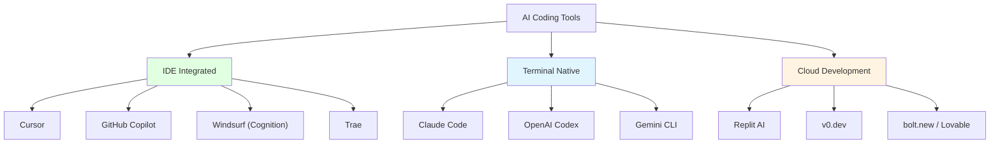
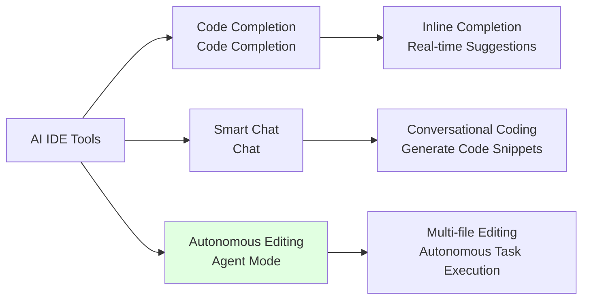
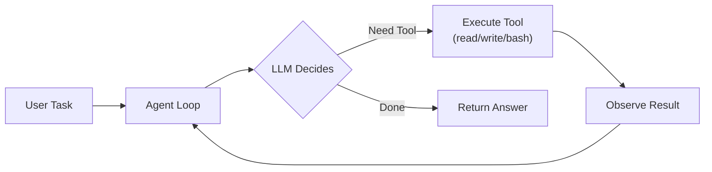

# Chapter 5: AI Coding Tools Landscape

> After completing this chapter, you will: Understand the AI coding tools ecosystem and choose the right tool combinations for your role



## 5.1 IDE Integrated Tools <DifficultyBadge level="beginner" /> <CostBadge cost="$0" />

> Prerequisites: None

### Why Do We Need It? (Problem)

In traditional programming, developers need to:

1. **Manually write boilerplate code**
   - Creating REST APIs: define routes, write CRUD operations, handle errors...
   - A simple CRUD interface requires 200+ lines of code
   - Repetitive work occupies 60% of development time

2. **Frequently search documentation**
   - Forgot API parameters? Google → Stack Overflow → Official docs
   - A small question interrupts 15 minutes of flow state
   - Wasting 2+ hours daily switching between tools

3. **High cost of cross-file refactoring**
   - Modifying database fields: change schema → change models → change API → change frontend
   - Manually modify 20+ files, easy to miss something
   - A small change triggers cascading bugs

**The Promise of AI IDE Tools: Describe your requirements in natural language, and AI helps you generate, modify, and refactor code.**

### What Is It? (Concept)

**IDE Integrated AI Tools** embed large language models directly into code editors, providing three core capabilities:



**Core Concepts:**

| Capability | Description | Typical Scenario | Tool Example |
|-----|------|---------|---------|
| **Code Completion** | Real-time suggestions while typing | Writing functions, importing libraries | GitHub Copilot inline completion |
| **Smart Chat** | Generate code snippets through conversation | "Write a regex to validate email" | Cursor Chat |
| **Agent Mode** | AI autonomously understands requirements and edits multiple files | "Add user authentication feature" | Cursor Composer, Windsurf Cascade |

**Comparison of Mainstream AI IDE Tools:**

| Tool | Core Features | Agent Mode | Context Capability | Pricing | Best For |
|-----|---------|-----------|-----------|------|---------|
| **Cursor** | Composer multi-file editing, Rules customization | ✅ Powerful | @-symbol file/doc references | $20/month (500 Premium requests) | Full-stack developers |
| **GitHub Copilot** | Most mature ecosystem, Workspace indexing | ✅ Copilot Edits | GitHub native integration | $10/month (individual), $19/month (business) | Enterprise teams |
| **Windsurf** | Cascade autonomous flow (acquired by Cognition/Devin) | ✅ Cascade | Codebase indexing | $15/month (Pro) | Users wanting polished UI |
| **Trae** | Large free quota | ✅ Basic Agent | Basic context | Free / $20/month | Budget-conscious students/individuals |
| **Cline/RooCode** | VS Code open-source extensions, local model support | ✅ Full Agent | Manual file selection | Pay-per-use (API costs) | Open source enthusiasts/custom needs |
| **JetBrains Junie** | Native IntelliJ integration, Junie Agent | ✅ Junie Agent | Native IDE indexing | $10/month | JetBrains users |

**Detailed Tool Overview:**

### Cursor

**The Most Powerful AI IDE (Built on VS Code)**

Core Features:
- **Composer (⌘ I)**: Multi-file Agent editing mode
  - Describe requirements in one sentence: "Add user login feature"
  - AI automatically: creates files → writes code → updates config
  - Supports previewing diff before applying
  
- **Rules (.cursorrules)**: Project-level AI behavior customization
  ```
  - Use TypeScript + React + Next.js 14
  - API routes follow RESTful conventions
  - All database operations use Prisma ORM
  - Error handling returns unified { error: string }
  ```

- **@ Symbol Context References**:
  - `@file`: Reference specific files
  - `@folder`: Reference entire directory
  - `@docs`: Reference online documentation (e.g., Next.js official docs)
  - `@web`: Search the internet

**Pricing:**
- Hobby: $0/month (limited completions, basic models)
- Pro: $20/month (500 Premium requests/month, access to GPT-5, Claude Sonnet 4.6)
- Business: $40/month (unlimited Premium + unified management)

### GitHub Copilot

**The Most Mature Enterprise-Grade AI Coding Assistant**

Core Features:
- **Copilot Chat**: In-IDE conversational programming
- **Copilot Edits**: Multi-file editing (similar to Cursor Composer)
- **Copilot Workspace**: Generate PR directly from GitHub Issues
- **Native Integration**: VS Code, JetBrains, Vim, Neovim

**Advantages:**
- First to launch (2021), richest training data
- Enterprise-grade security: code not used for training, SOC 2 certified
- Deep GitHub ecosystem integration: Pull Requests, Code Review

**Pricing:**
- Individual: $10/month
- Business: $19/month/user
- Enterprise: $39/month/user (includes audit logs, IP protection)

### Windsurf

**AI IDE Acquired by Cognition (Devin Team)**

::: warning Status Update (2025)
Windsurf was acquired by Cognition (the team behind Devin, the AI software engineer). While still functioning as an independent product, its roadmap and direction may evolve as it integrates with Cognition's autonomous agent technology.
:::

Core Features:
- **Cascade**: Intelligent flow orchestration Agent
  - Automatically breaks down tasks → executes step by step → validates results
  - Example: "Refactor this component, extract common logic"
  - AI will: analyze code → create new files → move functions → update references

**Pricing:**
- Free: Limited completions
- Pro: $15/month (Premium requests)

**Value Analysis:** Windsurf Pro $15 offers similar functionality to Cursor Pro $20, but with an uncertain roadmap post-acquisition. Evaluate based on your preference for stability vs value.

### Trae

**The Most Generous Free AI IDE**

Core Features:
- Large free quota for daily usage
- Multi-model support: GPT-5, Claude Sonnet 4.6, Gemini 2.5
- Basic Agent mode

**Best For:**
- Students, individual developers
- Those who don't want to bind credit cards
- Light users with under 200 AI assists per month

### Cline / RooCode

**Open Source VS Code Extensions**

Cline (formerly Claude Dev) and RooCode are community-driven open-source extensions that give you full Agent capabilities with your own API keys:
- Full Agent capabilities: read/write files, execute commands, browser control
- Local model support: Ollama, LM Studio
- Multi-model switching: OpenAI, Anthropic, Google, DeepSeek

**Advantages:**
- Fully open source, transparent code
- Pay-per-use: only pay API costs, no subscription
- Can connect your own API Key, use low-cost models like DeepSeek

**Best For:**
- Users with existing OpenAI/Anthropic API Keys
- Need to use local models (privacy-sensitive scenarios)
- Hackers who enjoy customization

### JetBrains Junie

**Native AI Agent for IntelliJ/PyCharm/WebStorm**

Core Features:
- AI code completion (supports Kotlin, Java, Python, etc.)
- **Junie Agent**: Autonomous task execution within JetBrains IDEs
- Project structure understanding (leverages IDE indexing)
- Refactoring suggestions, test generation

**Best For:**
- Heavy JetBrains users (don't want to switch editors)
- Java/Kotlin developers (high completion quality)

**Pricing:** $10/month

---

### Terminal Native Tools: The Agent Loop Paradigm

Beyond IDE tools, **terminal-native AI coding agents** have become mainstream in 2025-2026. These tools run directly in your terminal and operate through an **Agent Loop** — a continuous cycle of reasoning and action:



**How the Agent Loop works** (inspired by [learn-claude-code](https://github.com/shareAI-lab/learn-claude-code)):

```python
while True:
    response = client.messages.create(
        model=model, system=system,
        messages=messages, tools=tools
    )
    messages.append(response)
    
    if response.stop_reason != "tool_use":
        return response  # Task complete
    
    # Execute tools and feed results back
    results = execute_tools(response.tool_calls)
    messages.append(results)
```

This simple pattern powers tools like Claude Code, OpenAI Codex, and Gemini CLI. The key insight: **an AI coding agent is just an LLM in a loop with tools** — tools for reading files, writing files, running commands, and searching code.

::: info Soul-Searching Question
If AI wrote 80% of the code, who's responsible for the code review? You? The AI? The project manager? In 2026, "the AI wrote it" is the new "it works on my machine" — technically true, still your problem.
:::

**Mainstream Terminal Agents:**

| Tool | Backing Model | Strengths | Pricing |
|------|-------------|-----------|---------|
| **Claude Code** | Claude Opus/Sonnet 4.6 | Strongest reasoning, architectural changes, debugging | Pay-per-use (API) or Max plan |
| **OpenAI Codex** | GPT-5.3-Codex | Deterministic multi-step tasks, cloud sandbox | API pricing or ChatGPT Pro |
| **Gemini CLI** | Gemini 2.5 Pro | Free tier generous (1M tokens/min), Google ecosystem | Free + paid tiers |
| **Aider** | Multi-model | Open source, git-native, pair programming style | Free (own API keys) |

::: tip Progressive Learning Path
The [learn-claude-code](https://github.com/shareAI-lab/learn-claude-code) project teaches you to build a Claude Code-like agent from scratch in 11 sessions: Agent Loop → Tools → TodoWrite → Subagents → Skills → Context Compaction → Background Tasks → Agent Teams. Highly recommended for understanding how these tools work internally.
:::

---

### Try It Yourself (Practice)

**Task: Use Cursor Agent Mode to Generate a TODO API**

We'll describe requirements in natural language and let Cursor help us:
1. Create an Express.js project
2. Implement TODO CRUD APIs
3. Add data persistence (JSON file)

**Step 1: Install Cursor**

1. Visit https://cursor.sh
2. Download and install (supports macOS, Windows, Linux)
3. Login required on first launch (supports GitHub/Google)

**Step 2: Create Project**

1. Open terminal, create project directory:
   ```bash
   mkdir todo-api
   cd todo-api
   npm init -y
   npm install express
   ```

2. Open project with Cursor:
   ```bash
   cursor .
   ```

**Step 3: Use Composer to Generate Code**

1. Press `⌘ I` (Mac) or `Ctrl I` (Windows/Linux) to open Composer
2. Enter the following prompt:

```
Create an Express.js TODO API with the following features:

1. GET /todos - Get all TODOs
2. POST /todos - Create new TODO (requires title and description)
3. PUT /todos/:id - Update TODO
4. DELETE /todos/:id - Delete TODO

Data stored in todos.json file, format:
[
  { "id": 1, "title": "Learn AI", "description": "Complete Chapter 5", "completed": false }
]

Requirements:
- Use ES6+ syntax
- Add error handling
- All responses return JSON
- Start on port 3000
```

3. Click **Generate**, Cursor will:
   - Create `server.js` (Express application)
   - Create `todos.json` (data file)
   - Implement all CRUD routes
   - Add error handling middleware

**Step 4: Preview and Apply Changes**

1. Composer displays files to be created/modified
2. Review each diff (red = deleted, green = added)
3. After confirming, click **Accept All**

**Step 5: Test API**

1. Start server:
   ```bash
   node server.js
   ```

2. Test API (open new terminal):
   ```bash
   # Get all TODOs
   curl http://localhost:3000/todos
   
   # Create TODO
   curl -X POST http://localhost:3000/todos \
     -H "Content-Type: application/json" \
     -d '{"title": "Learn Cursor", "description": "Complete hands-on task"}'
   
   # Update TODO
   curl -X PUT http://localhost:3000/todos/1 \
     -H "Content-Type: application/json" \
     -d '{"completed": true}'
   
   # Delete TODO
   curl -X DELETE http://localhost:3000/todos/1
   ```

**Step 6: Modify Requirements (Experience Agent Capabilities)**

Open Composer again (⌘ I), enter:

```
Add user authentication:
1. POST /login - User login (username, password)
2. All /todos routes require JWT token verification
3. Passwords encrypted with bcrypt
```

Observe how Cursor:
- Installs new dependencies (jsonwebtoken, bcrypt)
- Creates auth middleware
- Modifies existing routes to add verification
- Updates package.json

**Expected Results:**

You should get a complete TODO API project, including:
- `server.js` (approximately 100 lines)
- `todos.json` (data file)
- `package.json` (dependency configuration)
- Complete CRUD functionality + error handling

**Comparison with Traditional Development:**
- **Traditional Way**: 1-2 hours (manually write routes, error handling, file I/O)
- **Cursor Agent**: 2 minutes (natural language description → complete code)

---

### Summary (Reflection)

- **What It Solves**: Through AI IDE and terminal tools, upgrade from "writing code" to "describing requirements," improving development efficiency 5-10x
- **What It Doesn't Solve**: IDE tools rely on GUI, terminal agents need good context — next chapter introduces Context Engineering to maximize AI tool effectiveness
- **Key Takeaways**:
  1. **Cursor** = Most powerful IDE (Composer + Rules), suitable for professional developers ($20/month)
  2. **Windsurf** = Polished UI, now under Cognition ($15/month, watch roadmap)
  3. **GitHub Copilot** = Enterprise choice (mature ecosystem + security certification)
  4. **Claude Code** = Strongest terminal agent for complex reasoning and debugging
  5. **Cline/RooCode** = Open source + Pay-per-use, suitable for API Key users
  6. **2026 trend**: Developers increasingly use multiple tools — IDE for daily work, terminal agents for complex problems
  7. Selection advice: Beginners start with Trae or Cursor Free; terminal users try Claude Code or Gemini CLI

---

*Last Updated: 2026-02-20*
