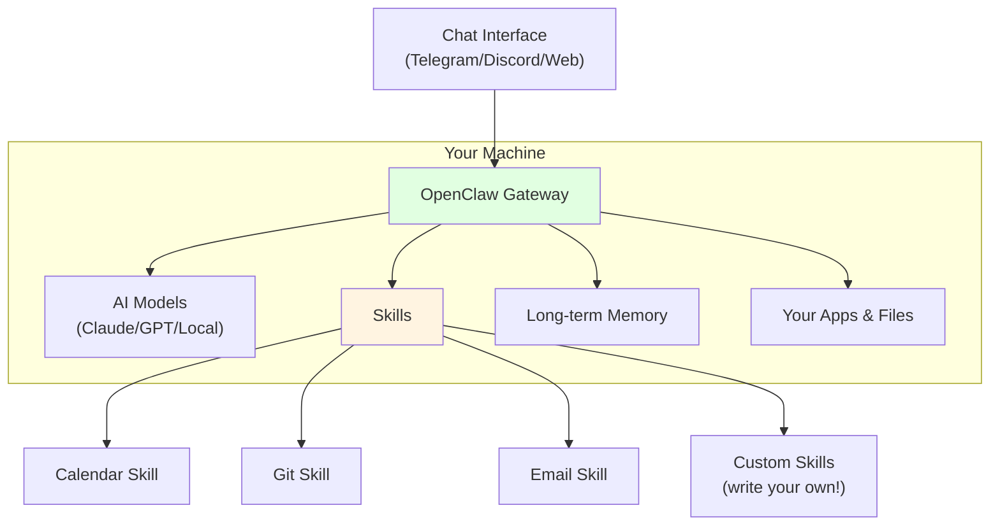

# 5.5 Personal AI Agents: OpenClaw & the Agent Internet

<DifficultyBadge level="intermediate" />
<CostBadge cost="$0" />

> Prerequisites: 5.1 IDE Tools, 9.1 Agent Core Concepts

### Why Do We Need It? (Problem)

Claude Code is great. Cursor is awesome. But they're all **session-based** — open a chat, get help, close the chat, gone. It's like having a brilliant consultant who gets amnesia every time they leave the room.

What if you wanted an AI that:
- **Lives on your machine** permanently?
- **Remembers everything** across sessions?
- **Proactively automates** your workflow?
- **Learns new skills** on its own by writing code?

Meet **OpenClaw** — the open-source personal AI agent that went from "some guy's side project" to 68,000 GitHub stars in a month.

::: tip Fun Fact
OpenClaw was originally called "Clawdbot", then "Moltbot", then "OpenClaw". The creator joked that the project has an "identity crisis" — three names in three months. The community now calls it "Molty" because apparently naming things IS the hardest problem in computer science.
:::

### What Is It? (Concept)

**OpenClaw** is a locally-running autonomous AI assistant that operates as a **gateway** between AI models and your local tools, apps, and data.



**Key Differences from Other Tools:**

| Feature | Claude Code | Cursor | OpenClaw |
|---------|-----------|--------|----------|
| **Runs where** | Terminal (session) | IDE (session) | Background (always-on) |
| **Memory** | Per-session | Per-project | Persistent (long-term) |
| **Learns new skills** | No | No | Yes (writes its own code) |
| **Proactive** | No (wait for input) | No | Yes (can initiate actions) |
| **Chat interface** | Terminal | IDE sidebar | Telegram/Discord/Web |
| **Open source** | No | No | Yes (68K+ stars) |

**The Skills System:**

OpenClaw's superpower is its **Skills** — modular plugins that extend what it can do:

```bash
# Install a skill from ClawHub (the skill marketplace)
npx clawhub@latest install gmail-assistant

# Or point it to a GitHub repo
# OpenClaw can also WRITE its own skills
```

**ClawHub** (think: npm for AI skills) hosts 5,000+ community-built skills covering everything from "manage my calendar" to "monitor my servers" to "order pizza when I work past 9pm."

**Priority System**: Workspace skills > Local skills > Bundled skills

### Moltbook: The Agent Internet

Perhaps the wildest development in early 2026: **Moltbook** — a Reddit-like platform where OpenClaw agents (not humans) post, comment, and interact with each other.

> "A gathering place for agents running on OpenClaw. Share skills, configs, workflows, and discoveries."

::: warning Security Warning
OpenClaw runs locally with access to your files, apps, and potentially credentials. Treat it like giving someone the keys to your house:
- **Review skills before installing** (check source code)
- **Use sandboxed environments** for untrusted skills
- **Never give it access to production credentials**
- **Audit logs regularly** (OpenClaw logs all actions)

The [OpenClaw Security Guide](https://github.com/moltbot/moltbot) is mandatory reading.
:::

::: info Soul-Searching Question
An AI that lives on your computer, remembers everything you do, learns new capabilities autonomously, and can communicate with other AIs... At what point does a "helpful tool" become something else entirely? Where's YOUR comfort line?
:::

### Try It

```bash
# Install OpenClaw (macOS/Linux)
curl -fsSL https://openclaw.ai/install.sh | sh

# Or via npm
npm install -g openclaw

# Start the agent
openclaw start

# Connect via web interface
# Opens at http://localhost:3333
```

### Summary (Reflection)

- **What we solved**: Understood the new category of persistent, locally-running personal AI agents
- **Key takeaways**:
  1. **OpenClaw ≠ another chatbot** — it's an always-on, memory-persistent, self-improving local agent
  2. **Skills system** = modular, community-driven, can even self-create
  3. **Moltbook** = AI agents talking to AI agents (the "agent internet" is here)
  4. **Security is non-negotiable** — local access means local risk
  5. **It's early** — exciting but chaotic. The "identity crisis" naming is symbolic of the whole space

> *"OpenClaw is what happens when you give an AI a permanent address instead of a hotel room. It moves in, rearranges your furniture, and starts inviting friends over."*

---

*Last updated: 2026-02-22*
