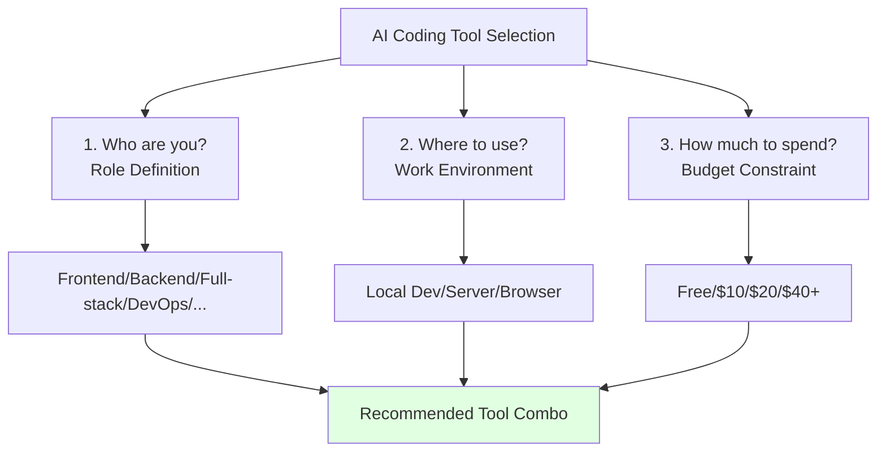
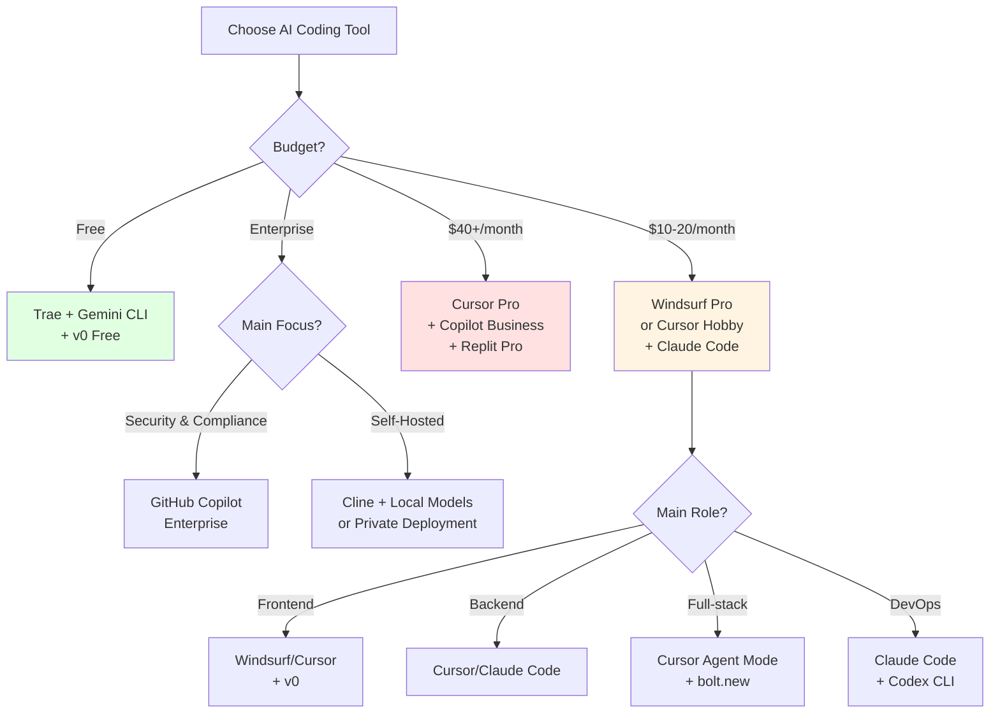

# 5.4 Tool Selection Guide <DifficultyBadge level="beginner" /> <CostBadge cost="$0" />

> Prerequisites: 5.1 IDE-Integrated Tools, 5.2 Terminal-Native Tools, 5.3 Cloud-Based AI Development

### Why Do You Need It? (Problem)

Now that you've learned about 10+ AI coding tools, you face a new challenge:

1. **Choice Paralysis**
   - Cursor, Windsurf, and Copilot all claim they're the best—who to trust?
   - Is the free Trae enough? Or must I pay?
   - Trying every tool is too costly

2. **Too Many Tools, Lower Efficiency**
   - Installed 3 IDE tools, don't know which to open
   - Terminal tools overlap with IDE tools
   - Spend more time switching tools than using them

3. **Different Roles, Different Needs**
   - Frontend developers need rapid UI generation
   - Backend developers focus on business logic and databases
   - DevOps engineers need to edit code directly on servers
   - Product managers just want to quickly validate prototypes

4. **Budget Constraints**
   - Students/individuals: free if possible
   - Small teams: limited budget, need cost-effectiveness
   - Large enterprises: focus on security and compliance

**Goal of this section: Provide clear tool combination recommendations based on your role, scenario, and budget.**

### What Is It? (Concept)

**Tool Selection Framework: 3 Dimensions × 2 Decisions**



**Decision Tree:**



---

## By Role Selection

### Frontend Developers

**Core Needs:**
- Rapid UI component generation
- Responsive design and style adjustments
- Automatic component documentation

**Recommended Combo:**

| Tool | Purpose | Price |
|-----|------|------|
| **Cursor** or **Windsurf** | Daily coding, refactoring | $20 or $10/month |
| **v0** | Rapid UI component generation | Free 200 credits |
| **Cline** (Optional) | Handle complex logic with Claude Sonnet 4.6 | Pay-per-use |

**Workflow Example:**

```
Need: Create user profile page

Step 1: Generate UI with v0
Prompt: "Design a user profile page with avatar, name, bio, social links"
→ Get React component code

Step 2: Integrate in Cursor
- Copy code generated by v0
- Use Cursor Agent to connect backend API
- "Modify this component to fetch data from /api/user and display"

Step 3: Optimize details
- Cursor Chat: "Add skeleton loading state"
- Cursor Chat: "Add edit mode to modify profile"
```

**Cost Analysis:**
- Windsurf Pro: $10/month
- v0 Free: 200 credits/month (sufficient)
- **Total: $10/month**

---

### Backend Developers

**Core Needs:**
- Business logic implementation
- Database query optimization
- API documentation generation
- Test case writing

**Recommended Combo:**

| Tool | Purpose | Price |
|-----|------|------|
| **Cursor** | Code writing, refactoring, testing | $20/month |
| **Claude Code** | Quick fixes on servers | $20/month (included in Claude Pro) |

**Or Low-Cost Alternative:**

| Tool | Purpose | Price |
|-----|------|------|
| **Cline** | Agent programming in VS Code | Pay-per-use |
| **Codex CLI** | Quick queries in terminal | Pay-per-use |
| **DeepSeek API** | Low-cost model ($0.14/1M tokens) | ~$5/month |

**Workflow Example:**

```
Need: Optimize order query API performance

Step 1: Analyze in Cursor
"Analyze performance bottlenecks in app/api/orders.py"
→ Cursor points out: N+1 query problem, missing indexes

Step 2: Let Cursor optimize
"Refactor this API:
1. Use JOIN instead of N+1 queries
2. Add database indexes
3. Add caching (Redis)"
→ Cursor auto-modifies code and generates migration files

Step 3: Generate tests
"Generate unit tests and performance tests for this API"
→ Cursor creates tests/test_orders.py
```

**Cost Analysis:**
- Option 1 (Cursor + Claude Code): $20/month (Claude Pro unlocks both tools)
- Option 2 (Cline + DeepSeek): ~$5/month

---

### Full-Stack Developers

**Core Needs:**
- Frontend and backend development simultaneously
- Database model and API sync modifications
- End-to-end feature implementation

**Recommended Combo:**

| Tool | Purpose | Price |
|-----|------|------|
| **Cursor** (Agent Mode) | Multi-file editing, full-stack refactoring | $20/month |
| **bolt.new** (Optional) | Quick project scaffolding | Free/month |

**Workflow Example:**

```
Need: Add user favorite feature (frontend + backend + database)

Input in Cursor Composer (⌘ I):

"Add user favorite article feature:
1. Database: Create favorites table (user_id, article_id, created_at)
2. Backend: Add POST /favorites and DELETE /favorites/:id API
3. Frontend: Add favorite button in article list, call API on click
4. Real-time UI state update"

→ Cursor automatically:
- ✅ Creates database migration file
- ✅ Creates app/api/favorites/route.ts
- ✅ Modifies components/ArticleCard.tsx to add favorite button
- ✅ Adds state management (React Context or Zustand)
- ✅ Generates test cases

Done! One command implements end-to-end feature.
```

**Cost Analysis:**
- Cursor Pro: $20/month
- bolt.new: Free (only for quick project generation)
- **Total: $20/month**

---

### DevOps / SRE Engineers

**Core Needs:**
- Quick config modifications on servers
- Log analysis and troubleshooting
- Writing automation scripts
- Optimizing CI/CD pipelines

**Recommended Combo:**

| Tool | Purpose | Price |
|-----|------|------|
| **Claude Code** | Modify code/config on servers | $20/month |
| **Codex CLI** | Quick queries and script generation | Pay-per-use |
| **MCP Tools** (Optional) | Integrate Kubernetes, GitHub, Jira | Free |

**Workflow Example:**

```bash
# Scenario: Production CPU spike, need to investigate

# Step 1: SSH to server
ssh user@prod-server

# Step 2: Launch Claude Code
claude-code

# Step 3: Let AI help analyze
You: Analyze logs from the last hour, find cause of CPU spike

Claude: 
I performed the following analysis:
1. ✅ Checked /var/log/app.log
2. ✅ Found many "Slow query" warnings
3. ✅ Located query at app/db/queries.py:145 missing index

Suggestion: Add index on email field in users table.

You: Create migration file and execute

Claude:
✅ Created migrations/add_email_index.sql
✅ Executed migration: psql -f migrations/add_email_index.sql
✅ Verified: EXPLAIN ANALYZE SELECT * FROM users WHERE email = '...'
✅ CPU usage returned to normal

Problem solved!
```

**Cost Analysis:**
- Claude Code (included in Claude Pro): $20/month
- Codex CLI + DeepSeek: ~$5/month
- **Total: $20-25/month**

---

### Tech Leaders / Architects

**Core Needs:**
- Code review
- Architecture design discussions
- Automatic documentation generation
- Team collaboration and knowledge sharing

**Recommended Combo:**

| Tool | Purpose | Price |
|-----|------|------|
| **Cursor** | Code writing, review | $20/month |
| **GitHub Copilot Business** | Unified team tool + audit | $19/month/person |
| **AGENTS.md** | Define team AI coding standards | Free |

**AGENTS.md Example:**

```markdown
# Team AI Coding Standards

## Architecture Patterns
- Use clean architecture (Controller → Service → Repository)
- Follow SOLID principles
- Prefer composition over inheritance

## Code Style
- TypeScript strict mode enabled
- Use functional components (React)
- Avoid `any` type, always use specific types

## Testing
- Unit test coverage > 80%
- Use Jest + Testing Library
- Mock external APIs

## Documentation
- All public APIs must have JSDoc
- README includes setup instructions and examples
- Architecture diagrams in /docs/architecture

## Security
- Never commit secrets (.env in .gitignore)
- Use environment variables for config
- Validate all user inputs
```

**Workflow Example:**

```
Scenario: Code Review

Step 1: Use Cursor to review PR
"Analyze this PR, check:
1. Does it follow team coding standards (refer to AGENTS.md)
2. Are there security vulnerabilities
3. Are tests missing
4. Any performance issues"

Step 2: Cursor generates review report
"Found the following issues:
1. ❌ app/api/users.py:23 - Direct SQL concatenation, injection risk
2. ❌ Missing unit tests
3. ⚠️ Function process_data() exceeds 50 lines, suggest splitting
4. ✅ Type hints complete
5. ✅ Documentation complete"

Step 3: Auto-generate improvement suggestions
"Generate fix code:
1. Use Parameterized Query instead of string concatenation
2. Generate test case template"
```

**Cost Analysis (10-person team):**
- Option 1 (Cursor): $20/month × 10 = $200/month
- Option 2 (Copilot Business): $19/month × 10 = $190/month
- **Recommend Copilot Business** (unified management, audit logs, GitHub native integration)

---

### Students / Budget-Limited Individual Developers

**Core Needs:**
- Free as much as possible
- Learning programming
- Quickly validate ideas

**Recommended Combo (Completely Free):**

| Tool | Purpose | Price |
|-----|------|------|
| **Trae** | AI assistance in IDE | Free (2M tokens/month) |
| **Gemini CLI** | Quick queries in terminal | Free (1500/day) |
| **v0** | UI component generation | Free (200 credits/month) |
| **bolt.new** | Full-stack prototypes | Free (5 times/day) |

**Workflow Example:**

```
Project: Develop a personal blog

Step 1: Generate initial project with bolt.new
"Create a Next.js blog with Markdown articles, tag categories, search"
→ Get complete project in 5 minutes

Step 2: Download project locally
Click "Download" → Unzip

Step 3: Continue development in VS Code + Trae
- Install Trae extension
- "Add dark mode toggle"
- "Add article reading time estimation"
- "Optimize mobile styles"

Step 4: Use v0 for UI components
- "Generate article card component showing title, excerpt, cover, tags"
- Copy code to project

Step 5: Use Gemini CLI for quick queries in terminal
gemini "How to configure sitemap.xml in Next.js?"
```

**Cost Analysis:**
- **Total: $0/month**
- Limits:
  - Trae 2M tokens/month (about 400 GPT-4o conversations)
  - v0 200 credits/month (about 40 generations)
  - bolt.new 5 generations/day
  - Gemini CLI 1500 requests/day

::: tip Is Free Quota Enough?
For learning and small projects, absolutely!
- Trae 2M tokens = ~13 complex conversations/day (GPT-4o basis)
- v0 200 credits = 10 components/week
- If not enough, upgrade to Windsurf Pro ($10/month) for best value
:::

---

## By Scenario Selection

### Scenario 1: Rapid Product Idea Validation (MVP)

**Need:** Build a demo-ready prototype in 3 days

**Recommended Tools:**
1. **bolt.new** (generate complete app)
2. **v0** (optimize UI)
3. **Replit AI** (quick deployment)

**Process:**
```
Day 1: Generate project skeleton with bolt.new (2 hours)
Day 2: Continue development in Replit (6 hours)
Day 3: Beautify UI with v0 + deploy (4 hours)

Total: 12 hours (vs traditional 80+ hours)
```

---

### Scenario 2: Legacy Code Maintenance

**Need:** Understand unfamiliar codebase, quickly fix bugs

**Recommended Tools:**
1. **Cursor** (codebase indexing + Agent refactoring)
2. **Claude Code** (quick terminal modifications)

**Process:**
```
Step 1: Open project in Cursor
"Analyze this project's architecture and core modules"

Step 2: Locate bug
"Where could this error be? [paste error log]"

Step 3: Auto-fix
"Fix this bug and generate test cases"

Step 4: Verify
Run tests, confirm fix
```

---

### Scenario 3: Team Collaboration Development

**Need:** 5-person team, unified tools and standards

**Recommended Tools:**
1. **GitHub Copilot Business** (unified platform + audit)
2. **AGENTS.md** (team standards)
3. **Replit AI** (pair programming/code review)

**Management Advantages:**
- Unified billing (per-seat)
- Code not used for model training
- Audit logs (who used how much AI)
- IP protection (enterprise version)

---

### Scenario 4: Open Source Project Contribution

**Need:** Quickly understand project, submit PRs

**Recommended Tools:**
1. **Cline** (free, open-source friendly)
2. **Gemini CLI** (free, long context for project understanding)

**Process:**
```bash
# Step 1: Clone project
git clone https://github.com/xxx/project.git
cd project

# Step 2: Understand project with Gemini CLI
gemini "Summarize this project's architecture" --context "$(find . -name '*.py' | head -50 | xargs cat)"

# Step 3: Develop new feature with Cline
cline "Implement Issue #123: add avatar upload feature"

# Step 4: Submit PR
git commit -am "feat: add avatar upload"
git push
```

---

## Recommended "Beginner Starter Pack"

**Phase 1: Free Experience (Weeks 1-2)**

```
Goal: Zero-cost AI coding experience, understand workflow

Tool Combo:
- Trae (IDE)
- Gemini CLI (Terminal)
- v0 (UI generation)
- bolt.new (Full-stack prototyping)

Learning Tasks:
1. Generate a TODO app with bolt.new
2. Generate 5 different UI components with v0
3. Complete 10 AI conversation coding sessions in Trae
```

**Phase 2: Paid Upgrade (Weeks 3-4)**

```
Goal: Deep usage, 5× efficiency boost

Tool Choice (pick one):
- Option A: Windsurf Pro ($10/month, best value)
- Option B: Cursor Hobby + Claude Pro ($20/month, most powerful)

Learning Tasks:
1. Develop a complete full-stack app with Agent mode
2. Use AGENTS.md / .cursorrules to customize AI behavior
3. Try multi-file refactoring, auto-generate tests
```

**Phase 3: Tool Matrix (Month 2+)**

```
Goal: Switch tools by scenario, achieve professional-level efficiency

Tool Matrix:
- Daily coding: Cursor / Windsurf
- Server ops: Claude Code
- Quick queries: Gemini CLI / Codex CLI
- UI design: v0
- Prototype validation: bolt.new

Advanced Learning:
1. Integrate MCP tools (GitHub, database, search)
2. Write custom Skills
3. Explore local models (Ollama + Cline)
```

---

## Cost Optimization Strategies

### Strategy 1: Tiered Model Usage

```
Simple tasks → Cheap models (DeepSeek, GPT-4o-mini)
Complex tasks → Premium models (GPT-4o, Claude Sonnet 4.6 Sonnet)

Implementation:
- Codex CLI: Switch --model parameter
- Cline: Configure multiple API Keys, switch manually
```

**Cost Comparison:**
```
All GPT-4o: $50/month
Tiered usage: $10/month (80% savings)
```

---

### Strategy 2: Leverage Free Quotas

| Platform | Free Quota | Value |
|-----|---------|------|
| Google AI Studio | 1500/day (Gemini 2.5 Flash) | $45/month |
| Trae | 2M tokens/month | $30/month |
| v0 | 200 credits/month | $10/month |
| bolt.new | 5 times/day | $15/month |
| **Total** | - | **~$100/month equivalent** |

**Strategy:** Use free quotas before considering paid options

---

### Strategy 3: Team Shared Subscription

```
Scenario: 5-person small team

Option A (Individual subscriptions):
Cursor Pro × 5 = $100/month

Option B (Shared + On-demand):
- 2 people subscribe Cursor Pro (core developers): $40/month
- 3 people use Trae + Gemini CLI (free): $0/month
- Shared Claude Pro account (terminal tools): $20/month
Total: $60/month (40% savings)
```

---

## Final Recommendation Matrix

| Role | Budget $0 | Budget $10-20 | Budget $40+ | Enterprise |
|-----|---------|------------|----------|------|
| **Frontend** | Trae + v0 | Windsurf + v0 | Cursor Pro + v0 Pro | Copilot Business |
| **Backend** | Trae + Gemini CLI | Cursor Hobby + Claude Code | Cursor Pro + Claude Pro | Copilot Enterprise |
| **Full-stack** | Trae + bolt.new | Cursor Hobby | Cursor Pro + bolt.new Pro | Copilot Business |
| **DevOps** | Gemini CLI + Codex CLI | Claude Code | Claude Code + MCP Tools | Copilot + Custom MCP |
| **Student** | Trae + All Free Tools | Windsurf Pro | - | - |

---

### Hands-On Practice (Practice)

**Task: Install and try recommended tools for 15 minutes based on your role**

**Steps:**

**1. Identify Your Role**

Choose the best match below:
- [ ] Frontend developer (mainly React/Vue etc.)
- [ ] Backend developer (mainly API/database)
- [ ] Full-stack developer (both frontend and backend)
- [ ] DevOps/SRE (ops, deployment, monitoring)
- [ ] Student/beginner (learning programming)

**2. Check Your Recommended Solution**

Based on the "Final Recommendation Matrix" above, find the tools for your role and budget.

**3. Install First Tool (5 minutes)**

**If choosing Cursor:**
```bash
# macOS
Download: https://cursor.sh
Install and login (Google/GitHub)

# Create test project
mkdir ai-test
cd ai-test
cursor .
```

**If choosing Windsurf:**
```bash
# Download: https://windsurf.ai
# Install and login

# Create test project
mkdir ai-test
cd ai-test
windsurf .
```

**If choosing Trae:**
```bash
# Install Trae extension in VS Code
# 1. Open VS Code
# 2. Extensions → Search "Trae"
# 3. Install → Reload

# Create test project
mkdir ai-test
cd ai-test
code .
```

**4. Try First AI Task (10 minutes)**

**Task: Let AI help you write an HTTP API**

Input in AI Chat (Cursor/Windsurf/Trae all have):

```
Create an Express.js API with:
1. GET /health - Health check
2. GET /users - Get user list (return mock data)
3. POST /users - Create user (accept name and email)

Requirements:
- Use TypeScript
- Add error handling
- Add request logging
```

Observe AI performance:
- ✅ How many files generated?
- ✅ Code quality?
- ✅ Can it run directly?

**5. Run and Test**

```bash
# Install dependencies (AI may have generated package.json)
npm install

# Run
npm run dev

# Test (open new terminal)
curl http://localhost:3000/health
curl http://localhost:3000/users
```

**6. Try Iteration (if time allows)**

Continue conversation:
```
"Add data validation: email must be valid format"
"Add unit tests"
"Add Swagger documentation"
```

**7. Record Your Experience**

Note in notebook:
- ✅ Which feature most useful?
- ❓ What problems encountered?
- 💡 Any improvement suggestions?
- 💰 Worth paying for?

---

### Summary (Reflection)

- **What it solved**: No longer confused about "which tool to choose", get clear answers based on role, scenario, budget
- **What it didn't solve**: Know the tools, but don't know how to use them well—need to learn "context engineering" techniques to make AI understand your needs more accurately (Chapter 6)
- **Key Points**:
  1. **No "best" tool, only "most suitable" combination**
  2. **Beginner recommendation**: Trae (free) → Windsurf Pro ($10) → Cursor Pro ($20)
  3. **Frontend first choice**: Cursor/Windsurf + v0
  4. **Backend first choice**: Cursor + Claude Code
  5. **Full-stack first choice**: Cursor Agent mode
  6. **DevOps first choice**: Claude Code + Codex CLI
  7. **Enterprise first choice**: GitHub Copilot Business/Enterprise
  8. **Budget-limited**: Trae + Gemini CLI + v0 (completely free)
  9. **Cost optimization**: Tiered model usage, leverage free quotas, team shared subscriptions
  10. **Next step**: Learn how to provide better context for higher-quality AI-generated code

---

*Last updated: 2026-02-20*
