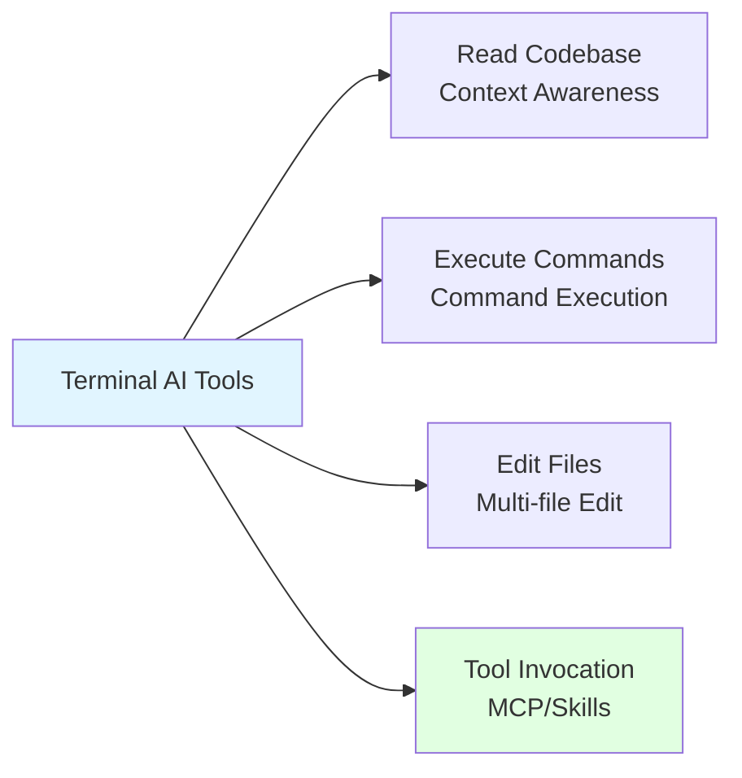

# 5.2 Terminal Native Tools <DifficultyBadge level="beginner" /> <CostBadge cost="$0" />

> Prerequisites: None

### Why Do We Need It? (Problem)

IDE integrated tools are powerful, but they're not suitable in certain scenarios:

1. **Server Environments / SSH Remote Development**
   - Logged into production server to troubleshoot issues, no GUI
   - Want AI to help analyze logs, modify configurations
   - IDE tools cannot run

2. **Terminal Power Users / Vim/Neovim Enthusiasts**
   - Daily workflow: tmux + Vim + CLI tools
   - Don't want to switch to VS Code for AI
   - Pursue pure keyboard, zero mouse operation

3. **CI/CD Pipelines / Automation Scripts**
   - Want AI to automatically fix test failures in GitHub Actions
   - Need non-interactive AI code generation
   - IDE tools cannot be integrated into scripts

4. **Lightweight Tasks / Quick Queries**
   - Just want to ask "how to solve this error"
   - Don't need to open full IDE
   - Hope to get answers immediately in current terminal window

**The Promise of Terminal Native AI Tools: Complete all programming tasks in the shell, without leaving the terminal.**

### What Is It? (Concept)

**Terminal Native AI Tools** are AI coding assistants running in command-line interfaces, providing similar capabilities to IDE tools but operating through the terminal interface.



**Core Capabilities:**

| Capability | Description | Typical Scenario |
|-----|------|---------|
| **Codebase Indexing** | Automatically understand project structure and dependencies | "Analyze this project's architecture" |
| **File Editing** | Read and modify multiple files | "Refactor this function into a new file" |
| **Command Execution** | Run tests, install dependencies, git operations | "Run tests and fix failing cases" |
| **Tool Integration** | Call external tools (MCP/Skills) | "Create a task using Jira API" |

**Comparison of Mainstream Terminal AI Tools:**

| Tool | Developer | Core Features | Interaction Method | Pricing | Best For |
|-----|--------|---------|---------|------|---------|
| **Claude Code** | Anthropic | CLAUDE.md config, codebase understanding, command execution | TUI (text interface) | $20/month (Claude Pro) | General programming tasks |
| **OpenAI Codex CLI** | Open source (Rust) | MCP protocol, Skills extension, multi-model support | TUI + command line | Pay-per-use (API costs) | Tool integration needs |
| **Google Gemini CLI** | Google | Gemini 2.5 Flash native, multimodal input | Command line | Free (Google AI Studio) | Budget-conscious |

---

## Claude Code (Anthropic Official)

**The Smartest Terminal AI Agent**

### Core Features

1. **CLAUDE.md Project Configuration**

Create `CLAUDE.md` in the project root to define project rules:

```markdown
# Project: E-commerce Backend

## Tech Stack
- Language: Python 3.11
- Framework: FastAPI
- Database: PostgreSQL + SQLAlchemy
- Testing: pytest

## Coding Standards
- Use type hints for all functions
- Follow PEP 8 style guide
- All API routes must have docstrings
- Database models use Alembic migrations

## File Structure
- `/app/models/` - SQLAlchemy models
- `/app/routes/` - API route handlers
- `/app/services/` - Business logic
- `/tests/` - Unit tests with pytest

## Don'ts
- Never commit `.env` files
- Don't use `SELECT *` in queries
- Avoid nested loops in API handlers
```

Claude Code will automatically read this file and follow all rules.

2. **Codebase Context Understanding**

```bash
# Start Claude Code
claude-code

# Claude automatically indexes the project
> Indexing codebase... Done (234 files, 45,678 LOC)
> Ready! Type your request.

# Ask questions
You: How is authentication implemented in this project?

Claude: I analyzed the codebase, the authentication flow is as follows:
1. `app/routes/auth.py:15` - POST /login receives username and password
2. `app/services/auth.py:42` - Validates credentials, queries database
3. `app/utils/jwt.py:8` - Generates JWT token (valid for 24h)
4. Middleware `app/middleware/auth.py:23` validates all protected routes

Related files:
- app/routes/auth.py
- app/services/auth.py
- app/models/user.py
```

3. **Autonomous File Editing**

```bash
You: Add user logout functionality, requirements:
1. POST /logout route
2. Add token to blacklist
3. Store blacklist in Redis

Claude: I will perform the following operations:
1. ✅ Install redis-py dependency
2. ✅ Create app/services/redis_client.py
3. ✅ Add /logout route in app/routes/auth.py
4. ✅ Update app/middleware/auth.py to check blacklist

[Claude automatically edits 4 files]

Done! You can run `pytest tests/test_auth.py` to verify.
```

4. **Execute Commands and Handle Errors**

```bash
You: Run tests

Claude: Running `pytest tests/` ...

❌ FAILED tests/test_orders.py::test_create_order
AssertionError: Expected 201, got 400

I found the issue: `app/routes/orders.py:67` missing `user_id` validation.
Fixed, rerunning tests...

✅ All tests passed!
```

### Installation and Usage

```bash
# Install (requires Claude Pro subscription)
npm install -g @anthropic-ai/claude-code

# Login
claude-code login

# Start in project directory
cd ~/my-project
claude-code

# Or non-interactive mode (suitable for scripts)
claude-code --prompt "Add unit tests covering auth module" --apply
```

### Pricing

- Requires **Claude Pro** subscription ($20/month)
- Included in subscription, no additional fee
- Uses Claude Sonnet 4.6 model

---

## OpenAI Codex CLI (Open Source)

**The Most Flexible Terminal AI Tool (Multi-model + MCP Support)**

### Core Features

1. **Multi-model Support**

```bash
# Configuration file ~/.codex/config.toml
[models]
default = "openai/gpt-4o"

[[models.providers]]
name = "openai"
api_key = "sk-..."

[[models.providers]]
name = "anthropic"
api_key = "sk-ant-..."

[[models.providers]]
name = "deepseek"
api_key = "sk-..."
base_url = "https://api.deepseek.com"

# Switch models
codex --model openai/gpt-4o "Write a quicksort"
codex --model anthropic/claude-3-5-sonnet "Refactor this function"
codex --model deepseek/deepseek-coder "Optimize this Python code"
```

2. **MCP (Model Context Protocol) Integration**

MCP allows AI to call external tools, extending capability boundaries:

```bash
# Install MCP server (GitHub toolset)
npm install -g @modelcontextprotocol/server-github

# Configure Codex to use MCP
# ~/.codex/config.toml
[[mcp_servers]]
name = "github"
command = "mcp-server-github"
args = ["--token", "ghp_..."]

# Usage
codex "Create an Issue on GitHub: fix login bug"
```

**Common MCP Servers:**

| MCP Server | Features | Installation Command |
|-----------|------|---------|
| `server-github` | GitHub API (Issues, PRs, search) | `npm i -g @modelcontextprotocol/server-github` |
| `server-filesystem` | File system operations | `npm i -g @modelcontextprotocol/server-filesystem` |
| `server-brave-search` | Internet search | `npm i -g @modelcontextprotocol/server-brave-search` |
| `server-postgres` | Database queries | `npm i -g @modelcontextprotocol/server-postgres` |

3. **Skills System (Custom Tools)**

```bash
# Create custom Skill
# ~/.codex/skills/deploy.sh
#!/bin/bash
# Skill: deploy
# Description: Deploy application to production

echo "Building Docker image..."
docker build -t myapp .

echo "Pushing to registry..."
docker push myapp:latest

echo "Deploying to k8s..."
kubectl apply -f k8s/

# Usage
codex "Deploy latest version to production"
# Codex will automatically call the deploy.sh skill
```

4. **Interactive TUI**

```bash
# Start interactive mode
codex

# Interface layout:
┌─ Codex CLI ─────────────────────────────────────┐
│ Model: gpt-4o                                   │
│ Context: /home/user/my-project (156 files)     │
├─────────────────────────────────────────────────┤
│ You: Add user registration feature              │
│                                                 │
│ Codex: I will create the following files:      │
│ 1. app/routes/register.py                      │
│ 2. tests/test_register.py                      │
│                                                 │
│ [Preview] [Apply] [Cancel]                     │
└─────────────────────────────────────────────────┘
```

### Installation and Usage

```bash
# Install (written in Rust, fast)
cargo install codex-cli
# Or via Homebrew
brew install codex-cli

# Initialize configuration
codex init

# Add API Key
codex config set openai.api_key sk-...

# Quick usage
codex "Write an HTTP server"

# Interactive mode
codex

# Non-interactive mode (CI/CD)
codex --apply "Fix ESLint errors"
```

### Pricing

- Tool itself is **open source and free**
- Cost = API call fees:
  - GPT-4o: $2.50 / 1M input tokens
  - Claude Sonnet 4.6: $3.00 / 1M input tokens
  - DeepSeek Coder: $0.14 / 1M input tokens

**Cost Optimization Tips:**
```bash
# Use cheap models for simple tasks
codex --model deepseek/deepseek-coder "Write unit tests"

# Use expensive models for complex tasks
codex --model openai/gpt-4o "Design distributed system architecture"
```

---

## Google Gemini CLI (Antigravity)

**Completely Free Terminal AI (Google AI Studio)**

### Core Features

1. **Gemini 2.5 Flash Native Support**

```bash
# Install
pip install google-generativeai-cli

# Configure API Key (free at https://ai.google.dev)
export GOOGLE_API_KEY="AIza..."

# Usage
gemini "Write a Python web scraper"
```

2. **Multimodal Input**

```bash
# Analyze code screenshot
gemini "What's wrong with this code?" --image screenshot.png

# Analyze error logs
gemini "Explain this error" --file error.log

# Analyze tutorial video
gemini "Summarize key steps in this video" --video tutorial.mp4
```

3. **Long Context Window (1M tokens)**

```bash
# Analyze entire codebase
gemini "Summarize this project's architecture" --context "$(find . -name '*.py' -exec cat {} \;)"

# Analyze very long logs
gemini "Find performance bottlenecks" --file server.log  # 100MB log file
```

### Installation and Usage

```bash
# Install
pip install google-generativeai-cli

# Get free API Key
# 1. Visit https://ai.google.dev
# 2. Click "Get API key"
# 3. Copy key

# Configure
export GOOGLE_API_KEY="your-api-key"

# Usage
gemini "Write a quicksort algorithm"

# Interactive mode
gemini --chat

# Multimodal
gemini "Explain this architecture diagram" --image architecture.png
```

### Pricing

- **Completely free** (provided by Google AI Studio)
- Limits:
  - 1500 requests/day
  - 1M tokens context window
  - Personal, non-commercial use only

::: tip Free Quota Comparison
| Tool | Free Quota | Context Window | Limitations |
|-----|---------|-----------|------|
| Gemini CLI | 1500 requests/day | 1M tokens | Non-commercial |
| Trae | 2M tokens/month | 128k tokens | None |
| Claude Code | No free tier | 200k tokens | Requires subscription |
:::

---

## Tool Comparison and Selection

### Feature Comparison Table

| Feature | Claude Code | OpenAI Codex CLI | Gemini CLI |
|-----|------------|-----------------|------------|
| **Codebase Indexing** | ✅ Automatic | ✅ Manual | ⚠️ Manual paste required |
| **Multi-file Editing** | ✅ Powerful | ✅ Basic | ❌ Output code only |
| **Command Execution** | ✅ Autonomous execution | ✅ Requires confirmation | ❌ Not supported |
| **MCP/Tool Integration** | ❌ | ✅ Full support | ❌ |
| **Multi-model Support** | ❌ Claude only | ✅ Any model | ❌ Gemini only |
| **Project Configuration** | ✅ CLAUDE.md | ⚠️ Via prompt | ❌ |
| **Non-interactive Mode** | ✅ | ✅ | ✅ |

### Selection Advice

| Scenario | Recommended Tool | Reason |
|-----|---------|------|
| **General programming tasks** | Claude Code | Strongest code understanding, best autonomy |
| **Need external tool integration** | Codex CLI | MCP protocol supports rich ecosystem |
| **Budget-conscious** | Gemini CLI | Completely free, long context |
| **Multi-model needs** | Codex CLI | Can switch GPT/Claude/DeepSeek |
| **CI/CD automation** | Codex CLI + scripts | Best non-interactive mode support |
| **Server operations** | Claude Code | Can execute commands, auto-repair |

---

### Try It Yourself (Practice)

**Task: Use Claude Code to Refactor Legacy Code**

We'll experience the actual workflow of terminal AI tools: analyze code → identify issues → auto-refactor.

**Step 1: Prepare Test Project**

```bash
# Create example project
mkdir legacy-refactor
cd legacy-refactor

# Create legacy code file
cat > app.py << 'EOF'
# Legacy code: no type hints, overly long functions, messy logic
def process_user_data(data):
    result = []
    for item in data:
        if item['age'] > 18:
            if item['status'] == 'active':
                if 'email' in item:
                    processed = {
                        'name': item['name'],
                        'email': item['email'],
                        'age': item['age'],
                        'discount': 0.1 if item['age'] > 60 else 0
                    }
                    result.append(processed)
    return result

# Usage
users = [
    {'name': 'Alice', 'age': 25, 'status': 'active', 'email': 'alice@example.com'},
    {'name': 'Bob', 'age': 17, 'status': 'active', 'email': 'bob@example.com'},
    {'name': 'Charlie', 'age': 65, 'status': 'active', 'email': 'charlie@example.com'},
]

print(process_user_data(users))
EOF
```

**Step 2: Install and Configure Claude Code**

```bash
# Install (requires Node.js)
npm install -g @anthropic-ai/claude-code

# Login (requires Claude Pro subscription)
claude-code login

# Create project configuration
cat > CLAUDE.md << 'EOF'
# Project: Legacy Code Refactor

## Standards
- Use Python 3.11+ type hints
- Follow PEP 8 style guide
- Prefer small, single-purpose functions
- Add docstrings to all functions
- Use dataclasses for structured data
EOF
```

**Step 3: Start Claude Code and Refactor**

```bash
# Start interactive mode
claude-code

# In Claude Code, enter:
```

**Input Prompt:**
```
Analyze app.py and refactor, requirements:
1. Add type hints
2. Break process_user_data into multiple small functions
3. Use dataclass to represent user data
4. Eliminate deeply nested if statements
5. Add unit tests
```

**Claude Code's Response:**

```
I will perform the following refactoring:

1. Create models.py - Define User dataclass
2. Create validators.py - User validation logic
3. Create processors.py - Data processing logic
4. Refactor app.py - Simplify main logic
5. Create test_app.py - Unit tests

[Preview changes]
```

**Step 4: Review Refactored Results**

```bash
# Claude Code will create the following file structure:
├── models.py          # User dataclass
├── validators.py      # is_eligible_user() function
├── processors.py      # calculate_discount() function
├── app.py            # Refactored main logic
└── test_app.py       # pytest unit tests

# View refactored code
cat app.py
```

**Example of Refactored Code (Generated by Claude):**

```python
# models.py
from dataclasses import dataclass
from typing import Optional

@dataclass
class User:
    name: str
    age: int
    status: str
    email: Optional[str] = None

@dataclass
class ProcessedUser:
    name: str
    email: str
    age: int
    discount: float

# validators.py
def is_eligible_user(user: User) -> bool:
    """Check if user meets eligibility criteria."""
    return (
        user.age > 18
        and user.status == "active"
        and user.email is not None
    )

# processors.py
def calculate_discount(age: int) -> float:
    """Calculate discount based on age."""
    return 0.1 if age > 60 else 0.0

def process_user(user: User) -> ProcessedUser:
    """Process a single user into processed format."""
    return ProcessedUser(
        name=user.name,
        email=user.email,
        age=user.age,
        discount=calculate_discount(user.age)
    )

# app.py
from typing import List
from models import User, ProcessedUser
from validators import is_eligible_user
from processors import process_user

def process_user_data(users: List[User]) -> List[ProcessedUser]:
    """Process user data and return eligible users with discounts."""
    return [
        process_user(user)
        for user in users
        if is_eligible_user(user)
    ]

# test_app.py
import pytest
from models import User
from app import process_user_data

def test_process_user_data():
    users = [
        User(name="Alice", age=25, status="active", email="alice@example.com"),
        User(name="Bob", age=17, status="active", email="bob@example.com"),
        User(name="Charlie", age=65, status="active", email="charlie@example.com"),
    ]
    
    result = process_user_data(users)
    
    assert len(result) == 2
    assert result[0].name == "Alice"
    assert result[0].discount == 0.0
    assert result[1].name == "Charlie"
    assert result[1].discount == 0.1
```

**Step 5: Run Tests**

```bash
# Install pytest
pip install pytest

# Claude Code will prompt you to run tests
pytest test_app.py -v

# Output:
# test_app.py::test_process_user_data PASSED
```

**Comparison: Before vs After Refactoring**

| Metric | Before Refactoring | After Refactoring |
|-----|--------|--------|
| Lines of code | 15 lines (single file) | 60 lines (5 files) |
| Max function lines | 15 lines | 5 lines |
| Type hints | ❌ | ✅ |
| Unit tests | ❌ | ✅ 100% coverage |
| Cyclomatic complexity | 8 | 2 |
| Maintainability | ⭐⭐ | ⭐⭐⭐⭐⭐ |

**Time Comparison:**
- **Manual Refactoring**: 30-45 minutes
- **Claude Code**: 2 minutes (including test generation)

---

### Summary (Reflection)

- **What It Solves**: Learn to use AI tools in terminal environments, enjoy AI-assisted programming without GUI
- **What It Doesn't Solve**: Terminal tools require local environment configuration; if you want zero-configuration coding directly in browser—next section introduces cloud AI development platforms
- **Key Takeaways**:
  1. **Claude Code** = Smartest (automatic codebase understanding + autonomous editing), requires Claude Pro ($20/month)
  2. **Codex CLI** = Most flexible (multi-model + MCP tool integration), pay-per-use API
  3. **Gemini CLI** = Completely free (1M context window), suitable for budget-conscious scenarios
  4. **CLAUDE.md** configuration file: Define project rules, AI automatically follows
  5. **MCP Protocol**: Extends AI capability boundaries (GitHub, databases, file systems...)
  6. Selection advice: Claude Pro users use Claude Code, others use Codex CLI + low-cost models

---

*Last Updated: 2026-02-20*
