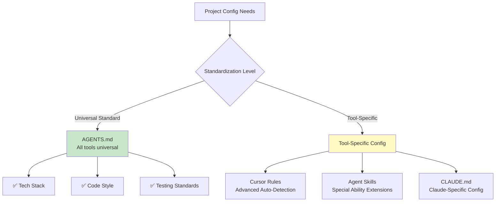

# 6.2 AGENTS.md Standard

<DifficultyBadge level="intermediate" />
<CostBadge cost="$0" />

**Prerequisites**: [6.1 Context Engineering Concepts](./index.md)

---

### Why: Why Do We Need AGENTS.md?

#### Problem Scenario

Your team has 5 people:

- Alice uses **GitHub Copilot**
- Bob uses **Cursor**
- Carol uses **Claude Code**
- David uses **Codex CLI**
- Eve uses **VS Code + Continue**

Each tool needs to configure "project standards":

```
Copilot    → .github/copilot-instructions.md
Cursor     → .cursorrules
Claude     → CLAUDE.md
Codex      → codex.md
Continue   → .continuerc.json
```

**Result**:
- ❌ Same standards written 5 times
- ❌ Alice updates Copilot config, Bob's Cursor doesn't know
- ❌ New hires don't know which file to read

**Pain Point**: **Tool fragmentation causes config duplication and desync**.

#### Solution: AGENTS.md

> **AGENTS.md is an open standard—one file configures all AI coding assistants.**

Like:
- `README.md` is project docs for humans
- `AGENTS.md` is project docs for AI

**Features**:
- ✅ **Vendor-Neutral**: All major AI tools support it
- ✅ **Write Once, Run Anywhere**: One config, Copilot, Cursor, Claude all read
- ✅ **Community Standard**: Adopted by 60,000+ open source projects
- ✅ **Version Management**: Committed with code, team auto-syncs

**Analogy**:

| Human Engineer | AI Engineer |
|-----------|----------|
| README.md | AGENTS.md |
| CONTRIBUTING.md | AGENTS.md |
| Onboarding docs | AGENTS.md |
| Code standards manual | AGENTS.md |

### What: What is AGENTS.md?

#### 1. Official Definition

AGENTS.md is a **Markdown-format project config file** that tells AI:

- What tech stack this project uses
- What code style to follow
- How to run and test
- Security considerations
- Code commit standards

**Official Website**: [agents.md](https://agents.md)

**GitHub Repo**: [github.com/aisd-gg/agents-md](https://github.com/aisd-gg/agents-md)

#### 2. Standard Structure of AGENTS.md

Per official spec, AGENTS.md includes:

```markdown
# AGENTS.md

## Project Overview
Brief intro to what project does

## Tech Stack
List languages, frameworks, tools used

## Development Setup
How to install dependencies, start project

## Code Style
Naming conventions, formatting tools, best practices

## Testing
Testing framework, commands, coverage requirements

## Project Structure
Directory organization, file naming rules

## Security
Sensitive info handling, permission control

## Git Workflow
Branch strategy, commit message conventions

## AI Guidelines
Special instructions and constraints for AI tools
```

#### 3. Tools Supporting AGENTS.md

| Tool | Support Status | Priority |
|-----|---------|-------|
| **Cursor** | ✅ Native support | Higher than .cursorrules |
| **GitHub Copilot** | ✅ Supported since Nov 2024 | Higher than .github/copilot-instructions.md |
| **Claude Code** | ✅ Auto-reads | Equal to CLAUDE.md |
| **Codex CLI** | ✅ Auto-reads | Equal to codex.md |
| **Continue** | ✅ Via config support | - |
| **Kilo Code** | ✅ Native support | - |
| **Windsurf** | ✅ Native support | - |

**Read Order** (Cursor example):

```
1. Check if AGENTS.md exists in project root
2. If yes, use AGENTS.md first
3. If no, fall back to .cursorrules (deprecated)
```

#### 4. AGENTS.md vs Other Config Files



**Recommended Strategy**:
- **AGENTS.md**: Write universal project standards (90% of content)
- **Tool Config**: Write tool-specific advanced features (10% of content)

### How: Write a Complete AGENTS.md

#### Real-World: Write AGENTS.md for a Next.js Project

**Project Background**:
- Tech Stack: Next.js 14 + TypeScript + Tailwind CSS
- Database: PostgreSQL + Prisma
- Testing: Vitest + Testing Library
- Deployment: Vercel

#### Complete AGENTS.md Example

```markdown
# AGENTS.md

## Project Overview

A full-stack blog system based on Next.js, supporting Markdown article publishing, comments, tag categories.

**Target Users**: Personal bloggers, tech writers  
**Core Features**: Article CRUD, Markdown rendering, full-text search, RSS subscription

---

## Tech Stack

### Frontend
- **Framework**: Next.js 14 (App Router)
- **Language**: TypeScript 5.3
- **Styling**: Tailwind CSS 3.4 + shadcn/ui
- **State Management**: Zustand 4.5
- **Forms**: React Hook Form + Zod

### Backend
- **Runtime**: Node.js 20 + Next.js Server Actions
- **Database**: PostgreSQL 16 + Prisma ORM 5.x
- **Auth**: NextAuth.js 5
- **File Storage**: Vercel Blob

### Toolchain
- **Package Manager**: pnpm 9.x
- **Linting**: ESLint + Prettier + TypeScript
- **Testing**: Vitest + Testing Library + Playwright
- **CI/CD**: GitHub Actions + Vercel

---

## Development Setup

### Prerequisites
- Node.js 20+
- pnpm 9+
- PostgreSQL 16+ (local or Docker)

### Installation Steps

\`\`\`bash
# 1. Clone repo
git clone https://github.com/yourname/blog.git
cd blog

# 2. Install dependencies
pnpm install

# 3. Configure environment variables
cp .env.example .env.local
# Edit .env.local, fill in database URL and secrets

# 4. Initialize database
pnpm db:push
pnpm db:seed

# 5. Start dev server
pnpm dev
\`\`\`

### Common Commands

| Command | Description |
|-----|------|
| `pnpm dev` | Start dev server (http://localhost:3000) |
| `pnpm build` | Build for production |
| `pnpm start` | Start production server |
| `pnpm test` | Run unit tests |
| `pnpm test:e2e` | Run E2E tests |
| `pnpm lint` | Code linting |
| `pnpm format` | Code formatting |
| `pnpm db:push` | Sync Prisma schema to database |
| `pnpm db:studio` | Open Prisma Studio |

---

## Code Style

### General Standards
- ✅ Use **TypeScript**, forbid `any` type
- ✅ Functions prefer **arrow functions**
- ✅ Use **named exports** not default exports (except Next.js pages)
- ✅ Components use **PascalCase**, functions use **camelCase**
- ✅ Constants use **UPPER_SNAKE_CASE**

### React Standards
- ✅ Function components + Hooks (forbid Class components)
- ✅ Component filename matches component name: `UserCard.tsx` → `export function UserCard()`
- ✅ One component per file (unless tightly related sub-components)
- ✅ Props types use `interface`: `interface UserCardProps { ... }`

### File Organization
\`\`\`
src/
├── app/              # Next.js App Router pages
│   ├── (auth)/       # Auth-related pages (route group)
│   ├── blog/         # Blog pages
│   └── api/          # API routes
├── components/       # React components
│   ├── ui/           # Base UI components (shadcn/ui)
│   ├── blog/         # Blog-related components
│   └── layout/       # Layout components
├── lib/              # Utility functions, config
│   ├── db.ts         # Prisma client
│   ├── auth.ts       # NextAuth config
│   └── utils.ts      # General utility functions
├── hooks/            # Custom Hooks
├── types/            # TypeScript type definitions
└── styles/           # Global styles
\`\`\`

### Naming Conventions
- **Components**: `<UserProfile />`, `<BlogPostCard />`
- **Pages**: `app/blog/[id]/page.tsx`
- **APIs**: `app/api/posts/route.ts`
- **Utility Functions**: `formatDate()`, `calculateReadingTime()`
- **Hooks**: `useUser()`, `useBlogPosts()`
- **Types**: `interface User {}`, `type PostStatus = 'draft' | 'published'`

### Tailwind CSS Standards
- ✅ Use Tailwind classes, avoid custom CSS (unless necessary)
- ✅ Use `cn()` utility to merge classes (from `lib/utils.ts`)
- ✅ Extract complex styles as component variants (using `class-variance-authority`)

Example:
\`\`\`tsx
import { cn } from '@/lib/utils';

export function Button({ className, variant = 'default', ...props }) {
  return (
    <button
      className={cn(
        'rounded-md px-4 py-2 font-medium transition-colors',
        variant === 'default' && 'bg-blue-600 text-white hover:bg-blue-700',
        variant === 'outline' && 'border border-gray-300 hover:bg-gray-100',
        className
      )}
      {...props}
    />
  );
}
\`\`\`

---

## Testing

### Testing Strategy
- **Unit Tests**: Utility functions, Hooks (Vitest)
- **Component Tests**: UI components (Testing Library)
- **E2E Tests**: Key user flows (Playwright)
- **Coverage Target**: 80%+

### Testing Standards

#### 1. Unit Tests (Vitest)
\`\`\`typescript
// lib/utils.test.ts
import { describe, it, expect } from 'vitest';
import { formatDate, calculateReadingTime } from './utils';

describe('formatDate', () => {
  it('formats date correctly', () => {
    const date = new Date('2024-01-15');
    expect(formatDate(date)).toBe('January 15, 2024');
  });

  it('handles invalid date', () => {
    expect(formatDate(new Date('invalid'))).toBe('Invalid date');
  });
});
\`\`\`

#### 2. Component Tests (Testing Library)
\`\`\`typescript
// components/Button.test.tsx
import { render, screen } from '@testing-library/react';
import userEvent from '@testing-library/user-event';
import { describe, it, expect, vi } from 'vitest';
import { Button } from './Button';

describe('Button', () => {
  it('renders with text', () => {
    render(<Button>Click me</Button>);
    expect(screen.getByRole('button', { name: /click me/i })).toBeInTheDocument();
  });

  it('calls onClick when clicked', async () => {
    const onClick = vi.fn();
    render(<Button onClick={onClick}>Click me</Button>);
    await userEvent.click(screen.getByRole('button'));
    expect(onClick).toHaveBeenCalledOnce();
  });
});
\`\`\`

#### 3. E2E Tests (Playwright)
\`\`\`typescript
// tests/e2e/blog.spec.ts
import { test, expect } from '@playwright/test';

test('create and publish a blog post', async ({ page }) => {
  // Login
  await page.goto('/login');
  await page.fill('[name="email"]', 'admin@example.com');
  await page.fill('[name="password"]', 'password123');
  await page.click('button[type="submit"]');

  // Create post
  await page.goto('/blog/new');
  await page.fill('[name="title"]', 'Test Post');
  await page.fill('[name="content"]', '# Hello World');
  await page.click('button:has-text("Publish")');

  // Verify
  await expect(page).toHaveURL(/\/blog\/.+/);
  await expect(page.locator('h1')).toHaveText('Test Post');
});
\`\`\`

### Running Tests
\`\`\`bash
# Unit and component tests
pnpm test                 # Run all tests
pnpm test:watch           # Watch mode
pnpm test:coverage        # Generate coverage report

# E2E tests
pnpm test:e2e             # Headless mode
pnpm test:e2e:ui          # Open Playwright UI
\`\`\`

---

## Project Structure

### Directory Descriptions

| Path | Description |
|-----|------|
| `src/app/` | Next.js 14 App Router pages and APIs |
| `src/components/` | React components (reusable) |
| `src/lib/` | Utility functions, config, Prisma client |
| `src/hooks/` | Custom React Hooks |
| `src/types/` | TypeScript type definitions |
| `prisma/` | Prisma schema and migration files |
| `public/` | Static assets (images, fonts) |
| `tests/` | E2E test files |

### Important Files

- **`AGENTS.md`**: This file, AI tool configuration
- **`README.md`**: Project introduction (for humans)
- **`package.json`**: Dependencies and scripts
- **`tsconfig.json`**: TypeScript configuration
- **`next.config.js`**: Next.js configuration
- **`tailwind.config.ts`**: Tailwind CSS configuration
- **`prisma/schema.prisma`**: Database schema
- **`.env.example`**: Environment variable template
- **`.eslintrc.js`**: ESLint rules
- **`.prettierrc`**: Prettier configuration

---

## Security

### Environment Variable Management
- ✅ **All secrets** in `.env.local`, **don't** commit to Git
- ✅ Use `.env.example` for variable template (values as placeholders)
- ✅ Production secrets configured in Vercel Dashboard

### Sensitive Info Check
\`\`\`bash
# Check for leaked secrets before commit
git diff | grep -E "(API_KEY|SECRET|PASSWORD|TOKEN)"
\`\`\`

### Database Security
- ✅ Use Prisma's parameterized queries (auto SQL injection prevention)
- ✅ User input must pass Zod validation
- ❌ Don't query database directly in client components (use Server Actions)

### Authentication & Authorization
- ✅ API routes and Server Actions must check `session`
- ✅ Sensitive operations (delete posts, modify users) need permission verification

Example:
\`\`\`typescript
// app/api/posts/[id]/route.ts
import { auth } from '@/lib/auth';

export async function DELETE(req: Request, { params }: { params: { id: string } }) {
  const session = await auth();
  if (!session) {
    return new Response('Unauthorized', { status: 401 });
  }

  // Verify user has permission to delete this post
  const post = await db.post.findUnique({ where: { id: params.id } });
  if (post.authorId !== session.user.id) {
    return new Response('Forbidden', { status: 403 });
  }

  await db.post.delete({ where: { id: params.id } });
  return new Response(null, { status: 204 });
}
\`\`\`

---

## Git Workflow

### Branch Strategy
- **`main`**: Production branch, auto-deploys to Vercel
- **`dev`**: Development branch, auto-deploys to preview env
- **Feature branches**: `feature/post-comments`, `fix/auth-bug`

### Commit Message Convention (Conventional Commits)

Format:
\`\`\`
<type>(<scope>): <subject>

<body>

<footer>
\`\`\`

**Type types**:
- `feat`: New feature
- `fix`: Bug fix
- `docs`: Documentation update
- `style`: Code formatting (doesn't affect functionality)
- `refactor`: Refactoring (no bug fix, no new feature)
- `test`: Test-related
- `chore`: Build tools, dependency updates

**Example**:
\`\`\`
feat(blog): add comment feature

- Add Comment component
- Create API route for posting comments
- Update Post page to display comments

Closes #42
\`\`\`

### Pull Request Convention
1. **Title**: Follow Conventional Commits
2. **Description**:
   - **What**: What changes made
   - **Why**: Why change
   - **How**: How implemented
   - **Testing**: How to test
3. **Checklist**:
   - [ ] Tests pass
   - [ ] Linting passes (`pnpm lint`)
   - [ ] Related docs updated
   - [ ] Test cases added (if new feature)

### Code Review Points
- Does it follow code standards?
- Is there test coverage?
- Any performance issues?
- Any security vulnerabilities?

---

## AI Guidelines

### Special Instructions for AI Tools

#### When Generating Code
1. **Reuse existing components first**: Check `src/components/` directory, don't reinvent the wheel
2. **Maintain style consistency**: Refer to similar files
3. **Generate tests**: New features must include tests
4. **Update types**: Sync `src/types/` when modifying APIs

#### When Modifying Code
1. **Minimize changes**: Only modify necessary parts
2. **Keep comments**: Unless outdated
3. **Update docs**: If API or config changed

#### Forbidden Operations
- ❌ Don't modify dependency versions in `package.json` (unless explicitly requested)
- ❌ Don't delete existing tests
- ❌ Don't commit `.env.local` files
- ❌ Don't query database directly in client components

#### Recommended Flow
\`\`\`
1. Understand requirements
2. Check existing code (find similar implementations)
3. Generate code (follow standards)
4. Write tests
5. Run lint and tests
6. Pre-commit checks
\`\`\`

---

## Resource Links

- **Official Docs**: [nextjs.org](https://nextjs.org)
- **Prisma Docs**: [prisma.io/docs](https://www.prisma.io/docs)
- **Tailwind CSS**: [tailwindcss.com](https://tailwindcss.com)
- **shadcn/ui**: [ui.shadcn.com](https://ui.shadcn.com)

---

## Changelog

- **2024-01-15**: Created AGENTS.md
- **2024-01-20**: Added testing standards
- **2024-02-01**: Updated Git workflow

---

**Maintainer**: [@yourname](https://github.com/yourname)  
**Last Updated**: 2024-02-15
```

### Best Practices

#### 1. Keep AGENTS.md Up-to-Date

**Strategy**:
- Update AGENTS.md whenever code standards change
- Update "Tech Stack" section when adding new dependencies
- Update "Git Workflow" section when changing Git workflow

**Automated Check** (optional):

```yaml
# .github/workflows/check-agents-md.yml
name: Check AGENTS.md
on: [pull_request]
jobs:
  check:
    runs-on: ubuntu-latest
    steps:
      - uses: actions/checkout@v4
      - name: Check if AGENTS.md exists
        run: |
          if [ ! -f AGENTS.md ]; then
            echo "❌ AGENTS.md not found"
            exit 1
          fi
      - name: Check if updated recently
        run: |
          # If package.json changed but AGENTS.md didn't, warn
          if git diff --name-only HEAD~1 | grep -q "package.json"; then
            if ! git diff --name-only HEAD~1 | grep -q "AGENTS.md"; then
              echo "⚠️ package.json changed but AGENTS.md not updated"
            fi
          fi
```

#### 2. Layered Configuration Strategy

```
┌─────────────────────────────────────┐
│ AGENTS.md (90% of standards)         │  ← Universal, cross-tool
│ - Tech stack, code style, testing    │
│ - All AI tools read                  │
└─────────────────────────────────────┘
              ↓
┌─────────────────────────────────────┐
│ Tool-specific config (10% advanced)  │  ← Tool-specific
│ - Cursor Rules: Auto-detection rules │
│ - Agent Skills: Special abilities    │
│ - CLAUDE.md: Claude-specific config  │
└─────────────────────────────────────┘
```

**Rules**:
- **AGENTS.md**: Write once, everyone and every tool uses
- **Tool Config**: Only write tool-specific features

#### 3. Migrate from .cursorrules to AGENTS.md

If your project already has `.cursorrules`:

```bash
# 1. Rename file
mv .cursorrules AGENTS.md

# 2. Adjust format (add standard section headings)
# 3. Commit
git add AGENTS.md .cursorrules
git commit -m "docs: migrate from .cursorrules to AGENTS.md"
```

Cursor will auto-prioritize AGENTS.md.

#### 4. Team Collaboration

**New Hire Onboarding**:
```bash
# After new hire clones project
cat AGENTS.md
# Their AI tool (whichever) will auto-read this file
```

**Team Sync**:
```bash
# Every git pull, everyone's AI tools use latest standards
git pull origin main
```

### Reflection: Value of AGENTS.md

#### 1. What Problem Does It Solve?

**Before** (no AGENTS.md):
```
Team Member 1 (Copilot)   → Their own Prompt
Team Member 2 (Cursor)    → Their own .cursorrules
Team Member 3 (Claude)    → Their own CLAUDE.md
Team Member 4 (Codex)     → Their own codex.md

→ 4 configs, 4 styles, not synced
```

**After** (with AGENTS.md):
```
AGENTS.md (one file)
   ↓
All tools (Copilot, Cursor, Claude, Codex...)
   ↓
Unified style, auto-sync
```

#### 2. AGENTS.md is the "README of AI Era"

| Traditional Dev | AI-First Dev |
|---------|--------------|
| README.md tells humans how to use | AGENTS.md tells AI how to write code |
| CONTRIBUTING.md tells humans contribution standards | AGENTS.md tells AI code standards |
| Humans read docs → write code | AI reads AGENTS.md → writes code |

#### 3. Power of Standardization

**Before AGENTS.md**:
- Every company invents their own config format
- Switch AI tool = rewrite config

**After AGENTS.md**:
- Open source community unified standard
- Adopted by 60,000+ projects
- Like HTML, JSON, becoming de facto standard

#### 4. Next Step: Tool-Specific Advanced Features

AGENTS.md solves 90% of problems, but 10% remain tool-specific:

- **Cursor Rules**: Auto-detection rules, conditional triggers
- **Agent Skills**: Extend AI with special abilities
- **CLAUDE.md**: Claude-specific configuration

👉 [Next Section: Rules & Skills System](./rules-skills.md)

---

## Reference Resources

- **Official Website**: [agents.md](https://agents.md)
- **GitHub Repo**: [aisd-gg/agents-md](https://github.com/aisd-gg/agents-md)
- **Example Projects**: [agents-md/examples](https://github.com/aisd-gg/agents-md/tree/main/examples)
- **VS Code Extension**: Search "AGENTS.md Validator"

---

*Last updated: 2026-02-20*
