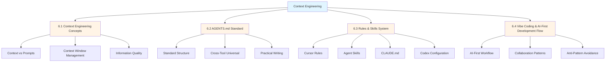
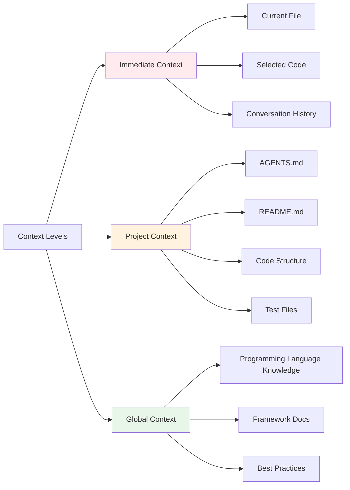
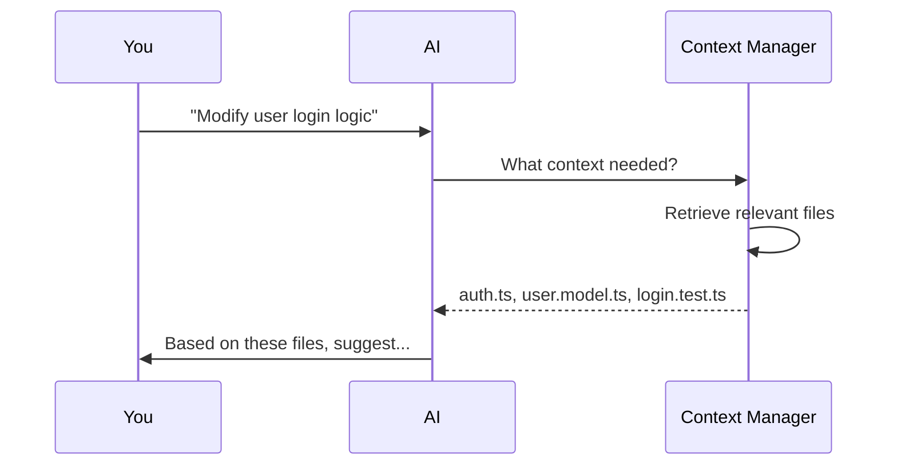
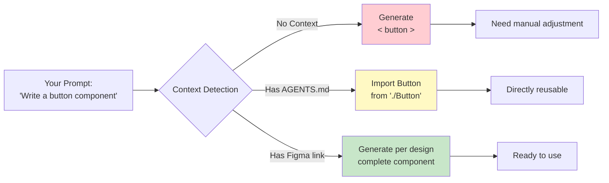

# Chapter 6: Context Engineering

> After completing this chapter, you will: Understand context engineering, write AGENTS.md for projects, configure tool-specific rules

## Chapter Concept Map



---

## 6.1 Context Engineering Concepts

<DifficultyBadge level="intermediate" />
<CostBadge cost="$0.01" />

### Why: Why is Context More Important Than Prompts?

Have you encountered this situation:

```
You: "Help me refactor this function"
AI: "Please provide function code"
You: *Copy-paste 100 lines of code*
AI: "What does this function depend on?"
You: *Copy-paste dependencies again*
AI: "What are your code standards?"
You: "…Forget it, I'll do it myself"
```

**Core Contradiction**: No matter how good the prompt, if AI doesn't understand your codebase, it's useless.

Like a job interview:
- **Prompt** = Interviewer's question: "Please introduce your project experience"
- **Context** = Candidate's resume, portfolio, GitHub profile

No matter how clever the question (Prompt engineering), without knowing the candidate's background (lacking Context), can't get good answers.

**Context engineering is more important than Prompt engineering**:
- ✅ Good Context + Simple Prompt = Accurate output
- ❌ Poor Context + Perfect Prompt = Nonsense

### What: What is Context Engineering?

#### 1. Definition Comparison

| Dimension | Prompt Engineering | Context Engineering |
|------|-------------------|---------------------|
| **Focus** | How to ask questions | What background info to provide |
| **Input** | Single conversation instruction | Codebase, docs, history |
| **Duration** | Immediate effect | Continuous accumulation |
| **Scope** | One request | Entire project |
| **Analogy** | Question wording | Study materials before exam |

#### 2. Three Levels of Context



**Immediate Context**:
- Current file content
- Code you've selected
- Recent conversation rounds

**Project Context**:
- Project config files (AGENTS.md, package.json, tsconfig.json)
- README and docs
- Code structure and naming conventions
- Test cases

**Global Context**:
- Programming language syntax knowledge
- Framework and library documentation
- Universal best practices

#### 3. Context Window Management

AI models have "memory capacity" limits:

```
GPT-4.1:   1M tokens        (about 750K words)
GPT-5:     400K tokens       (about 300K words, with deep reasoning)
Claude 4.6: 200K tokens      (Beta 1M, about 150-750K words)
Gemini:    1M tokens          (about 750K words)
```

**Problem**: A medium-sized project has tens of thousands of lines of code, can't all fit in.

**Solution**: Like humans, only remember "relevant" information.



**Key Technologies**:
- **RAG (Retrieval-Augmented Generation)**: Search relevant code first, then generate answer
- **Smart Chunking**: Break large files into small chunks, load only needed parts
- **Priority Ranking**: AGENTS.md > Current file > Dependency files

#### 4. Why is Context Quality More Important Than Prompt Techniques?

**Experiment Comparison**:

```python
# Experiment: Let AI generate a login form

# ❌ Scenario A: Perfect Prompt + Zero Context
Prompt: """
Generate a login form component using React + TypeScript,
Requirements: Form validation, error hints, accessibility, unit tests
"""
Context: (none)

# ✅ Scenario B: Simple Prompt + Rich Context  
Prompt: "Generate login form"
Context:
  - AGENTS.md (project uses Ant Design, Zod validation, Testing Library)
  - components/Button.tsx (understand existing component style)
  - utils/validation.ts (know validation utility functions)
  - tests/Form.test.tsx (understand test writing style)
```

**Result**:
- Scenario A: Generated code has inconsistent style, introduces new libraries, different test framework
- Scenario B: Code directly usable, unified style, uses existing tools

**Core Principle**:
> **Feed AI the right information at the right time**  
> Context Engineering is about feeding the right information at the right time.

### How: Hands-On Experiment with Context Impact

#### Experiment 1: Context Length Impact

**Steps**:

1. Create test file `/tmp/context-test.ts`

```typescript
// A buggy function
function calculateDiscount(price: number, userType: string) {
  if (userType === "vip") {
    return price * 0.8;
  }
  return price;
}
```

2. **Test A: No Context**

```
Prompt: "What's wrong with this function?"
```

AI might answer: "Looks fine, VIP gets 20% off, regular users pay full price"

3. **Test B: Add Business Context**

Create `context.md`:

```markdown
## Business Rules
- VIP users: 20% off
- Member users: 10% off  
- Regular users: Full price
- Student users: 15% off
```

```
Prompt: "According to business rules, what's wrong with this function?"
Context: context.md
```

AI will find:
- ❌ Missing "member" and "student" user handling
- ❌ No input validation (price could be negative)
- ❌ No type enum (userType is string, easy to typo)

4. **Test C: Add Codebase Context**

Create `types.ts`:

```typescript
// Existing type definitions
export enum UserType {
  VIP = "VIP",
  MEMBER = "MEMBER", 
  REGULAR = "REGULAR",
  STUDENT = "STUDENT"
}

export const DISCOUNT_RATES: Record<UserType, number> = {
  [UserType.VIP]: 0.8,
  [UserType.MEMBER]: 0.9,
  [UserType.REGULAR]: 1.0,
  [UserType.STUDENT]: 0.85
};
```

```
Prompt: "What's wrong with this function?"
Context: context.md, types.ts
```

AI will suggest:

```typescript
import { UserType, DISCOUNT_RATES } from './types';

function calculateDiscount(price: number, userType: UserType): number {
  if (price < 0) {
    throw new Error('Price cannot be negative');
  }
  return price * DISCOUNT_RATES[userType];
}
```

**Comparison Results**:

| Context Level | Issues Found | Code Quality | Reuses Existing Code |
|-------------|-----------|----------|-------------|
| No Context   | 0         | ⭐⭐      | ❌          |
| + Business Docs   | 3         | ⭐⭐⭐    | ❌          |
| + Codebase     | 5         | ⭐⭐⭐⭐⭐ | ✅          |

::: tip Think of It This Way
Context Engineering vs Prompt Engineering is like: Prompt Engineering = asking the right question on an exam. Context Engineering = studying the right materials before the exam. You can ask the perfect question, but if you studied the wrong textbook, you're still failing.
:::

#### Experiment 2: Context Quality Impact

**Scenario**: Let AI write tests for React component

**Test A: Vague Context**

```markdown
# AGENTS.md
Testing Framework: Jest
```

AI might generate:

```javascript
// Uses enzyme, old-style
import { shallow } from 'enzyme';
test('renders', () => {
  const wrapper = shallow(<LoginForm />);
  expect(wrapper.find('input').length).toBe(2);
});
```

**Test B: Precise Context**

```markdown
# AGENTS.md
## Testing Standards
- Framework: Vitest + Testing Library  
- Naming: describe/it instead of test
- Query Priority: ByRole > ByLabelText > ByTestId
- Assertions: @testing-library/jest-dom

## Example
\`\`\`typescript
import { render, screen } from '@testing-library/react';
import userEvent from '@testing-library/user-event';

describe('Button', () => {
  it('handles click', async () => {
    const onClick = vi.fn();
    render(<Button onClick={onClick}>Click me</Button>);
    await userEvent.click(screen.getByRole('button'));
    expect(onClick).toHaveBeenCalledOnce();
  });
});
\`\`\`
```

AI will generate compliant tests:

```typescript
import { render, screen } from '@testing-library/react';
import userEvent from '@testing-library/user-event';
import { describe, it, expect, vi } from 'vitest';
import { LoginForm } from './LoginForm';

describe('LoginForm', () => {
  it('submits with valid credentials', async () => {
    const onSubmit = vi.fn();
    render(<LoginForm onSubmit={onSubmit} />);
    
    await userEvent.type(
      screen.getByLabelText(/email/i),
      'user@example.com'
    );
    await userEvent.type(
      screen.getByLabelText(/password/i),
      'password123'
    );
    await userEvent.click(
      screen.getByRole('button', { name: /sign in/i })
    );
    
    expect(onSubmit).toHaveBeenCalledWith({
      email: 'user@example.com',
      password: 'password123'
    });
  });
});
```

**Comparison**: Context quality determines AI-generated code's "style match".

#### Experiment 3: Visualize Context's Role



### Reflection: Context Engineering Insights

#### 1. Context is AI's "Resume"

- Prompt is the question, Context is candidate's background
- More complete background, more precise answers
- One-time config (write AGENTS.md well), use everywhere

#### 2. Context Priority

```
Config files (AGENTS.md) > Current file > Related files > Docs > General knowledge
```

**Reason**: More specific info is more useful for current task.

#### 3. Shift from Prompt to Context Engineering

**Old Thinking** (Prompt engineering):
```
"You are a senior React engineer proficient in TypeScript and functional programming,
consider performance optimization and accessibility, generate a reusable, testable button component..."
```
Have to repeat this long paragraph every time.

**New Thinking** (Context engineering):
```
// Write once in AGENTS.md
Tech Stack: React 18 + TypeScript
Code Style: Functional, Hooks
Quality Requirements: Performance optimization, a11y, test coverage

// Future simple prompts
"Generate a button component"
```

#### 4. Next Step: Standardize Context

Problem: 5 people use 5 AI tools, need to write project conventions 5 times?

Solution: **AGENTS.md**—one config, all AI tools universal.

::: tip Context Compression & Memory Management
As conversations grow longer, context windows fill up. Modern AI coding tools use several strategies to manage this:

**Context Compression (Compact)**:
- Summarize earlier conversation turns into compact summaries
- Keep only the most relevant code snippets and decisions
- [learn-claude-code Session 06](https://github.com/shareAI-lab/learn-claude-code) demonstrates building a compaction system from scratch

**Session Memory vs Project Memory**:
- **Session Memory**: Current conversation context, lost when session ends
- **Project Memory**: Persistent files like AGENTS.md, CLAUDE.md that survive across sessions
- Tools like Claude Code use `CLAUDE.md` to persist learned project conventions

**Key Insight from [hello-agents Ch.9](https://datawhalechina.github.io/hello-agents/#/)**: Context Engineering is the evolution of Prompt Engineering — instead of crafting individual prompts, you design systems that automatically feed the right context to the AI at the right time.
:::

👉 [Next Section: AGENTS.md Standard](./agents-md.md)

---

*Last updated: 2026-02-20*
