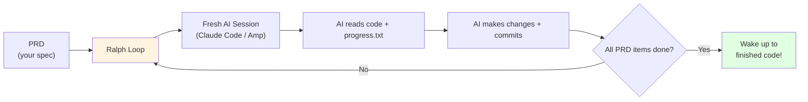

# 6.5 Ralph Wiggum Pattern

<DifficultyBadge level="intermediate" />
<CostBadge cost="$0.50-5.00" />

> Prerequisites: 6.1 Context Engineering Concepts, 5.1 AI Coding Tools

### Why Do We Need It? (Problem)

You've had this experience:

1. Start a complex coding task with Claude Code / Cursor
2. Work for 30 minutes, great progress
3. Context window fills up, AI starts "forgetting" earlier decisions
4. You close the session, go to sleep
5. Wake up, start a new session... AI has no idea what you were doing

**The fundamental problem**: AI coding sessions are **ephemeral**. Context dies when the session ends. Your AI has short-term memory measured in tokens, not days.

What if you could set up a task, go to sleep, and wake up to find the AI completed it overnight?

::: tip Why "Ralph Wiggum"?
Named after Ralph Wiggum from The Simpsons — the lovably naive character who persists at things with innocent determination. The pattern embodies this spirit: keep trying, keep looping, never give up, occasionally say something surprisingly brilliant.

Creator Geoffrey Huntley: "Software is now clay on the pottery wheel. If something isn't right, throw it back on the wheel."
:::

### What Is It? (Concept)

**Ralph Wiggum Pattern** = An autonomous coding loop where:

1. You write a **PRD** (Product Requirements Document) as a JSON/Markdown spec
2. A **shell script** repeatedly feeds the PRD to an AI coding agent
3. Each iteration is a **fresh context** (no memory pollution)
4. **Memory persists via git** — the agent reads code changes, not conversation history
5. **Progress tracked in a file** (`progress.txt`) that persists across iterations



**Key Insight**: Instead of maintaining conversation context, Ralph uses **git as memory**. Each loop iteration starts fresh, but the agent reads the codebase (which contains all previous work) and a `progress.txt` file tracking what's done.

```bash
# Simplified Ralph loop (actual implementation)
while true; do
    # Check if all PRD items are complete
    if all_items_done; then
        echo "All done! Go check your code."
        exit 0
    fi
    
    # Run AI agent with fresh context
    claude-code --message "Read prd.json and progress.txt. \
        Complete the next unchecked item. \
        Update progress.txt when done. \
        Commit your changes."
    
    # Wait a moment before next iteration
    sleep 5
done
```

**Ralph vs Other Patterns:**

| Pattern | Memory | Human Involvement | Duration | Best For |
|---------|--------|------------------|----------|----------|
| **Manual session** | In context window | Constant | Minutes-hours | Interactive work |
| **Vibe Coding** | In context | High (prompting) | Minutes | Quick prototypes |
| **Ralph Wiggum** | Git + progress file | Setup only | Hours (overnight) | Well-specced features |
| **Agent Teams** | Shared memory | None | Hours-days | Complex multi-part projects |

::: warning Anti-Patterns
- **Don't Ralph without a clear PRD** — vague specs + autonomous loop = expensive chaos
- **Don't skip the "watch the loop" phase** — run it manually first, learn from failures, THEN automate
- **Don't use Anthropic's Ralph plugin** (community advice) — it keeps each loop in the same context window, defeating the purpose
- **Don't forget cost controls** — an overnight Ralph loop can burn through $50+ in API costs if your PRD is ambiguous
:::

### Try It: Setting Up Ralph

**Step 1: Install Ralph**

```bash
git clone https://github.com/snarktank/ralph.git
cd ralph
```

**Step 2: Create Your PRD**

```json
// prd.json
{
  "project": "User Authentication System",
  "items": [
    {"id": 1, "task": "Create User model with email, password hash, created_at", "done": false},
    {"id": 2, "task": "Implement registration endpoint POST /auth/register", "done": false},
    {"id": 3, "task": "Implement login endpoint POST /auth/login with JWT", "done": false},
    {"id": 4, "task": "Add authentication middleware", "done": false},
    {"id": 5, "task": "Write tests for all endpoints", "done": false}
  ]
}
```

**Step 3: Run Ralph**

```bash
# Using Claude Code as the AI backend
./ralph.sh --agent claude-code --prd prd.json

# Or using Amp
./ralph.sh --agent amp --prd prd.json
```

**Step 4: Go to sleep. Seriously.**

::: info Soul-Searching Question
If an AI can implement a full feature spec overnight while you sleep... what does "being a developer" mean in 2026? Are you the architect who writes specs, the QA who reviews output, or the project manager who prioritizes features? Maybe all three?
:::

### Summary (Reflection)

- **What we solved**: A pattern for autonomous, overnight AI coding with persistent progress
- **Key takeaways**:
  1. **Git is the memory** — fresh context each loop, code changes persist
  2. **PRD is the contract** — clear spec = good results, vague spec = expensive mess
  3. **Watch before automating** — manually loop first, learn the failure modes
  4. **Cost awareness** — set budget limits, an unattended loop is an unattended credit card

> *"Ralph Wiggum Pattern is what happens when you combine 'set it and forget it' with 'an AI that charges by the token'. Exciting? Yes. Potentially expensive? Also yes. Use responsibly."*

---

*Last updated: 2026-02-22*
