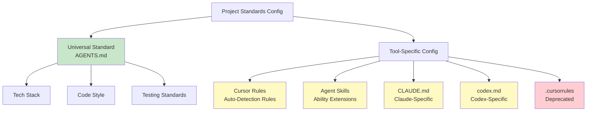

# 6.3 Rules & Skills System

<DifficultyBadge level="intermediate" />
<CostBadge cost="$0" />

**Prerequisites**: [6.2 AGENTS.md Standard](./agents-md.md)

---

### Why: Why Need Tool-Specific Configuration?

#### Problem Scenario

You already have `AGENTS.md` with universal project standards. But you find:

**Scenario 1**: You want Cursor to auto-suggest "run test command is `pnpm test`" when opening `.test.ts` files.  
→ AGENTS.md is static docs, can't do "conditional trigger".

**Scenario 2**: You want AI to "auto-generate API docs", need to call custom scripts.  
→ AGENTS.md can only write standards, can't extend AI abilities.

**Scenario 3**: You use Claude Code, want to configure its specific features (like MCP servers).  
→ AGENTS.md is universal standard, can't cover tool-unique features.

**Core Contradiction**:  
> **AGENTS.md is universal, but each tool has its own advanced config capabilities.**

**Analogy**:
- **AGENTS.md** = Universal driving rules (stop on red, go on green)
- **Tool Config** = Specific car model's advanced features (Tesla autopilot, BMW night vision)

### What: Tool-Specific Configuration System

#### Complete Configuration Landscape



#### 1. Cursor Rules

**Definition**: Cursor's three-tier rule system, supports auto-detection, conditional triggers, manual invocation.

**Three-Tier Architecture**:

```
1. User Rules
   Location: ~/.cursor/rules/
   Purpose: Cross-project personal preferences
   Example: "I prefer const over let"

2. Project Rules
   Location: <project>/.cursor/rules/
   Purpose: Project-specific rules
   Example: "This project uses Ant Design"

3. Team Rules
   Location: Team shared config (synced via Git)
   Purpose: Team unified standards
   Example: "All company projects use ESLint Airbnb standards"
```

**Rule Types**:

| Type | Trigger Method | Use Case |
|-----|---------|---------|
| **Always-Apply** | Auto-applied to all conversations | Code style, naming conventions |
| **Auto-Detected** | Auto-triggered on specific file types | `.test.ts` → suggest test commands |
| **Manual** | User manually invokes (`@ruleName`) | Generate API docs, code review |

**Example: Project Rule**

Create `.cursor/rules/testing.md`:

```markdown
---
name: Testing Rules
type: auto-detected
trigger: "**/*.test.ts"
---

# Testing Rules

When user edits test files, provide the following guidance:

## Testing Framework
- Use Vitest + Testing Library
- Forbid Jest (project migrated)

## Run Commands
\`\`\`bash
pnpm test              # Run all tests
pnpm test:watch        # Watch mode
pnpm test:coverage     # Generate coverage report
\`\`\`

## Test Template
\`\`\`typescript
import { describe, it, expect } from 'vitest';

describe('ComponentName', () => {
  it('should ...', () => {
    // Test code
  });
});
\`\`\`

## Hints
- If user asks "how to run tests", answer: `pnpm test`
- If user writes `import { test } from 'jest'`, remind: project uses Vitest, not Jest
```

**Effect**: When you open any `.test.ts` file, Cursor auto-loads this rule, AI knows:
- Project uses Vitest (not Jest)
- Run command is `pnpm test`
- What test template looks like

**Manual Rule Example**

Create `.cursor/rules/review-code.md`:

```markdown
---
name: Code Review
type: manual
command: "@review"
---

# Code Review Checklist

When user inputs `@review`, perform comprehensive code review on current file:

## Checks
1. **Code Style**
   - Follows ESLint rules?
   - Naming semantic?
   - Sufficient comments?

2. **Type Safety**
   - Any `any` types?
   - Potential `null/undefined` errors?

3. **Performance**
   - Unnecessary repeat computations?
   - Can optimize with `useMemo` or `useCallback`?

4. **Security**
   - XSS risks?
   - User input validated?

5. **Testing**
   - Has corresponding test files?
   - Test coverage?

## Output Format
\`\`\`
### Code Review Report

#### ✅ Good Points
- ...

#### ⚠️ Needs Improvement
- ...

#### 🔴 Critical Issues
- ...

#### Suggestions
- ...
\`\`\`
```

**Usage**:
```
You: @review
AI: (Auto-performs comprehensive review of current file, outputs structured report)
```

#### 2. Agent Skills

**Definition**: Agent Skills is an **open standard** for extending AI agents with special abilities.

**Official Repo**: [github.com/agent-skills/agent-skills](https://github.com/agent-skills/agent-skills)

**Core Idea**: Like installing "plugins" for AI, teach it new abilities.

**Example Skill**:

```markdown
# Skill: Generate API Documentation

## Description
Auto-generate Markdown docs for TypeScript APIs.

## Input
- TypeScript file path
- Functions/classes to export

## Output
- API documentation in Markdown format

## Implementation
\`\`\`typescript
// Use TypeDoc or ts-morph to parse TypeScript AST
// Extract function signatures, parameters, return values, comments
// Generate Markdown documentation
\`\`\`

## Usage Example
User: Generate API docs for `src/lib/api.ts`
AI:
1. Read `api.ts`
2. Parse all exported functions
3. Generate Markdown docs
4. Save to `docs/api.md`
```

**How to Use in Cursor**:

1. Download Skill file (`.skill.md`)
2. Place in `~/.cursor/skills/` directory
3. Enable in Cursor settings
4. AI auto-learns this skill

**Common Skill Packages**:
- **Code Generation**: Generate CRUD APIs, database models
- **Documentation**: API docs, README, Changelog
- **Code Review**: Auto-detect potential issues
- **Refactoring**: Extract functions, optimize performance
- **Test Generation**: Auto-generate unit tests

#### 3. CLAUDE.md

**Definition**: Claude Code (Anthropic's AI coding assistant) project config file.

**Location**: `CLAUDE.md` in project root

**Relationship with AGENTS.md**:
- **AGENTS.md**: Universal standard, all tools read
- **CLAUDE.md**: Claude-specific, configures Claude features

**Unique Features**:

1. **MCP Server Configuration** (Model Context Protocol)

```markdown
# CLAUDE.md

## MCP Servers

This project uses the following MCP servers:

### 1. Database MCP
Connect to PostgreSQL database, let Claude query database structure.

\`\`\`json
{
  "mcpServers": {
    "database": {
      "command": "mcp-server-postgres",
      "args": ["--connection", "postgresql://localhost/mydb"]
    }
  }
}
\`\`\`

### 2. Filesystem MCP
Let Claude read files in specific directories.

\`\`\`json
{
  "mcpServers": {
    "filesystem": {
      "command": "mcp-server-filesystem",
      "args": ["--root", "./src"]
    }
  }
}
\`\`\`
```

2. **Claude-Specific Prompts**

```markdown
## Claude-Specific Prompts

### Code Generation Preferences
- Prefer functional programming
- Avoid over-abstraction
- Each function no more than 20 lines

### Conversation Style
- Answers should be concise
- Provide code examples
- Explain key decisions
```

#### 4. Codex CLI Configuration

**Codex CLI**: GitHub's command-line AI tool.

**Config File**: `codex.md`

**Example**:

```markdown
# codex.md

## Project Info
Name: AI-First Blog
Tech Stack: Next.js + TypeScript + Prisma

## Common Commands

### Development
\`\`\`bash
npm run dev         # Start dev server
npm run build       # Build for production
npm run test        # Run tests
\`\`\`

### Database
\`\`\`bash
npx prisma studio   # Open database UI
npx prisma migrate dev   # Run database migrations
\`\`\`

## Codex Skills

### 1. Generate Migration
\`\`\`bash
codex ask "migration to add email field to User table"
\`\`\`

### 2. Explain Code
\`\`\`bash
codex explain src/lib/auth.ts
\`\`\`

## Codex Connectors
- PostgreSQL: `postgresql://localhost/mydb`
- Redis: `redis://localhost:6379`
```

#### 5. .cursorrules (Deprecated)

**Status**: Replaced by `AGENTS.md`, recommend migrating.

**If still using**:
```bash
# Migration steps
mv .cursorrules AGENTS.md
# Adjust format, add standard sections
```

**Cursor Read Priority**:
```
1. AGENTS.md (priority)
2. .cursor/rules/ (project rules)
3. .cursorrules (deprecated, backward compatible)
```

#### Configuration System Comparison

| Config System | Tool Support | Scope | Trigger | Typical Use |
|---------|---------|-------|---------|---------|
| **AGENTS.md** | All tools | Project universal | Auto-load | Tech stack, code style, testing standards |
| **Cursor Rules** | Cursor | Cursor-specific | Auto/Manual | Conditional trigger rules, custom commands |
| **Agent Skills** | Cursor, Copilot | Cross-tool | Manual install | Extend AI abilities (docs, review) |
| **CLAUDE.md** | Claude Code | Claude-specific | Auto-load | MCP servers, Claude config |
| **codex.md** | Codex CLI | Codex-specific | Auto-load | Codex commands, connector config |
| **.cursorrules** | Cursor | Cursor-specific | Auto-load | ⚠️ Deprecated, migrate to AGENTS.md |

### How: Create Real Config Files

#### Real-World 1: Configure Cursor Rules for Project

**Goal**: Create automation rules so Cursor provides different help for different file types.

**Step 1**: Create project rules directory

```bash
mkdir -p .cursor/rules
```

**Step 2**: Create test file rule

`.cursor/rules/testing.md`:

```markdown
---
name: Testing Guide
type: auto-detected
trigger: "**/*.test.{ts,tsx,js,jsx}"
---

# Testing Guide

## Framework
Vitest + Testing Library

## Common Commands
- `pnpm test` - Run all tests
- `pnpm test:watch` - Watch mode
- `pnpm test <filename>` - Run single test

## Template
\`\`\`typescript
import { describe, it, expect } from 'vitest';
import { render, screen } from '@testing-library/react';

describe('Component', () => {
  it('renders correctly', () => {
    render(<Component />);
    expect(screen.getByText('Hello')).toBeInTheDocument();
  });
});
\`\`\`

## Hints
- Test naming: use `describe` and `it`
- Query elements: prefer `ByRole` > `ByLabelText` > `ByTestId`
- Async operations: use `waitFor` or `findBy*`
```

**Step 3**: Create API route rule

`.cursor/rules/api-routes.md`:

```markdown
---
name: API Routes Guide
type: auto-detected
trigger: "**/app/api/**/*.ts"
---

# API Routes Guide

## Next.js App Router API

### File Structure
\`\`\`
app/api/
  posts/
    route.ts          # /api/posts
    [id]/
      route.ts        # /api/posts/[id]
\`\`\`

### HTTP Methods
\`\`\`typescript
// app/api/posts/route.ts
export async function GET(request: Request) {
  // Query list
}

export async function POST(request: Request) {
  // Create resource
}
\`\`\`

### Dynamic Routes
\`\`\`typescript
// app/api/posts/[id]/route.ts
export async function GET(
  request: Request,
  { params }: { params: { id: string } }
) {
  const { id } = params;
  // Query single resource
}
\`\`\`

## Security Checklist
- [ ] Validate request body (use Zod)
- [ ] Check user permissions (use NextAuth session)
- [ ] Handle errors (return correct status codes)
- [ ] Prevent SQL injection (use Prisma)

## Response Format
\`\`\`typescript
// Success
return Response.json({ data: posts }, { status: 200 });

// Error
return Response.json({ error: 'Not found' }, { status: 404 });
\`\`\`
```

**Step 4**: Create database model rule

`.cursor/rules/prisma.md`:

```markdown
---
name: Prisma Guide
type: auto-detected
trigger: "**/prisma/schema.prisma"
---

# Prisma Schema Guide

## Model Naming
- Use singular: `model User` (not Users)
- Use PascalCase
- Relations use plural: `posts Post[]`

## Required Fields
\`\`\`prisma
model Post {
  id        String   @id @default(cuid())
  createdAt DateTime @default(now())
  updatedAt DateTime @updatedAt
}
\`\`\`

## Common Types
\`\`\`prisma
String    # String
Int       # Integer
Float     # Float
Boolean   # Boolean
DateTime  # DateTime
Json      # JSON
\`\`\`

## Relations
\`\`\`prisma
model User {
  id    String @id
  posts Post[]
}

model Post {
  id       String @id
  authorId String
  author   User   @relation(fields: [authorId], references: [id])
}
\`\`\`

## After Modifying Schema
\`\`\`bash
npx prisma migrate dev --name add_email_to_user
npx prisma generate
\`\`\`
```

**Step 5**: Create manual rule (code review)

`.cursor/rules/review.md`:

```markdown
---
name: Code Review
type: manual
command: "@review"
---

# Code Review

Perform comprehensive review of current file:

## Check Dimensions
1. **Code Quality**
   - Naming clear?
   - Logic concise?
   - Duplicate code?

2. **Type Safety**
   - Any `any` types?
   - Type definitions complete?

3. **Performance**
   - Unnecessary re-renders?
   - Can optimize?

4. **Security**
   - User input validated?
   - Sensitive info exposed?

5. **Testing**
   - Has test coverage?
   - Edge cases considered?

## Output Format
\`\`\`markdown
### Code Review Report

#### ✅ Strengths
- ...

#### ⚠️ Suggestions
- ...

#### 🔴 Issues
- ...
\`\`\`
```

**Usage Effect**:

- Open `.test.ts` → Cursor auto-loads testing rule
- Open `app/api/*/route.ts` → Cursor auto-loads API rule
- Open `schema.prisma` → Cursor auto-loads Prisma rule
- Type `@review` → Triggers code review

#### Real-World 2: Create Custom Agent Skill

**Goal**: Create a "Generate CRUD API" skill.

**Step 1**: Create Skill file

`~/.cursor/skills/generate-crud-api.skill.md`:

```markdown
# Skill: Generate CRUD API

## Description
Auto-generate complete CRUD API routes for Prisma models.

## Input
- Prisma model name (e.g., `Post`)

## Output
- `app/api/posts/route.ts` (list + create)
- `app/api/posts/[id]/route.ts` (read + update + delete)
- Includes:
  - Zod validation
  - Error handling
  - TypeScript types
  - NextAuth permission checks

## Implementation Steps

### 1. Read Prisma Schema
\`\`\`typescript
// Find model definition from prisma/schema.prisma
model Post {
  id        String   @id @default(cuid())
  title     String
  content   String
  published Boolean  @default(false)
  authorId  String
  author    User     @relation(fields: [authorId], references: [id])
  createdAt DateTime @default(now())
  updatedAt DateTime @updatedAt
}
\`\`\`

### 2. Generate List and Create Route
\`\`\`typescript
// app/api/posts/route.ts
import { NextRequest } from 'next/server';
import { z } from 'zod';
import { db } from '@/lib/db';
import { auth } from '@/lib/auth';

// Create Post validation schema
const createPostSchema = z.object({
  title: z.string().min(1).max(200),
  content: z.string().min(1),
  published: z.boolean().default(false),
});

// GET /api/posts - Query list
export async function GET(request: NextRequest) {
  try {
    const { searchParams } = new URL(request.url);
    const page = parseInt(searchParams.get('page') || '1');
    const limit = parseInt(searchParams.get('limit') || '10');
    
    const posts = await db.post.findMany({
      skip: (page - 1) * limit,
      take: limit,
      orderBy: { createdAt: 'desc' },
      include: { author: { select: { id: true, name: true } } },
    });
    
    const total = await db.post.count();
    
    return Response.json({
      data: posts,
      pagination: { page, limit, total },
    });
  } catch (error) {
    return Response.json(
      { error: 'Failed to fetch posts' },
      { status: 500 }
    );
  }
}

// POST /api/posts - Create
export async function POST(request: NextRequest) {
  try {
    // Permission check
    const session = await auth();
    if (!session) {
      return Response.json({ error: 'Unauthorized' }, { status: 401 });
    }
    
    // Validate request body
    const body = await request.json();
    const validated = createPostSchema.parse(body);
    
    // Create resource
    const post = await db.post.create({
      data: {
        ...validated,
        authorId: session.user.id,
      },
    });
    
    return Response.json({ data: post }, { status: 201 });
  } catch (error) {
    if (error instanceof z.ZodError) {
      return Response.json(
        { error: 'Validation failed', details: error.errors },
        { status: 400 }
      );
    }
    return Response.json(
      { error: 'Failed to create post' },
      { status: 500 }
    );
  }
}
\`\`\`

### 3. Generate Single Resource Route
\`\`\`typescript
// app/api/posts/[id]/route.ts
// ... (similar implementation for GET, PATCH, DELETE)
\`\`\`

## Usage Example

**User**: "Generate CRUD API for Post model"

**AI**:
1. Read `prisma/schema.prisma`, find `Post` model
2. Analyze field types, generate Zod schema
3. Create `app/api/posts/route.ts` (list + create)
4. Create `app/api/posts/[id]/route.ts` (read + update + delete)
5. Hint: "API generated, accessible at:
   - GET /api/posts (list)
   - POST /api/posts (create)
   - GET /api/posts/[id] (read)
   - PATCH /api/posts/[id] (update)
   - DELETE /api/posts/[id] (delete)"
```

**Step 2**: Enable in Cursor

1. Open Cursor settings
2. Find "Agent Skills"
3. Click "Add Skill"
4. Select `generate-crud-api.skill.md`

**Usage**:
```
You: "Generate CRUD API for Post model"
AI: *Auto-executes Skill steps, generates all files*
```

#### Real-World 3: Configure Claude Code (CLAUDE.md)

**Scenario**: You use Claude Code, want it to access database and filesystem.

**Step 1**: Create CLAUDE.md

```markdown
# CLAUDE.md

## Project Overview
Next.js full-stack blog system

## MCP Servers

### 1. PostgreSQL Database
Connect to local database, let Claude query table structure and data.

\`\`\`json
{
  "mcpServers": {
    "postgres": {
      "command": "npx",
      "args": [
        "-y",
        "mcp-server-postgres",
        "postgresql://localhost:5432/blog_dev"
      ]
    }
  }
}
\`\`\`

**Purpose**:
- Query table structure: `SHOW TABLES`, `DESCRIBE posts`
- Execute read-only queries: `SELECT * FROM posts WHERE published = true`
- ⚠️ Forbid: `DROP`, `DELETE`, `UPDATE` (read-only mode)

### 2. Filesystem
Let Claude read `src/` and `prisma/` directories.

\`\`\`json
{
  "mcpServers": {
    "filesystem": {
      "command": "npx",
      "args": ["-y", "mcp-server-filesystem", "--root", "./"]
    }
  }
}
\`\`\`

**Purpose**:
- Read config files
- Analyze code structure
- View Prisma schema

## Claude-Specific Prompts

### Code Style
- Functional programming preferred
- Each function no more than 20 lines
- Complex logic split into small functions

### Conversation Style
- Code first, then explain
- Code examples should be complete and runnable
- Explain rationale for key decisions

### Special Abilities
Claude can:
- Query database table structure via MCP
- Read project files
- Generate complex code (leverage long context window)

Claude cannot:
- Directly modify database (read-only mode)
- Execute shell commands (security restrictions)
```

**Step 2**: Install MCP servers

```bash
# PostgreSQL MCP server
npm install -g mcp-server-postgres

# Filesystem MCP server
npm install -g mcp-server-filesystem
```

**Step 3**: Claude Code auto-reads

Restart Claude Code, it will:
1. Read `CLAUDE.md`
2. Launch MCP servers
3. Now Claude can directly query database and files

**Usage Effect**:

```
You: "What tables are in the database?"
Claude: *Via MCP query* "There are User, Post, Comment, Tag tables"

You: "What's the Post table structure?"
Claude: *Execute DESCRIBE posts*
\`\`\`
id        String
title     String
content   String
...
\`\`\`

You: "How many published articles?"
Claude: *Execute SELECT COUNT(*) FROM posts WHERE published = true* "23 articles"
```

### Reflection: Configuration Best Practices

#### 1. Layered Configuration Principle

```
┌─────────────────────────────────────┐
│ AGENTS.md (Base Layer)               │  ← 90% standards
│ - Tech stack, code style, testing    │
│ - Everyone, every tool uses          │
└─────────────────────────────────────┘
              ↓
┌─────────────────────────────────────┐
│ Tool Config (Enhancement Layer)      │  ← 10% advanced
│ - Cursor Rules: Automation rules     │
│ - Agent Skills: Special abilities    │
│ - CLAUDE.md: Claude-specific         │
└─────────────────────────────────────┘
```

**Principle**:
- **AGENTS.md writes universal standards**: What everyone needs to know
- **Tool config writes special abilities**: Only for users of that tool

#### 2. Automation vs Manual

| Rule Type | Use Case | Example |
|---------|---------|------|
| **Always-Apply** | Code style, naming conventions | "Use const not let" |
| **Auto-Detected** | File type-specific help | Open `.test.ts` → suggest test commands |
| **Manual** | Complex tasks, code review | `@review` triggers comprehensive review |

**Recommendation**:
- 90% use auto rules (reduce interruptions)
- 10% use manual rules (complex tasks)

#### 3. Team Collaboration

**Scenario 1**: New hire onboarding

```bash
# New hire clones project
git clone <repo>

# Their AI tool auto-reads:
# - AGENTS.md (universal standards)
# - .cursor/rules/ (project rules)
# - CLAUDE.md (if using Claude)

# No extra config, immediate start
```

**Scenario 2**: Standards update

```bash
# Team decides to change code style
# 1. Update AGENTS.md
# 2. git push
# 3. Everyone git pull
# → Everyone's AI tools auto-sync
```

#### 4. Tool Selection Recommendations

| Your Need | Recommended Solution |
|---------|---------|
| Team unified standards | **AGENTS.md** |
| Cursor automation rules | **Cursor Rules** |
| Extend AI abilities (docs, review) | **Agent Skills** |
| Claude-specific features (MCP) | **CLAUDE.md** |
| Codex CLI config | **codex.md** |

#### 5. Next Step: From Config to Workflow

Now you have:
- ✅ AGENTS.md (universal standards)
- ✅ Cursor Rules (automation rules)
- ✅ Agent Skills (special abilities)
- ✅ CLAUDE.md (tool config)

**Question**: How to **actually use** these tools?

👉 [Next Section: Vibe Coding & AI-First Development Flow](./vibe-coding.md)

---

## Reference Resources

- **Cursor Rules Docs**: [cursor.sh/docs/rules](https://cursor.sh/docs/rules)
- **Agent Skills Standard**: [github.com/agent-skills](https://github.com/agent-skills/agent-skills)
- **MCP Protocol**: [modelcontextprotocol.io](https://modelcontextprotocol.io)
- **Claude Code Docs**: [docs.anthropic.com/claude-code](https://docs.anthropic.com)

---

*Last updated: 2026-02-20*
