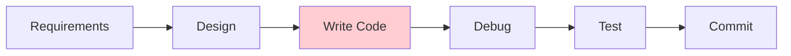
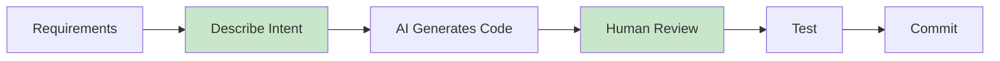
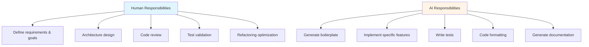
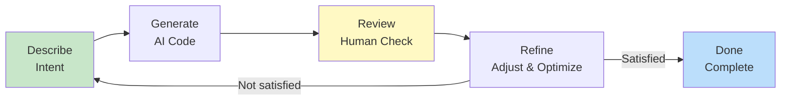
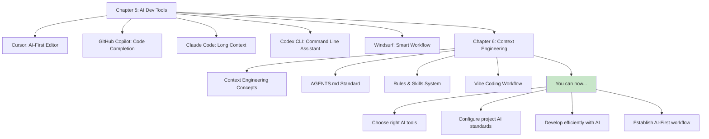

# 6.4 Vibe Coding & AI-First Development Flow

<DifficultyBadge level="intermediate" />
<CostBadge cost="$0" />

**Prerequisites**:
- [5.1 IDE-Integrated Tools](/05-ai-coding-tools/)
- [6.1 Context Engineering Concepts](./index.md)
- [6.2 AGENTS.md Standard](./agents-md.md)
- [6.3 Rules & Skills System](./rules-skills.md)

---

### Why: Why Need AI-First Development Flow?

#### Traditional Dev vs AI-First Dev

**Traditional Development Process**:



**Problems**:
- Writing code takes 70% of time
- Repetitive work (CRUD, boilerplate, tests)
- Unfamiliar tech → read docs → trial and error

**AI-First Development Process**:



**Changes**:
- Write code → **Describe intent**
- Debug → **Review and guide AI**
- Humans do high-value work (architecture, business logic, code review)
- AI does low-value work (boilerplate, repetitive tasks, formatting)

#### Core Question

**How to shift AI from "occasional help" to "full participation" development mode?**

**Analogy**:
- **Traditional** = Drive yourself: Control steering, gas, brake—tiring but in control
- **AI-First** = Partner with driver: You say destination and route, driver drives, you navigate and decide

**Key**:
1. Clearly **express intent** (don't need precise instructions)
2. Effectively **review and correct** AI output
3. Establish **human-AI collaboration rhythm**

### What: What is Vibe Coding?

#### 1. Definition

**Vibe Coding**: Describe code that "feels right" in natural language, let AI generate implementation, humans verify and adjust.

**Term Origin**: Andrej Karpathy (Tesla AI Director, OpenAI founding member) proposed in 2023.

**Core Idea**:
> **You don't need to remember how to write every line, just know what "right code" looks like.**

**Analogy**:
- **Traditional Programming** = Painting: Control every stroke
- **Vibe Coding** = Collaborate with AI artist: You say "paint a sunset, warm feeling", artist paints, you say "sky more red, clouds softer"

#### 2. Vibe Coding Characteristics

| Feature | Traditional Programming | Vibe Coding |
|-----|---------|------------|
| **Input** | Precise code | Vague intent |
| **Process** | Line-by-line writing | Conversational generation |
| **Speed** | Slow (need to recall syntax) | Fast (express ideas directly) |
| **Error Handling** | Debugger, Stack Overflow | Dialogue with AI to fix |
| **Learning Curve** | Steep (need to memorize) | Gentle (need to understand) |
| **Applicable Scenarios** | Fine control, performance optimization | Quick prototypes, boilerplate |

#### 3. AI-Native Project Structure

**Traditional Project Structure** (for humans):

```
my-app/
├── README.md           # Project description
├── CONTRIBUTING.md     # Contribution guide
├── docs/               # Documentation
├── src/                # Source code
└── tests/              # Tests
```

**AI-Native Project Structure** (for humans and AI):

```
my-app/
├── README.md           # For humans: project description
├── AGENTS.md           # For AI: project standards
├── .cursor/
│   └── rules/          # Cursor rules
├── docs/
│   ├── architecture.md # Architecture docs (AI reference)
│   └── decisions.md    # Design decisions (AI reference)
├── src/
│   ├── types/          # TypeScript types (AI understands data structures)
│   └── examples/       # Example code (AI learns style)
└── tests/
    └── examples/       # Test examples (AI learns testing style)
```

**Key Differences**:
- ✅ Add `AGENTS.md` (AI's "onboarding docs")
- ✅ Add `docs/architecture.md` (AI understands system design)
- ✅ Add `src/examples/` (AI learns code style)
- ✅ Add `tests/examples/` (AI learns testing style)

#### 4. Human-AI Collaboration Best Practices



**Humans excel at**:
- Strategic thinking: How should this feature be designed?
- Business judgment: Does this logic match requirements?
- Quality control: Any problems with this code?

**AI excels at**:
- Execution details: Implement this design
- Repetitive work: Write tests, docs, boilerplate
- Knowledge retrieval: How to use this API?

#### 5. Development Loop



**Detailed Steps**:

1. **Describe**: Use natural language to clarify what you want
   ```
   "Create a login form with email and password inputs,
   email needs format validation, password at least 8 chars,
   on submit call API, show loading state and error messages"
   ```

2. **Generate**: AI generates code
   ```typescript
   // AI generates complete LoginForm.tsx
   ```

3. **Review**: Human checks code
   ```
   - Logic correct?
   - Any security issues?
   - Style consistent?
   - Anything missing?
   ```

4. **Refine**: Adjust based on review
   ```
   "Password input needs 'show/hide password' button"
   → AI modifies code → review again → until satisfied
   ```

#### 6. Vibe Coding Suitable Scenarios

**✅ Good for Vibe Coding**:

| Scenario | Reason |
|-----|------|
| **CRUD API** | High repetition, AI excels |
| **UI Components** | Much boilerplate, AI generates fast |
| **Data Transformation** | Clear logic, AI implements accurately |
| **Test Cases** | Strong patterns, AI batch generates |
| **Code Refactoring** | AI optimizes structure while maintaining functionality |
| **Documentation** | AI extracts info from code |

**❌ Not Good for Vibe Coding**:

| Scenario | Reason | Recommendation |
|-----|------|------|
| **Complex Algorithms** | AI may misunderstand | Human designs core algorithm, AI assists implementation |
| **Performance Optimization** | AI doesn't understand bottlenecks | Human uses profiler to find issues, AI assists optimization |
| **Architecture Design** | AI lacks global view | Human designs architecture, AI implements details |
| **Security-Critical** | AI may introduce vulnerabilities | Human strictly reviews security code |

#### 7. Common Anti-Patterns

**❌ Anti-Pattern 1: Completely Trust AI**

```
Wrong approach:
1. Let AI generate code
2. Don't check, don't test, commit directly
3. Find bugs later

Correct approach:
1. AI generates code
2. Carefully review logic and security
3. Run tests to validate
4. Commit after confirming no issues
```

**❌ Anti-Pattern 2: Over-Instruct AI**

```
Wrong approach:
"First define a variable called count, then use useState to initialize to 0,
then write a function called increment, use setCount(count + 1),
then bind onClick on button..."

Correct approach:
"Create a counter component with increment/decrement buttons"
```

**❌ Anti-Pattern 3: Ignore Context**

```
Wrong approach:
Describe project's tech stack, code style in detail every time...

Correct approach:
Write AGENTS.md once, AI auto-knows project standards
```

**❌ Anti-Pattern 4: Don't Iterate Optimization**

```
Wrong approach:
AI's first generation not satisfying → give up → write yourself

Correct approach:
AI first generation → point out issues → AI modifies → point out again → iterate multiple rounds
```

### How: Real-World Vibe Coding

#### Real-World Case: Build Blog Comment Feature from Scratch

**Requirements**:
- Users can comment on articles
- Comments can be nested (max 3 levels)
- Must login to comment
- Comments support Markdown format
- Can like comments

**Tech Stack**: Next.js 14 + TypeScript + Prisma + Tailwind CSS

---

#### Step 1: Describe Intent

**Your Input**:

```
I want to add comment feature to blog.

Feature requirements:
1. Users can comment on articles
2. Comments can reply (nested, max 3 levels)
3. Must login to comment
4. Comments support Markdown format
5. Each comment can be liked
6. Display in reverse chronological order

Technical implementation:
- Database: Prisma
- UI: React components + Tailwind CSS
- Auth: NextAuth session

Please design database schema first.
```

**AI's Reply**:

```prisma
// prisma/schema.prisma

model Comment {
  id        String   @id @default(cuid())
  content   String   @db.Text
  postId    String
  post      Post     @relation(fields: [postId], references: [id], onDelete: Cascade)
  authorId  String
  author    User     @relation(fields: [authorId], references: [id])
  parentId  String?  // Parent comment ID (null = top-level comment)
  parent    Comment? @relation("CommentReplies", fields: [parentId], references: [id], onDelete: Cascade)
  replies   Comment[] @relation("CommentReplies")
  likes     CommentLike[]
  createdAt DateTime @default(now())
  updatedAt DateTime @updatedAt

  @@index([postId])
  @@index([authorId])
  @@index([parentId])
}

model CommentLike {
  id        String   @id @default(cuid())
  commentId String
  comment   Comment  @relation(fields: [commentId], references: [id], onDelete: Cascade)
  userId    String
  user      User     @relation(fields: [userId], references: [id])
  createdAt DateTime @default(now())

  @@unique([commentId, userId]) // Each user can like once
  @@index([commentId])
  @@index([userId])
}
```

---

#### Step 2: Review

**Your Review Checklist**:

- ✅ Used `@db.Text` (comment content may be long)
- ✅ Used `onDelete: Cascade` (auto-cleanup when deleting post/comment)
- ✅ Used `@@unique([commentId, userId])` (prevent duplicate likes)
- ✅ Added indexes (query performance)
- ⚠️ Issue: No nesting level limit

**Your Feedback**:

```
Schema looks good, but missing nesting level limit.

Suggest adding depth field:
- Top-level comment depth = 0
- Reply comment depth = parent.depth + 1
- Frontend limit depth < 3 to allow reply
```

**AI's Modification**:

```prisma
model Comment {
  id        String   @id @default(cuid())
  content   String   @db.Text
  depth     Int      @default(0)  // New: nesting level
  postId    String
  post      Post     @relation(fields: [postId], references: [id], onDelete: Cascade)
  authorId  String
  author    User     @relation(fields: [authorId], references: [id])
  parentId  String?
  parent    Comment? @relation("CommentReplies", fields: [parentId], references: [id], onDelete: Cascade)
  replies   Comment[] @relation("CommentReplies")
  likes     CommentLike[]
  createdAt DateTime @default(now())
  updatedAt DateTime @updatedAt

  @@index([postId])
  @@index([authorId])
  @@index([parentId])
}
```

---

#### Step 3: Adjust and Iterate

**You**:
```
Great! Now generate API routes:
- POST /api/posts/[postId]/comments - Create comment
- POST /api/comments/[id]/like - Like comment
- DELETE /api/comments/[id]/like - Unlike comment

Requirements:
- Verify user login
- Check nesting depth
- Return complete comment data (including author info and like count)
```

**AI Generates** (example: create comment):

```typescript
// app/api/posts/[postId]/comments/route.ts
import { NextRequest } from 'next/server';
import { z } from 'zod';
import { auth } from '@/lib/auth';
import { db } from '@/lib/db';

const createCommentSchema = z.object({
  content: z.string().min(1).max(5000),
  parentId: z.string().optional(),
});

export async function POST(
  request: NextRequest,
  { params }: { params: { postId: string } }
) {
  try {
    // 1. Verify login
    const session = await auth();
    if (!session) {
      return Response.json({ error: 'Unauthorized' }, { status: 401 });
    }

    // 2. Validate request body
    const body = await request.json();
    const { content, parentId } = createCommentSchema.parse(body);

    // 3. Check if post exists
    const post = await db.post.findUnique({
      where: { id: params.postId },
    });
    if (!post) {
      return Response.json({ error: 'Post not found' }, { status: 404 });
    }

    // 4. If reply, check parent comment and depth
    let depth = 0;
    if (parentId) {
      const parent = await db.comment.findUnique({
        where: { id: parentId },
      });
      if (!parent) {
        return Response.json({ error: 'Parent comment not found' }, { status: 404 });
      }
      if (parent.postId !== params.postId) {
        return Response.json({ error: 'Parent comment not in this post' }, { status: 400 });
      }
      depth = parent.depth + 1;
      if (depth > 2) {
        return Response.json(
          { error: 'Maximum nesting depth (3 levels) exceeded' },
          { status: 400 }
        );
      }
    }

    // 5. Create comment
    const comment = await db.comment.create({
      data: {
        content,
        postId: params.postId,
        authorId: session.user.id,
        parentId: parentId || null,
        depth,
      },
      include: {
        author: {
          select: {
            id: true,
            name: true,
            image: true,
          },
        },
        _count: {
          select: {
            likes: true,
            replies: true,
          },
        },
      },
    });

    return Response.json({ data: comment }, { status: 201 });
  } catch (error) {
    if (error instanceof z.ZodError) {
      return Response.json(
        { error: 'Validation failed', details: error.errors },
        { status: 400 }
      );
    }
    console.error('Create comment error:', error);
    return Response.json(
      { error: 'Failed to create comment' },
      { status: 500 }
    );
  }
}
```

**Your Review**:

- ✅ Verify login
- ✅ Check depth limit
- ✅ Return author info and stats
- ✅ Complete error handling
- 👌 Code clear, logic correct

**You**:
```
Perfect! Continue generating frontend components:
- CommentList: Comment list
- CommentItem: Single comment (recursively render nested replies)
- CommentForm: Comment input box

Requirements:
- Use Tailwind CSS
- Markdown rendering with react-markdown
- Like button with animation effect
- Reply button click shows reply box
```

**AI Generates** (example: CommentItem):

```typescript
// components/CommentItem.tsx
'use client';

import { useState } from 'react';
import { formatDistanceToNow } from 'date-fns';
import ReactMarkdown from 'react-markdown';
import { Heart, Reply, Trash2 } from 'lucide-react';
import { CommentForm } from './CommentForm';
import { Avatar } from './ui/Avatar';
import { Button } from './ui/Button';
import { useSession } from 'next-auth/react';
import { cn } from '@/lib/utils';

interface CommentItemProps {
  comment: {
    id: string;
    content: string;
    depth: number;
    createdAt: string;
    author: {
      id: string;
      name: string;
      image: string | null;
    };
    _count: {
      likes: number;
      replies: number;
    };
    isLiked?: boolean;
    replies?: CommentItemProps['comment'][];
  };
  postId: string;
  onReply?: (commentId: string, content: string) => void;
  onLike?: (commentId: string) => void;
  onDelete?: (commentId: string) => void;
}

export function CommentItem({
  comment,
  postId,
  onReply,
  onLike,
  onDelete,
}: CommentItemProps) {
  const { data: session } = useSession();
  const [showReplyForm, setShowReplyForm] = useState(false);
  const [isLiking, setIsLiking] = useState(false);

  const isAuthor = session?.user?.id === comment.author.id;
  const canReply = comment.depth < 2; // Max 3 levels (0, 1, 2)

  const handleLike = async () => {
    if (!session) {
      alert('Please login first');
      return;
    }
    setIsLiking(true);
    await onLike?.(comment.id);
    setIsLiking(false);
  };

  const handleReply = async (content: string) => {
    await onReply?.(comment.id, content);
    setShowReplyForm(false);
  };

  return (
    <div className="group">
      {/* Comment body */}
      <div className="flex gap-3">
        <Avatar src={comment.author.image} name={comment.author.name} />

        <div className="flex-1 min-w-0">
          {/* Author and time */}
          <div className="flex items-center gap-2 mb-1">
            <span className="font-medium text-sm">{comment.author.name}</span>
            <span className="text-xs text-gray-500">
              {formatDistanceToNow(new Date(comment.createdAt), {
                addSuffix: true,
              })}
            </span>
          </div>

          {/* Comment content */}
          <div className="prose prose-sm max-w-none mb-2">
            <ReactMarkdown>{comment.content}</ReactMarkdown>
          </div>

          {/* Action buttons */}
          <div className="flex items-center gap-4">
            {/* Like button */}
            <button
              onClick={handleLike}
              disabled={isLiking}
              className={cn(
                'flex items-center gap-1 text-sm transition-colors',
                comment.isLiked
                  ? 'text-red-500'
                  : 'text-gray-500 hover:text-red-500'
              )}
            >
              <Heart
                className={cn(
                  'w-4 h-4 transition-all',
                  comment.isLiked && 'fill-current',
                  isLiking && 'scale-125'
                )}
              />
              <span>{comment._count.likes || 0}</span>
            </button>

            {/* Reply button */}
            {canReply && session && (
              <button
                onClick={() => setShowReplyForm(!showReplyForm)}
                className="flex items-center gap-1 text-sm text-gray-500 hover:text-blue-500 transition-colors"
              >
                <Reply className="w-4 h-4" />
                <span>Reply</span>
              </button>
            )}

            {/* Delete button (only author visible) */}
            {isAuthor && (
              <button
                onClick={() => onDelete?.(comment.id)}
                className="flex items-center gap-1 text-sm text-gray-500 hover:text-red-500 transition-colors opacity-0 group-hover:opacity-100"
              >
                <Trash2 className="w-4 h-4" />
                <span>Delete</span>
              </button>
            )}
          </div>

          {/* Reply form */}
          {showReplyForm && (
            <div className="mt-3">
              <CommentForm
                postId={postId}
                parentId={comment.id}
                onSubmit={handleReply}
                onCancel={() => setShowReplyForm(false)}
                placeholder={`Reply to @${comment.author.name}`}
              />
            </div>
          )}

          {/* Nested replies */}
          {comment.replies && comment.replies.length > 0 && (
            <div className="mt-4 space-y-4 border-l-2 border-gray-100 pl-4">
              {comment.replies.map((reply) => (
                <CommentItem
                  key={reply.id}
                  comment={reply}
                  postId={postId}
                  onReply={onReply}
                  onLike={onLike}
                  onDelete={onDelete}
                />
              ))}
            </div>
          )}
        </div>
      </div>
    </div>
  );
}
```

---

#### Step 4: Test Validation

**You**:
```
Generate test cases:
1. Unit tests: API routes
2. Component tests: CommentItem
3. E2E tests: Complete comment flow
```

**AI Generates Tests** (example):

```typescript
// app/api/posts/[postId]/comments/route.test.ts
import { describe, it, expect, vi, beforeEach } from 'vitest';
import { POST } from './route';

// Mock auth and db
vi.mock('@/lib/auth', () => ({
  auth: vi.fn(),
}));
vi.mock('@/lib/db', () => ({
  db: {
    post: { findUnique: vi.fn() },
    comment: { findUnique: vi.fn(), create: vi.fn() },
  },
}));

describe('POST /api/posts/[postId]/comments', () => {
  beforeEach(() => {
    vi.clearAllMocks();
  });

  it('returns 401 if not logged in', async () => {
    const { auth } = await import('@/lib/auth');
    vi.mocked(auth).mockResolvedValue(null);

    const request = new Request('http://localhost/api/posts/1/comments', {
      method: 'POST',
      body: JSON.stringify({ content: 'Test' }),
    });

    const response = await POST(request, { params: { postId: '1' } });
    const data = await response.json();

    expect(response.status).toBe(401);
    expect(data.error).toBe('Unauthorized');
  });

  it('returns 404 if post not found', async () => {
    const { auth } = await import('@/lib/auth');
    const { db } = await import('@/lib/db');

    vi.mocked(auth).mockResolvedValue({ user: { id: 'user1' } } as any);
    vi.mocked(db.post.findUnique).mockResolvedValue(null);

    const request = new Request('http://localhost/api/posts/1/comments', {
      method: 'POST',
      body: JSON.stringify({ content: 'Test' }),
    });

    const response = await POST(request, { params: { postId: '1' } });
    const data = await response.json();

    expect(response.status).toBe(404);
    expect(data.error).toBe('Post not found');
  });

  it('returns 400 if nesting depth exceeds limit', async () => {
    const { auth } = await import('@/lib/auth');
    const { db } = await import('@/lib/db');

    vi.mocked(auth).mockResolvedValue({ user: { id: 'user1' } } as any);
    vi.mocked(db.post.findUnique).mockResolvedValue({ id: '1' } as any);
    vi.mocked(db.comment.findUnique).mockResolvedValue({
      id: 'parent1',
      depth: 2, // Already 3rd level
      postId: '1',
    } as any);

    const request = new Request('http://localhost/api/posts/1/comments', {
      method: 'POST',
      body: JSON.stringify({ content: 'Test', parentId: 'parent1' }),
    });

    const response = await POST(request, { params: { postId: '1' } });
    const data = await response.json();

    expect(response.status).toBe(400);
    expect(data.error).toContain('Maximum nesting depth');
  });

  it('creates comment successfully', async () => {
    const { auth } = await import('@/lib/auth');
    const { db } = await import('@/lib/db');

    vi.mocked(auth).mockResolvedValue({ user: { id: 'user1' } } as any);
    vi.mocked(db.post.findUnique).mockResolvedValue({ id: '1' } as any);
    vi.mocked(db.comment.create).mockResolvedValue({
      id: 'comment1',
      content: 'Test comment',
      depth: 0,
      postId: '1',
      authorId: 'user1',
      author: { id: 'user1', name: 'Test User', image: null },
      _count: { likes: 0, replies: 0 },
    } as any);

    const request = new Request('http://localhost/api/posts/1/comments', {
      method: 'POST',
      body: JSON.stringify({ content: 'Test comment' }),
    });

    const response = await POST(request, { params: { postId: '1' } });
    const data = await response.json();

    expect(response.status).toBe(201);
    expect(data.data.content).toBe('Test comment');
    expect(data.data.depth).toBe(0);
  });
});
```

**Run Tests**:

```bash
pnpm test
```

**Result**:
```
✓ app/api/posts/[postId]/comments/route.test.ts (4)
  ✓ POST /api/posts/[postId]/comments (4)
    ✓ returns 401 if not logged in
    ✓ returns 404 if post not found
    ✓ returns 400 if nesting depth exceeds limit
    ✓ creates comment successfully

Test Files  1 passed (1)
     Tests  4 passed (4)
```

---

#### Step 5: Integrate and Optimize

**You**:
```
Now integrate into article detail page:
- Add comment section in app/blog/[id]/page.tsx
- Implement real-time updates (new comments auto-display)
- Add loading states and error hints
```

**AI Generates Complete Page** (simplified):

```typescript
// app/blog/[id]/page.tsx
import { CommentSection } from '@/components/CommentSection';
import { db } from '@/lib/db';
import { notFound } from 'next/navigation';

export default async function BlogPost({ params }: { params: { id: string } }) {
  const post = await db.post.findUnique({
    where: { id: params.id },
    include: {
      author: true,
      _count: { select: { comments: true } },
    },
  });

  if (!post) {
    notFound();
  }

  return (
    <article>
      {/* Article content */}
      <header>
        <h1>{post.title}</h1>
        <p>{post.author.name}</p>
      </header>
      <div dangerouslySetInnerHTML={{ __html: post.content }} />

      {/* Comment section */}
      <section className="mt-12">
        <h2 className="text-2xl font-bold mb-6">
          Comments ({post._count.comments})
        </h2>
        <CommentSection postId={post.id} />
      </section>
    </article>
  );
}
```

**Final Review**:

```bash
# Run linting
pnpm lint

# Run all tests
pnpm test

# Test functionality locally
pnpm dev
# Visit http://localhost:3000/blog/[id]
# Test: login → comment → reply → like → delete
```

**Done**! Complete feature from zero to finish, with AI completing:
- ✅ Database design
- ✅ API implementation
- ✅ Frontend components
- ✅ Test cases
- ✅ Integration into page

**Traditional development time**: 2-3 days  
**Vibe Coding time**: 2-3 hours

---

### Vibe Coding Practical Tips

#### Tip 1: Step-by-Step, Don't Ask Too Much at Once

**❌ Bad**:
```
"Help me build a complete blog system with article management, comments, tags, search, user management, permissions..."
```

**✅ Good**:
```
Step 1: "Design comment feature database schema"
Step 2: "Generate create comment API"
Step 3: "Generate comment list component"
Step 4: "Integrate into article detail page"
```

**Reason**: Step-by-step execution, review and adjust each step, avoid major rework.

#### Tip 2: Provide Examples and References

**❌ Bad**:
```
"Write a button component"
```

**✅ Good**:
```
"Write a button component, reference components/ui/Button.tsx style,
but support loading state, reference Ant Design Button API"
```

**Reason**: With references, AI can more accurately match your expectations.

#### Tip 3: Clear Constraints and Requirements

**❌ Bad**:
```
"Optimize this function"
```

**✅ Good**:
```
"Optimize this function:
- Reduce database query count (use Prisma's include)
- Add caching (use React Query)
- Keep functionality unchanged
- Add comments explaining optimizations"
```

**Reason**: Clear constraints tell AI what "good" standards are.

#### Tip 4: Use AGENTS.md to Avoid Repeated Explanations

**❌ Bad**:
```
Every time say: "Use TypeScript, Tailwind CSS, Vitest testing, follow Airbnb standards..."
```

**✅ Good**:
```
Write project standards once in AGENTS.md, then just say:
"Generate login component"
AI auto-knows what tech stack and code style
```

#### Tip 5: Review Focus

**Code Review Checklist**:

```markdown
## Logic Correctness
- [ ] Does functionality meet requirements?
- [ ] Are edge cases handled? (null, errors, exceptions)

## Security
- [ ] Is user input validated?
- [ ] Any SQL injection, XSS risks?
- [ ] Is sensitive info leaked?

## Performance
- [ ] Unnecessary repeat computations?
- [ ] Are database queries optimized?
- [ ] Need caching?

## Maintainability
- [ ] Is code clear and understandable?
- [ ] Is naming semantic?
- [ ] Sufficient comments?

## Testing
- [ ] Has test coverage?
- [ ] Are tests comprehensive? (normal flow + exception flow)
```

---

### Reflection: From Tools to Workflow

#### Tools Section Checklist

**Congratulations! You've completed the "Tools Section" learning.**

Let's review what you've learned:



#### Skills You Now Master

**✅ Tool Selection**:
- Know differences between Cursor, Copilot, Claude Code
- Can choose right tools by scenario
- Understand each tool's pros/cons and pricing

**✅ Context Engineering**:
- Understand Context more important than Prompt
- Can write AGENTS.md to configure project standards
- Can create Cursor Rules for automation
- Can use Agent Skills to extend AI abilities

**✅ Vibe Coding**:
- Master Describe → Generate → Review → Refine loop
- Know when to use AI, when humans intervene
- Can effectively review and optimize AI-generated code
- Established AI-First development habits

#### Where to Go from Here?

**Chapter 7: Function Calling**  
→ Let AI not just generate code, but **execute tasks**: call APIs, operate databases, run commands

**Chapter 8: Agent Practice**  
→ Build your own AI Agents: automated testing, code review, deployment pipelines

**Chapter 9: MCP Protocol**  
→ Deep dive into AI tool communication protocols, build your own AI tool integrations

---

### Best Practices Summary

#### 1. Human-AI Division of Labor

**Humans responsible for**:
- ✅ Strategic decisions (how to design this feature?)
- ✅ Business logic (is this judgment correct?)
- ✅ Code review (any problems with this code?)
- ✅ Architecture design (how to structure system?)

**AI responsible for**:
- ✅ Code generation (implement design)
- ✅ Repetitive work (CRUD, tests, docs)
- ✅ Knowledge retrieval (how to use this API?)
- ✅ Format adjustments (formatting, renaming)

#### 2. Collaboration Rhythm

```
Quick iteration: Describe → Generate → Review → Refine
         ↓              ↓           ↓          ↓
        30s          10-30s        1-2min     30s
```

**Key**: Maintain fast feedback loop, don't let AI "deviate" too long.

#### 3. Quality Assurance

**Don't Blindly Trust AI**:
- ❌ Commit generated code directly
- ✅ Generate code → review → test → confirm then commit

**Automated Testing**:
```bash
# Pre-commit checklist
pnpm lint           # Code standards
pnpm type-check     # Type checking
pnpm test           # Run tests
pnpm build          # Build verification
```

#### 4. Continuous Optimization

**Regularly Update AGENTS.md**:
- Tech stack changes → update config
- Code standards adjust → update docs
- Team decisions → record in AGENTS.md

**Collect Feedback**:
- What mistakes does AI often make? → explicitly forbid in AGENTS.md
- Which scenarios does AI do poorly? → human takeover
- Which scenarios is AI efficient? → use AI more

---

### Next Step: Function Calling

**Problem**: Now AI can generate code, but what if I want AI to **auto-execute tasks**?

**Scenarios**:
- "Help me deploy this project to Vercel"
- "Query database, find top 10 most active users"
- "Run tests, send me failed cases"

**Solution**: **Function Calling**—let AI not just answer questions, but call tools and execute operations.

👉 [Next Chapter: Function Calling](../07-function-calling/index.md)

---

## Reference Resources

- **Vibe Coding** (Andrej Karpathy): [tweet](https://twitter.com/karpathy/status/1617979122625712128)
- **AI-First Development**: [blog.replit.com](https://blog.replit.com/ai-first-development)
- **Cursor Docs**: [cursor.sh/docs](https://cursor.sh/docs)
- **AGENTS.md Standard**: [agents.md](https://agents.md)
- **Agent Skills**: [github.com/agent-skills](https://github.com/agent-skills/agent-skills)

---

*Last updated: 2026-02-20*
