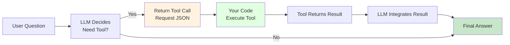
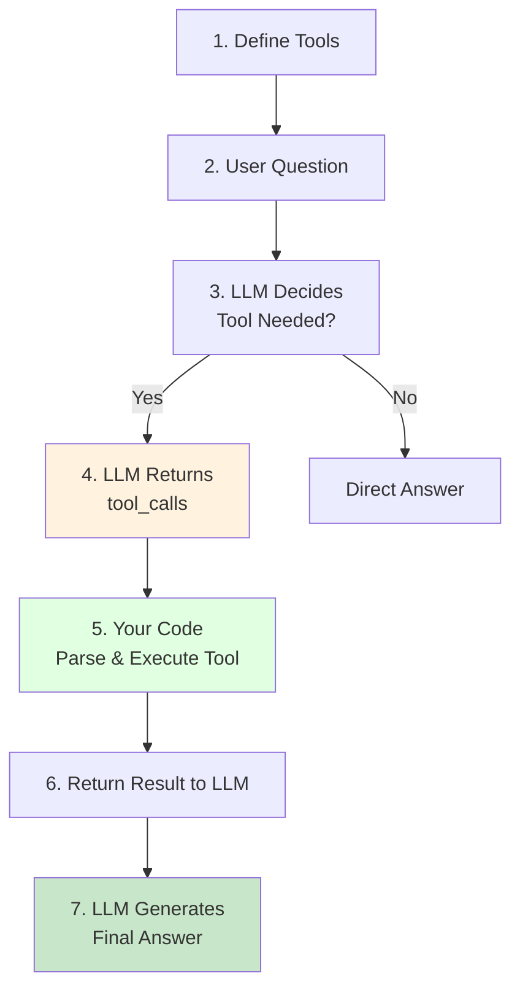

# Chapter 7: Function Calling & Tool Use

> After completing this chapter, you'll be able to: Enable LLMs to call external tools, transforming from "chatting" to "working"



**Chapter Overview:**

- **7.1 Function Calling Fundamentals**: Understand FC workflow, implement weather query example
- **7.2 Tool Use in Practice**: Compare tool calling approaches between OpenAI and Anthropic
- **7.3 Tool Orchestration & Fallback**: Multi-tool composition, automatic selection, failure retry strategies

---

## 7.1 Function Calling Fundamentals <DifficultyBadge level="intermediate" /> <CostBadge cost="$0.01" />

> Prerequisites: 4.3 Structured Outputs

### Why Do We Need It? (Problem)

**Problem: Pure text LLMs cannot "do work"**

Suppose you're building a customer service chatbot, and a user asks:

> "What's the weather like in Beijing today?"

**Using a regular LLM:**

```python
response = client.chat.completions.create(
    model="gpt-4.1-mini",
    messages=[{"role": "user", "content": "What's the weather like in Beijing today?"}]
)
print(response.choices[0].message.content)
```

**AI Reply:**
> "Sorry, I cannot access real-time weather data. Please check a weather website or use a weather app."

**❌ Problem:**
- LLM can only generate text, cannot query databases, call APIs, or send emails
- Its training data has a knowledge cutoff (e.g., GPT-4.1: June 2024, Claude Sonnet 4.6: Jan 2026) — it doesn't know real-time information
- All "work" requirements cannot be fulfilled

**Real-world scenarios require AI to:**
1. Query databases (user orders, inventory)
2. Call external APIs (weather, maps, payments)
3. Perform local operations (file read/write, calculations)
4. Send notifications (email, SMS)

**Function Calling is the solution:** Let the LLM tell you "which tool to call and what parameters to pass", your code executes the tool and returns results, then the LLM integrates them into the final answer.

::: tip Think of It This Way
Function Calling is like giving AI a pair of hands. Before, it could only talk (output text). Now it can actually DO things — check weather, query databases, send emails. It went from "all talk, no action" to "action hero." The AI places an order (JSON), your code plays delivery driver.
:::

### What Is It? (Concept)

**Function Calling is a "collaboration pattern":**

The LLM doesn't directly execute tools, but:
1. Analyzes the user's question
2. Decides whether a tool is needed
3. Generates a JSON request for the tool call
4. Your code executes the tool
5. The tool result is returned to the LLM
6. The LLM generates the final answer

```mermaid
sequenceDiagram
    participant User as User
    participant LLM as LLM
    participant Code as Your Code
    participant Tool as External Tool/API
    
    User->>LLM: "What's the weather in Beijing today?"
    LLM->>LLM: Analysis: Need weather data
    LLM->>Code: tool_call:<br/>{name: "get_weather",<br/>args: {city: "Beijing"}}
    Code->>Tool: Call weather API
    Tool->>Code: Return: {"temp": 15, "desc": "Sunny"}
    Code->>LLM: Tool result: 15°C, Sunny
    LLM->>User: "Beijing weather is sunny today, 15°C,<br/>suitable for outdoor activities."
    
    style LLM fill:#e1f5fe
    style Code fill:#fff3e0
    style Tool fill:#c8e6c9
```

**Core Components:**

| Component | Purpose | Example |
|-----|------|------|
| **Tool Definition** | Describe tool using JSON Schema | Function name, parameters, types, description |
| **Tool Call** | LLM's call request | `{"name": "get_weather", "arguments": {...}}` |
| **Tool Result** | Your code's execution return | `{"temperature": 15, "weather": "sunny"}` |
| **Final Response** | LLM's integrated answer | "Beijing weather is sunny today, 15°C" |

**Tool Definition Format (JSON Schema):**

```python
tools = [
    {
        "type": "function",
        "function": {
            "name": "get_weather",
            "description": "Get real-time weather information for a specified city",
            "parameters": {
                "type": "object",
                "properties": {
                    "city": {
                        "type": "string",
                        "description": "City name, e.g.: Beijing, Shanghai"
                    },
                    "unit": {
                        "type": "string",
                        "enum": ["celsius", "fahrenheit"],
                        "description": "Temperature unit"
                    }
                },
                "required": ["city"],
                "additionalProperties": False
            }
        }
    }
]
```

**Key Fields:**
- `name`: Unique identifier for the tool
- `description`: Describes tool functionality (LLM uses this to decide whether to call)
- `parameters`: Parameter definition in JSON Schema format
- `required`: List of required parameters

**Workflow:**



**Complete Code Example:**

```python
from openai import OpenAI
import json

client = OpenAI()

# 1. Define tools
tools = [
    {
        "type": "function",
        "function": {
            "name": "get_weather",
            "description": "Get real-time weather for a specified city",
            "parameters": {
                "type": "object",
                "properties": {
                    "city": {
                        "type": "string",
                        "description": "City name"
                    }
                },
                "required": ["city"]
            }
        }
    }
]

# 2. Implement tool function (mock)
def get_weather(city: str):
    # In production, call real weather API
    fake_data = {
        "Beijing": {"temperature": 15, "weather": "Sunny"},
        "Shanghai": {"temperature": 22, "weather": "Cloudy"}
    }
    return fake_data.get(city, {"temperature": 20, "weather": "Unknown"})

# 3. First call: LLM decides to call tool
messages = [{"role": "user", "content": "What's the weather like in Beijing today?"}]

response = client.chat.completions.create(
    model="gpt-4.1-mini",
    messages=messages,
    tools=tools,
    tool_choice="auto"  # Auto decide whether to call tool
)

# 4. Check if tool call is needed
message = response.choices[0].message
if message.tool_calls:
    # 5. Execute tool
    tool_call = message.tool_calls[0]
    function_name = tool_call.function.name
    function_args = json.loads(tool_call.function.arguments)
    
    print(f"LLM requests call: {function_name}({function_args})")
    
    # Call local function
    result = get_weather(**function_args)
    print(f"Tool returns: {result}")
    
    # 6. Return result to LLM
    messages.append(message)  # Add LLM's tool call request
    messages.append({
        "role": "tool",
        "tool_call_id": tool_call.id,
        "content": json.dumps(result, ensure_ascii=False)
    })
    
    # 7. LLM generates final answer
    final_response = client.chat.completions.create(
        model="gpt-4.1-mini",
        messages=messages
    )
    
    print(f"Final answer: {final_response.choices[0].message.content}")
else:
    print(f"Direct answer: {message.content}")
```

::: warning Common Pitfall
Forgot to handle the case where `tool_calls` is empty? Congratulations, your Agent will stand there frozen like an actor who forgot their lines. Always check `if message.tool_calls:` before trying to process them.
:::

**Output:**
```
LLM requests call: get_weather({'city': 'Beijing'})
Tool returns: {'temperature': 15, 'weather': 'Sunny'}
Final answer: Beijing weather is sunny today, 15°C, suitable for outdoor activities.
```

**Streaming Response (SSE):**

Function Calling also supports streaming output:

```python
stream = client.chat.completions.create(
    model="gpt-4.1-mini",
    messages=messages,
    tools=tools,
    stream=True
)

for chunk in stream:
    if chunk.choices[0].delta.tool_calls:
        # Stream returns tool call information
        print(chunk.choices[0].delta.tool_calls)
```

### Try It Yourself (Practice)

Complete weather query example with multi-city support and streaming output.

<ColabBadge path="demos/07-function-calling/function_calling.ipynb" />

### Summary (Reflection)

- **What it solves**: Enables LLMs to call external tools, transforming from "chat" to "work"
- **What it doesn't solve**: How do OpenAI and Anthropic's tool calling differ? How to combine multiple tools? — Next section covers this
- **Key Points**:
  1. **Function Calling is a collaboration pattern**: LLM proposes call request, your code executes
  2. **Tool definition uses JSON Schema**: Clearly describe parameter types and descriptions
  3. **Workflow**: User question → LLM returns tool_call → Execute tool → Return result → LLM generates answer
  4. **Supports streaming output**: Real-time tool call information
  5. **Description is important**: LLM uses description to decide whether to call, explain tool functionality clearly
  6. **The AI is the brains, your code is the brawn** — AI decides WHAT to call, you handle the actual execution

> *"Function Calling turned AI from a know-it-all who can't do anything into a know-it-all who can order YOUR code to do things. Progress? Definitely. Terrifying? Slightly."*

---

*Last updated: 2026-02-20*
