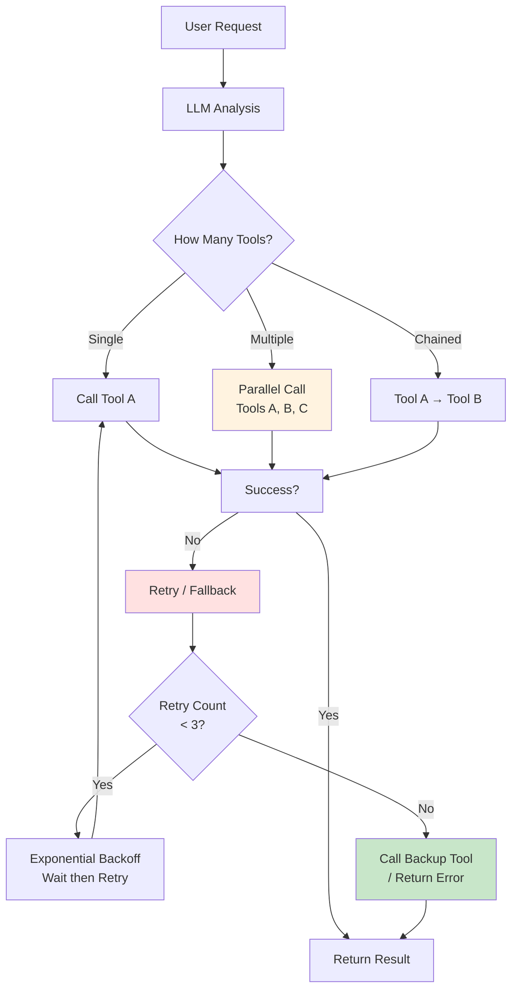

# 7.3 Tool Orchestration & Fallback <DifficultyBadge level="advanced" /> <CostBadge cost="$0.03" />

> Prerequisites: 7.1 Function Calling Fundamentals, 7.2 Tool Use in Practice

### Why Do We Need It? (Problem)

**Problem: Tool calls fail in real-world scenarios**

You've implemented basic tool calling, but in production environments you'll encounter these issues:

**Scenario 1: Tool call fails**

```python
# User: "Check the weather on Mars"
# LLM calls: get_weather(city="Mars")
# Tool returns: {"error": "City not found"}
# ❌ How to let LLM know it failed and give a reasonable response?
```

**Scenario 2: Need to call multiple tools**

```python
# User: "Check the weather in Beijing and Shanghai, tell me which is warmer"
# Need:
# 1. get_weather(city="Beijing")
# 2. get_weather(city="Shanghai")
# 3. Compare results
# ❌ How to orchestrate multiple tool calls?
```

**Scenario 3: Tool timeout or unavailable**

```python
# Primary tool: Weather API (timeout)
# Fallback: Use cached data / call backup API
# ❌ How to implement automatic fallback?
```

**Scenario 4: Wrong tool selection**

```python
# User: "Calculate 2+3"
# LLM incorrectly calls get_weather
# ❌ How to validate tool selection correctness?
```

**This section solves:** Tool orchestration, automatic selection, failure retry, fallback strategies.

### What Is It? (Concept)

**Tool Orchestration is the mechanism for managing multiple tools working together:**



**Core Patterns:**

| Pattern | Description | Use Case |
|-----|------|---------|
| **Sequential** | Tool A → Tool B → Tool C | Later tools depend on earlier results |
| **Parallel** | Call multiple tools simultaneously | Independent query tasks |
| **Conditional** | Decide next step based on results | Multi-step reasoning scenarios |
| **Fallback** | Call backup tool when primary fails | Improve availability |
| **Retry** | Auto-retry on failure (exponential backoff) | Temporary errors |

---

## 1. Tool Chain

**Scenario: Later tools depend on earlier results**

Example: Check weather → Recommend clothing based on weather

```python
from openai import OpenAI
import json
import time

client = OpenAI()

# Define tools
tools = [
    {
        "type": "function",
        "function": {
            "name": "get_weather",
            "description": "Get city weather",
            "parameters": {
                "type": "object",
                "properties": {
                    "city": {"type": "string", "description": "City name"}
                },
                "required": ["city"]
            }
        }
    },
    {
        "type": "function",
        "function": {
            "name": "suggest_clothing",
            "description": "Recommend clothing based on temperature",
            "parameters": {
                "type": "object",
                "properties": {
                    "temperature": {"type": "number", "description": "Temperature (°C)"}
                },
                "required": ["temperature"]
            }
        }
    }
]

# Implement tools
def get_weather(city: str):
    weather_data = {
        "Beijing": {"temperature": 5, "weather": "Sunny"},
        "Shanghai": {"temperature": 18, "weather": "Cloudy"}
    }
    return weather_data.get(city, {"error": "City not found"})

def suggest_clothing(temperature: float):
    if temperature < 10:
        return {"suggestion": "Down jacket, thick coat"}
    elif temperature < 20:
        return {"suggestion": "Sweater, jacket"}
    else:
        return {"suggestion": "T-shirt, short sleeves"}

available_functions = {
    "get_weather": get_weather,
    "suggest_clothing": suggest_clothing
}

# Auto-execute tool chain
def run_tool_chain(user_query: str, max_iterations: int = 5):
    messages = [{"role": "user", "content": user_query}]
    
    for i in range(max_iterations):
        print(f"\n=== Iteration {i+1} ===")
        
        response = client.chat.completions.create(
            model="gpt-4.1-mini",
            messages=messages,
            tools=tools,
            tool_choice="auto"
        )
        
        message = response.choices[0].message
        messages.append(message)
        
        # Check if tool call needed
        if not message.tool_calls:
            print(f"Final answer: {message.content}")
            return message.content
        
        # Execute all tool calls
        for tool_call in message.tool_calls:
            function_name = tool_call.function.name
            function_args = json.loads(tool_call.function.arguments)
            
            print(f"Calling tool: {function_name}({function_args})")
            
            function_to_call = available_functions[function_name]
            result = function_to_call(**function_args)
            
            print(f"Tool returns: {result}")
            
            messages.append({
                "role": "tool",
                "tool_call_id": tool_call.id,
                "content": json.dumps(result, ensure_ascii=False)
            })
    
    return "Max iterations reached"

# Test
run_tool_chain("What's the weather in Beijing today? What should I wear?")
```

**Output:**
```
=== Iteration 1 ===
Calling tool: get_weather({'city': 'Beijing'})
Tool returns: {'temperature': 5, 'weather': 'Sunny'}

=== Iteration 2 ===
Calling tool: suggest_clothing({'temperature': 5})
Tool returns: {'suggestion': 'Down jacket, thick coat'}

=== Iteration 3 ===
Final answer: Beijing weather is sunny today, temperature is 5°C, recommend wearing down jacket or thick coat to stay warm.
```

---

## 2. Parallel Tool Calls

**Scenario: Query weather for multiple cities simultaneously**

Both OpenAI and Anthropic support returning multiple tool calls at once:

```python
from openai import OpenAI
import json

client = OpenAI()

tools = [
    {
        "type": "function",
        "function": {
            "name": "get_weather",
            "description": "Get city weather",
            "parameters": {
                "type": "object",
                "properties": {
                    "city": {"type": "string"}
                },
                "required": ["city"]
            }
        }
    }
]

def get_weather(city: str):
    weather_data = {
        "Beijing": {"temperature": 5, "weather": "Sunny"},
        "Shanghai": {"temperature": 18, "weather": "Cloudy"},
        "Guangzhou": {"temperature": 25, "weather": "Sunny"}
    }
    return weather_data.get(city, {"error": "City not found"})

# User question: involves multiple cities
messages = [{"role": "user", "content": "What's the weather in Beijing, Shanghai, Guangzhou? Which is warmest?"}]

response = client.chat.completions.create(
    model="gpt-4.1-mini",
    messages=messages,
    tools=tools
)

message = response.choices[0].message
messages.append(message)

# LLM will return multiple tool_calls
print(f"LLM called {len(message.tool_calls)} tools")

for tool_call in message.tool_calls:
    function_args = json.loads(tool_call.function.arguments)
    result = get_weather(**function_args)
    
    print(f"get_weather({function_args}) = {result}")
    
    messages.append({
        "role": "tool",
        "tool_call_id": tool_call.id,
        "content": json.dumps(result, ensure_ascii=False)
    })

# Final answer
final_response = client.chat.completions.create(
    model="gpt-4.1-mini",
    messages=messages
)

print(f"\nFinal answer: {final_response.choices[0].message.content}")
```

---

## 3. Error Handling & Fallback

**Scenario: Handling strategy when tool call fails**

```python
from openai import OpenAI
import json
import time
from typing import Dict, Any, Callable

client = OpenAI()

class ToolExecutor:
    """Tool executor with retry and fallback"""
    
    def __init__(self, max_retries: int = 3, backoff_factor: float = 2.0):
        self.max_retries = max_retries
        self.backoff_factor = backoff_factor
    
    def execute_with_retry(
        self, 
        func: Callable, 
        args: Dict[str, Any],
        fallback_func: Callable = None
    ) -> Dict[str, Any]:
        """
        Execute tool with retry and fallback support
        
        Args:
            func: Primary tool function
            args: Arguments
            fallback_func: Backup tool function
        
        Returns:
            Tool execution result
        """
        last_error = None
        
        # Retry primary tool
        for attempt in range(self.max_retries):
            try:
                result = func(**args)
                
                # Check if result contains error
                if isinstance(result, dict) and "error" in result:
                    raise Exception(result["error"])
                
                return {
                    "success": True,
                    "data": result,
                    "attempts": attempt + 1
                }
            
            except Exception as e:
                last_error = e
                wait_time = self.backoff_factor ** attempt
                
                print(f"Tool call failed (attempt {attempt+1}): {e}")
                
                if attempt < self.max_retries - 1:
                    print(f"Waiting {wait_time}s before retry...")
                    time.sleep(wait_time)
        
        # Primary tool failed, try fallback
        if fallback_func:
            print(f"Primary tool failed, switching to backup")
            try:
                result = fallback_func(**args)
                return {
                    "success": True,
                    "data": result,
                    "fallback": True
                }
            except Exception as e:
                print(f"Backup tool also failed: {e}")
        
        # All options failed
        return {
            "success": False,
            "error": str(last_error),
            "attempts": self.max_retries
        }

# Define primary and backup tools
def get_weather_api(city: str):
    """Primary tool: Call real API (simulated)"""
    import random
    
    # Simulate 30% failure rate
    if random.random() < 0.3:
        raise Exception("API timeout")
    
    weather_data = {
        "Beijing": {"temperature": 5, "weather": "Sunny", "source": "API"},
        "Shanghai": {"temperature": 18, "weather": "Cloudy", "source": "API"}
    }
    
    if city not in weather_data:
        raise Exception(f"City {city} not found")
    
    return weather_data[city]

def get_weather_cache(city: str):
    """Backup tool: Use cached data"""
    cache_data = {
        "Beijing": {"temperature": 5, "weather": "Sunny (cached)", "source": "cache"},
        "Shanghai": {"temperature": 18, "weather": "Cloudy (cached)", "source": "cache"}
    }
    
    if city not in cache_data:
        raise Exception(f"No cache data for {city}")
    
    return cache_data[city]

# Test
executor = ToolExecutor(max_retries=3, backoff_factor=1.5)

print("=== Test 1: Normal call ===")
result = executor.execute_with_retry(
    func=get_weather_api,
    args={"city": "Beijing"},
    fallback_func=get_weather_cache
)
print(f"Result: {result}\n")

print("=== Test 2: Non-existent city (will trigger fallback) ===")
result = executor.execute_with_retry(
    func=get_weather_api,
    args={"city": "Mars"},
    fallback_func=get_weather_cache
)
print(f"Result: {result}\n")
```

---

## 4. Smart Tool Selection

**Scenario: Validate whether LLM's tool selection is correct**

```python
from openai import OpenAI
import json
from typing import List, Dict

client = OpenAI()

# Define tools with metadata
tools_with_metadata = [
    {
        "tool": {
            "type": "function",
            "function": {
                "name": "get_weather",
                "description": "Get real-time weather information for a city",
                "parameters": {
                    "type": "object",
                    "properties": {
                        "city": {"type": "string", "description": "City name"}
                    },
                    "required": ["city"]
                }
            }
        },
        "keywords": ["weather", "temperature", "rain", "sunny", "temperature"],
        "required_params": ["city"]
    },
    {
        "tool": {
            "type": "function",
            "function": {
                "name": "calculator",
                "description": "Perform mathematical calculations",
                "parameters": {
                    "type": "object",
                    "properties": {
                        "expression": {"type": "string", "description": "Mathematical expression"}
                    },
                    "required": ["expression"]
                }
            }
        },
        "keywords": ["calculate", "add", "subtract", "multiply", "divide", "equals"],
        "required_params": ["expression"]
    }
]

def validate_tool_call(tool_name: str, args: Dict, user_query: str) -> bool:
    """
    Validate if tool call is reasonable
    
    Returns:
        True: Reasonable
        False: Not reasonable
    """
    # Find tool metadata
    tool_meta = None
    for meta in tools_with_metadata:
        if meta["tool"]["function"]["name"] == tool_name:
            tool_meta = meta
            break
    
    if not tool_meta:
        print(f"Warning: Unknown tool {tool_name}")
        return False
    
    # Check keyword match
    keywords = tool_meta["keywords"]
    query_lower = user_query.lower()
    
    has_keyword = any(kw in query_lower for kw in keywords)
    if not has_keyword:
        print(f"Warning: User query doesn't contain keywords for tool {tool_name}")
        return False
    
    # Check required parameters
    required_params = tool_meta["required_params"]
    missing_params = [p for p in required_params if p not in args]
    
    if missing_params:
        print(f"Warning: Missing required parameters: {missing_params}")
        return False
    
    return True

# Test
user_query = "What's the weather in Beijing?"
messages = [{"role": "user", "content": user_query}]

tools = [meta["tool"] for meta in tools_with_metadata]

response = client.chat.completions.create(
    model="gpt-4.1-mini",
    messages=messages,
    tools=tools
)

message = response.choices[0].message

if message.tool_calls:
    for tool_call in message.tool_calls:
        function_name = tool_call.function.name
        function_args = json.loads(tool_call.function.arguments)
        
        print(f"LLM selected tool: {function_name}({function_args})")
        
        # Validate tool selection
        is_valid = validate_tool_call(function_name, function_args, user_query)
        
        if is_valid:
            print("✅ Tool selection is reasonable")
        else:
            print("❌ Tool selection is unreasonable, refusing execution")
```

---

## 5. Complete Tool Orchestration Framework

**Integrate all features:**

```python
from openai import OpenAI
import json
import time
from typing import List, Dict, Any, Callable, Optional

class ToolOrchestrator:
    """Tool orchestration framework"""
    
    def __init__(
        self, 
        client: OpenAI,
        model: str = "gpt-4o-mini",
        max_iterations: int = 10,
        max_retries: int = 3
    ):
        self.client = client
        self.model = model
        self.max_iterations = max_iterations
        self.max_retries = max_retries
        self.functions: Dict[str, Dict] = {}
    
    def register_tool(
        self, 
        name: str, 
        func: Callable,
        fallback_func: Optional[Callable] = None,
        schema: Dict = None
    ):
        """Register tool"""
        self.functions[name] = {
            "func": func,
            "fallback": fallback_func,
            "schema": schema
        }
    
    def execute_tool(self, name: str, args: Dict[str, Any]) -> Dict[str, Any]:
        """Execute tool (with retry and fallback)"""
        tool_info = self.functions.get(name)
        
        if not tool_info:
            return {"success": False, "error": f"Tool {name} not registered"}
        
        # Retry mechanism
        for attempt in range(self.max_retries):
            try:
                result = tool_info["func"](**args)
                return {"success": True, "data": result}
            
            except Exception as e:
                if attempt < self.max_retries - 1:
                    wait_time = 2 ** attempt
                    print(f"Tool {name} failed, retrying in {wait_time}s")
                    time.sleep(wait_time)
                else:
                    # Try fallback
                    if tool_info["fallback"]:
                        try:
                            result = tool_info["fallback"](**args)
                            return {"success": True, "data": result, "fallback": True}
                        except:
                            pass
                    
                    return {"success": False, "error": str(e)}
    
    def run(self, user_query: str, tools: List[Dict]) -> str:
        """Run tool orchestration"""
        messages = [{"role": "user", "content": user_query}]
        
        for i in range(self.max_iterations):
            response = self.client.chat.completions.create(
                model=self.model,
                messages=messages,
                tools=tools,
                tool_choice="auto"
            )
            
            message = response.choices[0].message
            messages.append(message)
            
            if not message.tool_calls:
                return message.content
            
            # Execute all tools
            for tool_call in message.tool_calls:
                name = tool_call.function.name
                args = json.loads(tool_call.function.arguments)
                
                print(f"[Iteration {i+1}] Calling tool: {name}({args})")
                
                result = self.execute_tool(name, args)
                
                messages.append({
                    "role": "tool",
                    "tool_call_id": tool_call.id,
                    "content": json.dumps(result, ensure_ascii=False)
                })
        
        return "Max iterations reached"

# Usage example
orchestrator = ToolOrchestrator(client=OpenAI())

# Register tools
orchestrator.register_tool(
    name="get_weather",
    func=lambda city: {"temperature": 15, "weather": "Sunny"},
    fallback_func=lambda city: {"temperature": 0, "weather": "Unknown (cached)"}
)

# Run
result = orchestrator.run(
    user_query="What's the weather in Beijing?",
    tools=[...]  # Tool definitions
)
```

### Try It Yourself (Practice)

Complete example: Multi-tool orchestration, auto-retry, fallback strategies.

<ColabBadge path="demos/07-function-calling/orchestration.ipynb" />

### Summary (Reflection)

- **What it solves**: Tool chain orchestration, parallel calls, failure retry, fallback strategies, smart selection
- **What it doesn't solve**: How to handle media types beyond text (images, audio)? — Next chapter introduces Multimodal AI
- **Key Points**:
  1. **Tool chains**: Achieve sequential tool calls through multi-turn conversations
  2. **Parallel calls**: LLM can return multiple tool_calls at once
  3. **Retry mechanism**: Exponential backoff
  4. **Fallback strategy**: Auto-switch to backup tool when primary fails
  5. **Tool validation**: Check if LLM's tool selection is reasonable
  6. **max_iterations prevents infinite loops**: Limit max tool call rounds
  7. **Production recommendations**: Logging, monitoring, timeout control, cost control

---

*Last updated: 2026-02-20*
