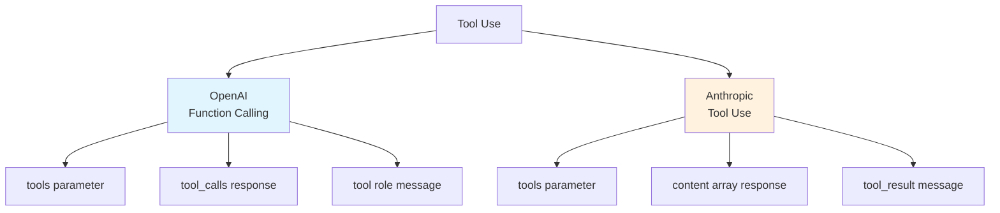

# 7.2 Tool Use in Practice <DifficultyBadge level="intermediate" /> <CostBadge cost="$0.02" />

> Prerequisites: 7.1 Function Calling Fundamentals

### Why Do We Need It? (Problem)

**Problem: Different vendors have different tool calling approaches**

You've mastered OpenAI's Function Calling, but when you try Anthropic's Claude:

```python
# ❌ OpenAI's approach doesn't work on Claude
response = client.messages.create(
    model="claude-3-5-sonnet-20241022",
    tools=tools,  # Claude's format is different!
    # ...
)
```

**Real-world challenges:**
1. **Different API formats**: OpenAI uses `tools`, Anthropic uses `tools` but with different structure
2. **Different response formats**: OpenAI returns `tool_calls`, Anthropic returns `content` array
3. **Parallel calls**: How to call multiple tools in one conversation?
4. **Error handling**: How to handle tool call failures, parameter errors, timeouts?

**This section solves**: Master the two mainstream paradigms (OpenAI and Anthropic), implement unified tool calling interface.

### What Is It? (Concept)

**Two Major Tool Calling Paradigms:**



**Key Differences Comparison:**

| Dimension | OpenAI | Anthropic |
|-----|--------|-----------|
| **Tool Definition** | `tools` list | `tools` list (format slightly different) |
| **Tool Call Control** | `tool_choice` | `tool_choice` |
| **Response Structure** | `message.tool_calls` | `content` array, type `tool_use` |
| **Tool Result Return** | `role: "tool"` | `role: "user"`, `content` contains `tool_result` |
| **Parallel Calls** | Supported, returns multiple `tool_calls` | Supported, returns multiple `tool_use` blocks |
| **Streaming Output** | Supported | Supported |

---

## OpenAI Function Calling Detailed

**Complete Workflow:**

```python
from openai import OpenAI
import json

client = OpenAI()

# 1. Define multiple tools
tools = [
    {
        "type": "function",
        "function": {
            "name": "get_weather",
            "description": "Get weather for a specified city",
            "parameters": {
                "type": "object",
                "properties": {
                    "city": {"type": "string", "description": "City name"}
                },
                "required": ["city"]
            }
        }
    },
    {
        "type": "function",
        "function": {
            "name": "calculator",
            "description": "Perform mathematical calculations",
            "parameters": {
                "type": "object",
                "properties": {
                    "expression": {
                        "type": "string",
                        "description": "Mathematical expression, e.g. '2+3*4'"
                    }
                },
                "required": ["expression"]
            }
        }
    }
]

# 2. Implement tool functions
def get_weather(city: str):
    return {"city": city, "temperature": 15, "weather": "Sunny"}

def calculator(expression: str):
    try:
        result = eval(expression)  # Production: use ast.literal_eval
        return {"expression": expression, "result": result}
    except:
        return {"error": "Calculation error"}

# 3. Tool routing
available_functions = {
    "get_weather": get_weather,
    "calculator": calculator
}

# 4. Call LLM
messages = [{"role": "user", "content": "What's the weather in Beijing? Also calculate 15*7"}]

response = client.chat.completions.create(
    model="gpt-4.1-mini",
    messages=messages,
    tools=tools,
    tool_choice="auto"  # auto | required | none | {"type": "function", "function": {"name": "xxx"}}
)

# 5. Handle tool calls (may be multiple)
message = response.choices[0].message
messages.append(message)

if message.tool_calls:
    for tool_call in message.tool_calls:
        function_name = tool_call.function.name
        function_args = json.loads(tool_call.function.arguments)
        
        print(f"Calling tool: {function_name}({function_args})")
        
        # Execute tool
        function_to_call = available_functions[function_name]
        result = function_to_call(**function_args)
        
        # Add tool result
        messages.append({
            "role": "tool",
            "tool_call_id": tool_call.id,
            "content": json.dumps(result, ensure_ascii=False)
        })

    # 6. LLM generates final answer
    final_response = client.chat.completions.create(
        model="gpt-4.1-mini",
        messages=messages
    )
    
    print(f"\nFinal answer: {final_response.choices[0].message.content}")
```

**tool_choice Parameter Explained:**

| Value | Behavior |
|---|------|
| `"auto"` | LLM auto-decides whether to call tool (default) |
| `"none"` | Force no tool call, text only |
| `"required"` | Force call at least one tool |
| `{"type": "function", "function": {"name": "get_weather"}}` | Force call specific tool |

---

## Anthropic Tool Use Detailed

**Anthropic's Implementation:**

```python
from anthropic import Anthropic
import json

client = Anthropic()

# 1. Define tools (format slightly different)
tools = [
    {
        "name": "get_weather",
        "description": "Get weather information for a specified city",
        "input_schema": {
            "type": "object",
            "properties": {
                "city": {
                    "type": "string",
                    "description": "City name"
                }
            },
            "required": ["city"]
        }
    },
    {
        "name": "calculator",
        "description": "Perform mathematical calculations",
        "input_schema": {
            "type": "object",
            "properties": {
                "expression": {
                    "type": "string",
                    "description": "Mathematical expression"
                }
            },
            "required": ["expression"]
        }
    }
]

# 2. Implement tool functions (same as above)
def get_weather(city: str):
    return {"city": city, "temperature": 15, "weather": "Sunny"}

def calculator(expression: str):
    try:
        return {"result": eval(expression)}
    except:
        return {"error": "Calculation error"}

available_functions = {
    "get_weather": get_weather,
    "calculator": calculator
}

# 3. Call LLM
messages = [{"role": "user", "content": "What's the weather in Beijing? Also calculate 15*7"}]

response = client.messages.create(
    model="claude-3-5-sonnet-20241022",
    max_tokens=1024,
    tools=tools,
    messages=messages
)

# 4. Handle tool calls
print(f"Stop reason: {response.stop_reason}")  # tool_use

# Anthropic's response structure: content is an array
tool_results = []
for content_block in response.content:
    if content_block.type == "tool_use":
        tool_name = content_block.name
        tool_input = content_block.input
        tool_use_id = content_block.id
        
        print(f"Calling tool: {tool_name}({tool_input})")
        
        # Execute tool
        function_to_call = available_functions[tool_name]
        result = function_to_call(**tool_input)
        
        # Collect tool results
        tool_results.append({
            "type": "tool_result",
            "tool_use_id": tool_use_id,
            "content": json.dumps(result, ensure_ascii=False)
        })

# 5. Return tool results to LLM
messages.append({"role": "assistant", "content": response.content})
messages.append({
    "role": "user",
    "content": tool_results
})

final_response = client.messages.create(
    model="claude-3-5-sonnet-20241022",
    max_tokens=1024,
    tools=tools,
    messages=messages
)

print(f"\nFinal answer: {final_response.content[0].text}")
```

**Key Differences:**

1. **Tool Definition**: Anthropic uses `input_schema` instead of `parameters`
2. **Response Structure**: Anthropic's `content` is an array, may contain multiple `tool_use` and `text` blocks
3. **Tool Results**: Anthropic uses `tool_result` type, placed in `user` role message

---

## Unified Tool Calling Interface

**Implement an abstraction layer to hide differences:**

```python
from abc import ABC, abstractmethod
from typing import List, Dict, Any, Callable
import json

class ToolUseAdapter(ABC):
    """Tool calling adapter base class"""
    
    @abstractmethod
    def call_with_tools(self, messages: List[Dict], tools: List[Dict]) -> Any:
        """Call LLM and handle tools"""
        pass
    
    @abstractmethod
    def execute_tools(self, response: Any, functions: Dict[str, Callable]) -> List[Dict]:
        """Execute tools and return results"""
        pass

class OpenAIAdapter(ToolUseAdapter):
    def __init__(self, client):
        self.client = client
    
    def call_with_tools(self, messages: List[Dict], tools: List[Dict]) -> Any:
        return self.client.chat.completions.create(
            model="gpt-4.1-mini",
            messages=messages,
            tools=tools,
            tool_choice="auto"
        )
    
    def execute_tools(self, response: Any, functions: Dict[str, Callable]) -> List[Dict]:
        results = []
        message = response.choices[0].message
        
        if message.tool_calls:
            for tool_call in message.tool_calls:
                func = functions[tool_call.function.name]
                args = json.loads(tool_call.function.arguments)
                result = func(**args)
                
                results.append({
                    "role": "tool",
                    "tool_call_id": tool_call.id,
                    "content": json.dumps(result, ensure_ascii=False)
                })
        
        return results

class AnthropicAdapter(ToolUseAdapter):
    def __init__(self, client):
        self.client = client
    
    def call_with_tools(self, messages: List[Dict], tools: List[Dict]) -> Any:
        return self.client.messages.create(
            model="claude-3-5-sonnet-20241022",
            max_tokens=1024,
            tools=tools,
            messages=messages
        )
    
    def execute_tools(self, response: Any, functions: Dict[str, Callable]) -> List[Dict]:
        results = []
        
        for block in response.content:
            if block.type == "tool_use":
                func = functions[block.name]
                result = func(**block.input)
                
                results.append({
                    "type": "tool_result",
                    "tool_use_id": block.id,
                    "content": json.dumps(result, ensure_ascii=False)
                })
        
        return results

# Use unified interface
def run_with_tools(adapter: ToolUseAdapter, messages: List[Dict], tools: List[Dict], functions: Dict[str, Callable]):
    # First call
    response = adapter.call_with_tools(messages, tools)
    
    # Execute tools
    tool_results = adapter.execute_tools(response, functions)
    
    if tool_results:
        # Return results to LLM
        # (Specific implementation adjusted by different adapters)
        pass
    
    return response
```

### Try It Yourself (Practice)

Complete example: Compare OpenAI and Anthropic tool calling, implement weather + calculator combination.

<ColabBadge path="demos/07-function-calling/tool_use.ipynb" />

### Summary (Reflection)

- **What it solves**: Master OpenAI and Anthropic's two tool calling paradigms, handle parallel tool calls
- **What it doesn't solve**: How to orchestrate multiple tools? What to do when calls fail? — Next section covers this
- **Key Points**:
  1. **OpenAI uses `tool_calls`**, Anthropic uses `content` array
  2. **Tool definition formats slightly different**: OpenAI uses `parameters`, Anthropic uses `input_schema`
  3. **Parallel calls**: Both support returning multiple tool calls at once
  4. **Unified interface**: Use adapter pattern to hide differences
  5. **tool_choice controls calling strategy**: auto / required / none / specific tool

---

*Last updated: 2026-02-20*
