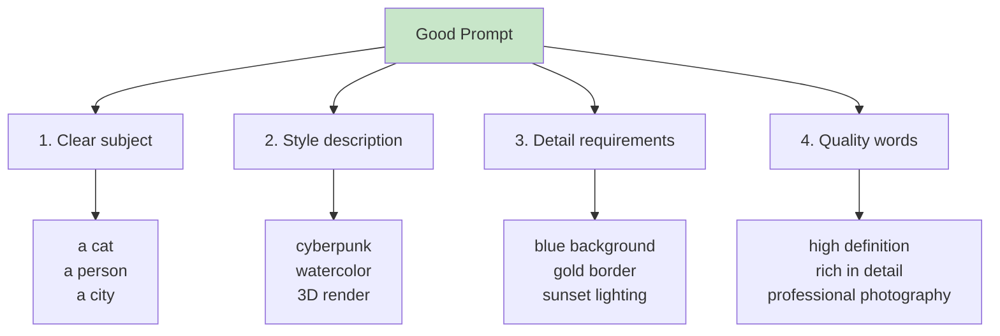

# 8.2 Image Generation <DifficultyBadge level="intermediate" /> <CostBadge cost="$0.04" />

> Prerequisites: 8.1 Vision (Image Understanding)

### Why Do We Need It? (Problem)

**Problem: Need images but no designer**

Real-world scenarios:

**Scenario 1: Content Creation**

> "I'm writing a tech blog and need an illustration: a developer coding at a computer, cyberpunk style"

**Traditional Methods:**
1. Find a designer to communicate requirements (high cost, long cycle)
2. Search stock image websites (copyright issues, not fitting enough)
3. Use Photoshop yourself (high technical barrier)

**Scenario 2: Product Design**

> "Help me design a minimalist logo themed 'AI-driven education'"

**Scenario 3: Advertising Materials**

> "Generate a promotional poster for Double 11 sale, tech style, 3D rendering"

**Scenario 4: UI Prototype**

> "Generate a mobile app login page, dark theme, with email and password input fields"

**AI image generation solves these problems**, letting you describe needs in natural language and have AI generate images in seconds.

### What Is It? (Concept)

**Image Generation is "text-to-image" AI technology**, describing scenes in natural language and having AI generate corresponding images.

**Popular Image Generation Models:**

| Model | Company | Price | Features | Use Cases |
|-----|------|------|------|---------|
| **DALL-E 3** | OpenAI | $0.04/image (1024x1024)<br/>$0.08/image (1024x1792) | High quality, understands complex prompts | Commercial design, content creation |
| **DALL-E 2** | OpenAI | $0.02/image (1024x1024) | Cost-effective, fast | Rapid prototyping, sketches |
| **Stable Diffusion** | Stability AI | Open source free (self-hosted)<br/>API $0.002/image | Highly controllable, many styles | Artistic creation, customization |
| **Midjourney** | Midjourney | $10/month (200 images) | Artistic, art styles | Illustration, concept design |
| **Imagen** | Google | Not yet public | Photo-realistic | Commercial ads, product images |

::: tip DALL-E 3 vs Stable Diffusion
- **DALL-E 3**: Foolproof, simple prompts produce good images, but more expensive
- **Stable Diffusion**: Requires learning prompt techniques, but allows fine control, open source and free
:::

**DALL-E 3 Workflow:**

```mermaid
sequenceDiagram
    participant User as "User"
    participant App as "Your Application"
    participant API as "DALL-E API"
    
    User->>App: Text description<br/>"a cat programming"
    App->>API: Send generation request<br/>prompt + size + quality
    API->>API: Text understanding<br/>Image generation
    API->>App: Return image URL
    App->>App: Download image (optional)
    App->>User: Display image
    
    style API fill:#fff3e0
```

**Basic Code Example:**

```python
from openai import OpenAI

client = OpenAI()

response = client.images.generate(
    model="dall-e-3",
    prompt="An orange cat coding, cyberpunk style, high definition, rich in detail",
    size="1024x1024",  # 1024x1024 | 1024x1792 | 1792x1024
    quality="standard",  # standard | hd
    n=1  # Number of images to generate (DALL-E 3 only supports 1)
)

image_url = response.data[0].url
print(f"Image URL: {image_url}")
```

**Parameter Details:**

| Parameter | Description | Options |
|-----|------|--------|
| `model` | Model version | `dall-e-3` | `dall-e-2` |
| `prompt` | Text description (English works better) | Max 4000 characters |
| `size` | Image size | `1024x1024` (square)<br/>`1024x1792` (portrait)<br/>`1792x1024` (landscape) |
| `quality` | Image quality | `standard` (standard, faster)<br/>`hd` (high-definition, 2x price) |
| `style` | Art style | `vivid` (vivid, default)<br/>`natural` (natural) |
| `n` | Generation count | DALL-E 3: 1<br/>DALL-E 2: 1-10 |

**Prompt Writing Techniques:**



**Prompt Formula:**

```
[Subject] + [Action/State] + [Style] + [Environment/Background] + [Details] + [Quality Words]
```

**Examples:**

| Scenario | Prompt | Breakdown |
|-----|--------|------|
| **Tech Blog Illustration** | `A developer coding on laptop, cyberpunk style, neon lights, dark room, high quality, digital art` | Subject: developer<br/>Action: coding<br/>Style: cyberpunk<br/>Environment: dark room, neon lights<br/>Quality: high definition, digital art |
| **Product Logo** | `Minimalist logo design for AI education, blue and white, geometric shapes, modern, professional` | Subject: logo<br/>Style: minimalist<br/>Color: blue and white<br/>Elements: geometric shapes<br/>Quality: modern, professional |
| **UI Prototype** | `Mobile app login screen, dark theme, email and password input fields, rounded buttons, gradient background, modern UI design` | Subject: login page<br/>Platform: mobile app<br/>Theme: dark<br/>Elements: email, password, rounded buttons<br/>Style: modern UI |

::: warning Content Policy
DALL-E 3 will refuse to generate:
- Violent, gory, pornographic content
- Real public figures
- Copyright-protected characters (e.g., Disney characters)
- Misleading, fraudulent content

Violating requests will return error: `content_policy_violation`
:::

**Image Editing (DALL-E 2):**

DALL-E 2 supports image editing and variation generation:

```python
from openai import OpenAI

client = OpenAI()

# Image editing (requires original + mask)
response = client.images.edit(
    model="dall-e-2",
    image=open("original.png", "rb"),
    mask=open("mask.png", "rb"),  # White areas will be regenerated
    prompt="Add a cat in the white area",
    n=1,
    size="1024x1024"
)

# Image variation (generate similar images based on original)
response = client.images.create_variation(
    model="dall-e-2",
    image=open("original.png", "rb"),
    n=2,  # Generate 2 variations
    size="1024x1024"
)
```

**Image URL vs Base64:**

API returns image URL by default (expires after 1 hour), can also return base64:

```python
response = client.images.generate(
    model="dall-e-3",
    prompt="a cat",
    response_format="b64_json"  # url | b64_json
)

import base64
image_base64 = response.data[0].b64_json

# Save to local
with open("cat.png", "wb") as f:
    f.write(base64.b64decode(image_base64))
```

### Try It Out (Practice)

**Experiment 1: Basic Image Generation**

```python
from openai import OpenAI
import requests
from PIL import Image
from io import BytesIO

client = OpenAI()

# Generate image
response = client.images.generate(
    model="dall-e-3",
    prompt="A futuristic city with flying cars, neon lights, cyberpunk style, high quality, digital art",
    size="1024x1024",
    quality="standard",
    n=1
)

image_url = response.data[0].url
print(f"Image URL: {image_url}")

# Download and display image
image_response = requests.get(image_url)
img = Image.open(BytesIO(image_response.content))
img.show()

# Save to local
img.save("generated_city.png")
```

**Experiment 2: Batch Generation (DALL-E 2)**

```python
from openai import OpenAI

client = OpenAI()

# DALL-E 2 supports generating multiple images at once
response = client.images.generate(
    model="dall-e-2",
    prompt="A cute robot mascot, friendly, colorful, 3D render",
    n=4,  # Generate 4 images
    size="512x512"
)

for i, image_data in enumerate(response.data):
    print(f"Image {i+1}: {image_data.url}")
```

**Experiment 3: Different Style Comparison**

```python
from openai import OpenAI

client = OpenAI()

prompt_base = "A mountain landscape at sunset"

styles = [
    "photorealistic, professional photography",
    "oil painting, impressionist style",
    "watercolor, soft colors",
    "digital art, cyberpunk style",
    "3D render, unreal engine"
]

for style in styles:
    full_prompt = f"{prompt_base}, {style}"
    
    response = client.images.generate(
        model="dall-e-3",
        prompt=full_prompt,
        size="1024x1024"
    )
    
    print(f"{style}:")
    print(f"  URL: {response.data[0].url}")
    print(f"  Revised Prompt: {response.data[0].revised_prompt}\n")
```

::: tip DALL-E 3 Revises Prompts
DALL-E 3 automatically optimizes your prompt, adding more details. Check `revised_prompt` to learn how to write better prompts.
:::

**Experiment 4: HD vs Standard Quality**

```python
from openai import OpenAI

client = OpenAI()

prompt = "A detailed portrait of a robot, professional photography, studio lighting"

# Standard quality
response_standard = client.images.generate(
    model="dall-e-3",
    prompt=prompt,
    quality="standard"  # $0.04
)

# HD quality
response_hd = client.images.generate(
    model="dall-e-3",
    prompt=prompt,
    quality="hd"  # $0.08
)

print("Standard quality:", response_standard.data[0].url)
print("HD quality:", response_hd.data[0].url)
```

**Experiment 5: Image Editing (DALL-E 2)**

```python
from openai import OpenAI
from PIL import Image
import io

client = OpenAI()

# Create a simple original and mask (demo)
# In actual use, you should use real images

# Generate original
original_response = client.images.generate(
    model="dall-e-2",
    prompt="A living room with a sofa",
    size="1024x1024"
)

# Download original
import requests
original_img = requests.get(original_response.data[0].url).content

# Create mask (white parts will be regenerated)
# Mask creation process omitted here, use image editing software in practice

# Edit image
response = client.images.edit(
    model="dall-e-2",
    image=original_img,
    # mask=mask_img,  # Need to provide mask
    prompt="Add a cat next to the sofa",
    n=1,
    size="1024x1024"
)

print("Edited image:", response.data[0].url)
```

**Experiment 6: Save Image to Local**

```python
from openai import OpenAI
import requests
from pathlib import Path

client = OpenAI()

def generate_and_save(prompt: str, filename: str):
    """Generate image and save to local"""
    response = client.images.generate(
        model="dall-e-3",
        prompt=prompt,
        size="1024x1024"
    )
    
    image_url = response.data[0].url
    
    # Download image
    image_data = requests.get(image_url).content
    
    # Save to local
    output_path = Path(filename)
    output_path.parent.mkdir(parents=True, exist_ok=True)
    
    with open(output_path, "wb") as f:
        f.write(image_data)
    
    print(f"Image saved to: {output_path}")
    return output_path

# Test
generate_and_save(
    prompt="A modern office space with plants, natural light, minimalist design",
    filename="output/office.png"
)
```

<ColabBadge path="demos/08-multimodal/image_generation.ipynb" />

### Summary (Reflection)

- **What it solves**: Generate images from natural language, no designer or Photoshop skills needed
- **What it doesn't solve**: Only visual, no sound—next section covers speech processing
- **Key Takeaways**:
  1. **DALL-E 3 highest quality**: Understands complex prompts, but more expensive ($0.04/image)
  2. **Prompt formula**: Subject + action + style + environment + details + quality words
  3. **English prompts work better**: Model training data is primarily English
  4. **DALL-E 3 auto-optimizes prompts**: Check `revised_prompt` to learn techniques
  5. **Image URLs expire after 1 hour**: Download locally for long-term storage
  6. **Content policy restrictions**: Cannot generate violent, sexual, celebrity content
  7. **DALL-E 2 supports editing and variations**: Can modify existing images

---

*Last updated: 2026-02-20*
