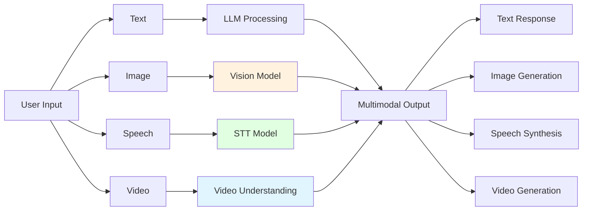
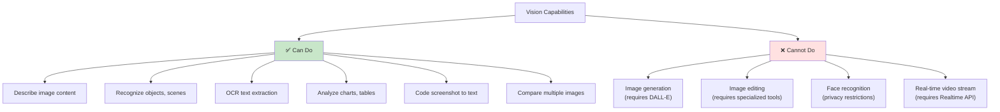

# Chapter 8: Multimodal AI

> After completing this chapter, you will be able to: Use AI to process various media types including images, speech, and video



**Chapter Navigation:**

- **8.1 Vision (Image Understanding)**: Use GPT-5/Claude Sonnet 4.6 to analyze images, OCR, and screenshot understanding
- **8.2 Image Generation**: Generate images with DALL-E and other tools
- **8.3 Speech & Audio**: Whisper speech-to-text, TTS text-to-speech
- **8.4 Video & Realtime**: Video understanding (Gemini 3), real-time voice conversations

---

## 8.1 Vision (Image Understanding) <DifficultyBadge level="intermediate" /> <CostBadge cost="$0.02" />

> Prerequisites: 3.1 Tokens and Tokenization

### Why Do We Need It? (Problem)

**Problem: Pure text LLMs cannot "see" images**

In real-world scenarios, users frequently send images:

**Scenario 1: User sends a screenshot**

> "What does this error mean? How do I fix it?"  
> [Attachment: error_screenshot.png]

**Using pure text LLM:**

```python
response = client.chat.completions.create(
    model="gpt-4.1-mini",
    messages=[{"role": "user", "content": "What does this error mean?"}]
)
```

**❌ Problem:**
- LLM cannot see the image content
- Users need to manually type descriptions, which is inefficient and prone to missing information

**Scenario 2: Product design review**

> "Please review this UI design for issues"  
> [Attachment: ui_design.png]

**Scenario 3: Document OCR**

> "Extract the amount, date, and items from this invoice"  
> [Attachment: invoice.jpg]

**Scenario 4: Data chart analysis**

> "What does this trend chart indicate?"  
> [Attachment: sales_chart.png]

**Vision models solve these problems**, enabling AI to:
1. Understand image content (object recognition, scene understanding)
2. Extract text (OCR)
3. Analyze charts and tables
4. Answer questions about images

### What Is It? (Concept)

**Vision is the "visual capability" of multimodal LLMs**, capable of receiving images as input and understanding their content.

**Popular Vision Models:**

| Model | Capabilities | Price (per 1M tokens) | Use Cases |
|-----|------|-------------------|---------|
| **GPT-5** | Image understanding, OCR, chart analysis, unified multimodal | Input $1.25 / Output $10.00 | General image understanding |
| **GPT-4.1-mini** | Basic image understanding | Input $0.40 / Output $1.60 | Simple image tasks |
| **Claude Sonnet 4.6** | Image understanding, code screenshots, 1M context | Input $3.00 / Output $15.00 | Technical docs, code |
| **Gemini 2.5 Flash** | Image, video, long documents | Input $0.30 / Output $2.50 | Multi-frame images, video |

::: tip How are images billed?
Vision models charge for images based on "image resolution" converted to tokens:
- Low resolution (below 512x512): ~85 tokens
- High resolution (2048x2048): ~765 tokens
- Detail mode: Splits images into multiple 512x512 chunks, 170 tokens each

Example: A 1024x1024 image ≈ 255 tokens
:::

**Vision API Workflow:**

```mermaid
sequenceDiagram
    participant User as "User"
    participant App as "Your Application"
    participant API as "Vision API"
    
    User->>App: Upload image + text question
    App->>App: Encode image to base64<br/>or provide URL
    App->>API: Send request:<br/>messages=[{<br/> "role": "user",<br/> "content": [<br/>  {"type": "text", "text": "..."},<br/>  {"type": "image_url", "image_url": "..."}]<br/>}]
    API->>API: Image understanding
    API->>App: Return analysis result
    App->>User: Display response
    
    style API fill:#fff3e0
```

**Two Ways to Send Images:**

| Method | Description | Advantages | Disadvantages |
|-----|------|------|------|
| **URL** | Provide public image URL | Simple, doesn't bloat request size | Image must be publicly accessible |
| **Base64** | Encode image as base64 string | Supports local/private images | Large request size |

**Basic Code Example (URL Method):**

```python
from openai import OpenAI

client = OpenAI()

response = client.chat.completions.create(
    model="gpt-4.1-mini",
    messages=[
        {
            "role": "user",
            "content": [
                {
                    "type": "text",
                    "text": "What is in this image?"
                },
                {
                    "type": "image_url",
                    "image_url": {
                        "url": "https://example.com/image.jpg"
                    }
                }
            ]
        }
    ],
    max_tokens=300
)

print(response.choices[0].message.content)
```

**Base64 Method:**

```python
import base64
from openai import OpenAI

client = OpenAI()

# Read and encode local image
def encode_image(image_path):
    with open(image_path, "rb") as image_file:
        return base64.b64encode(image_file.read()).decode("utf-8")

image_base64 = encode_image("path/to/image.jpg")

response = client.chat.completions.create(
    model="gpt-4.1-mini",
    messages=[
        {
            "role": "user",
            "content": [
                {"type": "text", "text": "Analyze this image"},
                {
                    "type": "image_url",
                    "image_url": {
                        "url": f"data:image/jpeg;base64,{image_base64}"
                    }
                }
            ]
        }
    ],
    max_tokens=300
)

print(response.choices[0].message.content)
```

**Vision Model Capabilities Boundary:**



::: warning Common Pitfall
Sending a 4K screenshot to a Vision API without compression? That's 3000+ tokens for a single image. Your wallet felt that. Always use `detail: "low"` for quick checks and `detail: "high"` only when you actually need pixel-level analysis.
:::

**Common Application Scenarios:**

| Scenario | Input | Output | Example |
|-----|------|------|------|
| **Technical Support** | Error screenshot | Problem diagnosis + solution | "This is a database connection error, check connection string" |
| **Document OCR** | Invoice, receipt image | Structured data (JSON) | `{"amount": 128.5, "date": "2026-02-20"}` |
| **UI Review** | UI design image | Design suggestions | "Button contrast insufficient, recommend darker color" |
| **Chart Analysis** | Data trend chart | Trend interpretation | "Sales increased 35% in Q4" |
| **Educational Assistance** | Math problem photo | Solution steps | "This is a quadratic equation, first transpose..." |

### Try It Out (Practice)

**Experiment 1: Basic Image Understanding**

```python
from openai import OpenAI

client = OpenAI()

# Test image URL (replace with your own image)
image_url = "https://upload.wikimedia.org/wikipedia/commons/thumb/d/dd/Gfp-wisconsin-madison-the-nature-boardwalk.jpg/2560px-Gfp-wisconsin-madison-the-nature-boardwalk.jpg"

response = client.chat.completions.create(
    model="gpt-4.1-mini",
    messages=[
        {
            "role": "user",
            "content": [
                {"type": "text", "text": "Please describe this image in detail, including the scene, colors, and atmosphere."},
                {"type": "image_url", "image_url": {"url": image_url}}
            ]
        }
    ],
    max_tokens=500
)

print(response.choices[0].message.content)
```

**Experiment 2: OCR Text Extraction**

```python
from openai import OpenAI
import base64

client = OpenAI()

def encode_image(image_path):
    with open(image_path, "rb") as f:
        return base64.b64encode(f.read()).decode("utf-8")

# Assume you have an image with text
image_base64 = encode_image("screenshot.png")

response = client.chat.completions.create(
    model="gpt-4.1-mini",
    messages=[
        {
            "role": "user",
            "content": [
                {"type": "text", "text": "Extract all text from the image, maintaining the original format."},
                {
                    "type": "image_url",
                    "image_url": {"url": f"data:image/png;base64,{image_base64}"}
                }
            ]
        }
    ],
    max_tokens=1000
)

print(response.choices[0].message.content)
```

**Experiment 3: Code Screenshot Understanding**

```python
from openai import OpenAI

client = OpenAI()

# Code screenshot URL
code_screenshot_url = "https://example.com/code_screenshot.png"

response = client.chat.completions.create(
    model="gpt-4.1",  # Recommend GPT-4.1 for code
    messages=[
        {
            "role": "user",
            "content": [
                {
                    "type": "text",
                    "text": "What problems exist in this code? How can it be optimized?"
                },
                {"type": "image_url", "image_url": {"url": code_screenshot_url}}
            ]
        }
    ],
    max_tokens=800
)

print(response.choices[0].message.content)
```

**Experiment 4: Multiple Image Comparison**

```python
from openai import OpenAI

client = OpenAI()

response = client.chat.completions.create(
    model="gpt-4.1-mini",
    messages=[
        {
            "role": "user",
            "content": [
                {"type": "text", "text": "Compare the differences between these two images:"},
                {"type": "image_url", "image_url": {"url": "https://example.com/image1.jpg"}},
                {"type": "image_url", "image_url": {"url": "https://example.com/image2.jpg"}},
            ]
        }
    ],
    max_tokens=500
)

print(response.choices[0].message.content)
```

**Experiment 5: Structured Data Extraction**

```python
from openai import OpenAI
import json

client = OpenAI()

# Invoice image
invoice_url = "https://example.com/invoice.jpg"

response = client.chat.completions.create(
    model="gpt-4.1-mini",
    messages=[
        {
            "role": "user",
            "content": [
                {
                    "type": "text",
                    "text": """Extract invoice information and return in JSON format:
{
  "invoice_number": "invoice number",
  "date": "date",
  "amount": amount,
  "items": [{"name": "item name", "price": price}]
}"""
                },
                {"type": "image_url", "image_url": {"url": invoice_url}}
            ]
        }
    ],
    response_format={"type": "json_object"}  # Force JSON output
)

data = json.loads(response.choices[0].message.content)
print(json.dumps(data, indent=2, ensure_ascii=False))
```

**Experiment 6: Image Detail Control**

```python
from openai import OpenAI

client = OpenAI()

image_url = "https://example.com/detailed_image.jpg"

# Low detail mode (faster, cheaper)
response_low = client.chat.completions.create(
    model="gpt-4.1-mini",
    messages=[
        {
            "role": "user",
            "content": [
                {"type": "text", "text": "What is this?"},
                {
                    "type": "image_url",
                    "image_url": {
                        "url": image_url,
                        "detail": "low"  # low | high | auto
                    }
                }
            ]
        }
    ]
)

# High detail mode (more accurate, more expensive)
response_high = client.chat.completions.create(
    model="gpt-4.1-mini",
    messages=[
        {
            "role": "user",
            "content": [
                {"type": "text", "text": "Describe all details in the image"},
                {
                    "type": "image_url",
                    "image_url": {
                        "url": image_url,
                        "detail": "high"
                    }
                }
            ]
        }
    ]
)

print("Low detail:", response_low.choices[0].message.content)
print("\nHigh detail:", response_high.choices[0].message.content)
```

<ColabBadge path="demos/08-multimodal/vision.ipynb" />

### Summary (Reflection)

- **What it solves**: Enables AI to understand images, supports OCR, chart analysis, and multi-image comparison
- **What it doesn't solve**: Can only "read" images, not "generate" them—next section covers image generation
- **Key Takeaways**:
  1. **Vision models can "see" images**: GPT-5, Claude Sonnet 4.6, Gemini 2.5 Flash
  2. **Two input methods**: URL (public images) or Base64 (local images)
  3. **Image billing based on resolution**: High-resolution images consume more tokens
  4. **detail parameter controls precision**: low (fast) vs high (accurate)
  5. **Supports multiple images**: Can send multiple images in one request for comparison
  6. **Combine with JSON Mode**: Extract structured data (invoices, tables)
  7. **Video understanding**: Gemini 3 natively supports video input for temporal analysis (e.g., activity recognition, video summarization)
  8. **GPT-5 unified multimodal**: Routes queries to the best-suited model component automatically

---

*Last updated: 2026-02-20*
