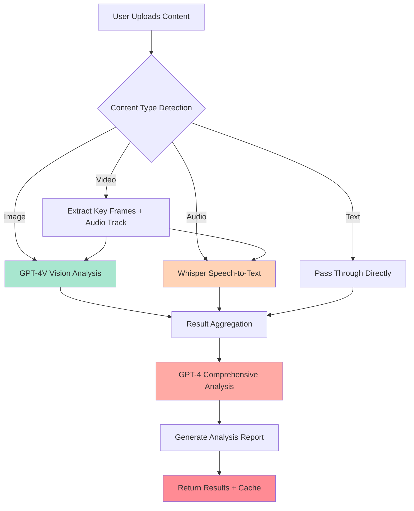

---
prev:
  text: '8.4 Video & Realtime'
  link: '/08-multimodal/video-realtime'
next:
  text: '9.1 Agent Core Concepts'
  link: '/09-ai-agents/'
---

# 8.5 Multimodal Application Practice

## Ready? Time to Build Something Real

In the previous sections, we learned about images, audio, video—like learning martial arts: learned punches, learned kicks, learned internal energy cultivation. But as the master says: **Practice without sparring equals wasted effort.**

Today we're going to string these skills together and build a truly usable multimodal content analysis pipeline. It's like opening a restaurant—knowing how to cook individual dishes (single APIs) is one thing, being able to run a restaurant and serve customers (complete application) is another.

Imagine this scenario: You're a content moderator processing massive amounts of user-uploaded content daily—images, audio, videos. The boss says: "Use AI to automatically analyze this content, extract key information, flag potential issues." This is the problem we're solving today.

::: tip Why Build a Multimodal Pipeline?
Because real-world data is **never in a single format**. Users don't just send text or just images. They send:
- Product intro videos with voiceovers
- Social media posts with images and text
- Podcast episodes with audio + images

If your AI system can only handle one type, it's like only knowing chopsticks but not knife and fork—awkward when you go abroad.
:::

## Project Architecture: What Are We Building?

We're building a **Multimodal Content Analysis Pipeline** that can:

1. **Accept Multiple Inputs**: Images, audio, videos, text
2. **Process Separately**: Use the most suitable AI model for each data type
3. **Comprehensive Analysis**: Aggregate all results, generate an intelligent report

Like a medical checkup center: blood tests, X-rays, blood pressure measurements happen separately, then a doctor synthesizes all results to give you a report.

### Architecture Diagram



The brilliance of this architecture lies in: **Decoupling + Aggregation**. Each model focuses on what it does best, then a "brain" integrates all information.

## Step 1: Analyze Images with GPT-4V

First, we need a function to process images. Suppose a user uploads a product image, we want to extract:
- Object recognition (what is this?)
- Scene understanding (where was it taken?)
- Potential issues (any inappropriate content?)

```python
import openai
from pathlib import Path
import base64

def analyze_image(image_path: str) -> dict:
    """
    Analyze image content using GPT-4V
    
    Like giving AI eyes to tell you what's in the image
    """
    # Read image and convert to base64
    with open(image_path, "rb") as image_file:
        image_data = base64.b64encode(image_file.read()).decode("utf-8")
    
    # Determine image format
    suffix = Path(image_path).suffix.lower()
    mime_type = {
        ".jpg": "image/jpeg",
        ".jpeg": "image/jpeg", 
        ".png": "image/png",
        ".gif": "image/gif",
        ".webp": "image/webp"
    }.get(suffix, "image/jpeg")
    
    response = openai.chat.completions.create(
        model="gpt-4o",  # or gpt-4-turbo
        messages=[
            {
                "role": "user",
                "content": [
                    {
                        "type": "text",
                        "text": """Please analyze this image in detail, including:
                        1. Main content (people/objects/scenes)
                        2. Visual style (color tone, composition, atmosphere)
                        3. Potential issues (violence, pornography, prohibited items, etc.)
                        4. Emotional tone (positive/negative/neutral)
                        
                        Please return results in JSON format."""
                    },
                    {
                        "type": "image_url",
                        "image_url": {
                            "url": f"data:{mime_type};base64,{image_data}"
                        }
                    }
                ]
            }
        ],
        max_tokens=500
    )
    
    result = response.choices[0].message.content
    
    return {
        "type": "image",
        "analysis": result,
        "tokens_used": response.usage.total_tokens
    }
```

::: warning Note Image Size
GPT-4V has image size limits (usually within 20MB). If the image is too large, remember to compress first:

```python
from PIL import Image

def compress_image(input_path: str, max_size_mb: float = 5.0):
    img = Image.open(input_path)
    
    # If image is too large, scale proportionally
    max_dimension = 2048
    if max(img.size) > max_dimension:
        img.thumbnail((max_dimension, max_dimension), Image.Resampling.LANCZOS)
    
    # Save as compressed JPEG
    output_path = input_path.replace(Path(input_path).suffix, "_compressed.jpg")
    img.save(output_path, "JPEG", quality=85, optimize=True)
    
    return output_path
```
:::

## Step 2: Transcribe Audio with Whisper

Next, handle audio. Users might upload voice messages, podcast clips, or video audio tracks.

```python
def transcribe_audio(audio_path: str) -> dict:
    """
    Convert audio to text using Whisper
    
    Like giving AI ears to understand what's being said
    """
    with open(audio_path, "rb") as audio_file:
        transcript = openai.audio.transcriptions.create(
            model="whisper-1",
            file=audio_file,
            response_format="verbose_json",  # Get more metadata
            language="zh"  # Specify Chinese to improve accuracy
        )
    
    # Whisper's verbose_json returns segment info and timestamps
    return {
        "type": "audio",
        "text": transcript.text,
        "language": transcript.language,
        "duration": transcript.duration,
        "segments": transcript.segments if hasattr(transcript, 'segments') else []
    }
```

::: tip Whisper Tips
If audio is very long (>25MB), need to split first:

```python
from pydub import AudioSegment

def split_audio(audio_path: str, chunk_length_ms: int = 600000):  # 10 minutes
    audio = AudioSegment.from_file(audio_path)
    chunks = []
    
    for i in range(0, len(audio), chunk_length_ms):
        chunk = audio[i:i + chunk_length_ms]
        chunk_path = f"/tmp/chunk_{i//chunk_length_ms}.mp3"
        chunk.export(chunk_path, format="mp3")
        chunks.append(chunk_path)
    
    return chunks
```
:::

## Step 3: Comprehensive Analysis—Summon the Ultimate Brain

Now we have image analysis results and audio transcript text, time to feed them to a "comprehensive analysis brain."

```python
def comprehensive_analysis(image_result: dict, audio_result: dict, text_input: str = "") -> dict:
    """
    Use GPT-4 for comprehensive analysis of all modality results
    
    Like giving all test reports to a doctor for final diagnosis
    """
    # Build prompt, integrate all information
    prompt = f"""You are a professional content analyst. There is multimodal content that needs comprehensive analysis:

【Image Analysis Results】
{image_result.get('analysis', 'No image')}

【Audio Transcript Text】
{audio_result.get('text', 'No audio')}

【Additional Text Content】
{text_input if text_input else 'No additional text'}

Please synthesize all the above information and generate a structured analysis report, including:
1. **Content Summary** (within 50 words)
2. **Key Themes**
3. **Emotional Tone** (positive/negative/neutral, with reasoning)
4. **Risk Assessment** (contains inappropriate content, risk level: low/medium/high)
5. **Suggested Tags** (3-5 keywords)
6. **Processing Recommendation** (approve/needs manual review/reject)

Please return in JSON format."""
    
    response = openai.chat.completions.create(
        model="gpt-4o",
        messages=[
            {"role": "system", "content": "You are a professional content moderation and analysis expert."},
            {"role": "user", "content": prompt}
        ],
        temperature=0.3,  # Lower temperature for more stable analysis
        response_format={"type": "json_object"}
    )
    
    return {
        "final_report": response.choices[0].message.content,
        "total_tokens": (
            image_result.get('tokens_used', 0) + 
            response.usage.total_tokens
        )
    }
```

## Complete Pipeline Code

Now let's assemble all steps:

```python
import openai
import json
from pathlib import Path
from typing import Optional
import logging

# Configure logging
logging.basicConfig(level=logging.INFO)
logger = logging.getLogger(__name__)

class MultimodalPipeline:
    """
    Multimodal content analysis pipeline
    
    Usage:
        pipeline = MultimodalPipeline(api_key="your-key")
        result = pipeline.process(
            image_path="photo.jpg",
            audio_path="audio.mp3",
            text="User review text"
        )
    """
    
    def __init__(self, api_key: str):
        openai.api_key = api_key
        self.results = {}
    
    def process(
        self,
        image_path: Optional[str] = None,
        audio_path: Optional[str] = None,
        text: Optional[str] = None
    ) -> dict:
        """
        Process multimodal input, return comprehensive analysis results
        """
        logger.info("🚀 Starting multimodal analysis pipeline")
        
        # Step 1: Process image
        if image_path and Path(image_path).exists():
            logger.info(f"📸 Analyzing image: {image_path}")
            self.results['image'] = analyze_image(image_path)
        else:
            self.results['image'] = {"type": "image", "analysis": "No image input"}
        
        # Step 2: Process audio
        if audio_path and Path(audio_path).exists():
            logger.info(f"🎵 Transcribing audio: {audio_path}")
            self.results['audio'] = transcribe_audio(audio_path)
        else:
            self.results['audio'] = {"type": "audio", "text": "No audio input"}
        
        # Step 3: Comprehensive analysis
        logger.info("🧠 Performing comprehensive analysis")
        self.results['final'] = comprehensive_analysis(
            self.results['image'],
            self.results['audio'],
            text or ""
        )
        
        # Step 4: Format output
        final_report = json.loads(self.results['final']['final_report'])
        
        logger.info("✅ Analysis complete")
        
        return {
            "success": True,
            "report": final_report,
            "metadata": {
                "total_tokens": self.results['final']['total_tokens'],
                "has_image": image_path is not None,
                "has_audio": audio_path is not None,
                "has_text": text is not None
            },
            "raw_results": self.results  # Keep raw results for debugging
        }

# Usage example
if __name__ == "__main__":
    pipeline = MultimodalPipeline(api_key="sk-...")
    
    result = pipeline.process(
        image_path="./samples/product.jpg",
        audio_path="./samples/review.mp3",
        text="This is a product review posted by a user on social media"
    )
    
    print(json.dumps(result['report'], indent=2, ensure_ascii=False))
```

::: details Click to view output example

```json
{
  "Content Summary": "User conducts image, text, and audio review of an electronic product, overall positive",
  "Key Themes": ["Product Review", "User Experience", "Value for Money Analysis"],
  "Emotional Tone": {
    "Result": "Positive",
    "Reasoning": "Audio uses positive words like 'very satisfied', 'highly recommend', image shows product in good condition"
  },
  "Risk Assessment": {
    "Level": "Low",
    "Explanation": "No inappropriate content found, normal user-generated content"
  },
  "Suggested Tags": ["Product Review", "Consumer Electronics", "Positive Feedback", "Authentic Experience", "Recommended Purchase"],
  "Processing Recommendation": "Approve"
}
```
:::

## Real-World Deployment Advice

Theory is done, now let's talk about what to watch for **in production** (these are hard-learned lessons):

### 1. Cost Control: Don't Let API Bills Scare You

Multimodal APIs are expensive! Especially GPT-4V and long audio. Must manage costs well:

```python
class CostAwareMultimodalPipeline(MultimodalPipeline):
    """Pipeline with cost control"""
    
    MAX_COST_PER_REQUEST = 0.5  # Max $0.5 per request
    
    def estimate_cost(self, image_path, audio_path, text):
        """Estimate cost"""
        cost = 0.0
        
        # GPT-4V: ~$0.01 / image
        if image_path:
            cost += 0.01
        
        # Whisper: $0.006 / minute
        if audio_path:
            from pydub import AudioSegment
            audio = AudioSegment.from_file(audio_path)
            minutes = len(audio) / 1000 / 60
            cost += 0.006 * minutes
        
        # GPT-4 comprehensive analysis: ~$0.03 / 1K tokens (assume 2K tokens)
        cost += 0.06
        
        return cost
    
    def process(self, image_path=None, audio_path=None, text=None):
        # Estimate cost first
        estimated_cost = self.estimate_cost(image_path, audio_path, text)
        
        if estimated_cost > self.MAX_COST_PER_REQUEST:
            logger.warning(f"⚠️ Estimated cost ${estimated_cost:.3f} exceeds limit, skipping processing")
            return {"success": False, "reason": "cost_limit_exceeded"}
        
        logger.info(f"💰 Estimated cost: ${estimated_cost:.3f}")
        return super().process(image_path, audio_path, text)
```

### 2. Caching Strategy: Don't Analyze Same Content Twice

Users might upload identical content repeatedly, use caching to save money:

```python
import hashlib
import redis

class CachedPipeline(MultimodalPipeline):
    def __init__(self, api_key: str, redis_url: str = "redis://localhost"):
        super().__init__(api_key)
        self.cache = redis.from_url(redis_url)
    
    def _get_content_hash(self, image_path, audio_path, text):
        """Generate content hash as cache key"""
        hash_input = ""
        
        if image_path:
            with open(image_path, "rb") as f:
                hash_input += hashlib.md5(f.read()).hexdigest()
        
        if audio_path:
            with open(audio_path, "rb") as f:
                hash_input += hashlib.md5(f.read()).hexdigest()
        
        if text:
            hash_input += text
        
        return hashlib.sha256(hash_input.encode()).hexdigest()
    
    def process(self, image_path=None, audio_path=None, text=None):
        # Check cache
        cache_key = self._get_content_hash(image_path, audio_path, text)
        cached = self.cache.get(cache_key)
        
        if cached:
            logger.info("✨ Cache hit, returning directly")
            return json.loads(cached)
        
        # No cache, process normally
        result = super().process(image_path, audio_path, text)
        
        # Save to cache (24-hour expiry)
        self.cache.setex(cache_key, 86400, json.dumps(result))
        
        return result
```

### 3. Error Handling: APIs Will Fail, Your System Can't

```python
from tenacity import retry, stop_after_attempt, wait_exponential

class RobustPipeline(MultimodalPipeline):
    @retry(
        stop=stop_after_attempt(3),
        wait=wait_exponential(multiplier=1, min=2, max=10)
    )
    def _call_openai_with_retry(self, func, *args, **kwargs):
        """API call with retry"""
        try:
            return func(*args, **kwargs)
        except openai.RateLimitError as e:
            logger.warning(f"⏳ Hit rate limit, waiting for retry")
            raise  # Retry decorator will handle
        except openai.APIError as e:
            logger.error(f"❌ API error: {e}")
            raise
        except Exception as e:
            logger.error(f"💥 Unknown error: {e}")
            # Return degraded result instead of crashing
            return {"error": str(e), "fallback": True}
```

### 4. Async Processing: Don't Make Users Wait Too Long

Multimodal analysis is slow, use async task queue:

```python
from celery import Celery

app = Celery('multimodal', broker='redis://localhost:6379/0')

@app.task
def async_analyze(image_path, audio_path, text):
    """Background async analysis task"""
    pipeline = MultimodalPipeline(api_key=os.getenv("OPENAI_API_KEY"))
    result = pipeline.process(image_path, audio_path, text)
    
    # Store result in database or notify user
    save_result_to_db(result)
    notify_user(result)
    
    return result

# API endpoint immediately returns task ID
@app.route('/analyze', methods=['POST'])
def analyze_endpoint():
    files = request.files
    text = request.form.get('text', '')
    
    # Save uploaded files
    image_path = save_uploaded_file(files.get('image'))
    audio_path = save_uploaded_file(files.get('audio'))
    
    # Submit async task
    task = async_analyze.delay(image_path, audio_path, text)
    
    return jsonify({
        "task_id": task.id,
        "status": "processing",
        "message": "Analyzing, please check results later"
    })
```

### 5. Monitoring and Logging: Need to Trace When Issues Arise

```python
import sentry_sdk
from prometheus_client import Counter, Histogram

# Sentry error tracking
sentry_sdk.init(dsn="your-sentry-dsn")

# Prometheus metrics
analysis_counter = Counter('multimodal_analysis_total', 'Total analyses')
analysis_duration = Histogram('multimodal_analysis_duration_seconds', 'Analysis duration')
analysis_cost = Histogram('multimodal_analysis_cost_dollars', 'Analysis cost')

class MonitoredPipeline(MultimodalPipeline):
    @analysis_duration.time()
    def process(self, image_path=None, audio_path=None, text=None):
        analysis_counter.inc()
        
        try:
            result = super().process(image_path, audio_path, text)
            
            # Record cost
            cost = self.estimate_cost(image_path, audio_path, text)
            analysis_cost.observe(cost)
            
            return result
        except Exception as e:
            sentry_sdk.capture_exception(e)
            raise
```

## One-Sentence Summary

> **Multimodal applications = team of specialized experts + a project manager who can make comprehensive judgments. Let vision models see, speech models hear, text models read, then aggregate for GPT-4 as the brain—this is the ultimate secret of multimodal AI.**

::: tip Next Steps
Congratulations! Now you've mastered the complete multimodal AI skill tree. Next, we're entering more advanced territory—**AI Agents**.

If multimodal is giving AI "five senses," then Agents give AI "autonomous action capability." Ready? Let's keep moving forward! 🚀
:::
