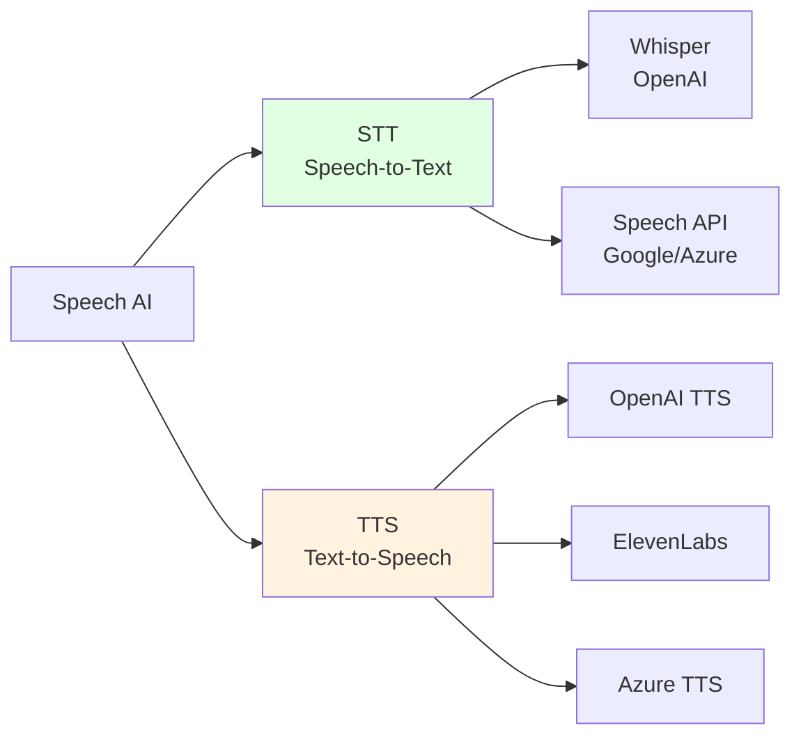

# 8.3 Speech & Audio <DifficultyBadge level="intermediate" /> <CostBadge cost="$0.01" />

> Prerequisites: 8.1 Vision (Image Understanding)

### Why Do We Need It? (Problem)

**Problem: Speech content is difficult to process and generate**

Real-world scenarios:

**Scenario 1: Meeting Minutes**

> "Just had a 2-hour meeting, need to organize meeting minutes"

**Traditional Methods:**
1. Manually listen to recording and transcribe word by word (time-consuming, error-prone)
2. Only note key points (miss details)

**Scenario 2: Customer Service Voice Reply**

> "Users call for inquiries, need automatic voice responses"

**Traditional Methods:**
1. Record fixed scripts (inflexible)
2. Human customer service (high cost)

**Scenario 3: Podcast/Video Subtitles**

> "Video needs subtitles, supporting multiple languages"

**Traditional Methods:**
1. Professional subtitle team production (long cycle, expensive)
2. Auto-subtitle tools (low accuracy)

**Scenario 4: Accessibility**

> "Visually impaired users need to hear webpage content"

**AI speech technology solves these problems:**
1. **STT (Speech-to-Text)**: Speech to text, auto-generate subtitles, meeting minutes
2. **TTS (Text-to-Speech)**: Text to speech, generate natural voice responses

### What Is It? (Concept)

**Speech & Audio processing includes two main directions:**



---

## 1. Speech-to-Text (Speech to Text)

**Popular STT Models:**

| Model | Company | Price | Features | Use Cases |
|-----|------|------|------|---------|
| **Whisper** | OpenAI | $0.006/minute | Multilingual, high accuracy | Meeting minutes, subtitle generation |
| **Azure Speech** | Microsoft | $1/hour | Real-time streaming, dialect support | Customer service, real-time translation |
| **Google Speech** | Google | $0.006/15 seconds | Auto-punctuation, speaker recognition | Podcasts, interviews |
| **AssemblyAI** | AssemblyAI | $0.00025/second | Auto-summarization, entity recognition | Content analysis |

::: tip Whisper's Advantages
- **Multilingual**: Supports 99 languages (Chinese, English, Japanese...)
- **No training required**: Out-of-the-box
- **Rich formats**: Supports JSON, SRT, VTT and other output formats
- **Open source version**: Can be deployed locally (requires GPU)
:::

**Whisper Workflow:**

```mermaid
sequenceDiagram
    participant User as "User"
    participant App as "Your Application"
    participant API as "Whisper API"
    
    User->>App: Upload audio file<br/>(mp3/wav/m4a...)
    App->>API: Send transcription request<br/>file + language + format
    API->>API: Speech recognition<br/>+punctuation+timestamps
    API->>App: Return text<br/>(JSON/SRT/VTT)
    App->>User: Display transcription result
    
    style API fill:#e1ffe1
```

**Basic Code Example:**

```python
from openai import OpenAI

client = OpenAI()

# Open audio file
audio_file = open("meeting.mp3", "rb")

# Transcribe
transcript = client.audio.transcriptions.create(
    model="whisper-1",
    file=audio_file,
    response_format="text"  # text | json | srt | vtt | verbose_json
)

print(transcript)
```

**Parameter Details:**

| Parameter | Description | Options |
|-----|------|--------|
| `model` | Model version | `whisper-1` |
| `file` | Audio file | Supports mp3, mp4, mpeg, mpga, m4a, wav, webm<br/>Max 25MB |
| `language` | Source language (optional, improves accuracy) | `zh` (Chinese), `en` (English), `ja` (Japanese)... |
| `response_format` | Output format | `text` | `json` | `srt` | `vtt` | `verbose_json` |
| `temperature` | Sampling temperature | 0-1, default 0 (more deterministic) |
| `prompt` | Prompt (guide style and terminology) | String |
| `timestamp_granularities` | Timestamp granularity | `segment` | `word` |

**Supported Output Formats:**

```python
# Plain text
response_text = client.audio.transcriptions.create(
    model="whisper-1",
    file=audio_file,
    response_format="text"
)
print(response_text)  # "Hello, today we discuss..."

# JSON (includes language info)
response_json = client.audio.transcriptions.create(
    model="whisper-1",
    file=audio_file,
    response_format="json"
)
print(response_json)
# {"text": "Hello, today we discuss..."}

# SRT subtitle format
response_srt = client.audio.transcriptions.create(
    model="whisper-1",
    file=audio_file,
    response_format="srt"
)
print(response_srt)
# 1
# 00:00:00,000 --> 00:00:03,000
# Hello, today we discuss...

# Verbose JSON (detailed info: timestamps, confidence)
response_verbose = client.audio.transcriptions.create(
    model="whisper-1",
    file=audio_file,
    response_format="verbose_json",
    timestamp_granularities=["word", "segment"]
)
print(response_verbose)
```

**Translation Feature (Translations):**

Whisper also supports translating any language to English:

```python
# Translate Chinese audio to English
translation = client.audio.translations.create(
    model="whisper-1",
    file=open("chinese_audio.mp3", "rb")
)

print(translation.text)  # Output English translation
```

---

## 2. Text-to-Speech (Text to Speech)

**Popular TTS Models:**

| Model | Company | Price | Features | Use Cases |
|-----|------|------|------|---------|
| **OpenAI TTS** | OpenAI | $15/1M characters (tts-1)<br/>$30/1M characters (tts-1-hd) | Natural, multiple voices | Content narration, audiobooks |
| **ElevenLabs** | ElevenLabs | $5/month (30k characters) | Emotionally rich, voice cloning | Ad voiceover, games |
| **Azure TTS** | Microsoft | $16/1M characters | SSML support, neural voices | Enterprise applications |
| **Google TTS** | Google | $16/1M characters | Multilingual, WaveNet | Multilingual applications |

**OpenAI TTS Voices:**

| Voice | Characteristics | Use Cases |
|-----|------|---------|
| `alloy` | Neutral, clear | News broadcasting, tutorials |
| `echo` | Male, steady | Audiobooks, explanations |
| `fable` | British, elegant | Literature, ads |
| `onyx` | Deep, magnetic | Brand intro, documentaries |
| `nova` | Female, lively | Customer service, casual content |
| `shimmer` | Female, gentle | Stories, guidance |

**TTS Workflow:**

```mermaid
sequenceDiagram
    participant User as "User"
    participant App as "Your Application"
    participant API as "TTS API"
    
    User->>App: Input text
    App->>API: Send TTS request<br/>text + voice + model
    API->>API: Text analysis<br/>Speech synthesis
    API->>App: Return audio stream<br/>(mp3/opus/aac/flac)
    App->>User: Play speech
    
    style API fill:#fff3e0
```

**Basic Code Example:**

```python
from openai import OpenAI
from pathlib import Path

client = OpenAI()

# Generate speech
response = client.audio.speech.create(
    model="tts-1",  # tts-1 | tts-1-hd
    voice="alloy",  # alloy | echo | fable | onyx | nova | shimmer
    input="Welcome to use AI voice assistant. Today I will introduce how to use OpenAI's TTS feature."
)

# Save to file
speech_file_path = Path("output.mp3")
response.stream_to_file(speech_file_path)

print(f"Speech generated: {speech_file_path}")
```

**Parameter Details:**

| Parameter | Description | Options |
|-----|------|--------|
| `model` | Model version | `tts-1` (fast)<br/>`tts-1-hd` (high quality, 2x price) |
| `voice` | Voice | `alloy` | `echo` | `fable` | `onyx` | `nova` | `shimmer` |
| `input` | Input text | Max 4096 characters |
| `response_format` | Audio format | `mp3` (default) | `opus` | `aac` | `flac` | `wav` | `pcm` |
| `speed` | Speech rate | 0.25-4.0, default 1.0 |

**Streaming Output (Real-time Generation):**

```python
from openai import OpenAI

client = OpenAI()

response = client.audio.speech.create(
    model="tts-1",
    voice="alloy",
    input="This is a text that needs to be played in real-time.",
    response_format="opus"  # opus suitable for streaming
)

# Stream to file
with open("speech_stream.opus", "wb") as f:
    for chunk in response.iter_bytes(chunk_size=1024):
        f.write(chunk)
```

**Adjust Speech Rate:**

```python
from openai import OpenAI

client = OpenAI()

text = "This is a test speech to compare the effects of different speech rates."

# Slow (0.5x)
response_slow = client.audio.speech.create(
    model="tts-1",
    voice="alloy",
    input=text,
    speed=0.5
)
response_slow.stream_to_file("slow.mp3")

# Normal speed (1.0x)
response_normal = client.audio.speech.create(
    model="tts-1",
    voice="alloy",
    input=text,
    speed=1.0
)
response_normal.stream_to_file("normal.mp3")

# Fast (1.5x)
response_fast = client.audio.speech.create(
    model="tts-1",
    voice="alloy",
    input=text,
    speed=1.5
)
response_fast.stream_to_file("fast.mp3")
```

---

## 3. Complete Application Scenarios

**Scenario 1: Meeting Minutes System**

```python
from openai import OpenAI

client = OpenAI()

def transcribe_meeting(audio_path: str) -> dict:
    """
    Transcribe meeting audio and generate summary
    """
    # 1. Speech to text
    with open(audio_path, "rb") as audio_file:
        transcript = client.audio.transcriptions.create(
            model="whisper-1",
            file=audio_file,
            response_format="verbose_json",
            timestamp_granularities=["segment"]
        )
    
    # 2. Use LLM to generate summary and to-dos
    summary_response = client.chat.completions.create(
        model="gpt-4.1-mini",
        messages=[
            {
                "role": "user",
                "content": f"""
Please analyze this meeting transcript and output:
1. Meeting topic
2. Key discussion points (3-5 items)
3. To-do items (TODO)
4. Key decisions

Meeting transcript:
{transcript.text}
"""
            }
        ]
    )
    
    return {
        "transcript": transcript.text,
        "segments": transcript.segments,
        "summary": summary_response.choices[0].message.content
    }

# Usage
result = transcribe_meeting("meeting.mp3")
print("Transcript:", result["transcript"])
print("\nSummary:", result["summary"])
```

**Scenario 2: Multilingual Customer Service**

```python
from openai import OpenAI

client = OpenAI()

def voice_customer_service(audio_path: str, language: str = "zh"):
    """
    Voice customer service: Recognize customer question → LLM answer → Voice reply
    """
    # 1. Speech to text
    with open(audio_path, "rb") as audio_file:
        question = client.audio.transcriptions.create(
            model="whisper-1",
            file=audio_file,
            language=language
        ).text
    
    print(f"Customer question: {question}")
    
    # 2. LLM generates answer
    answer = client.chat.completions.create(
        model="gpt-4.1-mini",
        messages=[
            {"role": "system", "content": "You are a professional customer service representative, answers should be concise and friendly."},
            {"role": "user", "content": question}
        ]
    ).choices[0].message.content
    
    print(f"Answer: {answer}")
    
    # 3. Text to speech
    response = client.audio.speech.create(
        model="tts-1",
        voice="nova",  # Female, lively
        input=answer
    )
    
    response.stream_to_file("customer_reply.mp3")
    
    return {
        "question": question,
        "answer": answer,
        "audio_path": "customer_reply.mp3"
    }

# Usage
result = voice_customer_service("customer_question.mp3")
```

**Scenario 3: Video Subtitle Generation**

```python
from openai import OpenAI

client = OpenAI()

def generate_subtitles(video_audio_path: str, output_srt: str = "subtitles.srt"):
    """
    Extract subtitles from video audio (SRT format)
    """
    with open(video_audio_path, "rb") as audio_file:
        transcript = client.audio.transcriptions.create(
            model="whisper-1",
            file=audio_file,
            response_format="srt"  # Direct SRT format output
        )
    
    # Save SRT file
    with open(output_srt, "w", encoding="utf-8") as f:
        f.write(transcript)
    
    print(f"Subtitles generated: {output_srt}")
    return transcript

# Usage
srt_content = generate_subtitles("video.mp3", "output.srt")
print(srt_content)
```

**Scenario 4: Audiobook Generation**

```python
from openai import OpenAI
from pathlib import Path

client = OpenAI()

def text_to_audiobook(text_file: str, output_dir: str = "audiobook"):
    """
    Convert long text to audiobook (by chapter)
    """
    # Read text
    with open(text_file, "r", encoding="utf-8") as f:
        content = f.read()
    
    # Split by chapter (assume split by "## Chapter X")
    chapters = content.split("##")
    chapters = [ch.strip() for ch in chapters if ch.strip()]
    
    # Create output directory
    output_path = Path(output_dir)
    output_path.mkdir(exist_ok=True)
    
    # Generate speech for each chapter
    for i, chapter_text in enumerate(chapters, 1):
        print(f"Generating chapter {i}...")
        
        # Limit length (TTS max 4096 characters)
        if len(chapter_text) > 4000:
            chapter_text = chapter_text[:4000] + "..."
        
        response = client.audio.speech.create(
            model="tts-1-hd",  # High quality
            voice="echo",  # Male, steady
            input=chapter_text,
            speed=0.9  # Slightly slower, better for listening
        )
        
        response.stream_to_file(output_path / f"chapter_{i:02d}.mp3")
    
    print(f"Audiobook generated to: {output_path}")

# Usage
text_to_audiobook("book.txt", "my_audiobook")
```

### Try It Out (Practice)

Complete examples: meeting transcription, customer service voice, subtitle generation, audiobook.

<ColabBadge path="demos/08-multimodal/speech_audio.ipynb" />

### Summary (Reflection)

- **What it solves**: Speech to text (Whisper), text to speech (TTS), supporting multiple languages and multiple output formats
- **What it doesn't solve**: All are one-way "recording → processing → output", cannot do real-time voice conversations—covered in next section
- **Key Takeaways**:
  1. **Whisper transcription high accuracy**: Supports 99 languages, price $0.006/minute
  2. **Multiple output formats**: text | json | srt | vtt | verbose_json
  3. **TTS rich voices**: 6 voices covering male/female, different styles
  4. **Adjustable speech rate**: 0.25-4.0x speed
  5. **Streaming output**: Suitable for real-time playback
  6. **File size limit**: Whisper max 25MB
  7. **Combine STT + LLM + TTS**: Implement intelligent voice assistant

---

*Last updated: 2026-02-20*
