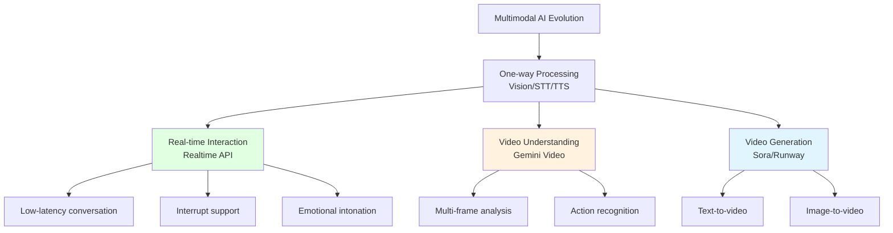

# 8.4 Video & Realtime <DifficultyBadge level="advanced" /> <CostBadge cost="$0.10" />

> Prerequisites: 8.1 Vision, 8.3 Speech & Audio

### Why Do We Need It? (Problem)

**Problem: Need real-time interaction and video generation**

Previous technologies were all "one-way processing":

- **Vision**: Upload image → analyze → return result
- **STT/TTS**: Upload audio → convert to text → generate speech

But real scenarios need **real-time bidirectional interaction**:

**Scenario 1: Real-time Voice Conversation**

> "I need a voice assistant that can converse like a phone call, not 'I finish speaking → you reply', but can interrupt anytime, natural communication"

**Problems with traditional STT + LLM + TTS approach:**
- High latency (3 API calls in series)
- Cannot interrupt
- No emotional intonation support

**Scenario 2: Video Content Understanding**

> "Analyze this 5-minute product demo video, extract key feature points"

**Traditional Methods:**
- Manual screenshots + Vision API (time-consuming, laborious)
- Extract audio + Whisper (only text, loses visual information)

**Scenario 3: Video Generation**

> "Automatically generate short videos from scripts"

**Traditional Methods:**
- Need professional video production team
- Long cycle, high cost

**Technologies introduced in this section:**
1. **OpenAI Realtime API**: Real-time voice conversation, low latency, supports interruption
2. **Video Understanding**: AI understands video content (Gemini)
3. **Video Generation**: AI generates video (Sora, Runway, Kling)

### What Is It? (Concept)

**Realtime & Video is the "advanced form" of multimodal AI:**



---

## 1. OpenAI Realtime API (Real-time Voice Conversation)

**What is Realtime API?**

OpenAI launched real-time voice conversation API in late 2024, features:
- **Low latency**: Average 320ms response time (10x faster than STT + LLM + TTS)
- **Interrupt support**: Users can interrupt AI speech anytime
- **Emotional intonation**: AI can understand and generate emotional speech
- **WebSocket connection**: Persistent connection, real-time bidirectional communication

**Workflow:**

```mermaid
sequenceDiagram
    participant User as "User"
    participant App as "Your Application"
    participant API as "Realtime API<br/>(WebSocket)"
    
    User->>App: Establish WebSocket connection
    App->>API: session.create
    
    loop Real-time conversation
        User->>App: Voice input (streaming)
        App->>API: input_audio_buffer.append
        API->>API: Real-time recognition<br/>+inference<br/>+generate speech
        API->>App: response.audio.delta (streaming)
        App->>User: Real-time playback
        
        Note over User,App: User can interrupt anytime
        User->>App: Interrupt signal
        App->>API: response.cancel
        API->>API: Stop current response
    end
    
    style API fill:#e1ffe1
```

**Key Features:**

| Feature | Description |
|-----|------|
| **Low Latency** | Average 320ms, fastest 250ms |
| **Streaming Bidirectional** | Supports both input and output streaming |
| **Interrupt Mechanism** | Auto-stops AI response when user speaks |
| **Multimodal Input** | Supports audio + text mixed input |
| **Function Calling** | Supports real-time tool calls |
| **Session Management** | Auto-manages context history |

**Basic Code Example (Simplified):**

::: warning Note
Realtime API uses WebSocket connection, code is complex. This shows a simplified concept, see Notebook for complete implementation.
:::

```python
import asyncio
import websockets
import json
import base64

async def realtime_voice_assistant():
    """
    Real-time voice assistant (simplified example)
    """
    url = "wss://api.openai.com/v1/realtime?model=gpt-4o-realtime-preview-2024-10-01"
    
    headers = {
        "Authorization": f"Bearer {OPENAI_API_KEY}",
        "OpenAI-Beta": "realtime=v1"
    }
    
    async with websockets.connect(url, extra_headers=headers) as ws:
        # 1. Configure session
        session_config = {
            "type": "session.update",
            "session": {
                "modalities": ["text", "audio"],
                "instructions": "You are a friendly assistant",
                "voice": "alloy",
                "input_audio_format": "pcm16",
                "output_audio_format": "pcm16",
                "turn_detection": {
                    "type": "server_vad"  # Server-side voice activity detection
                }
            }
        }
        await ws.send(json.dumps(session_config))
        
        # 2. Send audio input
        audio_data = b"..."  # Audio data from microphone
        audio_message = {
            "type": "input_audio_buffer.append",
            "audio": base64.b64encode(audio_data).decode()
        }
        await ws.send(json.dumps(audio_message))
        
        # 3. Receive response
        async for message in ws:
            event = json.loads(message)
            
            if event["type"] == "response.audio.delta":
                # Real-time receive audio chunks
                audio_chunk = base64.b64decode(event["delta"])
                # Play audio...
            
            elif event["type"] == "response.audio.done":
                print("Response complete")
            
            elif event["type"] == "response.text.delta":
                # Also has text version
                print(event["delta"], end="")

# Run
asyncio.run(realtime_voice_assistant())
```

**Core Concepts:**

| Concept | Description |
|-----|------|
| **Session** | Session configuration, includes model, voice, instructions |
| **Turn** | One conversation turn (user speaks → AI replies) |
| **VAD** | Voice activity detection, determines if user is speaking |
| **Input Audio Buffer** | Input audio buffer, accumulates user audio |
| **Response** | AI's reply, includes audio and text |

**Supported Event Types:**

| Client Sends | Server Returns |
|-----------|----------|
| `session.update` | `session.created` |
| `input_audio_buffer.append` | `input_audio_buffer.speech_started` |
| `input_audio_buffer.commit` | `input_audio_buffer.speech_stopped` |
| `response.create` | `response.audio.delta` |
| `response.cancel` | `response.audio.done` |
| `conversation.item.create` | `response.text.delta` |

**Use Cases:**

| Scenario | Why Realtime API Fits |
|-----|----------------------|
| **Voice Customer Service** | Low latency, natural conversation |
| **Voice Assistant** | Interrupt mechanism, continuous interaction |
| **Phone Bot** | Real-time response, emotional intonation |
| **Voice Teaching** | Interactive Q&A, instant feedback |
| **Real-time Translation** | Low latency, streaming output |

**Cost:**

Realtime API is relatively expensive:
- **Audio input**: $100 / 1M tokens
- **Audio output**: $200 / 1M tokens
- **Text input**: $5 / 1M tokens
- **Text output**: $20 / 1M tokens

Example: 1 minute voice conversation ~$0.12-0.20

---

## 2. Video Understanding

**Gemini 2.5 Flash supports video understanding:**

```python
# Note: This is a concept example, actual use requires Google AI SDK
import google.generativeai as genai

genai.configure(api_key="YOUR_GOOGLE_API_KEY")

model = genai.GenerativeModel("gemini-2.0-flash-exp")

# Upload video file
video_file = genai.upload_file(path="product_demo.mp4")

# Analyze video
response = model.generate_content([
    "Please analyze this video and extract the following information:\n"
    "1. Video topic\n"
    "2. Main objects and scenes appearing\n"
    "3. Key actions and events\n"
    "4. Video duration and rhythm\n",
    video_file
])

print(response.text)
```

**Video Understanding Capabilities:**

| Capability | Description |
|-----|------|
| **Scene Recognition** | Recognize environments and locations in video |
| **Object Detection** | Identify appearing objects |
| **Action Recognition** | Understand human actions (walk, run, jump) |
| **Temporal Analysis** | Understand event sequence |
| **Multimodal Fusion** | Combine visual + audio information |

**Use Cases:**

- Video content moderation
- Intelligent video summarization
- Sports event analysis
- Surveillance video analysis
- Educational video breakdown

---

## 3. Video Generation

**Popular Video Generation Models:**

| Model | Company | Status | Features | Price |
|-----|------|------|------|------|
| **Sora** | OpenAI | Beta | Highest quality, up to 60 seconds | Not public |
| **Runway Gen-3** | Runway | Available | Commercial-grade, 5-10 seconds | $0.05/second |
| **Pika** | Pika Labs | Available | User-friendly, 3-4 seconds | $8/month (250 videos) |
| **Kling** | Kuaishou | Available | High quality, Chinese support | ¥0.2/second |

**Sora (Concept, API not yet public):**

```python
# Hypothetical API call method (actually not public)
from openai import OpenAI

client = OpenAI()

response = client.videos.generate(
    model="sora-1.0",
    prompt="A golden retriever running on the beach at sunset, 4K HD, cinematic quality",
    duration=10,  # 10 seconds
    resolution="1920x1080",
    fps=24
)

video_url = response.data[0].url
print(f"Video URL: {video_url}")
```

**Runway Gen-3 (Actually Available):**

```python
# Using Runway API (requires API Key)
import requests

api_key = "YOUR_RUNWAY_API_KEY"
url = "https://api.runwayml.com/v1/generate"

payload = {
    "model": "gen3",
    "prompt": "An orange cat typing on a keyboard, close-up shot, soft lighting",
    "duration": 5,
    "aspect_ratio": "16:9"
}

headers = {
    "Authorization": f"Bearer {api_key}",
    "Content-Type": "application/json"
}

response = requests.post(url, json=payload, headers=headers)
result = response.json()

print(f"Task ID: {result['id']}")
print(f"Status: {result['status']}")
```

**Video Generation Challenges:**

| Challenge | Description |
|-----|------|
| **High Cost** | 1 second of video costs $0.05-0.20 |
| **Long Time** | Generating 10 seconds of video takes 5-10 minutes |
| **Controllability** | Difficult to precisely control details |
| **Consistency** | Hard to unify style across multiple shots |

**Use Cases:**

- Ad production
- Social media short videos
- Concept demonstrations
- Animation prototypes
- Educational content

---

## 4. Comprehensive Application Case

**Case: Intelligent Video Customer Service System**

```python
import asyncio
import websockets
import json

async def video_customer_service():
    """
    Video customer service: Real-time voice + screen sharing analysis
    """
    # 1. Establish Realtime API connection
    realtime_ws = await websockets.connect("wss://api.openai.com/v1/realtime")
    
    # 2. Configure session
    await realtime_ws.send(json.dumps({
        "type": "session.update",
        "session": {
            "instructions": "You are a technical support customer service representative helping users solve software problems",
            "voice": "nova"
        }
    }))
    
    # 3. User real-time voice input
    # (audio capture code omitted)
    
    # 4. If user shares screen, send screenshot analysis
    screenshot_base64 = capture_screenshot()
    
    # Use Vision API to analyze screenshot
    vision_response = await analyze_screenshot(screenshot_base64)
    
    # 5. Inject analysis result into conversation
    await realtime_ws.send(json.dumps({
        "type": "conversation.item.create",
        "item": {
            "type": "message",
            "role": "user",
            "content": [
                {"type": "text", "text": f"I see the screen shows: {vision_response}"}
            ]
        }
    }))
    
    # 6. AI replies combining voice + visual information
    async for message in realtime_ws:
        event = json.loads(message)
        if event["type"] == "response.audio.delta":
            # Real-time playback of voice reply
            pass

async def analyze_screenshot(screenshot_base64):
    """Analyze screen screenshot"""
    from openai import OpenAI
    client = OpenAI()
    
    response = client.chat.completions.create(
        model="gpt-4.1-mini",
        messages=[{
            "role": "user",
            "content": [
                {"type": "text", "text": "What problem does this screen show?"},
                {"type": "image_url", "image_url": {"url": f"data:image/png;base64,{screenshot_base64}"}}
            ]
        }]
    )
    
    return response.choices[0].message.content
```

### Try It Out (Practice)

::: warning Experiment Notes
- **Realtime API** requires WebSocket programming, code is complex, Notebook provides simplified version
- **Video generation** APIs are mostly in beta or paid status, Notebook provides concept code
- This section focuses on **understanding technical capabilities and application scenarios**, not complete implementation
:::

<ColabBadge path="demos/08-multimodal/realtime.ipynb" />

### Summary (Reflection)

- **What it solves**: Real-time voice conversation, video understanding, video generation—the highest form of multimodal AI
- **What it doesn't solve**: These are all "using AI", haven't covered "managing AI"—next chapter introduces AI Agents
- **Key Takeaways**:
  1. **Realtime API low latency**: Average 320ms, supports interruption
  2. **WebSocket connection**: Persistent bidirectional communication
  3. **Video understanding**: Gemini 2.5 Flash supports multi-frame video analysis
  4. **Video generation**: Sora (beta), Runway (available), Kling (Chinese)
  5. **High cost**: Realtime API is 10-20x regular API, video generation even more expensive
  6. **Cutting edge**: Some features are experimental, APIs may change
  7. **Use cases**: Voice customer service, real-time translation, video content production

**Multimodal AI Capabilities Summary:**

| Capability | Input | Output | Representative Tech | Cost |
|-----|------|------|---------|------|
| **Vision** | Image | Text | GPT-4o | Low |
| **Image Gen** | Text | Image | DALL-E 3 | Medium |
| **STT** | Speech | Text | Whisper | Low |
| **TTS** | Text | Speech | OpenAI TTS | Low |
| **Realtime** | Speech | Speech | Realtime API | High |
| **Video** | Video | Text | Gemini 2.5 | Medium |
| **Video Gen** | Text | Video | Sora/Runway | Very High |

---

*Last updated: 2026-02-20*
