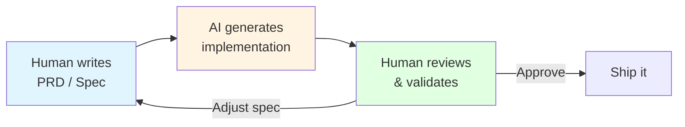

# 9.5 AI-Native Development Patterns

<DifficultyBadge level="intermediate" />
<CostBadge cost="$0" />

> Prerequisites: 9.1 Agent Core Concepts

### Why Do We Need It? (Problem)

It's 2026, and the numbers are in:
- **30% of Microsoft's code** is written by AI
- **25%+ of Google's** new code is AI-generated
- **85% of developers** use AI coding tools regularly
- GitHub Copilot crossed **20 million users**

Yet most teams are still using AI the "old way" — like a fancy autocomplete. They haven't changed HOW they develop, just added AI as a bolt-on.

::: info Soul-Searching Question
If you're still writing detailed implementation code by hand and using AI only for "suggest the next line"... you're using a jet engine to power a bicycle. What would software development look like if it was designed FOR AI from the ground up?
:::

### What Is It? (Concept)

**AI-Native Development** = Designing your entire development workflow around AI capabilities, not just sprinkling AI on top of existing processes.

**Three Key Patterns:**

#### 1. Spec-Driven Development (SDD)

Instead of writing code, you write **specifications**. The AI writes the code.



**The old way:**
```
Developer → Write code → Test → Fix bugs → Ship
```

**The AI-native way:**
```
Developer → Write spec → AI codes → Review → Adjust spec → AI fixes → Ship
```

::: tip Fun Fact
Anthropic's 2026 Agentic Coding Report predicts that "non-technical teams across sales, marketing, legal, and operations will gain the ability to automate workflows and build tools with no engineering intervention." The spec IS the code.
:::

#### 2. Objective-Validation Protocol (OVP)

The evolution of Vibe Coding. Instead of "prompt and pray," you:

1. **Define objectives** (what success looks like)
2. **Let agents execute** autonomously
3. **Validate at checkpoints** (human approves critical decisions)

```
Old: Human-in-the-Loop (constant supervision)
New: Objective-Validation (define goals → agents execute → humans validate)
```

As IBM's Ismael Faro puts it: "Users define goals and validate while collections of agents autonomously execute."

#### 3. AI Development Patterns

A set of battle-tested practices (from [ai-development-patterns](https://github.com/PaulDuvall/ai-development-patterns)):

**Issue Generation Pattern:**
```
BAD:  "Fix the login page"
BAD:  "Make the dashboard better"

GOOD: "AUTH-002: Password validation service
       - Files: src/auth/validators.py, tests/test_validators.py
       - Coverage: 95%, unit + integration tests  
       - CI: lint, test, security-scan must pass
       - AI-assisted: Use AI for implementation and test generation"
```

**Context Priming Pattern:**
- AGENTS.md / CLAUDE.md with project conventions
- Architecture Decision Records (ADRs)
- Explicit tech stack constraints

**Review Loop Pattern:**
```
AI writes code → Automated tests → AI reviews own code → 
Human reviews AI's review → Merge
```

::: warning Common Mistake
"AI wrote it, so it must be good" — NO. AI-generated code needs MORE review, not less. The AI is incredibly confident, even when it's wrong. It's like a junior developer who never says "I don't know."
:::

### The State of AI-Native in Practice

**What's working (2026):**
- Spec → Code generation for CRUD / boilerplate (80%+ accuracy)
- AI-assisted code review catching real bugs
- Test generation from specs
- Documentation generation from code

**What's still hard:**
- Architecture decisions (AI suggests, human decides)
- Performance optimization (AI over-engineers or under-optimizes)
- Security review (AI misses subtle vulnerabilities)
- Cross-system integration (AI doesn't understand your infra)

**The New Developer Stack:**

| Role | Old Way | AI-Native Way |
|------|---------|--------------|
| **Architect** | Draw diagrams → Write design docs | Write specs → Review AI output |
| **Developer** | Write code → Debug → Test | Write specs → Review AI code → Guide AI debugging |
| **QA** | Manual testing → Write test cases | Review AI-generated tests → Focus on edge cases |
| **PM** | Write tickets → Wait for dev | Write specs → AI estimates + implements |

### Summary (Reflection)

- **What we solved**: Understood how development workflows change when built around AI capabilities
- **Key takeaways**:
  1. **Spec-Driven Development** = write what you want, not how to build it
  2. **Objective-Validation Protocol** = from constant supervision to checkpoint-based validation
  3. **AI Development Patterns** = battle-tested practices for AI-assisted workflows
  4. **Review is MORE important** with AI, not less — AI is confident but fallible
  5. **The developer role shifts** from "code writer" to "spec writer + code reviewer"

> *"In 2026, the best developers aren't the ones who type fastest — they're the ones who spec most clearly. Turns out, the real 10x engineer was the one who could explain what they wanted all along."*

---

*Last updated: 2026-02-22*
