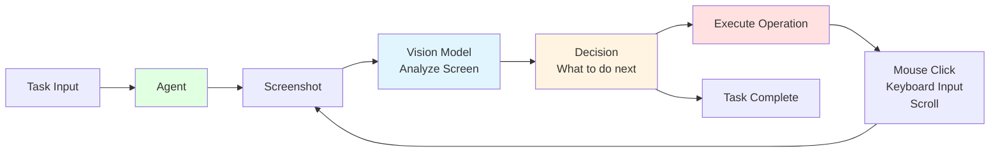
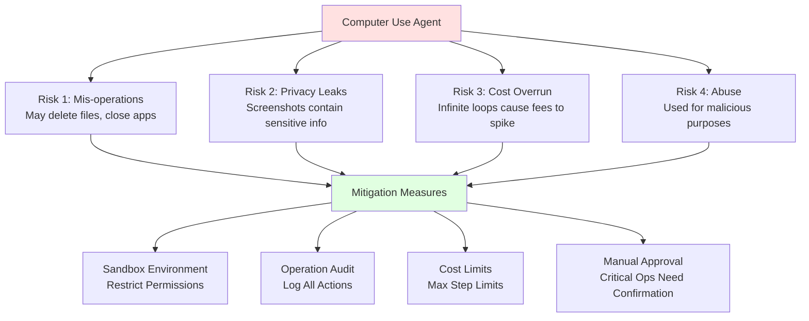

# 9.4 Computer Use <DifficultyBadge level="advanced" /> <CostBadge cost="$0.10" />

> Prerequisites: 9.1 Core Agent Concepts

### Why Do We Need It? (Problem)

So far, our Agents can only call APIs and functions — but when humans work, many operations are **completed through interfaces**.

**Limitations of Traditional Agents:**

```python
# What Agents can do:
- Call weather API ✅
- Query database ✅
- Execute Python code ✅

# What Agents cannot do:
- Open browser to search for information ❌
- Fill out web forms ❌
- Click buttons to download files ❌
- Operate desktop applications ❌
```

**Real-World Scenario Challenges:**

**Scenario 1: Market Research**

Task: "Go to competitor websites and check their pricing strategies"

```
Traditional approach:
1. Need to write scrapers for each website → High cost
2. Websites update and scrapers break → Hard to maintain
3. Anti-scraping mechanisms → Low success rate

Ideal approach:
Agent opens browser itself, browses like a human, clicks, takes screenshots
```

**Scenario 2: Office Automation**

Task: "Help me organize my inbox, mark important emails with stars"

```
Traditional approach:
Need email provider API → Not all services have APIs

Ideal approach:
Agent opens email client, clicks, drags, marks like a human
```

**Scenario 3: Software Testing**

Task: "Test this webpage's login flow"

```
Traditional approach:
Selenium scripts → Need to write code, complex to maintain

Ideal approach:
Tell Agent "test login functionality", it operates browser to complete test
```

**Core Question: How to make AI control computers like humans?**

This is what **Computer Use** aims to solve.

### What Is It? (Concept)

**What is Computer Use?**

Computer Use enables AI Agents to:
1. **See the screen**: "See" screen content through screenshots
2. **Make decisions**: Analyze screen, decide next operation
3. **Control computer**: Mouse clicks, keyboard input, page scrolling



**How It Works:**

```
1. Screenshot → 2. AI Analysis → 3. Generate Operation Commands → 4. Execute → 5. Screenshot Again → Loop...
```

**Two Main Implementation Solutions:**

### 1. Anthropic Computer Use

**Features:**
- First public Computer Use API (October 2024)
- Based on Claude Sonnet 4.6
- Provides complete Docker environment

**API Example:**

```python
import anthropic

client = anthropic.Anthropic()

# Enable Computer Use
response = client.messages.create(
    model="claude-3-5-sonnet-20241022",
    max_tokens=1024,
    tools=[
        {
            "type": "computer_20241022",
            "name": "computer",
            "display_width_px": 1920,
            "display_height_px": 1080,
        }
    ],
    messages=[
        {
            "role": "user",
            "content": "Go to google.com and search for 'Anthropic AI'"
        }
    ],
)
```

**Supported Operations:**

| Operation Type | Description | Example |
|---------|------|------|
| **key** | Key press | `{"type": "key", "text": "Enter"}` |
| **type** | Type text | `{"type": "type", "text": "Hello"}` |
| **mouse_move** | Move mouse | `{"type": "mouse_move", "coordinate": [100, 200]}` |
| **left_click** | Left click | `{"type": "left_click"}` |
| **left_click_drag** | Drag | `{"type": "left_click_drag", "coordinate": [300, 400]}` |
| **screenshot** | Take screenshot | `{"type": "screenshot"}` |

### 2. OpenAI Computer Use

**Features:**
- Released January 2025
- Based on GPT-4o
- Cleaner API design

**API Example:**

```python
from openai import OpenAI

client = OpenAI()

# Create Agent supporting Computer Use
agent = client.beta.assistants.create(
    model="gpt-4o",
    tools=[{"type": "computer_use"}],
    instructions="You can control the computer to complete tasks."
)

# Run task
thread = client.beta.threads.create()
client.beta.threads.messages.create(
    thread_id=thread.id,
    role="user",
    content="Open Chrome and search for OpenAI"
)

run = client.beta.threads.runs.create(
    thread_id=thread.id,
    assistant_id=agent.id
)
```

**Comparison: Anthropic vs OpenAI**

| Comparison | Anthropic Computer Use | OpenAI Computer Use |
|-------|------------------------|---------------------|
| **Release Date** | October 2024 | January 2025 |
| **Model** | Claude Sonnet 4.6 | GPT-4o |
| **API Complexity** | More complex (manual screenshot handling) | Simple (automatic handling) |
| **Environment** | Provides Docker image | Cloud-hosted |
| **Pricing** | Token-based + screenshot cost | Operation-based |
| **Availability** | Public beta | Private beta |
| **Suitable For** | Research, complex tasks | Production, simple tasks |

**Computer Use Capability Boundaries**

✅ **Tasks it excels at:**
1. **Web operations**: Search, fill forms, click
2. **Browsing and navigation**: Find information, take screenshots
3. **Simple desktop operations**: Open apps, copy-paste
4. **Visual recognition**: Identify button and input box positions

❌ **Tasks it's not suited for:**
1. **Complex interactions**: Gaming, video editing
2. **Real-time tasks**: Each operation takes 2-5 seconds
3. **Precise operations**: Pixel-level positioning unstable
4. **Privacy operations**: Should not be used for sensitive information

**Security and Privacy Considerations**



**Best Practices:**

1. **Use sandbox environments**
   - Docker containers or virtual machines
   - Restrict network access and file permissions

2. **Confirm before operations**
   - Critical operations (like deleting files) need manual confirmation
   - Show operation preview

3. **Cost control**
   - Set max steps (e.g., 50 steps)
   - Monitor token usage

4. **Privacy protection**
   - Auto-blur sensitive information in screenshots
   - Don't test on production data

### Hands-On Practice (Practice)

Since Computer Use requires a special environment, we'll show **conceptual code** and **setup process**.

**Anthropic Computer Use Complete Example**

**Step 1: Launch Docker Environment**

```bash
# Download official Docker image
docker pull anthropic/computer-use-demo

# Run container
docker run -p 5900:5900 -p 6080:6080 anthropic/computer-use-demo
```

**Step 2: Write Control Script**

```python
import anthropic
import base64
import os
from anthropic.types.beta import BetaToolComputerUse20241022Param

client = anthropic.Anthropic(api_key=os.environ.get("ANTHROPIC_API_KEY"))

def computer_use_agent(task: str, max_steps: int = 20):
    """
    Computer Use Agent main loop
    """
    messages = [
        {
            "role": "user",
            "content": task,
        }
    ]
    
    # Define Computer Use tool
    tools = [
        {
            "type": "computer_20241022",
            "name": "computer",
            "display_width_px": 1920,
            "display_height_px": 1080,
            "display_number": 1,
        }
    ]
    
    print(f"Task: {task}\n")
    print("=" * 80)
    
    for step in range(1, max_steps + 1):
        print(f"\nStep {step}:")
        
        # Call Claude
        response = client.messages.create(
            model="claude-3-5-sonnet-20241022",
            max_tokens=1024,
            tools=tools,
            messages=messages,
        )
        
        print(f"Stop reason: {response.stop_reason}")
        
        # Complete
        if response.stop_reason == "end_turn":
            final_text = next(
                (block.text for block in response.content if hasattr(block, "text")),
                "Task completed"
            )
            print(f"\nFinal answer: {final_text}")
            return final_text
        
        # Need to execute tool
        if response.stop_reason == "tool_use":
            # Add Assistant message
            messages.append({"role": "assistant", "content": response.content})
            
            tool_results = []
            
            for block in response.content:
                if block.type == "tool_use":
                    print(f"  Tool: {block.name}")
                    print(f"  Action: {block.input.get('action')}")
                    
                    # This is pseudocode, actual implementation needs to connect to Docker container
                    # Execute operation and get screenshot
                    result = execute_computer_action(block.input)
                    
                    tool_results.append({
                        "type": "tool_result",
                        "tool_use_id": block.id,
                        "content": result,
                    })
            
            # Add tool results
            messages.append({"role": "user", "content": tool_results})
    
    return "Max steps reached"

def execute_computer_action(action_input: dict) -> str:
    """
    Execute computer operation (pseudocode)
    Actual implementation needs to connect to Docker container's VNC
    """
    action_type = action_input.get("action")
    
    if action_type == "screenshot":
        # Take screenshot and return base64
        screenshot_base64 = take_screenshot()
        return f"data:image/png;base64,{screenshot_base64}"
    
    elif action_type == "mouse_move":
        coordinate = action_input.get("coordinate")
        move_mouse(coordinate[0], coordinate[1])
        return "Mouse moved"
    
    elif action_type == "left_click":
        click_mouse()
        return "Clicked"
    
    elif action_type == "type":
        text = action_input.get("text")
        type_text(text)
        return f"Typed: {text}"
    
    elif action_type == "key":
        key = action_input.get("text")
        press_key(key)
        return f"Pressed: {key}"
    
    return "Unknown action"
```

**Step 3: Run Tasks**

```python
# Example task 1: Web search
result1 = computer_use_agent(
    "Open Chrome, go to google.com, and search for 'Anthropic AI'. Take a screenshot of the results."
)

# Example task 2: Fill form
result2 = computer_use_agent(
    "Go to example.com/contact, fill in the name 'John Doe' and email 'john@example.com', then click Submit."
)

# Example task 3: File operations
result3 = computer_use_agent(
    "Open the file 'data.csv' in the Downloads folder and tell me how many rows it has."
)
```

**OpenAI Computer Use Example (Simplified)**

```python
from openai import OpenAI

client = OpenAI()

def openai_computer_use(task: str):
    """
    OpenAI Computer Use (conceptual code)
    """
    # Create Agent
    agent = client.beta.assistants.create(
        model="gpt-4o",
        tools=[{"type": "computer_use"}],
        instructions="""You can control the computer to complete tasks.
        
Available actions:
- Click on UI elements
- Type text
- Press keys
- Take screenshots
- Navigate web pages

Always explain what you're doing and why."""
    )
    
    # Create thread
    thread = client.beta.threads.create()
    
    # Send task
    client.beta.threads.messages.create(
        thread_id=thread.id,
        role="user",
        content=task
    )
    
    # Run
    run = client.beta.threads.runs.create(
        thread_id=thread.id,
        assistant_id=agent.id
    )
    
    # Wait for completion (actual implementation needs polling)
    # ...
    
    return "Task completed"
```

**Real-World Applications of Computer Use**

| Domain | Application | Value |
|-----|------|------|
| **Test Automation** | UI testing, regression testing | Reduce 90% test script maintenance cost |
| **Data Collection** | Web data extraction | No need to write scraper code |
| **Office Automation** | Email organization, form filling | Save repetitive labor |
| **Customer Service Training** | Simulate customer operations | Auto-generate training cases |
| **Competitive Analysis** | Monitor competitor websites | Real-time market insights |

**Limitations and Future**

**Current Limitations:**
1. **Slow speed**: Each operation takes 2-5 seconds
2. **High cost**: Screenshot + Vision Model costs are high
3. **Unstable**: UI changes may cause failures
4. **Security risks**: Requires sandbox environment

**Future Directions:**
1. **Faster inference**: Real-time operations
2. **More accurate positioning**: Pixel-level precision
3. **Better understanding**: Understand complex UIs
4. **Multimodal fusion**: Combine OCR, voice

<ColabBadge path="demos/09-ai-agents/computer_use.ipynb" />

### Summary (Reflection)

- **What we solved**: Understood the principles and application scenarios of Computer Use, know how to make AI control computers
- **What we didn't solve**: Single Agent capability is limited — next chapter introduces multi-Agent collaboration
- **Key Takeaways**:
  1. **Computer Use lets AI control computers like humans**: See screen, click mouse, type keyboard
  2. **How it works**: Screenshot → Vision Model analysis → Generate operations → Execute → Loop
  3. **Two main solutions**: Anthropic (pioneer), OpenAI (cleaner)
  4. **Suitable scenarios**: Web operations, automated testing, data collection
  5. **Safety first**: Must use in sandbox environment, set operation limits

**Capabilities Section Checkpoint ✅**

So far, you've mastered the core capabilities of AI:
- ✅ Chapter 7: Function Calling - Make AI use tools
- ✅ Chapter 8: Structured Outputs - Make AI output structured data
- ✅ Chapter 9: AI Agent - Make AI reason autonomously and take actions
  - 9.1 Core Agent Concepts
  - 9.2 ReAct Pattern
  - 9.3 Agent Frameworks
  - 9.4 Computer Use

**Next: Chapter 10 - Multi-Agent (Multi-Agent Collaboration)**

Single Agents struggle with complex tasks, multiple Agents collaborating can solve system-level problems.

---

*Last updated: 2026-02-20*
