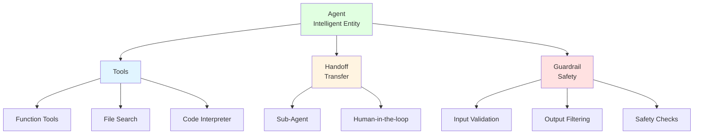

# 9.3 Agent Frameworks in Practice <DifficultyBadge level="advanced" /> <CostBadge cost="$0.05" />

> Prerequisites: 9.2 ReAct Pattern

### Why Do We Need It? (Problem)

In the previous section, we hand-wrote a ReAct Agent. While it works, it has many issues:

**Problem 1: Large codebase, error-prone**
```python
# Details hand-written Agent needs to handle:
- Build prompt templates
- Parse Action format (regex)
- Tool registration and calling
- Error handling
- Conversation history management
- Token statistics
- Timeout control
# Total ~150 lines of code, easy to introduce bugs
```

**Problem 2: Missing advanced features**
- ❌ No long-term memory
- ❌ No multi-turn conversation support
- ❌ No streaming output
- ❌ Cannot integrate vector databases
- ❌ No multi-Agent collaboration

**Problem 3: High maintenance cost**
- Need manual adaptation for every OpenAI API update
- Adding new tools requires modifying multiple places
- Difficult to reuse and share

**We need a mature framework to focus on business logic, not low-level implementation.**

### What Is It? (Concept)

**Comparison of Mainstream Agent Frameworks**

| Framework | Developer | Positioning | Strengths | Weaknesses | Suitable Scenarios |
|-----|--------|------|------|------|---------|
| **OpenAI Agents SDK** | OpenAI | Official framework | Simple, stable, native GPT support | Smaller ecosystem, fewer features | Production, simple Agents |
| **LangGraph** | LangChain | Graph state machine | Flexible, controllable, visualizable | Steep learning curve, complex code | Complex workflows, precise control needed |
| **CrewAI** | CrewAI | Multi-Agent collaboration | Easy to use, role-based, good collaboration | Less flexible, more black-box | Multi-Agent tasks |
| **AutoGPT** | Significant Gravitas | Autonomous Agent | Strong autonomy, feature-rich | Unstable, expensive | Research and experiments |
| **MetaGPT** | DeepWisdom | Software dev Agent | Specialized, complete process | Domain-limited | Software engineering tasks |

**Focus: OpenAI Agents SDK**

We'll focus on **OpenAI Agents SDK** because:
1. **Official support**: Maintained by OpenAI, stable and reliable
2. **Simple and easy**: Clean API design, low learning curve
3. **Production-ready**: Suitable for production deployment
4. **Native integration**: Deep integration with GPT models

**OpenAI Agents SDK Core Concepts**



**1. Agent (Intelligent Entity)**

Agent is the core execution unit, containing:
- **Instructions**: Agent's "persona" and behavior rules
- **Model**: LLM model to use
- **Tools**: Callable functions

```python
from openai import OpenAI

client = OpenAI()

agent = client.beta.assistants.create(
    name="Math Tutor",
    instructions="You are a helpful math tutor. Use the calculator when needed.",
    model="gpt-4.1-mini",
    tools=[{"type": "code_interpreter"}],
)
```

**2. Tools**

Three types of tools:

**a) Function Tools**
- Custom Python functions
- Same as Function Calling

```python
tools = [
    {
        "type": "function",
        "function": {
            "name": "get_weather",
            "description": "Get current weather in a location",
            "parameters": {
                "type": "object",
                "properties": {
                    "location": {"type": "string"},
                },
                "required": ["location"],
            },
        },
    }
]
```

**b) File Search**
- Upload documents, Agent automatically retrieves
- Built-in vector database

```python
tools = [{"type": "file_search"}]

# Upload file
file = client.files.create(
    file=open("document.pdf", "rb"),
    purpose="assistants",
)
```

**c) Code Interpreter**
- Agent can write and execute code
- Suitable for data analysis, visualization

```python
tools = [{"type": "code_interpreter"}]
```

**3. Handoff (Transfer)**

When task exceeds current Agent's capability, transfer to other Agents or humans.

```python
# Main Agent can transfer to specialized Agents
main_agent = create_agent(
    name="Receptionist",
    handoffs=["billing_agent", "tech_support_agent"]
)
```

**4. Guardrail (Safety)**

Safety checks and restrictions:
- Input validation (prevent injection attacks)
- Output filtering (prevent sensitive info leakage)
- Cost control (limit token usage)

**OpenAI Agents SDK vs Hand-written Agent**

| Comparison | Hand-written Agent | OpenAI Agents SDK |
|-------|-----------|-------------------|
| Code Size | ~150 lines | ~15 lines |
| Error Handling | Manual | Automatic |
| Conversation History | Manual management | Auto-managed |
| Tool Registration | Dictionary mapping | Declarative config |
| Streaming Output | Manual implementation | Native support |
| Multi-turn Conversation | Manual implementation | Native support |
| File Processing | Manual implementation | Built-in |
| Deployment | Self-hosted service | Cloud-hosted |

### Hands-On Practice (Practice)

We'll rewrite the previous ReAct Agent using OpenAI Agents SDK.

**Step 1: Create Agent**

```python
import os
from openai import OpenAI

client = OpenAI()

# Define tools
tools = [
    {
        "type": "function",
        "function": {
            "name": "calculator",
            "description": "Calculate a mathematical expression",
            "parameters": {
                "type": "object",
                "properties": {
                    "expression": {
                        "type": "string",
                        "description": "Mathematical expression to evaluate, e.g. '2 + 2' or '(123 + 456) * 789'",
                    }
                },
                "required": ["expression"],
            },
        },
    },
    {
        "type": "function",
        "function": {
            "name": "search",
            "description": "Search Wikipedia for information",
            "parameters": {
                "type": "object",
                "properties": {
                    "query": {
                        "type": "string",
                        "description": "Search query",
                    }
                },
                "required": ["query"],
            },
        },
    },
]

# Create Agent
agent = client.beta.assistants.create(
    name="Research Assistant",
    instructions="""You are a helpful research assistant.
    
When asked a question:
1. Break it down into steps
2. Use the calculator tool for math problems
3. Use the search tool to find factual information
4. Provide clear, well-reasoned answers

Always explain your reasoning process.""",
    model="gpt-4.1-mini",
    tools=tools,
)

print(f"Agent created: {agent.id}")
```

**Step 2: Implement Tool Functions**

```python
import requests

def calculator(expression: str) -> str:
    """Calculate mathematical expression"""
    try:
        result = eval(expression, {"__builtins__": {}}, {})
        return str(result)
    except Exception as e:
        return f"Error: {str(e)}"

def search(query: str) -> str:
    """Search Wikipedia"""
    try:
        url = f"https://en.wikipedia.org/api/rest_v1/page/summary/{query}"
        response = requests.get(url)
        if response.status_code == 200:
            data = response.json()
            return data.get("extract", "No summary found")
        return "Not found"
    except Exception as e:
        return f"Error: {str(e)}"

# Tool mapping
TOOL_MAP = {
    "calculator": calculator,
    "search": search,
}
```

**Step 3: Run Agent**

```python
def run_agent(agent_id: str, user_message: str, verbose: bool = True):
    """
    Run Agent and handle tool calls
    """
    # Create conversation thread
    thread = client.beta.threads.create()
    
    # Add user message
    client.beta.threads.messages.create(
        thread_id=thread.id,
        role="user",
        content=user_message,
    )
    
    if verbose:
        print(f"\n{'='*80}")
        print(f"User: {user_message}")
        print(f"{'='*80}\n")
    
    # Run Agent
    run = client.beta.threads.runs.create(
        thread_id=thread.id,
        assistant_id=agent_id,
    )
    
    # Poll until complete
    while True:
        run_status = client.beta.threads.runs.retrieve(
            thread_id=thread.id,
            run_id=run.id,
        )
        
        if verbose:
            print(f"Status: {run_status.status}")
        
        # Need to execute tool
        if run_status.status == "requires_action":
            tool_calls = run_status.required_action.submit_tool_outputs.tool_calls
            tool_outputs = []
            
            for tool_call in tool_calls:
                function_name = tool_call.function.name
                function_args = eval(tool_call.function.arguments)
                
                if verbose:
                    print(f"\n🔧 Calling: {function_name}({function_args})")
                
                # Execute tool
                result = TOOL_MAP[function_name](**function_args)
                
                if verbose:
                    print(f"📊 Result: {result}")
                
                tool_outputs.append({
                    "tool_call_id": tool_call.id,
                    "output": result,
                })
            
            # Submit tool outputs
            client.beta.threads.runs.submit_tool_outputs(
                thread_id=thread.id,
                run_id=run.id,
                tool_outputs=tool_outputs,
            )
        
        # Complete
        elif run_status.status == "completed":
            break
        
        # Failed
        elif run_status.status in ["failed", "cancelled", "expired"]:
            print(f"❌ Run {run_status.status}")
            return None
        
        # Wait
        import time
        time.sleep(1)
    
    # Get final answer
    messages = client.beta.threads.messages.list(thread_id=thread.id)
    final_message = messages.data[0].content[0].text.value
    
    if verbose:
        print(f"\n{'='*80}")
        print(f"Assistant: {final_message}")
        print(f"{'='*80}\n")
    
    return final_message
```

**Step 4: Test Agent**

```python
# Test 1: Needs calculation
result1 = run_agent(
    agent.id,
    "What is (123 + 456) * 789?"
)

# Test 2: Needs search
result2 = run_agent(
    agent.id,
    "Who created the Python programming language?"
)

# Test 3: Needs multi-step reasoning
result3 = run_agent(
    agent.id,
    "What is the population of the birthplace of Python's creator?"
)
```

**Sample Output:**

```
================================================================================
User: What is the population of the birthplace of Python's creator?
================================================================================

Status: in_progress

🔧 Calling: search({'query': 'Python creator'})
📊 Result: Python was created by Guido van Rossum in 1991.

Status: in_progress

🔧 Calling: search({'query': 'Guido van Rossum birthplace'})
📊 Result: Guido van Rossum was born in Haarlem, Netherlands.

Status: in_progress

🔧 Calling: search({'query': 'Haarlem Netherlands population'})
📊 Result: As of 2023, Haarlem has a population of approximately 162,000.

Status: completed

================================================================================
Assistant: The creator of Python is Guido van Rossum, who was born in Haarlem, Netherlands. 
The population of Haarlem is approximately 162,000 as of 2023.
================================================================================
```

**Step 5: Add Streaming Output**

```python
def run_agent_streaming(agent_id: str, user_message: str):
    """
    Agent with streaming output support
    """
    thread = client.beta.threads.create()
    
    client.beta.threads.messages.create(
        thread_id=thread.id,
        role="user",
        content=user_message,
    )
    
    # Stream run
    with client.beta.threads.runs.stream(
        thread_id=thread.id,
        assistant_id=agent_id,
    ) as stream:
        for event in stream:
            # Text output
            if event.event == "thread.message.delta":
                delta = event.data.delta.content[0].text.value
                print(delta, end="", flush=True)
            
            # Tool call
            elif event.event == "thread.run.requires_action":
                # Handle tool calls...
                pass
    
    print()  # Newline
```

**Comparison with LangGraph**

Let's implement the same functionality using LangGraph for comparison:

```python
from langgraph.graph import StateGraph, END
from langgraph.prebuilt import ToolNode

# Define state
class AgentState(TypedDict):
    messages: list
    
# Define tool node
tool_node = ToolNode(tools=[calculator, search])

# Build graph
workflow = StateGraph(AgentState)

# Add nodes
workflow.add_node("agent", call_model)
workflow.add_node("tools", tool_node)

# Add edges
workflow.add_edge("agent", "tools")
workflow.add_conditional_edges(
    "tools",
    should_continue,
    {
        "continue": "agent",
        "end": END,
    },
)

# Compile
app = workflow.compile()

# Run
result = app.invoke({"messages": [("user", "Your question")]})
```

**Framework Comparison Summary:**

| Feature | OpenAI Agents SDK | LangGraph |
|-----|-------------------|-----------|
| Code Size | ⭐⭐⭐ Very small | ⭐⭐ More |
| Learning Curve | ⭐⭐⭐ Simple | ⭐ Steep |
| Flexibility | ⭐⭐ Medium | ⭐⭐⭐ Very high |
| Visualization | ⭐ None | ⭐⭐⭐ Excellent |
| Flow Control | ⭐⭐ Automatic | ⭐⭐⭐ Precise |
| Production Ready | ⭐⭐⭐ Yes | ⭐⭐ Needs testing |

**Selection Recommendations:**

✅ **Choose OpenAI Agents SDK when:**
- Simple to medium complexity Agents
- Need rapid development and deployment
- Mainly using GPT models
- Team not very familiar with AI

✅ **Choose LangGraph when:**
- Need precise control of execution flow
- Complex conditional branches and loops
- Need visualization for debugging
- Need to support multiple LLMs

<ColabBadge path="demos/09-ai-agents/frameworks.ipynb" />

### Summary (Reflection)

- **What we solved**: From hand-writing 150 lines of code to using framework with 15 lines, 10x efficiency improvement
- **What we didn't solve**: Agents can only call APIs, can't operate computers like humans — next section introduces Computer Use
- **Key Takeaways**:
  1. **Frameworks greatly simplify development**: From low-level implementation to declarative configuration
  2. **OpenAI Agents SDK is preferred**: Simple, stable, production-ready
  3. **Three types of tools**: Function Tools, File Search, Code Interpreter
  4. **Handoff supports collaboration**: Agents can transfer tasks to other Agents
  5. **Choose framework based on needs**: Simple tasks use OpenAI SDK, complex workflows use LangGraph

**Frameworks are not silver bullets:**
- Understanding underlying principles (ReAct) helps use frameworks effectively
- Frameworks have learning costs and abstraction overhead
- Simple tasks may not need frameworks

---

*Last updated: 2026-02-20*
