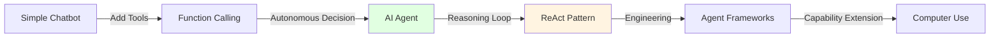
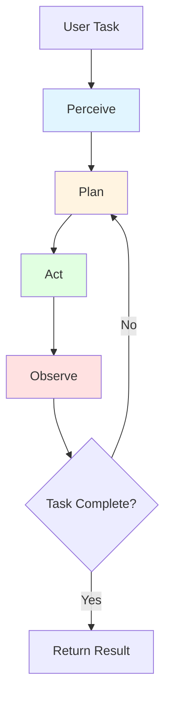
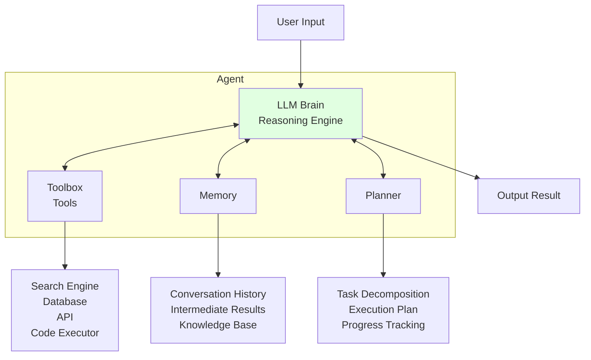
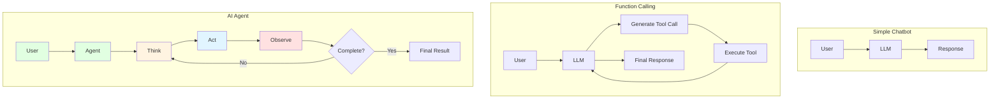
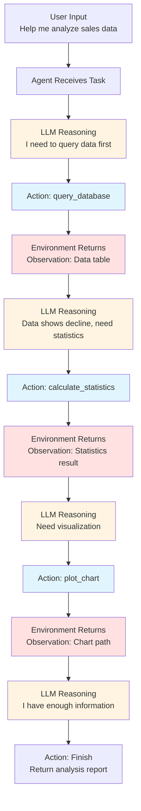

# Chapter 9: AI Agent

> After completing this chapter, you will: understand the essence of Agents, hand-write a ReAct Agent, and use mainstream frameworks to build Agents



## 9.1 Core Agent Concepts <DifficultyBadge level="intermediate" /> <CostBadge cost="$0" />

> Prerequisites: 7.1 Function Calling Basics

### Why Do We Need It? (Problem)

Once you've mastered Function Calling, you'll discover a new problem: **Who decides when to call which tool?**

**Scenario 1: Booking a Flight**

User: "Help me book a flight from Beijing to Shanghai tomorrow"

```python
# Need to call multiple tools sequentially
1. search_flights(from="Beijing", to="Shanghai", date="2026-02-21")
2. check_seat_availability(flight_id="CA1234")  
3. get_user_payment_info()
4. book_flight(flight_id="CA1234", passenger_info={...})
5. send_confirmation_email(booking_id="BK789")
```

**Problems:**
- Manual orchestration means writing if-else statements — no different from traditional programming
- If LLM plans everything at once, what happens when intermediate state changes? (e.g., seats get taken)
- If tool calls fail, who handles retries or alternative plans?

**Scenario 2: Data Analysis Task**

User: "Analyze last month's sales data and find reasons for declining trends"

```python
# Uncertain number of tool calls needed
1. query_database(sql="SELECT * FROM sales WHERE date > '2026-01-20'")
2. Found anomaly → calculate_statistics(data)
3. Need more data → query_database(sql="SELECT * FROM marketing WHERE...")  
4. Generate chart → plot_chart(data, type="line")
5. Write report → generate_report(findings)
```

**Problems:**
- **Uncertain number of calls**: Could need 3, could need 10
- **Each call depends on previous results**: Next step depends on current findings
- **Needs intermediate reasoning**: Not just "call tools," but "think → act → observe → think again"

**Fundamental Contradiction:**

Function Calling solves **"how to use tools"**, but not **"when to use, which one, how many times"**.

This requires an **AI Agent** — an intelligent entity that can **make autonomous decisions and take continuous actions**.

### What Is It? (Concept)

**What is an AI Agent?**

An AI Agent (intelligent agent) is an entity that can:
1. **Perceive**: Understand tasks and environmental states
2. **Plan**: Decide what to do next
3. **Act**: Call tools or generate output
4. **Observe**: Review execution results
5. **Iterate**: Adjust plans based on observations

Until the task is complete.



**AI Agent vs Simple LLM Call**

| Dimension | Simple LLM Call | Function Calling | AI Agent |
|-----|-------------|------------------|----------|
| **Interaction Count** | One-shot | One or few times | Multiple loops until complete |
| **Decision-Making** | Manual prompt design | Manual tool selection | AI decides next step |
| **Tool Usage** | None | Call predefined tools | Autonomously select and combine tools |
| **Error Handling** | Cannot handle | Requires manual intervention | Auto retry or adjust strategy |
| **Task Complexity** | Single Q&A | Single-step or simple multi-step | Complex multi-step with reasoning |

**Key Difference: Autonomy**

```python
# Simple LLM call: You decide everything
response = llm.chat("What is Python?")

# Function Calling: You decide when to call
if user_asks_weather():
    result = call_weather_api()
    response = llm.chat(f"The weather is {result}")

# AI Agent: AI decides what to do
agent = Agent(tools=[weather, calculator, search])
response = agent.run("Help me plan tomorrow's schedule")  # AI decides which tools, how many times
```

**Core Components of an Agent**



1. **LLM Brain (Reasoning Engine)**
   - Core reasoning engine
   - Understand tasks, make decisions, generate actions

2. **Toolbox (Tools)**
   - Callable external functions
   - Examples: search engine, database, calculator, code executor

3. **Memory**
   - Short-term memory: conversation history and intermediate results for current task
   - Long-term memory: knowledge base, past experience

4. **Planner**
   - Task decomposition: break large tasks into small steps
   - Execution plan: decide what to do first, what to do next
   - Progress tracking: know which step we're on

**Agent vs Chatbot vs Function Calling**



**Key Features:**

1. **Simple Chatbot**:
   - Single conversation, stateless
   - Cannot use tools
   - Suitable for: FAQ, casual chat

2. **Function Calling**:
   - Can call tools
   - But requires manual decision logic
   - Suitable for: tasks with known workflows

3. **AI Agent**:
   - Autonomous decision-making, iterative execution
   - Handles open-ended, uncertain tasks
   - Suitable for: complex tasks, multi-step reasoning

### Hands-On Practice (Practice)

**Concept Demo: Agent's Thinking Process**

Let's understand the Agent workflow through an example without writing code.

**Task:** "Calculate (123 + 456) × 789 and tell me if the result is a prime number"

**Agent's Reasoning Process:**

```
[Step 1] Perceive Task
User request: Calculate expression and check if prime
Analysis: Need two tools — calculator + prime checker

[Step 2] Plan
Plan:
  1. Use calculator to compute (123 + 456) × 789
  2. After getting result, use prime checker
  3. Return final answer

[Step 3] Execute - 1st Loop
Think: "I need to calculate the expression first"
Act: Call calculator((123 + 456) × 789)
Observe: Got result 456831

[Step 4] Execute - 2nd Loop  
Think: "I got the result 456831, now need to check if it's prime"
Act: Call is_prime(456831)
Observe: Got result False (456831 = 3 × 152277)

[Step 5] Complete
Think: "I've completed all necessary calculations"
Final Answer: "(123 + 456) × 789 = 456831, which is not a prime number because it's divisible by 3"
```

**Comparison: If Using Function Calling**

```python
# Need manual logic
result1 = calculator((123 + 456) * 789)
result2 = is_prime(result1)
response = f"{result1} is {'a prime' if result2 else 'not a prime'}"
```

**Agent Advantages:**
- No need for manual if-else
- Automatically determines call order
- Can handle uncertain tasks (like "analyze data")

---

### Classic Agent Paradigms

Understanding the main patterns for building agents is key to implementing them effectively. These paradigms, detailed in [hello-agents Chapter 4](https://datawhalechina.github.io/hello-agents/#/), represent the core design patterns of the agent world:

#### ReAct (Reasoning + Acting)

The most widely adopted agent pattern. The agent alternates between **Reasoning** (thinking about what to do) and **Acting** (executing a tool), then **Observing** the result:

```
Thought: I need to find the current stock price of AAPL
Action: search("AAPL stock price")
Observation: AAPL is trading at $198.50
Thought: Now I need to calculate the portfolio value
Action: calculator(100 * 198.50)
Observation: 19850.0
Thought: I have all the information needed
Answer: Your 100 shares of AAPL are worth $19,850.00
```

This is the pattern used by most production agents including Claude Code and OpenAI Codex.

#### Plan-and-Solve

The agent first creates a complete plan, then executes it step by step:

```
Plan:
1. Query the database for last month's sales data
2. Calculate key statistics (mean, median, trend)
3. Identify anomalies or significant changes
4. Generate a visualization chart
5. Write a summary report

Execute: [runs each step sequentially, adjusting if needed]
```

Best for well-defined tasks where the full scope is known upfront.

#### Reflection

The agent reviews its own output and iteratively improves:

```
Draft: [generates initial code/text]
Review: "The error handling is incomplete, missing edge case for empty input"
Revision: [improves the code based on self-review]
Review: "Looks good now, all edge cases handled"
Final: [outputs the refined result]
```

This pattern powers features like "self-healing code" in modern AI coding tools.

::: tip The Agent Loop — Foundation of All Paradigms
All these paradigms share a common foundation: the **Agent Loop** (see [learn-claude-code](https://github.com/shareAI-lab/learn-claude-code)):

```python
while True:
    response = llm.generate(messages, tools)
    if response.stop_reason != "tool_use":
        return response  # Done
    result = execute_tool(response.tool_call)
    messages.append(result)  # Feed back and continue
```

The difference between paradigms is *how the LLM reasons* within this loop — ReAct interleaves thought and action, Plan-and-Solve front-loads planning, and Reflection adds a self-critique step.
:::

---

**Real Agent Architecture Diagram**



**What Can Agents Do? What Can't They Do?**

✅ **Tasks Agents Excel At:**
1. **Multi-step reasoning tasks**: Require multiple thinking and action cycles
2. **Uncertain tasks**: Don't know exactly how many steps needed
3. **Tool combination needed**: One task requires multiple tools
4. **Intermediate judgments needed**: Next step depends on intermediate results

❌ **Tasks Agents Are Not Suited For:**
1. **Simple Q&A**: Direct LLM call is faster and cheaper
2. **Fixed workflows**: Hard-coded logic more reliable for known steps
3. **High real-time requirements**: Agent loops need multiple LLM calls, takes time
4. **Cost-sensitive**: Each loop calls LLM, cost is N times regular calls

### Summary (Reflection)

- **What we solved**: Understood the essence of Agents — not "calling tools" but "autonomous decision loops"
- **What we didn't solve**: Know what an Agent is, but don't know how to implement one — next section we'll hand-write the simplest Agent
- **Key Takeaways**:
  1. **Agent's core is autonomous decision-making**: No manual orchestration needed, AI decides next step
  2. **Agent's work loop**: Perceive → Plan → Act → Observe → Loop
  3. **Agent vs Function Calling**: Function Calling is a tool, Agent is the intelligent entity using tools
  4. **Agent suits complex multi-step tasks**: Uncertainty, needs reasoning, needs tool combination
  5. **Agent is not a silver bullet**: Using Agent for simple tasks is wasteful, higher cost and latency

> *"An Agent is basically a while-True loop with an LLM inside — sounds embarrassingly simple, yet this pattern powers virtually every AI coding tool in 2026. Sometimes the best ideas are the dumb ones."*

---

*Last updated: 2026-02-20*
