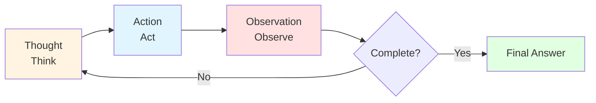
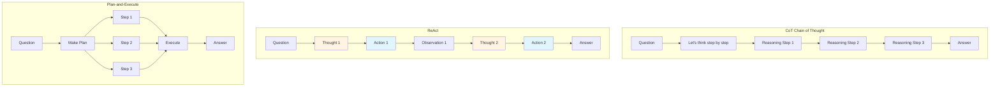

# 9.2 ReAct Pattern <DifficultyBadge level="intermediate" /> <CostBadge cost="$0.05" />

> Prerequisites: 7.1 Function Calling Basics, 9.1 Core Agent Concepts

### Why Do We Need It? (Problem)

In the previous section, we understood the essence of Agents: **iterative reasoning and action**. But how exactly do we implement it?

**Core Challenge: How to make LLM both think and act?**

Let's look at a failed example:

```python
# Wrong example: Directly ask LLM to call tools
prompt = "Calculate 123 + 456 and check if it's a prime number"
response = llm.chat(prompt, tools=[calculator, is_prime])
# Problem: LLM might directly answer "579, not prime" (guessing)
# Or only call one tool without forming a reasoning chain
```

**Problem 1: LLM "skips thinking"**
- Directly gives answer without calling tools
- Or calls tools but doesn't explain why

**Problem 2: Cannot form reasoning chains**
- When multi-step reasoning is needed, LLM easily "disconnects"
- No clear think → act → observe loop

**Problem 3: Difficult to debug**
- Don't know what the AI is thinking
- Can't trace reasoning process when errors occur

**We need a clear pattern that forces LLM to follow a "think → act" rhythm.**

This is **ReAct**.

### What Is It? (Concept)

**ReAct = Reasoning + Acting**

ReAct is a simple but powerful Agent pattern with a core idea:

> **Before each action, must think; after each action, must observe.**



**Three Phases of ReAct Loop:**

1. **Thought (Think)**
   - LLM generates reasoning process
   - Explicitly states "what I'm doing now and why"

2. **Action (Act)**
   - Call tool or execute operation
   - Format: `Action: tool_name[input]`

3. **Observation (Observe)**
   - Return tool execution result
   - Format: `Observation: result`

**Example: Complete ReAct Reasoning Chain**

Task: "What time is it in Beijing now? Is it daytime or nighttime there?"

```
Thought 1: I need to get Beijing's current time first
Action 1: get_current_time[Beijing]
Observation 1: 2026-02-20 14:30:00

Thought 2: It's 14:30, 2:30 PM, should be daytime
Action 2: Finish[Beijing is now 2026-02-20 14:30 (2:30 PM), it's daytime]
```

**ReAct vs Other Patterns**

| Pattern | Thinking Method | Use Cases | Pros | Cons |
|-----|---------|---------|------|------|
| **ReAct** | Alternate reasoning and action | Tasks needing tools | Interpretable, easy to debug | Each step calls LLM, expensive |
| **CoT (Chain of Thought)** | One-shot reasoning | Pure reasoning tasks | Simple, cheap | Cannot use tools |
| **Plan-and-Execute** | Plan first then execute | Tasks with known steps | Efficient | Cannot dynamically adjust plan |



**ReAct Prompt Structure**

```
You run in a loop of Thought, Action, Observation.
At the end of the loop you output a Final Answer.

Use Thought to describe your reasoning about the question.
Use Action to run one of the available actions.
Observation will be the result of running those actions.

Available actions:
- calculator[expression]: Calculate a math expression
- search[query]: Search the internet
- finish[answer]: Return the final answer

Example session:
Question: What is 25 * 4 + 10?
Thought 1: I need to calculate this expression
Action 1: calculator[25 * 4 + 10]
Observation 1: 110
Thought 2: I have the answer
Action 2: finish[110]

Now it's your turn:
Question: {user_question}
```

**Key Design Points:**

1. **Clear format conventions**
   - `Thought N:`, `Action N:`, `Observation N:` have fixed formats
   - Easy to parse and debug

2. **Few-shot examples**
   - Show LLM a complete example
   - Help LLM understand the format

3. **Finish action**
   - Clear termination signal
   - Avoid infinite loops

**ReAct Implementation Logic**

```python
def react_agent(question, tools, max_steps=10):
    """
    ReAct Agent core loop
    """
    prompt = build_react_prompt(question, tools)
    
    for step in range(1, max_steps + 1):
        # 1. LLM generates Thought + Action
        response = llm.chat(prompt)
        
        # 2. Parse Action
        action = parse_action(response)
        
        # 3. Execute Action
        if action.name == "finish":
            return action.input  # Return final answer
        
        observation = execute_tool(action.name, action.input)
        
        # 4. Add Observation to prompt
        prompt += f"\nObservation {step}: {observation}"
        prompt += f"\nThought {step + 1}:"
    
    return "Max steps reached"
```

### Hands-On Practice (Practice)

We'll hand-write a ReAct Agent from scratch without using any framework.

**Task Goals:**
- Support two tools: calculator + Wikipedia search
- Handle questions requiring multi-step reasoning
- Output complete reasoning process

**Step 1: Define Tools**

```python
import re
import requests

# Tool 1: Calculator
def calculator(expression: str) -> str:
    """
    Calculate mathematical expression
    """
    try:
        # Safe calculation: only allow numbers and basic operators
        result = eval(expression, {"__builtins__": {}}, {})
        return str(result)
    except Exception as e:
        return f"Error: {str(e)}"

# Tool 2: Wikipedia search (simplified)
def wikipedia_search(query: str) -> str:
    """
    Search Wikipedia and return summary
    """
    try:
        url = "https://en.wikipedia.org/api/rest_v1/page/summary/" + query
        response = requests.get(url)
        if response.status_code == 200:
            data = response.json()
            return data.get("extract", "No summary found")
        else:
            return "Not found"
    except Exception as e:
        return f"Error: {str(e)}"

# Tool registry
TOOLS = {
    "calculator": calculator,
    "search": wikipedia_search,
}
```

**Step 2: Build ReAct Prompt**

```python
REACT_PROMPT_TEMPLATE = """You run in a loop of Thought, Action, Observation.
At the end of the loop you output a Final Answer.

Use Thought to describe your reasoning about the question.
Use Action to run one of the available actions - actions are like Python function calls.
Observation will be the result of running those actions.

Available actions:
- calculator[expression]: Calculate a math expression. Example: calculator[25 * 4 + 10]
- search[query]: Search Wikipedia. Example: search[Python programming language]
- finish[answer]: Return the final answer and stop. Example: finish[The answer is 42]

IMPORTANT: 
- You can only use ONE action per step
- Always output "Thought N:" before "Action N:"
- After each action, wait for "Observation N:" before continuing

Example session:
Question: What is the population of the capital of France?
Thought 1: I need to first find out what the capital of France is.
Action 1: search[capital of France]
Observation 1: Paris is the capital and most populous city of France.
Thought 2: Now I know the capital is Paris. I need to find its population.
Action 2: search[population of Paris]
Observation 2: As of 2023, the population of Paris is approximately 2.2 million.
Thought 3: I have the answer now.
Action 3: finish[The population of Paris is approximately 2.2 million]

Now it's your turn:
Question: {question}
Thought 1:"""

def build_prompt(question: str) -> str:
    return REACT_PROMPT_TEMPLATE.format(question=question)
```

**Step 3: Parse Action**

```python
def parse_action(text: str) -> tuple[str, str]:
    """
    Parse Action from LLM output
    
    Format: Action N: tool_name[input]
    Returns: (tool_name, input)
    """
    # Match "Action N: tool_name[input]"
    action_pattern = r"Action \d+: (\w+)\[(.*?)\]"
    match = re.search(action_pattern, text)
    
    if match:
        tool_name = match.group(1)
        tool_input = match.group(2)
        return tool_name, tool_input
    
    return None, None
```

**Step 4: Implement ReAct Loop**

```python
from openai import OpenAI

client = OpenAI()

def react_agent(question: str, max_steps: int = 10, verbose: bool = True) -> str:
    """
    ReAct Agent main loop
    """
    prompt = build_prompt(question)
    
    if verbose:
        print("=" * 80)
        print(f"Question: {question}")
        print("=" * 80)
    
    for step in range(1, max_steps + 1):
        # 1. LLM generates reasoning and action
        response = client.chat.completions.create(
            model="gpt-4.1-mini",
            messages=[{"role": "user", "content": prompt}],
            temperature=0,  # Deterministic output
        )
        
        llm_output = response.choices[0].message.content
        
        if verbose:
            print(f"\n{llm_output}")
        
        # 2. Parse Action
        tool_name, tool_input = parse_action(llm_output)
        
        if tool_name is None:
            return "Error: Failed to parse action"
        
        # 3. Check if finished
        if tool_name == "finish":
            if verbose:
                print("\n" + "=" * 80)
                print(f"Final Answer: {tool_input}")
                print("=" * 80)
            return tool_input
        
        # 4. Execute tool
        if tool_name not in TOOLS:
            observation = f"Error: Unknown tool '{tool_name}'"
        else:
            observation = TOOLS[tool_name](tool_input)
        
        if verbose:
            print(f"Observation {step}: {observation}")
        
        # 5. Update prompt
        prompt += llm_output
        prompt += f"\nObservation {step}: {observation}\n"
        prompt += f"Thought {step + 1}:"
    
    return "Error: Max steps reached without finishing"
```

**Step 5: Test Agent**

```python
# Test 1: Question requiring calculation
question1 = "What is (123 + 456) * 789?"
answer1 = react_agent(question1)

# Test 2: Question requiring search
question2 = "Who created Python programming language?"
answer2 = react_agent(question2)

# Test 3: Question requiring multi-step reasoning
question3 = "What is the population of the birthplace of the creator of Python?"
answer3 = react_agent(question3)
```

**Sample Output:**

```
================================================================================
Question: What is the population of the birthplace of the creator of Python?
================================================================================

Thought 1: I need to first find out who created Python.
Action 1: search[creator of Python]
Observation 1: Python was created by Guido van Rossum in 1991.

Thought 2: Now I know Guido van Rossum created Python. I need to find his birthplace.
Action 2: search[Guido van Rossum birthplace]
Observation 2: Guido van Rossum was born in Haarlem, Netherlands.

Thought 3: Now I know he was born in Haarlem. I need to find the population of Haarlem.
Action 3: search[population of Haarlem Netherlands]
Observation 3: As of 2023, Haarlem has a population of approximately 162,000.

Thought 4: I have all the information I need.
Action 4: finish[The population of Haarlem, the birthplace of Python creator Guido van Rossum, is approximately 162,000]
================================================================================
Final Answer: The population of Haarlem, the birthplace of Python creator Guido van Rossum, is approximately 162,000
================================================================================
```

**Step 6: Add Safety Mechanisms**

```python
def react_agent_safe(question: str, max_steps: int = 10, verbose: bool = True) -> dict:
    """
    ReAct Agent with error handling and statistics
    """
    prompt = build_prompt(question)
    history = []
    total_tokens = 0
    
    for step in range(1, max_steps + 1):
        try:
            response = client.chat.completions.create(
                model="gpt-4.1-mini",
                messages=[{"role": "user", "content": prompt}],
                temperature=0,
            )
            
            llm_output = response.choices[0].message.content
            total_tokens += response.usage.total_tokens
            
            # Record history
            history.append({
                "step": step,
                "thought_and_action": llm_output,
            })
            
            # Parse Action
            tool_name, tool_input = parse_action(llm_output)
            
            if tool_name is None:
                return {
                    "status": "error",
                    "message": "Failed to parse action",
                    "history": history,
                }
            
            # Check termination
            if tool_name == "finish":
                return {
                    "status": "success",
                    "answer": tool_input,
                    "steps": step,
                    "total_tokens": total_tokens,
                    "history": history,
                }
            
            # Execute tool
            observation = TOOLS.get(tool_name, lambda x: f"Unknown tool: {tool_name}")(tool_input)
            
            history[-1]["observation"] = observation
            
            # Update prompt
            prompt += llm_output
            prompt += f"\nObservation {step}: {observation}\n"
            prompt += f"Thought {step + 1}:"
            
        except Exception as e:
            return {
                "status": "error",
                "message": str(e),
                "history": history,
            }
    
    return {
        "status": "timeout",
        "message": f"Max steps ({max_steps}) reached",
        "history": history,
    }
```

<ColabBadge path="demos/09-ai-agents/react_agent.ipynb" />

### Summary (Reflection)

- **What we solved**: Hand-wrote a ReAct Agent from scratch, understood the core implementation principles of Agents
- **What we didn't solve**: Hand-written Agents require lots of code, error-prone, lack advanced features — next section introduces mature Agent frameworks
- **Key Takeaways**:
  1. **ReAct = Reasoning + Acting**: Think before each action, observe after each action
  2. **Prompt engineering is key**: Clear format conventions make LLM follow ReAct pattern
  3. **Parsing Action is core logic**: Use regex to extract tool name and input
  4. **Loop until finish**: Agent decides when task is complete
  5. **Value of hand-writing Agents**: Understanding principles helps master frameworks

**From Hand-written to Framework:**
- Hand-written Agent: ~100 lines of code, need to handle all details yourself
- Agent Framework: ~10 lines of code, automatically handles parsing, errors, memory, etc.

In the next section, we'll rewrite this Agent using OpenAI Agents SDK to experience the power of frameworks.

---

*Last updated: 2026-02-20*
