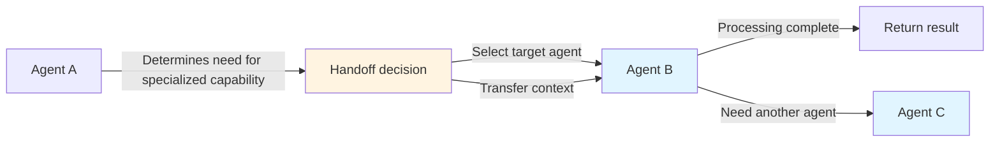
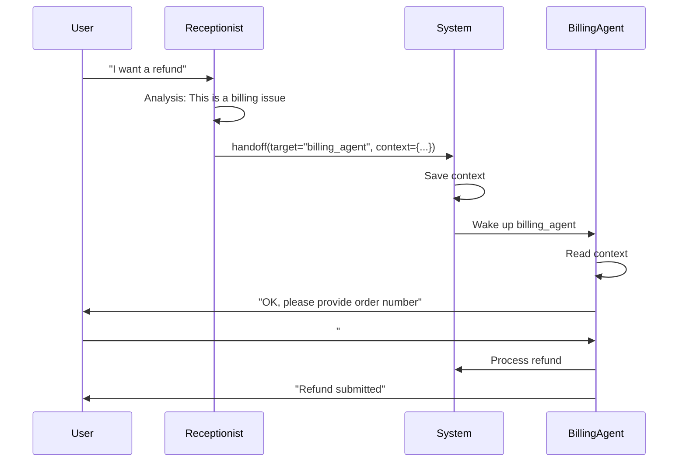
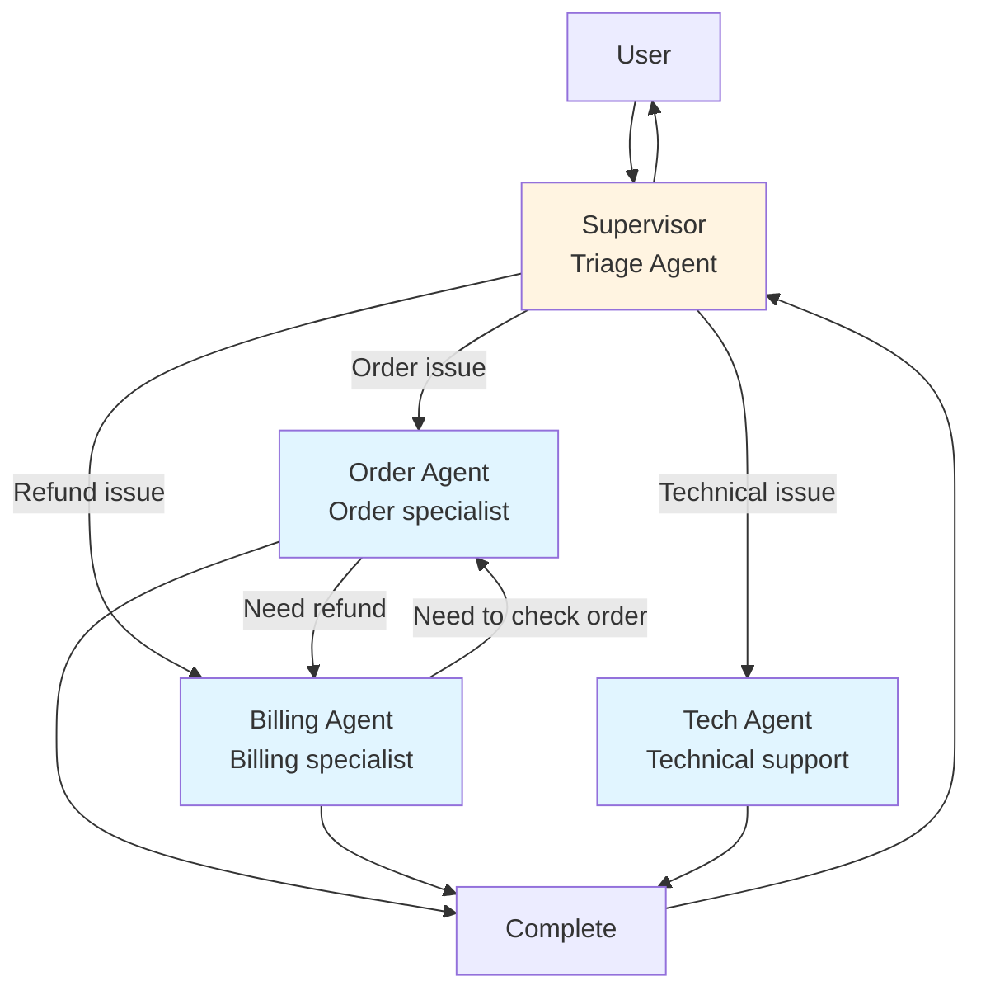

# 10.2 Sub-Agent and Handoff <DifficultyBadge level="advanced" /> <CostBadge cost="$0.10" />

> Prerequisites: 9.3 Agent Framework in Practice, 10.1 Multi-Agent Architecture

### Why do we need it? (Problem)

In the previous section, we learned about four collaboration patterns for multi-agents, but a core problem remains unsolved:

**How does an agent know when to "handoff" a task?**

**Scenario: Customer service system**

```
User: "My order #12345 hasn't shipped yet, I want a refund"

Receptionist Agent:
  - Is this an order issue? Or a refund issue?
  - Should I transfer to order specialist? Or billing specialist?
  - If the order specialist can't handle it, how to transfer to billing?
  - How to ensure information isn't lost?
```

**Problem 1: Complex decision making**
```python
# Naive implementation
def handle_request(user_message):
    if "order" in user_message:
        return order_agent.run(user_message)
    elif "refund" in user_message:
        return billing_agent.run(user_message)
    elif "technical" in user_message:
        return tech_agent.run(user_message)
    else:
        return "Sorry, I don't know who to transfer to"

# Problems:
# - Keyword matching too simple, easy to misjudge
# - Cannot handle complex situations (both order and refund)
# - Hard-coded, difficult to extend
```

**Problem 2: Context loss**
```python
# Agent A processes then transfers to Agent B
result_A = agent_A.run(user_message)
result_B = agent_B.run(result_A)  # Agent B can't see original user message!

# Problems:
# - Agent B doesn't know complete context
# - Cannot trace conversation history
```

**Problem 3: Cannot rollback**
```python
# What if transferred incorrectly?
receptionist → order_agent  # Transferred wrong, should go to billing
# Can we go back to receptionist and reassign?
```

**We need a standard "handoff" mechanism.**

### What is it? (Concept)

**What is Handoff?**

Handoff is a mechanism in multi-agent systems where one agent transfers a task to another agent.



**Three elements of Handoff:**

1. **Decision**
   - When to handoff?
   - Handoff to whom?

2. **Context Transfer**
   - What information to transfer?
   - How to ensure information completeness?

3. **Control Flow**
   - Who's in control after handoff?
   - Can we rollback?

**OpenAI Agents SDK Handoff mechanism**

OpenAI Agents SDK natively supports Handoff:

```python
# Define handoff target
handoff_to_billing = {
    "type": "handoff",
    "target": "billing_agent",
    "description": "Transfer to billing specialist for payment issues"
}

# Declare handoff when creating agent
receptionist = client.beta.assistants.create(
    name="Receptionist",
    instructions="You are a receptionist. When users ask about billing, hand off to billing agent.",
    handoffs=[handoff_to_billing],
)
```

**Handoff workflow:**



**Supervisor + Worker pattern**

Most common Handoff pattern: one Supervisor manages multiple Workers



**Characteristics:**
- Supervisor handles triage and coordination
- Workers handle specialized tasks
- Workers can handoff to each other
- All results ultimately return to Supervisor

**Triage Agent pattern**

Specialized "triage" agent that determines routing logic

```python
triage_agent = client.beta.assistants.create(
    name="Triage Agent",
    instructions="""Analyze user requests and route to the appropriate specialist:
    
- Order Agent: order status, tracking, cancellation
- Billing Agent: payments, refunds, invoices  
- Tech Agent: technical issues, bugs, API problems
- General Agent: other questions

Always provide a reason for your routing decision.""",
    handoffs=[
        {"type": "handoff", "target": "order_agent"},
        {"type": "handoff", "target": "billing_agent"},
        {"type": "handoff", "target": "tech_agent"},
        {"type": "handoff", "target": "general_agent"},
    ],
)
```

**Handoff vs Function Calling**

| Comparison | Function Calling | Handoff |
|-------|-----------------|---------|
| **Goal** | Call tool/API | Transfer to another agent |
| **Return** | Synchronous return result | May need multiple rounds of dialogue |
| **Context** | Single call | Continuous conversation context |
| **Control** | Current agent maintains control | Transfer control |
| **Use case** | Data query, computation | Tasks requiring specialized capabilities |

```python
# Function Calling: Call tool and return immediately
result = call_tool("get_weather", location="Beijing")
print(f"The weather is {result}")

# Handoff: Transfer to another agent, may need multiple rounds of dialogue
handoff_to("weather_expert")
# Weather Expert Agent takes over, may ask more questions
# "Do you want today's weather or the forecast for the next week?"
```

### Practice

We'll build a **customer service system** with 1 Supervisor + 3 Worker Agents.

**System architecture:**

```
Supervisor (Receptionist)
├── Order Agent (order specialist)
├── Billing Agent (billing specialist)
└── Tech Agent (technical support)
```

**Step 1: Define Worker Agents**

```python
from openai import OpenAI

client = OpenAI()

# Worker 1: Order Agent
order_agent = client.beta.assistants.create(
    name="Order Specialist",
    instructions="""You are an order specialist.
    
Your responsibilities:
- Check order status
- Track shipments
- Handle cancellations
- Update shipping addresses

If the user wants a refund, hand off to Billing Agent.

Always be professional and helpful.""",
    model="gpt-4.1-mini",
    tools=[
        {
            "type": "function",
            "function": {
                "name": "get_order_status",
                "description": "Get the status of an order",
                "parameters": {
                    "type": "object",
                    "properties": {
                        "order_id": {"type": "string"}
                    },
                    "required": ["order_id"],
                },
            },
        }
    ],
    # Order Agent can handoff to Billing
    handoffs=[
        {
            "type": "handoff",
            "target": "billing_agent",
            "description": "Hand off to billing for refund requests"
        }
    ],
)

# Worker 2: Billing Agent
billing_agent = client.beta.assistants.create(
    name="Billing Specialist",
    instructions="""You are a billing specialist.

Your responsibilities:
- Process refunds
- Handle payment issues
- Generate invoices
- Update payment methods

If you need order details, hand off to Order Agent.

Always verify the order status before processing refunds.""",
    model="gpt-4.1-mini",
    tools=[
        {
            "type": "function",
            "function": {
                "name": "process_refund",
                "description": "Process a refund for an order",
                "parameters": {
                    "type": "object",
                    "properties": {
                        "order_id": {"type": "string"},
                        "amount": {"type": "number"},
                    },
                    "required": ["order_id", "amount"],
                },
            },
        }
    ],
    handoffs=[
        {
            "type": "handoff",
            "target": "order_agent",
            "description": "Hand off to order specialist for order details"
        }
    ],
)

# Worker 3: Tech Agent
tech_agent = client.beta.assistants.create(
    name="Tech Support",
    instructions="""You are a technical support specialist.

Your responsibilities:
- Troubleshoot technical issues
- Help with API problems
- Debug integration issues
- Provide technical documentation

If the issue is not technical, hand off to Receptionist.""",
    model="gpt-4.1-mini",
    tools=[{"type": "code_interpreter"}],
    handoffs=[
        {
            "type": "handoff",
            "target": "receptionist",
            "description": "Hand off to receptionist for non-technical issues"
        }
    ],
)
```

**Step 2: Define Supervisor Agent**

```python
# Supervisor: Receptionist (triage)
receptionist = client.beta.assistants.create(
    name="Receptionist",
    instructions="""You are a friendly receptionist for customer support.

Your job is to understand the user's request and route them to the right specialist:

- Order Specialist: order status, tracking, cancellation, shipping
- Billing Specialist: refunds, payments, invoices, billing issues
- Tech Support: API errors, technical bugs, integration problems

Analyze the user's message carefully and hand off to the most appropriate specialist.

If you're unsure, ask clarifying questions before handing off.""",
    model="gpt-4.1-mini",
    handoffs=[
        {
            "type": "handoff",
            "target": "order_agent",
            "description": "Hand off to order specialist"
        },
        {
            "type": "handoff",
            "target": "billing_agent",
            "description": "Hand off to billing specialist"
        },
        {
            "type": "handoff",
            "target": "tech_agent",
            "description": "Hand off to tech support"
        },
    ],
)
```

**Step 3: Implement tool functions**

```python
# Mock database
ORDERS = {
    "12345": {
        "status": "shipped",
        "amount": 99.99,
        "items": ["Widget A", "Widget B"],
        "tracking": "TRK-98765",
    },
    "67890": {
        "status": "pending",
        "amount": 149.99,
        "items": ["Gadget X"],
        "tracking": None,
    },
}

def get_order_status(order_id: str) -> str:
    """Get order status"""
    order = ORDERS.get(order_id)
    if order:
        return f"Order {order_id}: {order['status']}. Tracking: {order.get('tracking', 'N/A')}"
    return f"Order {order_id} not found"

def process_refund(order_id: str, amount: float) -> str:
    """Process refund"""
    order = ORDERS.get(order_id)
    if not order:
        return f"Order {order_id} not found"
    
    if amount > order["amount"]:
        return f"Refund amount ${amount} exceeds order total ${order['amount']}"
    
    return f"Refund of ${amount} for order {order_id} processed successfully"

TOOL_MAP = {
    "get_order_status": get_order_status,
    "process_refund": process_refund,
}
```

**Step 4: Run multi-agent system**

```python
def run_multi_agent_system(user_message: str, verbose: bool = True):
    """
    Run multi-agent customer service system
    """
    # Create thread
    thread = client.beta.threads.create()
    
    # Add user message
    client.beta.threads.messages.create(
        thread_id=thread.id,
        role="user",
        content=user_message,
    )
    
    if verbose:
        print(f"\n{'='*80}")
        print(f"User: {user_message}")
        print(f"{'='*80}\n")
    
    # Start from Receptionist
    current_agent = receptionist.id
    
    while True:
        # Run current agent
        run = client.beta.threads.runs.create(
            thread_id=thread.id,
            assistant_id=current_agent,
        )
        
        # Poll status
        while True:
            run_status = client.beta.threads.runs.retrieve(
                thread_id=thread.id,
                run_id=run.id,
            )
            
            if verbose:
                print(f"[{get_agent_name(current_agent)}] Status: {run_status.status}")
            
            # Need to execute tools
            if run_status.status == "requires_action":
                tool_outputs = []
                
                for tool_call in run_status.required_action.submit_tool_outputs.tool_calls:
                    function_name = tool_call.function.name
                    function_args = eval(tool_call.function.arguments)
                    
                    if verbose:
                        print(f"  🔧 Calling: {function_name}({function_args})")
                    
                    result = TOOL_MAP[function_name](**function_args)
                    
                    if verbose:
                        print(f"  📊 Result: {result}")
                    
                    tool_outputs.append({
                        "tool_call_id": tool_call.id,
                        "output": result,
                    })
                
                client.beta.threads.runs.submit_tool_outputs(
                    thread_id=thread.id,
                    run_id=run.id,
                    tool_outputs=tool_outputs,
                )
            
            # Need handoff
            elif run_status.status == "requires_handoff":
                handoff = run_status.required_handoff
                
                if verbose:
                    print(f"  🔄 Handoff to: {handoff.target}")
                    print(f"  💬 Reason: {handoff.reason}")
                
                # Switch to target agent
                current_agent = get_agent_id(handoff.target)
                
                # Confirm handoff
                client.beta.threads.runs.submit_handoff(
                    thread_id=thread.id,
                    run_id=run.id,
                    handoff_id=handoff.id,
                )
                break  # Enter next agent's loop
            
            # Complete
            elif run_status.status == "completed":
                messages = client.beta.threads.messages.list(thread_id=thread.id)
                final_message = messages.data[0].content[0].text.value
                
                if verbose:
                    print(f"\n{'='*80}")
                    print(f"[{get_agent_name(current_agent)}] {final_message}")
                    print(f"{'='*80}\n")
                
                return final_message
            
            # Failed
            elif run_status.status in ["failed", "cancelled", "expired"]:
                print(f"❌ Run {run_status.status}")
                return None
            
            # Wait
            import time
            time.sleep(1)

def get_agent_name(agent_id: str) -> str:
    """Get agent name"""
    mapping = {
        receptionist.id: "Receptionist",
        order_agent.id: "Order Specialist",
        billing_agent.id: "Billing Specialist",
        tech_agent.id: "Tech Support",
    }
    return mapping.get(agent_id, "Unknown")

def get_agent_id(agent_name: str) -> str:
    """Get agent ID by name"""
    mapping = {
        "receptionist": receptionist.id,
        "order_agent": order_agent.id,
        "billing_agent": billing_agent.id,
        "tech_agent": tech_agent.id,
    }
    return mapping.get(agent_name)
```

**Step 5: Test multi-agent collaboration**

```python
# Test 1: Order query (single agent)
result1 = run_multi_agent_system(
    "Has my order #12345 shipped?"
)

# Test 2: Refund (needs handoff)
result2 = run_multi_agent_system(
    "I don't want order #12345 anymore, please refund"
)

# Test 3: Complex situation (multiple handoffs)
result3 = run_multi_agent_system(
    "My order #67890 hasn't shipped yet, can I cancel and refund?"
)
```

**Example output:**

```
================================================================================
User: I don't want order #12345 anymore, please refund
================================================================================

[Receptionist] Status: in_progress
[Receptionist] Status: requires_handoff
  🔄 Handoff to: billing_agent
  💬 Reason: User is requesting a refund

[Billing Specialist] Status: in_progress
  🔧 Calling: get_order_status({'order_id': '12345'})
  📊 Result: Order 12345: shipped. Tracking: TRK-98765

[Billing Specialist] Status: in_progress
  🔧 Calling: process_refund({'order_id': '12345', 'amount': 99.99})
  📊 Result: Refund of $99.99 for order 12345 processed successfully

[Billing Specialist] Status: completed

================================================================================
[Billing Specialist] Your refund of $99.99 for order #12345 has been processed successfully. 
You should see the amount back in your account within 3-5 business days.
================================================================================
```

**Step 6: Add logging and monitoring**

```python
class HandoffTracker:
    def __init__(self):
        self.handoffs = []
    
    def record_handoff(self, from_agent: str, to_agent: str, reason: str):
        self.handoffs.append({
            "from": from_agent,
            "to": to_agent,
            "reason": reason,
            "timestamp": time.time(),
        })
    
    def get_path(self) -> str:
        """Get handoff path"""
        path = [self.handoffs[0]["from"]]
        for h in self.handoffs:
            path.append(h["to"])
        return " → ".join(path)
    
    def get_statistics(self) -> dict:
        """Get statistics"""
        return {
            "total_handoffs": len(self.handoffs),
            "path": self.get_path(),
            "agents_involved": len(set(h["from"] for h in self.handoffs) | set(h["to"] for h in self.handoffs)),
        }
```

<ColabBadge path="demos/10-multi-agent/handoff.ipynb" />

### Reflection

- **What did we solve**: Mastered the Handoff mechanism and built a complete multi-agent customer service system
- **What we didn't solve**: This is still a simple case—the next section will tackle a more complex real-world project
- **Key points**:
  1. **Handoff is the core of multi-agent systems**: Enables task flow between agents
  2. **Supervisor + Worker is a classic pattern**: One coordinator + multiple specialists
  3. **Context automatically transferred**: Framework automatically manages conversation history
  4. **Workers can handoff to each other**: Not necessarily back to Supervisor
  5. **Declarative configuration**: Declare handoff targets when creating agents

**From simple to complex:**
- This section's customer service system is a basic Handoff application
- Next section we'll build a more complex research system involving more agent collaboration

---

*Last updated: 2026-02-20*
