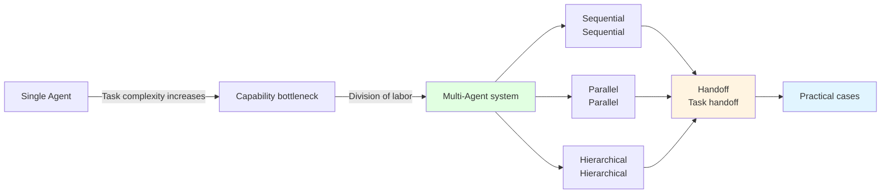
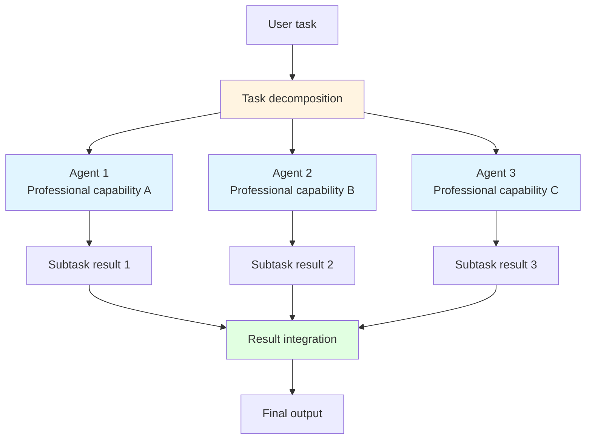
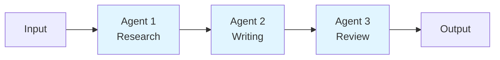
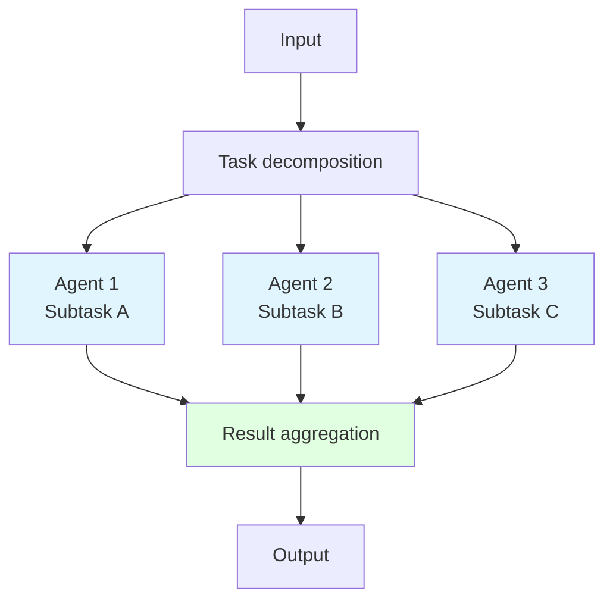
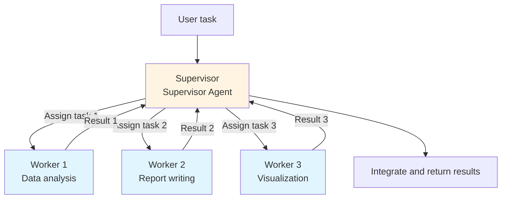
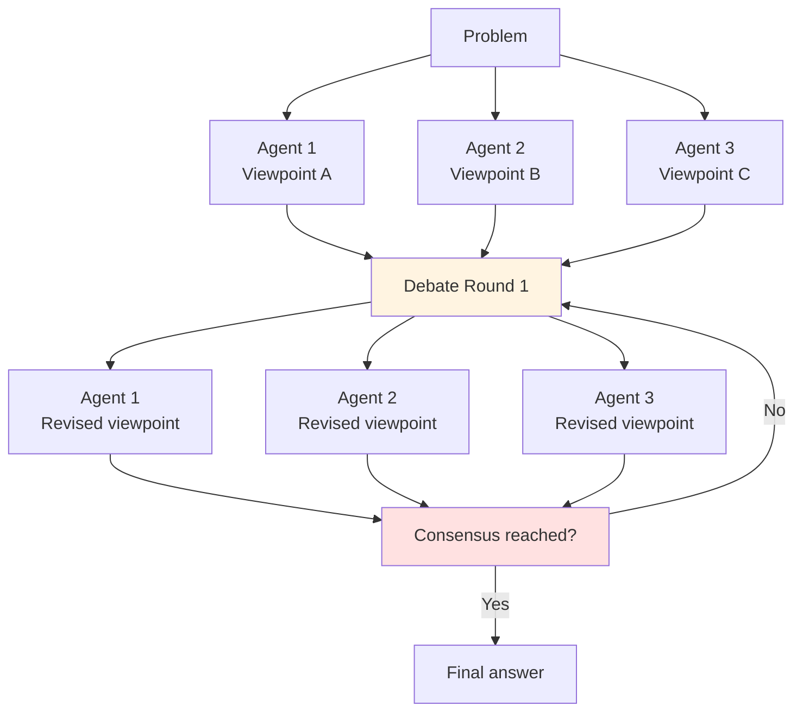
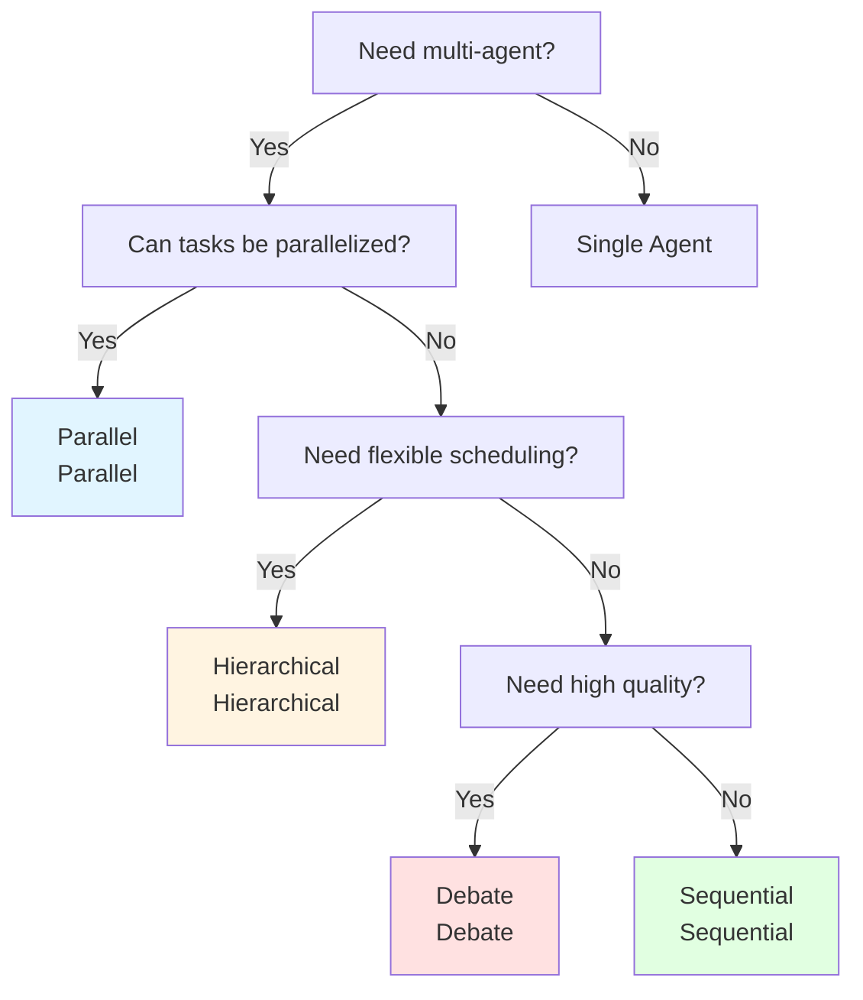
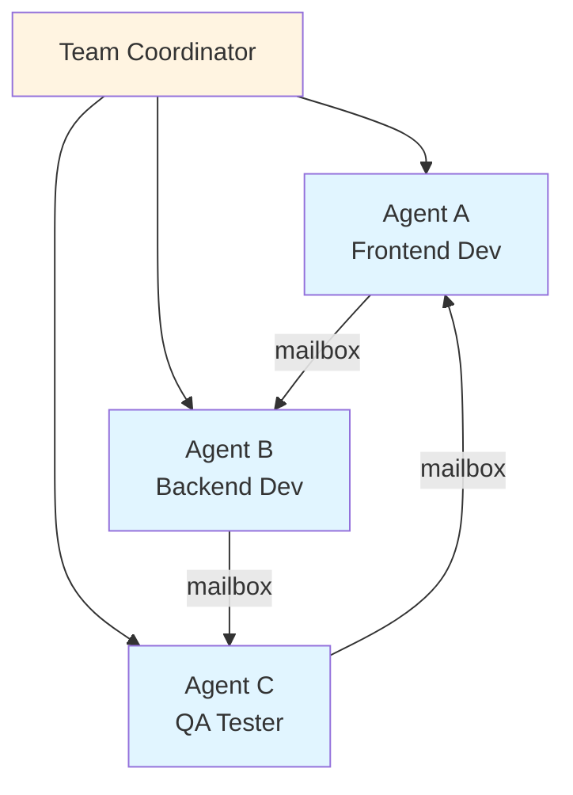

# Chapter 10: Multi-Agent

> After completing this chapter, you will be able to: Design multi-agent collaboration systems and implement task distribution and handoff



## 10.1 Multi-Agent Architecture <DifficultyBadge level="advanced" /> <CostBadge cost="$0" />

> Prerequisites: 9.1 Agent Core Concepts

### Why do we need it? (Problem)

Single agents are already powerful, so why do we need multi-agent collaboration?

**Scenario 1: Writing a technical blog**

Single agent attempt:

```
User: "Write a technical blog about RAG"

Agent (all-in-one):
1. Research RAG technology
2. Organize article structure  
3. Write content
4. Check grammar and logic
5. Generate image suggestions
6. Optimize SEO

Problems:
- Reasoning chain too long, easy to lose focus
- Research not deep enough, because also need to consider writing
- Writing quality decreases, because also need to consider SEO
- Cannot parallelize, low efficiency
```

Multi-agent collaboration:

```
Researcher Agent: Focus on researching RAG, provide detailed information
Writer Agent: Based on research, focus on writing quality
Reviewer Agent: Check logic and grammar
SEO Agent: Optimize title and keywords

Advantages:
- Each agent has a single responsibility, does it better
- Can work in parallel (research while preparing outline)
- Mutual review, higher quality
```

**Scenario 2: Customer service system**

Single agent attempt:

```
User: "Why hasn't my order shipped yet?"

All-in-one Agent:
- Need to know all knowledge about order queries
- Need to know all knowledge about logistics tracking  
- Need to know all knowledge about refund process
- Need to know all knowledge about technical support

Problems:
- Prompt too long, token waste
- Knowledge mixed, easy to answer incorrectly
- Cannot specialize
```

Multi-agent collaboration:

```
Triage Agent (triage):
  "This is an order issue, transfer to order specialist"
  
Order Agent (order specialist):
  Query order → "Order has shipped, transfer to logistics specialist"
  
Shipping Agent (logistics specialist):
  Track logistics → Provide detailed information

Advantages:
- Each agent only needs specialized knowledge
- Prompt short and concise
- Can independently optimize and test
```

**Core problem: Capability ceiling of a single agent**

| Dimension | Single Agent | Multi-Agent System |
|-----|-----------|-------------|
| **Task Complexity** | Medium | High |
| **Professional Depth** | Generalized | Specialized |
| **Parallel Capability** | None | Yes |
| **Maintainability** | Difficult (multiple responsibilities) | Easy (single responsibility) |
| **Scalability** | Low | High |
| **Cost** | High per request | Overall controllable |

### What is it? (Concept)

**Core of multi-agent systems: Division of labor and collaboration**



**Four collaboration patterns in multi-agent systems**

### 1. Sequential (Sequential execution)

**Characteristics:** Pipeline pattern, one agent completes then passes to the next



**Applicable scenarios:**
- Content creation (research → writing → editing)
- Data processing (extraction → cleaning → analysis)
- Software development (design → coding → testing)

**Advantages:**
- Clear logic, easy to understand
- Each stage can be optimized separately
- Easy to track and debug

**Disadvantages:**
- Serial execution, time-consuming
- Error in previous agent blocks entire process

**Code example:**

```python
def sequential_multi_agent(task):
    # Agent 1: Research
    research_result = researcher_agent.run(task)
    
    # Agent 2: Write (based on research results)
    draft = writer_agent.run(f"Write based on the following information:\n{research_result}")
    
    # Agent 3: Review
    final = reviewer_agent.run(f"Review the following content:\n{draft}")
    
    return final
```

### 2. Parallel (Parallel execution)

**Characteristics:** Multiple agents work simultaneously, results aggregated at the end



**Applicable scenarios:**
- Market research (multiple agents research different competitors)
- Data collection (parallel scraping from multiple sources)
- Code review (multiple agents check different aspects)

**Advantages:**
- Fast, simultaneous execution
- Independent of each other, no mutual influence

**Disadvantages:**
- Need final aggregation logic
- May produce conflicting results

**Code example:**

```python
import asyncio

async def parallel_multi_agent(task):
    # Execute multiple agents in parallel
    results = await asyncio.gather(
        agent1.run_async(task),
        agent2.run_async(task),
        agent3.run_async(task),
    )
    
    # Aggregate results
    final = summarizer_agent.run(f"Aggregate the following results:\n{results}")
    return final
```

### 3. Hierarchical (Hierarchical/Supervisor pattern)

**Characteristics:** One Supervisor Agent manages multiple Worker Agents



**Applicable scenarios:**
- Complex project management
- Customer service system (triage + specialists)
- Research reports (coordinating multiple researchers)

**Advantages:**
- Clear chain of command
- Flexible task allocation
- Can dynamically adjust plans

**Disadvantages:**
- Supervisor becomes a bottleneck
- Adds a layer of abstraction

**Code example:**

```python
def hierarchical_multi_agent(task):
    supervisor = SupervisorAgent()
    workers = {
        "analyst": AnalystAgent(),
        "writer": WriterAgent(),
        "visualizer": VisualizerAgent(),
    }
    
    # Supervisor assigns tasks
    plan = supervisor.plan(task)
    
    results = {}
    for step in plan:
        worker = workers[step.agent]
        results[step.agent] = worker.run(step.task)
    
    # Supervisor integrates results
    final = supervisor.integrate(results)
    return final
```

### 4. Debate/Consensus (Debate/consensus)

**Characteristics:** Multiple agents reach consensus through debate



**Applicable scenarios:**
- Complex decision-making (investment advice)
- Creative generation (brainstorming)
- Problem solving (mathematical proofs)

**Advantages:**
- Multiple perspectives, high quality
- Mutual challenges, fewer errors

**Disadvantages:**
- Time-consuming, high cost
- May not reach consensus

**Code example:**

```python
def debate_multi_agent(question, rounds=3):
    agents = [AgentA(), AgentB(), AgentC()]
    
    # Initial opinions
    opinions = [agent.think(question) for agent in agents]
    
    # Debate rounds
    for round in range(rounds):
        new_opinions = []
        for i, agent in enumerate(agents):
            others = opinions[:i] + opinions[i+1:]
            new_opinion = agent.debate(question, others)
            new_opinions.append(new_opinion)
        opinions = new_opinions
    
    # Reach consensus
    consensus = consensus_agent.merge(opinions)
    return consensus
```

**Multi-agent communication mechanisms**

How do agents communicate with each other?

| Mechanism | Description | Example |
|-----|------|------|
| **Shared Memory** | Shared memory/blackboard | All agents read/write the same data structure |
| **Message Passing** | Message passing | Agent A sends a message to Agent B |
| **Handoff** | Task handoff | Agent A completes and hands off to Agent B |
| **Event Bus** | Event bus | Agents publish/subscribe to events |

```python
# Example: Shared Memory
class SharedMemory:
    def __init__(self):
        self.data = {}
    
    def write(self, key, value):
        self.data[key] = value
    
    def read(self, key):
        return self.data.get(key)

# Agent 1 writes
shared_memory.write("research_result", "...")

# Agent 2 reads
research = shared_memory.read("research_result")
```

**Multi-agent system design principles**

✅ **Single Responsibility**
- Each agent does one thing, does it well

✅ **Loose Coupling**
- Agents communicate through interfaces, not directly dependent on implementation

✅ **Composable**
- Can flexibly combine different agents

✅ **Observable**
- Record input/output of each agent for easy debugging

✅ **Fault Tolerant**
- One agent failure should not crash the entire system

### Practice

**Concept demonstration: Comparison of four patterns**

We use pseudocode to compare the four patterns handling the same task: "Analyze competitors and write a report"

**Sequential (Sequential):**

```python
# Serial execution
result = sequential_pipeline([
    ("research", "Collect competitor information"),
    ("analyze", "Analyze competitor strategies"),
    ("write", "Write analysis report"),
    ("review", "Review report"),
])

# Time: 10 + 8 + 12 + 5 = 35 seconds
# Advantage: Clear logic
# Disadvantage: Time-consuming
```

**Parallel (Parallel):**

```python
# Collect information on multiple competitors in parallel
competitor_data = parallel_execute([
    ("research_A", "Analyze competitor A"),
    ("research_B", "Analyze competitor B"),
    ("research_C", "Analyze competitor C"),
])

# Aggregate
report = summarizer.run(competitor_data)

# Time: max(10, 12, 8) + 5 = 17 seconds
# Advantage: Fast
# Disadvantage: Need aggregation logic
```

**Hierarchical (Hierarchical):**

```python
# Supervisor makes a plan
supervisor = SupervisorAgent()
plan = supervisor.plan("Analyze competitors and write report")

# Assign tasks
results = {}
for task in plan.tasks:
    worker = get_worker(task.type)
    results[task.id] = worker.run(task)

# Supervisor integrates
final_report = supervisor.integrate(results)

# Time: 2 + 20 + 3 = 25 seconds (planning + execution + integration)
# Advantage: Flexible, controllable
# Disadvantage: Added planning overhead
```

**Debate (Debate):**

```python
# Three agents analyze separately
agent_A = "Analyze from product perspective"
agent_B = "Analyze from marketing perspective"  
agent_C = "Analyze from technical perspective"

# Multiple debate rounds
for round in range(3):
    opinions = debate_round([agent_A, agent_B, agent_C])

# Reach consensus
final_report = consensus(opinions)

# Time: (8 * 3) * 3 + 5 = 77 seconds (3 rounds × 3 agents)
# Advantage: High quality, comprehensive
# Disadvantage: Time-consuming, high cost
```

**Decision tree:**



::: tip Think of It This Way
Single Agent = A solo developer doing everything.
Multi-Agent = A well-organized dev team with specialists.

The solo dev can build anything... slowly and with questionable quality. The team builds faster and better, but now you have communication overhead, disagreements, and someone who always breaks the build. Sound familiar?
:::

<ColabBadge path="demos/10-multi-agent/architectures.ipynb" />

### Reflection

- **What did we solve**: Understood why we need multi-agents and the four main collaboration patterns
- **What we didn't solve**: Know the patterns, but don't yet know how to implement handoff between agents—the next section introduces the Handoff mechanism
- **Key points**:
  1. **Single agents have capability limits**: Complex tasks need division of labor
  2. **Four collaboration patterns**: Sequential, Parallel, Hierarchical, Debate
  3. **Choose pattern based on scenario**: Parallelize when possible, use hierarchical when flexible, use debate for quality
  4. **Design principles**: Single responsibility, loose coupling, composable, observable, fault tolerant
  5. **Communication mechanisms**: Shared Memory, Message Passing, Handoff, Event Bus

**From theory to practice:**
- Understood architectural patterns, next step is to implement "handoff" between agents
- Handoff is the core mechanism of multi-agent systems

---

### Subagent Pattern & Agent Teams

Beyond the four collaboration patterns above, modern agent systems (inspired by [learn-claude-code](https://github.com/shareAI-lab/learn-claude-code)) introduce two additional patterns:

#### Subagent Pattern (Process Isolation)

A main agent spawns child agents for specific subtasks, each running in an isolated context:

```python
class MainAgent:
    def run(self, task):
        # Spawn isolated subagent for research
        research = self.spawn_subagent(
            task="Research RAG techniques",
            tools=[web_search, file_read],
            context_limit=50000  # Isolated context
        )
        
        # Spawn another subagent for coding
        code = self.spawn_subagent(
            task=f"Implement based on: {research.result}",
            tools=[file_write, bash],
            context_limit=100000
        )
        return code.result
```

**Key benefits**: Each subagent has its own context window, preventing the main agent from running out of context on complex tasks.

#### Agent Teams (Persistent Collaboration)

Agents form persistent teams with mailbox-based communication:



Each agent maintains its own state and communicates through persistent mailboxes, enabling long-running collaborative tasks.

### Multi-Agent Frameworks

Several frameworks have emerged to simplify building multi-agent systems:

| Framework | Provider | Key Features | Best For |
|-----------|---------|-------------|----------|
| **OpenAI Agents SDK** | OpenAI | Handoff, guardrails, tracing | Production agents with OpenAI models |
| **LangGraph** | LangChain | Graph-based workflows, persistence | Complex stateful workflows |
| **CrewAI** | Community | Role-based agents, easy setup | Quick prototyping |
| **AutoGen** | Microsoft | Conversational agents, code execution | Research and experimentation |
| **Mastra** | Community | TypeScript-first, workflow engine | TypeScript/Node.js projects |

::: tip Agentic RL — Training Agents with Reinforcement Learning
An emerging trend from [hello-agents](https://datawhalechina.github.io/hello-agents/#/) is **Agentic RL**: using reinforcement learning to train agents to make better tool-use decisions. Instead of relying solely on prompt engineering, agents learn optimal strategies through trial and error. This approach is behind improvements in models like DeepSeek-R1 and OpenAI o3.
:::

---

*Last updated: 2026-02-20*
