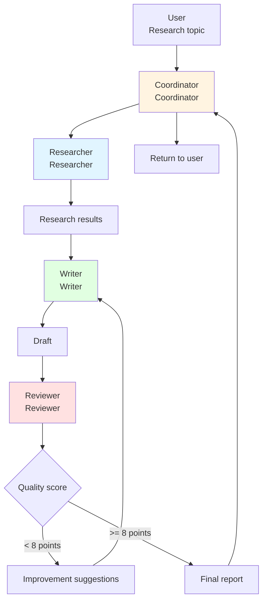

# 10.3 Practice: Multi-Agent Research System <DifficultyBadge level="advanced" /> <CostBadge cost="$0.20" />

> Prerequisites: 10.1 Multi-Agent Architecture, 10.2 Sub-Agent and Handoff

### Why do we need it? (Problem)

In the previous section, we learned the Handoff mechanism and built a simple customer service system. Now let's tackle a **more complex and realistic** scenario.

**Scenario: AI Research Report Generation System**

Task: "Write a research report on '2026 AI Agent Market Trends'"

**If using a single agent:**

```
All-in-one Agent:
1. Search information (not comprehensive enough)
2. Analyze data (not deep enough)
3. Write report (not high quality enough)
4. Review and polish (unclear standards)

Problems:
- Reasoning chain too long, easy to lose focus
- Each step is superficial
- No mutual review, no quality assurance
- Cannot parallelize, too time-consuming
```

**If using multi-agent collaboration:**

```
Researcher Agent (Researcher):
  - Deep search and analysis of information
  - Extract key data and trends
  - Focus on accuracy and comprehensiveness

Writer Agent (Writer):
  - Organize article structure
  - Transform research results into fluent text
  - Focus on readability and logic

Reviewer Agent (Reviewer):
  - Check factual accuracy
  - Review logical consistency
  - Provide improvement suggestions
  - Focus on quality assurance

Advantages:
- Each agent specializes in one area
- Can iterate multiple rounds, mutual feedback
- Significantly improved quality
```

**Core challenges:**
1. **How to coordinate multiple agents?** The Researcher → Writer → Reviewer workflow
2. **How to handle feedback?** When Reviewer provides modification suggestions, how to return to Writer?
3. **How to avoid infinite loops?** When to stop iterating?
4. **How to track progress?** Know which step we're at, how much is completed?

### What is it? (Concept)

**Multi-agent research system architecture**



**System components:**

1. **Coordinator**
   - Receive user task
   - Assign to Researcher
   - Track overall progress
   - Return final result

2. **Researcher**
   - Search relevant information
   - Analyze data and trends
   - Generate research summary
   - Tools: Search engine, database

3. **Writer**
   - Write report based on research results
   - Organize structure and logic
   - Ensure readability
   - Can revise multiple times

4. **Reviewer**
   - Evaluate report quality (1-10 score)
   - Check factual accuracy
   - Provide specific improvement suggestions
   - Decide if rework is needed

**Workflow:**

```
[Step 1] User submits research topic
         ↓
[Step 2] Coordinator assigns to Researcher
         ↓
[Step 3] Researcher searches information, analyzes data
         ↓
[Step 4] Researcher handoff to Writer (with research results)
         ↓
[Step 5] Writer writes draft
         ↓
[Step 6] Writer handoff to Reviewer
         ↓
[Step 7] Reviewer evaluates quality
         ↓
         ├─ If score >= 8 → Done, return to Coordinator
         └─ If score < 8 → Handoff back to Writer (with modification suggestions)
                             ↓
                      [Step 5] Writer revises (max 3 rounds)
```

**Key design points:**

✅ **Unidirectional flow + Feedback loop**
- Main flow: Researcher → Writer → Reviewer → Done
- Feedback flow: Reviewer → Writer (max 3 times)

✅ **Quality gate**
- Reviewer score determines if passed
- Below 8 points automatically rework

✅ **Prevent infinite loops**
- Max 3 revision rounds
- After 3 rounds, force pass

✅ **Context sharing**
- Shared Memory saves research results
- All agents can access

### Practice

Let's build this complete research system.

**Step 1: Define Shared Memory**

```python
class SharedMemory:
    """
    Shared memory, accessible by all agents
    """
    def __init__(self):
        self.data = {
            "topic": None,
            "research_findings": None,
            "draft_version": 0,
            "current_draft": None,
            "review_feedback": [],
            "final_report": None,
        }
    
    def set(self, key: str, value):
        self.data[key] = value
        print(f"📝 Memory updated: {key}")
    
    def get(self, key: str):
        return self.data.get(key)
    
    def increment_version(self):
        self.data["draft_version"] += 1
        return self.data["draft_version"]
    
    def add_feedback(self, feedback: str, score: int):
        self.data["review_feedback"].append({
            "feedback": feedback,
            "score": score,
            "version": self.data["draft_version"],
        })

# Initialize shared memory
shared_memory = SharedMemory()
```

**Step 2: Define tool functions**

```python
import requests
from typing import List, Dict

def search_web(query: str) -> str:
    """
    Search the internet (simplified version)
    In real applications, use professional search APIs like Tavily, Serper
    """
    # Here we use Wikipedia API as an example
    try:
        url = f"https://en.wikipedia.org/api/rest_v1/page/summary/{query.replace(' ', '_')}"
        response = requests.get(url)
        if response.status_code == 200:
            data = response.json()
            return data.get("extract", "No information found")
        return "No information found"
    except:
        return "Search failed"

def save_research_findings(findings: str) -> str:
    """
    Save research results to shared memory
    """
    shared_memory.set("research_findings", findings)
    return "Research findings saved"

def get_research_findings() -> str:
    """
    Get research results
    """
    findings = shared_memory.get("research_findings")
    if findings:
        return findings
    return "No research findings available"

def save_draft(draft: str) -> str:
    """
    Save draft
    """
    version = shared_memory.increment_version()
    shared_memory.set("current_draft", draft)
    return f"Draft v{version} saved"

def get_current_draft() -> str:
    """
    Get current draft
    """
    draft = shared_memory.get("current_draft")
    version = shared_memory.get("draft_version")
    if draft:
        return f"[Version {version}]\n\n{draft}"
    return "No draft available"

def get_review_history() -> str:
    """
    Get review history
    """
    feedback = shared_memory.get("review_feedback")
    if not feedback:
        return "No review history"
    
    history = []
    for i, fb in enumerate(feedback, 1):
        history.append(f"Review {i} (v{fb['version']}): Score {fb['score']}/10\n{fb['feedback']}")
    
    return "\n\n".join(history)

def save_review(feedback: str, score: int) -> str:
    """
    Save review feedback
    """
    shared_memory.add_feedback(feedback, score)
    return f"Review saved with score {score}/10"

TOOL_MAP = {
    "search_web": search_web,
    "save_research_findings": save_research_findings,
    "get_research_findings": get_research_findings,
    "save_draft": save_draft,
    "get_current_draft": get_current_draft,
    "get_review_history": get_review_history,
    "save_review": save_review,
}
```

**Step 3: Create Researcher Agent**

```python
from openai import OpenAI

client = OpenAI()

researcher = client.beta.assistants.create(
    name="Research Specialist",
    instructions="""You are a thorough research specialist.

Your job:
1. Search for information about the given topic
2. Analyze trends, data, and key insights
3. Organize findings into a structured research summary
4. Save the findings and hand off to Writer

Research Structure:
- Executive Summary (2-3 sentences)
- Key Findings (3-5 bullet points)
- Trends Analysis
- Data & Statistics
- Conclusions

Be comprehensive but concise. Focus on facts and data.""",
    model="gpt-4.1-mini",
    tools=[
        {
            "type": "function",
            "function": {
                "name": "search_web",
                "description": "Search the web for information",
                "parameters": {
                    "type": "object",
                    "properties": {
                        "query": {"type": "string"}
                    },
                    "required": ["query"],
                },
            },
        },
        {
            "type": "function",
            "function": {
                "name": "save_research_findings",
                "description": "Save research findings to shared memory",
                "parameters": {
                    "type": "object",
                    "properties": {
                        "findings": {"type": "string"}
                    },
                    "required": ["findings"],
                },
            },
        },
    ],
    handoffs=[
        {
            "type": "handoff",
            "target": "writer",
            "description": "Hand off to writer after completing research"
        }
    ],
)
```

**Step 4: Create Writer Agent**

```python
writer = client.beta.assistants.create(
    name="Content Writer",
    instructions="""You are a skilled content writer.

Your job:
1. Get research findings from memory
2. Write a well-structured, engaging report
3. If this is a revision, review previous feedback and improve accordingly
4. Save the draft and hand off to Reviewer

Report Structure:
- Title
- Executive Summary
- Introduction
- Main Body (with subheadings)
- Key Insights
- Conclusion

Writing Guidelines:
- Clear and professional tone
- Logical flow
- Use data from research
- 800-1200 words
- Include specific examples

If revising:
- Address all feedback points
- Explain what you changed""",
    model="gpt-4.1-mini",
    tools=[
        {
            "type": "function",
            "function": {
                "name": "get_research_findings",
                "description": "Get research findings from memory",
                "parameters": {"type": "object", "properties": {}},
            },
        },
        {
            "type": "function",
            "function": {
                "name": "get_review_history",
                "description": "Get previous review feedback",
                "parameters": {"type": "object", "properties": {}},
            },
        },
        {
            "type": "function",
            "function": {
                "name": "save_draft",
                "description": "Save draft to memory",
                "parameters": {
                    "type": "object",
                    "properties": {
                        "draft": {"type": "string"}
                    },
                    "required": ["draft"],
                },
            },
        },
    ],
    handoffs=[
        {
            "type": "handoff",
            "target": "reviewer",
            "description": "Hand off to reviewer after completing draft"
        }
    ],
)
```

**Step 5: Create Reviewer Agent**

```python
reviewer = client.beta.assistants.create(
    name="Quality Reviewer",
    instructions="""You are a meticulous quality reviewer.

Your job:
1. Read the current draft
2. Evaluate quality on multiple dimensions
3. Provide a score (1-10) and specific feedback
4. If score >= 8: approve and hand off to coordinator
5. If score < 8 AND draft_version < 3: hand off to writer for revision
6. If draft_version >= 3: approve anyway (max iterations reached)

Evaluation Criteria:
- Accuracy: Are facts correct?
- Completeness: All key points covered?
- Clarity: Is it easy to understand?
- Structure: Logical organization?
- Engagement: Interesting to read?

Feedback Format:
Score: X/10

Strengths:
- ...

Areas for Improvement:
- [Specific issue 1]
- [Specific issue 2]

Suggestions:
- [Specific suggestion 1]
- [Specific suggestion 2]

Be constructive and specific.""",
    model="gpt-4.1-mini",
    tools=[
        {
            "type": "function",
            "function": {
                "name": "get_current_draft",
                "description": "Get the current draft",
                "parameters": {"type": "object", "properties": {}},
            },
        },
        {
            "type": "function",
            "function": {
                "name": "save_review",
                "description": "Save review feedback and score",
                "parameters": {
                    "type": "object",
                    "properties": {
                        "feedback": {"type": "string"},
                        "score": {"type": "integer", "minimum": 1, "maximum": 10},
                    },
                    "required": ["feedback", "score"],
                },
            },
        },
    ],
    handoffs=[
        {
            "type": "handoff",
            "target": "writer",
            "description": "Hand off back to writer for revision if score < 8"
        },
        {
            "type": "handoff",
            "target": "coordinator",
            "description": "Hand off to coordinator if approved"
        },
    ],
)
```

**Step 6: Create Coordinator Agent**

```python
coordinator = client.beta.assistants.create(
    name="Project Coordinator",
    instructions="""You are the project coordinator for a research report system.

Your job:
1. Receive the research topic from the user
2. Hand off to Researcher to start the process
3. When the report is approved, present it to the user

You manage the overall workflow but delegate all actual work to specialists.""",
    model="gpt-4.1-mini",
    handoffs=[
        {
            "type": "handoff",
            "target": "researcher",
            "description": "Hand off to researcher to start research"
        }
    ],
)
```

**Step 7: Run complete system**

```python
def run_research_system(topic: str, verbose: bool = True):
    """
    Run complete research system
    """
    # Initialize
    shared_memory.set("topic", topic)
    
    # Create thread
    thread = client.beta.threads.create()
    
    # User message
    client.beta.threads.messages.create(
        thread_id=thread.id,
        role="user",
        content=f"Please create a research report on: {topic}"
    )
    
    if verbose:
        print(f"\n{'='*80}")
        print(f"🎯 Research Topic: {topic}")
        print(f"{'='*80}\n")
    
    # Start from Coordinator
    current_agent = coordinator.id
    agent_map = {
        coordinator.id: ("Coordinator", coordinator),
        researcher.id: ("Researcher", researcher),
        writer.id: ("Writer", writer),
        reviewer.id: ("Reviewer", reviewer),
    }
    
    step = 0
    max_steps = 20  # Prevent infinite loop
    
    while step < max_steps:
        step += 1
        agent_name = agent_map[current_agent][0]
        
        if verbose:
            print(f"\n[Step {step}] Running {agent_name}...")
        
        # Run agent
        run = client.beta.threads.runs.create(
            thread_id=thread.id,
            assistant_id=current_agent,
        )
        
        # Poll
        while True:
            run_status = client.beta.threads.runs.retrieve(
                thread_id=thread.id,
                run_id=run.id,
            )
            
            # Need to execute tools
            if run_status.status == "requires_action":
                tool_outputs = []
                
                for tool_call in run_status.required_action.submit_tool_outputs.tool_calls:
                    func_name = tool_call.function.name
                    func_args = eval(tool_call.function.arguments)
                    
                    if verbose:
                        print(f"  🔧 {func_name}({func_args})")
                    
                    result = TOOL_MAP[func_name](**func_args)
                    
                    if verbose and len(result) < 100:
                        print(f"  ✓ {result}")
                    
                    tool_outputs.append({
                        "tool_call_id": tool_call.id,
                        "output": result,
                    })
                
                client.beta.threads.runs.submit_tool_outputs(
                    thread_id=thread.id,
                    run_id=run.id,
                    tool_outputs=tool_outputs,
                )
            
            # Need handoff
            elif run_status.status == "requires_handoff":
                handoff = run_status.required_handoff
                target = handoff.target
                
                # Find target agent
                target_agent = None
                for agent_id, (name, agent) in agent_map.items():
                    if name.lower() == target.lower():
                        target_agent = agent_id
                        break
                
                if verbose:
                    print(f"  🔄 Handoff to {target}")
                
                # Switch agent
                current_agent = target_agent
                
                # Confirm handoff
                client.beta.threads.runs.submit_handoff(
                    thread_id=thread.id,
                    run_id=run.id,
                    handoff_id=handoff.id,
                )
                break
            
            # Complete
            elif run_status.status == "completed":
                # Check if this is final completion (Coordinator complete)
                if current_agent == coordinator.id and step > 1:
                    if verbose:
                        print(f"\n{'='*80}")
                        print(f"✅ Research system completed!")
                        print(f"{'='*80}\n")
                    
                    # Get final report
                    final_draft = shared_memory.get("current_draft")
                    return {
                        "status": "success",
                        "report": final_draft,
                        "steps": step,
                        "versions": shared_memory.get("draft_version"),
                        "feedback_count": len(shared_memory.get("review_feedback")),
                    }
                break
            
            # Failed
            elif run_status.status in ["failed", "cancelled", "expired"]:
                print(f"❌ {agent_name} {run_status.status}")
                return {"status": "error", "message": run_status.status}
            
            import time
            time.sleep(1)
    
    return {"status": "timeout", "message": "Max steps reached"}
```

**Step 8: Test complete system**

```python
# Run research system
result = run_research_system(
    topic="AI Agent Market Trends 2026",
    verbose=True
)

# Output results
print("\n" + "="*80)
print("📊 System Statistics:")
print("="*80)
print(f"Status: {result['status']}")
print(f"Total Steps: {result['steps']}")
print(f"Draft Versions: {result['versions']}")
print(f"Review Rounds: {result['feedback_count']}")

print("\n" + "="*80)
print("📄 Final Report:")
print("="*80)
print(result['report'])
```

**Example output:**

```
================================================================================
🎯 Research Topic: AI Agent Market Trends 2026
================================================================================

[Step 1] Running Coordinator...
  🔄 Handoff to researcher

[Step 2] Running Researcher...
  🔧 search_web({'query': 'AI Agent market trends 2026'})
  🔧 search_web({'query': 'autonomous AI agents'})
  🔧 search_web({'query': 'AI agent adoption enterprise'})
  🔧 save_research_findings({...})
  ✓ Research findings saved
  🔄 Handoff to writer

[Step 3] Running Writer...
  🔧 get_research_findings({})
  🔧 save_draft({...})
  📝 Memory updated: draft_version
  ✓ Draft v1 saved
  🔄 Handoff to reviewer

[Step 4] Running Reviewer...
  🔧 get_current_draft({})
  🔧 save_review({'feedback': '...', 'score': 7})
  📝 Memory updated: review_feedback
  ✓ Review saved with score 7/10
  🔄 Handoff to writer

[Step 5] Running Writer...
  🔧 get_research_findings({})
  🔧 get_review_history({})
  🔧 save_draft({...})
  📝 Memory updated: draft_version
  ✓ Draft v2 saved
  🔄 Handoff to reviewer

[Step 6] Running Reviewer...
  🔧 get_current_draft({})
  🔧 save_review({'feedback': '...', 'score': 9})
  📝 Memory updated: review_feedback
  ✓ Review saved with score 9/10
  🔄 Handoff to coordinator

[Step 7] Running Coordinator...

================================================================================
✅ Research system completed!
================================================================================

================================================================================
📊 System Statistics:
================================================================================
Status: success
Total Steps: 7
Draft Versions: 2
Review Rounds: 2

================================================================================
📄 Final Report:
================================================================================
[The final report content would appear here...]
```

<ColabBadge path="demos/10-multi-agent/research_system.ipynb" />

### Reflection

- **What did we solve**: Built a complete multi-agent collaboration system, implemented research→writing→review closed loop
- **What we didn't solve**: This chapter is complete, next chapter enters the protocol section (MCP, OpenAPI, etc.)
- **Key points**:
  1. **Shared Memory is the collaboration foundation**: All agents share state and data
  2. **Quality gate controls process**: Reviewer's score determines whether to continue iterating
  3. **Prevent infinite loops**: Set maximum iteration count
  4. **Clear division of responsibilities**: Researcher, Writer, Reviewer each with their own duties
  5. **Traceable execution flow**: Record every handoff and tool call

**Multi-agent system design experience:**

✅ **Do (Recommended):**
1. Single responsibility: Each agent focuses on one thing
2. Clear handoff conditions: When to handoff, handoff to whom
3. Shared memory: Avoid repeatedly passing large amounts of data
4. Set limits: Prevent infinite loops and cost overruns
5. Detailed logs: Easy to debug and optimize

❌ **Don't (Avoid):**
1. Overlapping agent responsibilities: Causes confusion
2. Complex loops: Hard to debug
3. Infinite iteration: Cost explosion
4. Lack coordinator: Process hard to control
5. Ignore error handling: System unstable

**Real application scenarios:**

| Scenario | Agent Configuration | Expected Effect |
|-----|-----------|---------|
| **Content Creation** | Research + Write + Review | Improve quality 50% |
| **Code Review** | Analyzer + Reviewer + Fixer | Reduce bugs 70% |
| **Market Research** | Multiple Researchers + Synthesizer | 3x coverage |
| **Customer Service** | Triage + Specialists | 90%+ resolution rate |
| **Education Tutoring** | Tutor + Explainer + Quiz Master | 2x learning efficiency |

**Chapter 10 Summary ✅**

You've mastered the complete knowledge of multi-agent systems:
- ✅ 10.1 Multi-Agent Architecture - Four collaboration patterns
- ✅ 10.2 Sub-Agent and Handoff - Task handoff mechanism
- ✅ 10.3 Practice: Multi-Agent Research System - Complete real-world case

**Next: Chapter 11 - Protocols (MCP, OpenAPI, etc.)**

Learn how to standardize agent interfaces with external systems.

---

*Last updated: 2026-02-20*
