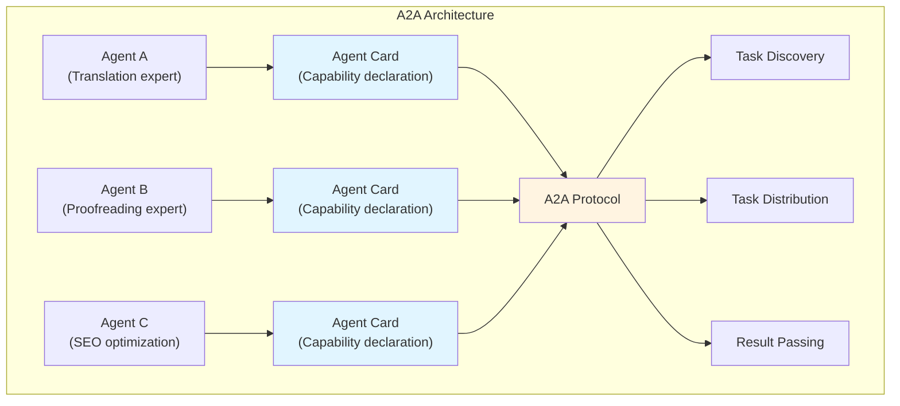
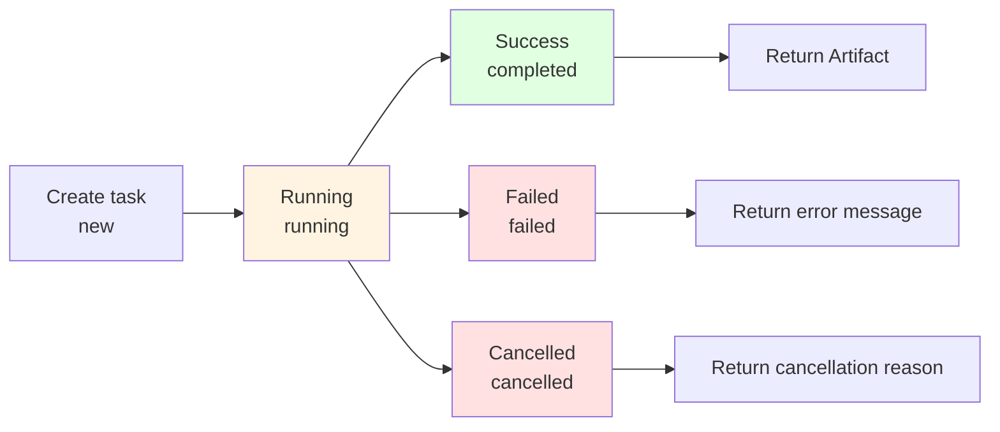

# 11.2 A2A Protocol <DifficultyBadge level="advanced" /> <CostBadge cost="$0" />

> Prerequisites: 11.1 MCP Protocol Explained, 10.1 Multi-Agent Architecture

### Why Do We Need It? (Problem)

**Problem: MCP solves "AI calling tools", but what about "AI calling AI"?**

We learned about multi-Agent collaboration in Chapter 10, but there's a key problem:

```
Scenario: You have a translation Agent and a proofreading Agent

Traditional approach:
┌──────────────────────────────────┐
│ Your code (hardcoded coordination logic) │
│                                  │
│ 1. Call translation Agent        │
│ 2. Parse translation result      │
│ 3. Construct proofreading Agent input │
│ 4. Call proofreading Agent       │
│ 5. Parse proofreading result     │
│ ...                              │
└──────────────────────────────────┘

Problems:
❌ Coordination logic hardcoded in code
❌ Adding Agent requires modifying coordination code
❌ Agents cannot "self-discover" each other
❌ No unified communication format
```

**Real-world Case: Multi-Agent Collaboration Dilemma**

```python
# Scenario: Content creation pipeline

# Agent 1: Researcher
research_result = researcher_agent.run("Research RAG technology")

# Agent 2: Writer (need to manually concatenate input)
article = writer_agent.run(f"""
    Please write a blog post based on the following research:
    
    {research_result}
    
    Requirements:
    - Around 2000 words
    - Include code examples
    - Target beginners
""")

# Agent 3: Editor (need to manually concatenate again)
final_article = editor_agent.run(f"""
    Please review the following article:
    
    {article}
    
    Check:
    - Grammar errors
    - Logical coherence
    - Technical term accuracy
""")

# Problems:
# 1. Each Agent's "interface" is different, needs manual adaptation
# 2. Cannot dynamically discover Agent capabilities
# 3. Cannot standardize task passing
# 4. Difficult to track task status
```

**A2A Core Problem: How do Agents "interconnect"?**

Internet analogy:
- **Before HTTP**: Each website had custom protocols, accessing each other was difficult
- **After HTTP**: Unified protocol, any website can access each other

The Agent world also needs an "HTTP":
- **Before A2A**: Each Agent has custom interface, collaboration requires hardcoding
- **After A2A**: Unified protocol, Agents can freely collaborate

### What Is It? (Concept)

**A2A = Agent-to-Agent Protocol**

A2A is an open protocol launched by Google in January 2025, aimed at **standardizing communication and collaboration between Agents**.



**Core Components:**

| Component | Role | Analogy |
|-----|------|-----|
| **Agent Card** | Agent's "business card", describes capabilities | API documentation |
| **Task** | Standard task format | HTTP Request |
| **Artifact** | Task output format | HTTP Response |
| **Part** | Artifact component unit | Response Body |

**Agent Card: Agent's "Self-introduction"**

Each Agent declares its capabilities through an Agent Card:

```json
{
  "name": "translator_agent",
  "description": "Professional Chinese-English translation Agent",
  "version": "1.0.0",
  "capabilities": [
    {
      "name": "translate",
      "description": "Translate text",
      "input_schema": {
        "type": "object",
        "properties": {
          "text": {
            "type": "string",
            "description": "Text to translate"
          },
          "from": {
            "type": "string",
            "enum": ["zh", "en"],
            "description": "Source language"
          },
          "to": {
            "type": "string",
            "enum": ["zh", "en"],
            "description": "Target language"
          }
        },
        "required": ["text", "from", "to"]
      },
      "output_schema": {
        "type": "object",
        "properties": {
          "translated_text": {
            "type": "string",
            "description": "Translated text"
          },
          "confidence": {
            "type": "number",
            "description": "Translation confidence"
          }
        }
      }
    }
  ],
  "author": "your-team",
  "contact": "team@example.com"
}
```

**Task Lifecycle:**



**Task: Standardized Task Format**

```json
{
  "id": "task_123",
  "agent_id": "translator_agent",
  "capability": "translate",
  "input": {
    "text": "Hello, world!",
    "from": "en",
    "to": "zh"
  },
  "status": "running",
  "created_at": "2026-02-20T10:00:00Z",
  "updated_at": "2026-02-20T10:00:05Z"
}
```

**Artifact: Standardized Output Format**

```json
{
  "task_id": "task_123",
  "status": "completed",
  "parts": [
    {
      "type": "text",
      "content": "你好,世界!"
    },
    {
      "type": "metadata",
      "content": {
        "confidence": 0.95,
        "model": "gpt-4",
        "cost": 0.002
      }
    }
  ],
  "completed_at": "2026-02-20T10:00:10Z"
}
```

**Parts: Support Multiple Types**

| Part Type | Description | Example |
|----------|------|-----|
| **text** | Text content | Translation result, summary |
| **image** | Image (base64) | Generated chart |
| **file** | File reference | Generated PDF, Excel |
| **metadata** | Metadata | Confidence, cost, duration |
| **error** | Error message | Failure reason |

**A2A Collaboration Workflow:**

```mermaid
sequenceDiagram
    participant User as User/Coordinator
    participant AgentA as Agent A<br/>(Translation)
    participant AgentB as Agent B<br/>(Proofreading)
    
    User->>AgentA: 1. GET /card (get capabilities)
    AgentA->>User: Agent Card
    
    User->>AgentA: 2. POST /tasks (create translation task)
    AgentA->>User: Task ID
    
    User->>AgentA: 3. GET /tasks/{id} (query status)
    AgentA->>User: status: running
    
    User->>AgentA: 4. GET /tasks/{id} (query status)
    AgentA->>User: status: completed + Artifact
    
    User->>AgentB: 5. POST /tasks (create proofreading task, input is A's Artifact)
    AgentB->>User: Task ID
    
    User->>AgentB: 6. GET /tasks/{id}
    AgentB->>User: status: completed + Artifact
    
    style AgentA fill:#e1f5ff
    style AgentB fill:#fff4e1
```

**A2A API Specification:**

```
Core endpoints:

GET  /card          - Get Agent Card
POST /tasks         - Create task
GET  /tasks/{id}    - Query task status
GET  /artifacts/{id} - Get task output
POST /tasks/{id}/cancel - Cancel task
```

**Complete Example: Translation + Proofreading Flow**

```python
import requests

# 1. Query translation Agent capabilities
card = requests.get("http://translator-agent.com/card").json()
print(f"Agent: {card['name']}")
print(f"Capabilities: {card['capabilities']}")

# 2. Create translation task
task = requests.post("http://translator-agent.com/tasks", json={
    "capability": "translate",
    "input": {
        "text": "Hello, world!",
        "from": "en",
        "to": "zh"
    }
}).json()

task_id = task["id"]

# 3. Poll task status
import time
while True:
    status = requests.get(f"http://translator-agent.com/tasks/{task_id}").json()
    if status["status"] == "completed":
        break
    time.sleep(1)

# 4. Get translation result
artifact = status["artifact"]
translated_text = artifact["parts"][0]["content"]
print(f"Translation result: {translated_text}")

# 5. Pass translation result to proofreading Agent
review_task = requests.post("http://reviewer-agent.com/tasks", json={
    "capability": "review",
    "input": {
        "text": translated_text,
        "language": "zh"
    }
}).json()

# 6. Get proofreading result
review_id = review_task["id"]
while True:
    review_status = requests.get(f"http://reviewer-agent.com/tasks/{review_id}").json()
    if review_status["status"] == "completed":
        break
    time.sleep(1)

final_text = review_status["artifact"]["parts"][0]["content"]
print(f"Final result: {final_text}")
```

**A2A vs MCP:**

| Dimension | MCP | A2A |
|-----|-----|-----|
| **Goal** | AI calling tools | Agent calling Agent |
| **Scenario** | LLM needs external capabilities (weather, database) | Agent collaboration (translation→proofreading) |
| **Communication** | JSON-RPC (mainly synchronous) | REST API (mainly asynchronous) |
| **Capability declaration** | Tools/Resources/Prompts | Agent Card |
| **State management** | Stateless | Task lifecycle |
| **Complexity** | Simple (single call) | Complex (multi-step collaboration) |

**A2A Advantages:**

✅ **Standardized interface**: All Agents use the same API format
✅ **Capability discovery**: Automatically discover Agent capabilities through Agent Card
✅ **Async support**: Suitable for long-running tasks
✅ **Composable**: Agents can be flexibly composed into workflows
✅ **Observable**: Task status is trackable, easy to debug

**A2A Challenges:**

⚠️ **Protocol complexity**: More complex than MCP, higher learning curve
⚠️ **Early ecosystem**: Released in January 2025, ecosystem still building
⚠️ **Network overhead**: Based on HTTP, has network latency
⚠️ **Coordinator necessary**: Needs a "commander" to coordinate Agents

### Hands-on Practice (Practice)

**Concept Demonstration: A2A Collaboration Pattern**

We'll use pseudo-code to demonstrate typical A2A use cases:

**Scenario 1: Serial Collaboration (Translation → Proofreading)**

```python
# Orchestrator
class A2AOrchestrator:
    def run_pipeline(self, text):
        # 1. Translation
        translate_task = self.create_task(
            agent="translator_agent",
            capability="translate",
            input={"text": text, "from": "en", "to": "zh"}
        )
        
        translate_result = self.wait_for_completion(translate_task)
        
        # 2. Proofreading (using translation result)
        review_task = self.create_task(
            agent="reviewer_agent",
            capability="review",
            input={"text": translate_result["translated_text"]}
        )
        
        return self.wait_for_completion(review_task)

# Usage
orchestrator = A2AOrchestrator()
result = orchestrator.run_pipeline("Hello, world!")
print(result)
```

**Scenario 2: Parallel Collaboration (Multiple researchers investigating simultaneously)**

```python
class A2AOrchestrator:
    def parallel_research(self, topics):
        # Create multiple tasks in parallel
        tasks = []
        for topic in topics:
            task = self.create_task(
                agent="researcher_agent",
                capability="research",
                input={"topic": topic}
            )
            tasks.append(task)
        
        # Wait for all tasks to complete
        results = [self.wait_for_completion(task) for task in tasks]
        
        # Summarize
        summary_task = self.create_task(
            agent="summarizer_agent",
            capability="summarize",
            input={"documents": results}
        )
        
        return self.wait_for_completion(summary_task)

# Usage
orchestrator = A2AOrchestrator()
result = orchestrator.parallel_research(["RAG", "Fine-tuning", "Prompt Engineering"])
print(result)
```

**Scenario 3: Dynamic Agent Discovery**

```python
class A2AOrchestrator:
    def discover_agents(self):
        # Get all Agents from registry
        agents = self.registry.list_agents()
        
        for agent in agents:
            card = self.get_agent_card(agent)
            print(f"Agent: {card['name']}")
            print(f"Capabilities: {[c['name'] for c in card['capabilities']]}")
    
    def find_agent_by_capability(self, capability_name):
        agents = self.registry.list_agents()
        for agent in agents:
            card = self.get_agent_card(agent)
            for capability in card['capabilities']:
                if capability['name'] == capability_name:
                    return agent
        return None

# Usage
orchestrator = A2AOrchestrator()
orchestrator.discover_agents()

# Dynamically find translation Agent
translator = orchestrator.find_agent_by_capability("translate")
print(f"Found translation Agent: {translator}")
```

**Complete example in Notebook:**

<ColabBadge path="demos/11-protocols/protocols_overview.ipynb" />

### Summary (Reflection)

- **What's solved**: Understood how A2A standardizes communication between Agents, implementing "Agent calling Agent"
- **What's not solved**: A2A is for peer-to-peer collaboration, but what about hundreds or thousands of Agents? How to manage large-scale Agent networks? — Next section introduces ANP protocol
- **Key Takeaways**:
  1. **A2A is Agent interconnection protocol**: Enables standardized communication and collaboration between Agents
  2. **Agent Card is core**: Agents declare their capabilities through Cards, enabling "self-discovery"
  3. **Task lifecycle**: new → running → completed/failed/cancelled
  4. **Async-first**: Suitable for long-running tasks
  5. **Complements MCP**: MCP solves "AI calling tools", A2A solves "Agent calling Agent"
  6. **Needs coordinator**: A2A itself doesn't provide automatic coordination, needs a "commander"

**Key Insights:**
- A2A design is similar to RESTful API, easy to understand and implement
- A2A is more suitable for **asynchronous, long-running** tasks (research, creation, analysis)
- A2A is still in early stages, ecosystem needs time to build

---

*Last updated: 2026-02-20*
