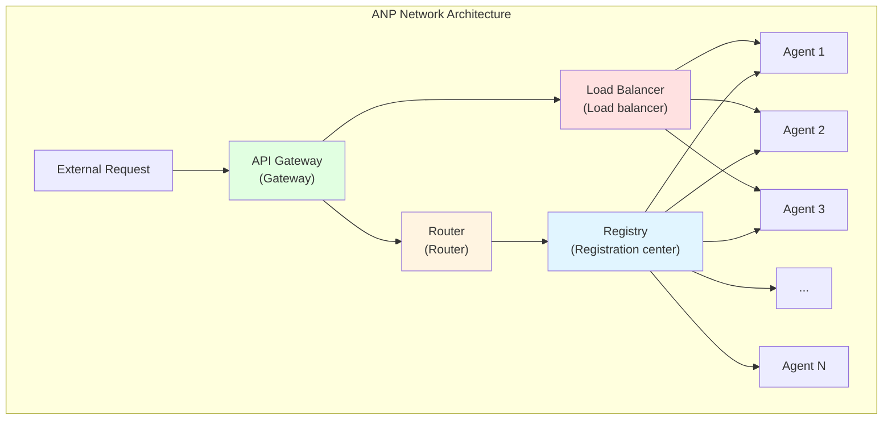
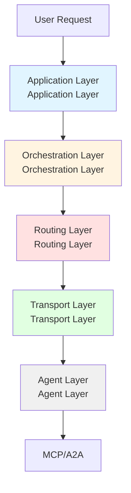

# 11.3 ANP Protocol <DifficultyBadge level="advanced" /> <CostBadge cost="$0" />

> Prerequisites: 11.2 A2A Protocol

### Why Do We Need It? (Problem)

**Problem: A2A is peer-to-peer, but what about large-scale Agent networks?**

Imagine this scenario:

```
Your company has 100 Agents:
- 10 data analysis Agents
- 20 content creation Agents
- 15 customer service Agents
- 30 R&D Agents
- 25 sales support Agents

Problems:
❌ A2A is peer-to-peer, how do 100 Agents discover each other?
❌ How to manage Agent registration and deregistration?
❌ How to load balance (which of the 10 data analysis Agents to choose)?
❌ How to handle Agent failures and fault tolerance?
❌ How to collaborate across organizations (your Agent calling another company's Agent)?
```

**Real Scenario: Agent Internet**

Internet development analogy:

| Stage | Internet | Agent World |
|-----|--------|-----------|
| **1.0** | LAN (peer-to-peer) | Single team Agents (A2A) |
| **2.0** | Internet (routing, DNS) | Cross-organization Agent network (ANP) |
| **3.0** | Web 2.0 (search, social) | Agent marketplace, ecosystem |

A2A solved the "LAN" problem, but to achieve "Agent Internet", we need:

1. **Service discovery**: Like DNS, find Agents that provide specific capabilities
2. **Routing**: Like IP routing, deliver requests across networks
3. **Load balancing**: Like Load Balancer, distribute tasks to multiple Agents
4. **Fault tolerance**: Like redundant backup, automatically switch when an Agent fails
5. **Security**: Like HTTPS, ensure secure communication
6. **Billing**: Like cloud services, charge by usage

**ANP Core Problem: How to make thousands of Agents work together?**

### What Is It? (Concept)

**ANP = Agent Network Protocol**

ANP is a protocol specification proposed by IBM Research in late 2024, aimed at **building large-scale Agent interconnection networks**.



**Core Components:**

| Component | Role | Analogy |
|-----|------|-----|
| **Registry** | Agent registration center | DNS server |
| **Router** | Route requests to appropriate Agent | IP router |
| **Load Balancer** | Load balancing | Nginx/HAProxy |
| **Gateway** | Unified entry point | API Gateway |
| **Monitor** | Monitoring and health checks | Prometheus |
| **Broker** | Message queue | RabbitMQ/Kafka |

**ANP Architecture Layers:**



**Layer Explanation:**

1. **Application Layer**: Defines business logic and workflows
2. **Orchestration Layer**: Manages task decomposition and result aggregation
3. **Routing Layer**: Selects appropriate Agent to handle tasks
4. **Transport Layer**: Handles network communication (HTTP/gRPC/WebSocket)
5. **Agent Layer**: Actual task-executing Agents (based on MCP/A2A)

**ANP Core Concepts:**

### 1. Agent Registry

```json
// Agent registration information
{
  "agent_id": "translator_001",
  "name": "Advanced Translation Agent",
  "capabilities": ["translate", "proofread"],
  "languages": ["zh", "en", "ja"],
  "endpoint": "https://translator.example.com",
  "health_check": "https://translator.example.com/health",
  "status": "online",
  "load": 0.3,  // Current load 30%
  "pricing": {
    "model": "pay-per-use",
    "rate": 0.01  // $0.01 per request
  },
  "metadata": {
    "region": "us-west",
    "version": "2.0.1",
    "owner": "acme-corp"
  }
}
```

### 2. Service Discovery

```python
# Query Agents that can provide translation capability
agents = registry.find_agents(
    capability="translate",
    filters={
        "languages": ["zh", "en"],
        "load": {"$lt": 0.5},  # Load < 50%
        "status": "online"
    },
    sort_by="load"  # Sort by load
)

# Returns:
# [
#   {"agent_id": "translator_001", "load": 0.3},
#   {"agent_id": "translator_002", "load": 0.4},
# ]
```

### 3. Smart Routing

```python
class ANPRouter:
    def route_task(self, task):
        # 1. Find available Agents
        agents = self.registry.find_agents(
            capability=task.capability
        )
        
        # 2. Routing strategy selection
        if self.strategy == "round_robin":
            agent = self.round_robin(agents)
        elif self.strategy == "least_load":
            agent = min(agents, key=lambda a: a.load)
        elif self.strategy == "geo_proximity":
            agent = self.nearest_agent(agents, task.region)
        
        # 3. Send task
        return agent.execute(task)
```

### 4. Fault Tolerance

```python
class ANPExecutor:
    def execute_with_retry(self, task, max_retries=3):
        for attempt in range(max_retries):
            try:
                agent = self.router.route_task(task)
                result = agent.execute(task)
                return result
            except AgentFailure as e:
                # Agent failure, mark as offline
                self.registry.mark_offline(agent.id)
                
                if attempt < max_retries - 1:
                    # Retry: select another Agent
                    continue
                else:
                    raise TaskFailure(f"Task failed after {max_retries} retries")
```

**ANP Workflow:**

```mermaid
sequenceDiagram
    participant User as User
    participant Gateway as API Gateway
    participant Router as Router
    participant Registry as Registry
    participant Agent1 as Agent 1
    participant Agent2 as Agent 2
    
    User->>Gateway: Request translation
    Gateway->>Router: Forward request
    Router->>Registry: Query available Agents
    Registry->>Router: [Agent1(30% load), Agent2(50% load)]
    Router->>Router: Select Agent1 (lower load)
    Router->>Agent1: Send task
    Agent1->>Agent1: Execute task
    Agent1->>Router: Return result
    Router->>Gateway: Return result
    Gateway->>User: Return result
    
    style Router fill:#fff4e1
    style Registry fill:#e1f5ff
    style Agent1 fill:#e1ffe1
```

**ANP vs A2A vs MCP:**

| Dimension | MCP | A2A | ANP |
|-----|-----|-----|-----|
| **Goal** | AI calling tools | Agent calling Agent | Large-scale Agent network |
| **Scale** | Single AI + multiple tools | Few Agents collaborating | Hundreds/thousands of Agents |
| **Communication** | JSON-RPC (synchronous) | REST (asynchronous) | Distributed (asynchronous) |
| **Discovery** | None | Agent Card | Registry + Router |
| **Routing** | None | Manual specification | Smart routing |
| **Fault tolerance** | None | Need to implement yourself | Built-in retry, failover |
| **Load balancing** | None | None | Supported |
| **Billing** | None | None | Supported |
| **Complexity** | Low | Medium | High |

**ANP Advantages:**

✅ **Large-scale support**: Can manage thousands of Agents
✅ **Smart routing**: Automatically select Agent based on load, location, capabilities
✅ **High availability**: Automatic failover and retry
✅ **Scalable**: Horizontal scaling, add machines to increase capacity
✅ **Cross-organization**: Supports Agent interconnection across organizations

**ANP Challenges:**

⚠️ **High complexity**: Requires deploying infrastructure like Registry, Router, Gateway
⚠️ **Still in proposal stage**: ANP specification still under discussion, no official implementation
⚠️ **Ecosystem missing**: No mature tools and platforms
⚠️ **Learning curve**: Need to understand distributed system concepts

### Hands-on Practice (Practice)

**Concept Demonstration: ANP Network Architecture**

Since ANP is still in proposal stage, we'll demonstrate core concepts with pseudo-code:

**Scenario 1: Agent Registration**

```python
# Agent registers to Registry on startup
class TranslatorAgent:
    def __init__(self):
        self.agent_id = "translator_001"
        self.capabilities = ["translate", "proofread"]
    
    def register(self, registry_url):
        # Register to registration center
        response = requests.post(f"{registry_url}/agents/register", json={
            "agent_id": self.agent_id,
            "capabilities": self.capabilities,
            "endpoint": "https://my-agent.com",
            "health_check": "https://my-agent.com/health"
        })
        print(f"Registration successful: {response.json()}")
    
    def heartbeat(self, registry_url):
        # Send heartbeat periodically
        while True:
            requests.post(f"{registry_url}/agents/{self.agent_id}/heartbeat", json={
                "status": "online",
                "load": self.get_current_load()
            })
            time.sleep(30)  # Every 30 seconds
```

**Scenario 2: Smart Routing**

```python
class ANPRouter:
    def __init__(self, registry):
        self.registry = registry
        self.strategies = {
            "round_robin": self.round_robin,
            "least_load": self.least_load,
            "geo_proximity": self.geo_proximity
        }
    
    def route(self, task, strategy="least_load"):
        # 1. Find available Agents
        agents = self.registry.find_agents(
            capability=task.capability,
            status="online"
        )
        
        if not agents:
            raise NoAvailableAgent(f"No available Agent provides {task.capability}")
        
        # 2. Apply routing strategy
        selected_agent = self.strategies[strategy](agents, task)
        
        # 3. Send task
        return self.send_task(selected_agent, task)
    
    def least_load(self, agents, task):
        # Select Agent with lowest load
        return min(agents, key=lambda a: a.load)
    
    def geo_proximity(self, agents, task):
        # Select Agent closest geographically
        user_region = task.metadata.get("region", "us-west")
        return min(agents, key=lambda a: self.distance(a.region, user_region))
```

**Scenario 3: Fault Tolerance and Retry**

```python
class ANPExecutor:
    def __init__(self, router, max_retries=3):
        self.router = router
        self.max_retries = max_retries
    
    async def execute(self, task):
        for attempt in range(self.max_retries):
            try:
                # Select Agent
                agent = self.router.route(task)
                
                # Execute task (with timeout)
                result = await asyncio.wait_for(
                    agent.execute(task),
                    timeout=60
                )
                
                return result
            
            except (AgentTimeout, AgentFailure) as e:
                print(f"Attempt {attempt + 1} failed: {e}")
                
                # Mark Agent as unavailable
                self.router.registry.mark_unhealthy(agent.id)
                
                if attempt < self.max_retries - 1:
                    # Retry
                    await asyncio.sleep(2 ** attempt)  # Exponential backoff
                    continue
                else:
                    raise TaskExecutionFailed(f"Task failed after {self.max_retries} retries")
```

**Scenario 4: Load Balancing**

```python
class ANPLoadBalancer:
    def __init__(self, registry):
        self.registry = registry
        self.round_robin_index = {}
    
    def balance(self, capability):
        # Get all available Agents
        agents = self.registry.find_agents(
            capability=capability,
            status="online"
        )
        
        # Filter Agents with high load
        available_agents = [
            a for a in agents
            if a.load < 0.8  # Load < 80%
        ]
        
        if not available_agents:
            # If all Agents have high load, select one with lowest load
            return min(agents, key=lambda a: a.load)
        
        # Round Robin
        if capability not in self.round_robin_index:
            self.round_robin_index[capability] = 0
        
        index = self.round_robin_index[capability]
        agent = available_agents[index % len(available_agents)]
        
        self.round_robin_index[capability] += 1
        
        return agent
```

**Complete example in Notebook:**

<ColabBadge path="demos/11-protocols/protocols_overview.ipynb" />

### Summary (Reflection)

- **What's solved**: Understood how ANP solves large-scale Agent network management problems
- **What's not solved**: How to choose among the three protocols (MCP, A2A, ANP)? Are they competing or complementary? — Next section introduces protocol ecosystem overview
- **Key Takeaways**:
  1. **ANP is Agent internet protocol**: Solves management, routing, fault tolerance of large-scale Agent networks
  2. **Core components**: Registry (registration), Router (routing), Load Balancer (load balancing), Gateway (gateway)
  3. **Layered architecture**: Application layer → Orchestration layer → Routing layer → Transport layer → Agent layer
  4. **Smart routing**: Automatically select Agent based on load, location, capabilities
  5. **High availability**: Automatic failover, retry, health checks
  6. **Still in proposal stage**: ANP specification still under discussion, ecosystem being built

**Key Insights:**
- ANP design is similar to **microservices architecture**, managing Agents as services
- ANP is more suitable for **enterprise-level, large-scale** Agent deployment scenarios
- ANP doesn't replace MCP/A2A, but builds a **network layer** on top of them

---

*Last updated: 2026-02-20*
