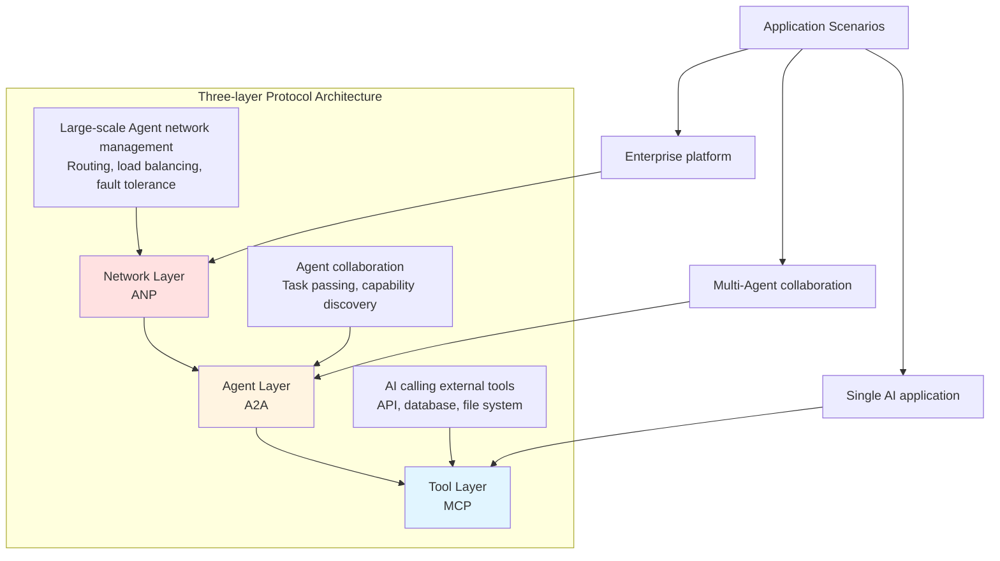
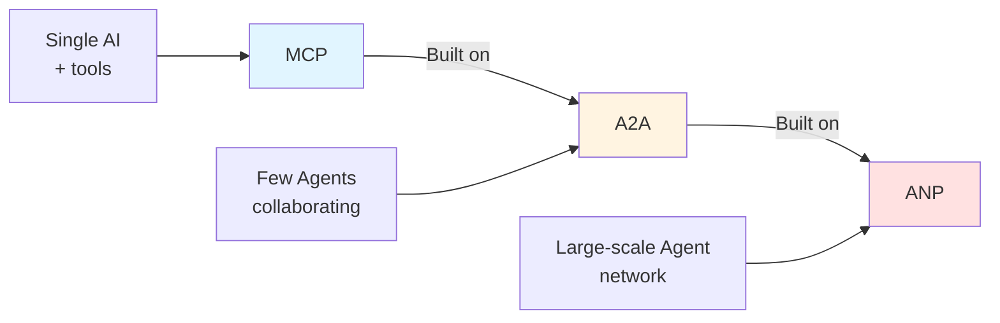
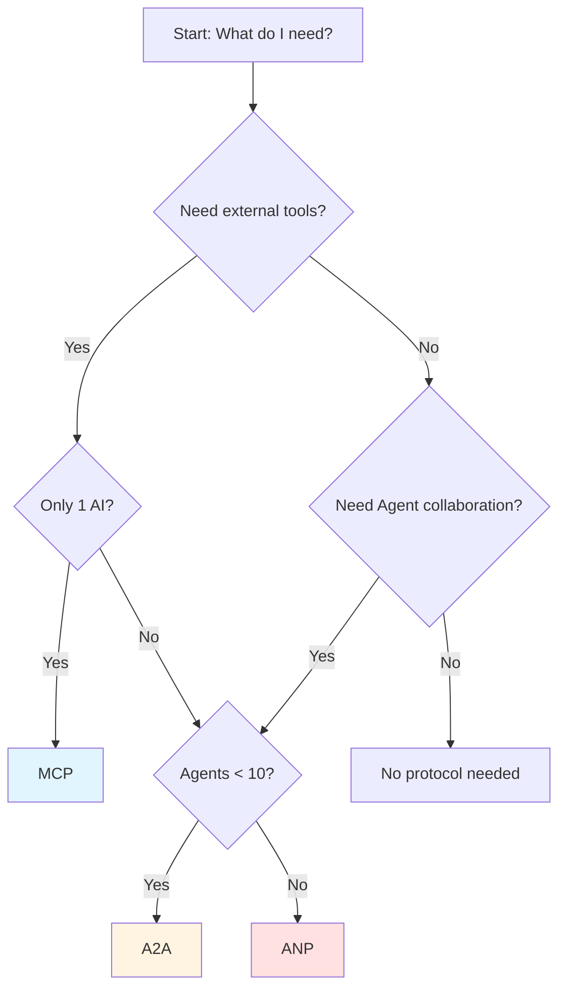

# 11.4 Protocol Ecosystem <DifficultyBadge level="intermediate" /> <CostBadge cost="$0" />

> Prerequisites: 11.1 MCP, 11.2 A2A, 11.3 ANP

### Why Do We Need It? (Problem)

**Problem: How to choose among the three protocols?**

After learning the previous three sections, you might have these questions:

```
❓ Are MCP, A2A, ANP competing protocols?
❓ Which protocol should I use for my project?
❓ Can I use multiple protocols together?
❓ Will these protocols replace each other?
```

**Real Scenario: Selection Confusion**

```python
# Scenario 1: Simple weather query
"Claude, what's the weather in Beijing today?"
→ Which protocol to use?

# Scenario 2: Translation + proofreading workflow
text → Translation Agent → Proofreading Agent → output
→ Which protocol to use?

# Scenario 3: Enterprise-level Agent platform
1000 Agents, cross-department collaboration, needs load balancing and fault tolerance
→ Which protocol to use?
```

Answer: **They're not competing, but complementary layers!**

### What Is It? (Concept)

**Three-layer Protocol Model: Tool Layer → Agent Layer → Network Layer**



**Each layer solves different problems:**

| Layer | Protocol | Problem Solved | Analogy |
|-----|------|-----------|-----|
| **Tool Layer** | MCP | How AI calls external tools | USB protocol (connecting devices) |
| **Agent Layer** | A2A | How Agents collaborate | HTTP (webpage communication) |
| **Network Layer** | ANP | How large-scale Agents are managed | TCP/IP (internet foundation) |

**They are progressive, not replacement:**



**Detailed Comparison:**

### 1. Capability Scope

```
MCP (Tool Layer):
┌──────────────────────────┐
│  Claude  →  Weather API   │
│  Claude  →  Database      │
│  Claude  →  File System   │
└──────────────────────────┘
Focus: Single AI calling multiple tools

A2A (Agent Layer):
┌──────────────────────────┐
│  Translation Agent → Proofreading Agent │
│  Research Agent → Writing Agent │
│  Analysis Agent → Visualization Agent│
└──────────────────────────┘
Focus: Collaboration between Agents

ANP (Network Layer):
┌──────────────────────────┐
│  Registry (Registration center) │
│  Router (Smart routing)   │
│  Load Balancer (Load balancing) │
│  Gateway (Unified entry)  │
└──────────────────────────┘
Focus: Large-scale Agent network management
```

### 2. Communication Mode

| Dimension | MCP | A2A | ANP |
|-----|-----|-----|-----|
| **Mode** | Sync RPC | Async REST | Distributed messaging |
| **State** | Stateless | Task state | Agent state |
| **Discovery** | None (predefined) | Agent Card | Registry |
| **Timeout** | Short (seconds) | Medium (minutes) | Long (hours) |

### 3. Use Cases

**MCP is suitable for:**

✅ Single AI application needs external capabilities
✅ Moderate number of tools (few to dozens)
✅ Synchronous calls, fast return
✅ Local or simple remote tools

**Example:**
```python
# Claude Desktop calling local file system
"Please help me organize files on desktop"
→ MCP Server (filesystem) executes local operations
```

**A2A is suitable for:**

✅ Multiple Agents collaborating on complex tasks
✅ Medium number of Agents (few to dozens)
✅ Asynchronous tasks, possibly time-consuming
✅ Needs capability discovery and task status tracking

**Example:**
```python
# Content creation pipeline
User input → Research Agent → Writing Agent → Editing Agent → Output
(Each Agent communicates via A2A protocol)
```

**ANP is suitable for:**

✅ Large-scale Agent network (hundreds/thousands)
✅ Cross-department, cross-organization collaboration
✅ Needs load balancing, fault tolerance, monitoring
✅ Enterprise-level platforms and ecosystems

**Example:**
```python
# Enterprise Agent platform
- 100 data analysis Agents
- 50 customer service Agents
- 30 R&D Agents
→ ANP provides unified management, routing, monitoring
```

### 4. Protocol Stack Examples

**Scenario 1: Simple Query (MCP only)**

```
User: "What's the weather in Beijing?"
 ↓
Claude (LLM)
 ↓
MCP Client
 ↓
MCP Server (Weather API)
 ↓
External weather service
```

**Scenario 2: Multi-Agent Collaboration (MCP + A2A)**

```
User: "Write a blog post about RAG technology"
 ↓
Coordinator
 ↓
A2A → Research Agent
       ↓
       MCP → Search engine, database
 ↓
A2A → Writing Agent
       ↓
       MCP → Grammar checker
 ↓
A2A → Editing Agent
 ↓
Final output
```

**Scenario 3: Enterprise Platform (MCP + A2A + ANP)**

```
User: "Analyze this quarter's sales data"
 ↓
ANP Gateway (Unified entry)
 ↓
ANP Router (Smart routing)
 ↓
ANP Registry (Find data analysis Agent)
 ↓
ANP Load Balancer (Select low-load Agent)
 ↓
Data Analysis Agent (collaborates via A2A)
  ├→ Data Cleaning Agent
  │   └→ MCP → Database
  ├→ Statistical Analysis Agent
  │   └→ MCP → Python execution environment
  └→ Visualization Agent
      └→ MCP → Chart generation tool
 ↓
Result aggregation
 ↓
ANP Gateway returns to user
```

**Three-layer Protocol Interaction:**

```mermaid
sequenceDiagram
    participant User as User
    participant ANP as ANP<br/>(Network Layer)
    participant A2A as A2A<br/>(Agent Layer)
    participant MCP as MCP<br/>(Tool Layer)
    participant Tool as External Tool
    
    User->>ANP: Request data analysis
    ANP->>ANP: Routing, load balancing
    ANP->>A2A: Assign to data analysis Agent
    A2A->>A2A: Task decomposition
    A2A->>MCP: Agent needs to query database
    MCP->>Tool: Execute SQL
    Tool->>MCP: Return data
    MCP->>A2A: Data returned
    A2A->>A2A: Agent generates analysis report
    A2A->>ANP: Task completed
    ANP->>User: Return result
    
    style ANP fill:#ffe1e1
    style A2A fill:#fff4e1
    style MCP fill:#e1f5ff
```

**Ecosystem Status (February 2026):**

| Protocol | Maturity | Ecosystem | Adoption |
|-----|-------|------|---------|
| **MCP** | ⭐⭐⭐⭐⭐ Mature | Claude Desktop, Cursor, Windsurf native support | Widely used |
| **A2A** | ⭐⭐⭐ Early | Google released, community implementing | Small-scale trials |
| **ANP** | ⭐⭐ Proposal | IBM research project, specification under discussion | Concept stage |

### Hands-on Practice (Practice)

**Decision Flowchart: Which Protocol Should I Use?**



**Real Case Comparison:**

| Application Scenario | Recommended Protocol | Reason |
|---------|---------|-----|
| **Personal AI assistant** | MCP | Single AI, calls calendar, email, files |
| **Code review tool** | MCP | Single AI, calls Git, Linter, Test Runner |
| **Content creation platform** | A2A | Research, writing, editing Agents collaborate |
| **Customer service system** | A2A | Triage, order, logistics specialist Agents collaborate |
| **Enterprise AI platform** | ANP + A2A + MCP | Large-scale Agents, need unified management and routing |
| **AI Agent marketplace** | ANP + A2A | Third-party Agent interconnection, needs registration and discovery |

**Practical Recommendations:**

```python
# 1. Start with MCP
# Suitable for: Personal projects, small teams, rapid prototyping

from mcp.server import Server

app = Server("my-tool")
@app.list_tools()
async def list_tools():
    return [Tool(name="search", ...)]

# 2. Expand to A2A
# Suitable for: Multi-Agent collaboration, medium-sized projects

class ResearchAgent:
    def get_card(self):
        return {"name": "researcher", "capabilities": [...]}
    
    def execute_task(self, task):
        # Call other Agents
        result = call_a2a_agent("writer_agent", task)

# 3. Evolve to ANP
# Suitable for: Large-scale, enterprise-level, cross-organization

class ANPPlatform:
    def __init__(self):
        self.registry = AgentRegistry()
        self.router = SmartRouter(self.registry)
        self.gateway = APIGateway(self.router)
```

**Complete example in Notebook:**

<ColabBadge path="demos/11-protocols/protocols_overview.ipynb" />

### Summary (Reflection)

- **What's solved**: Understood the positioning and selection logic of MCP, A2A, ANP protocols
- **What's not solved**: Now we know protocols, but how to build AI systems with "memory"? — Next chapter introduces RAG and memory storage
- **Key Takeaways**:
  1. **Three-layer model**: MCP (Tool Layer) → A2A (Agent Layer) → ANP (Network Layer)
  2. **Not competing, but complementary**: Each layer solves problems at different scales and scenarios
  3. **Selection principle**: Start from requirements, don't over-engineer
  4. **Can be mixed**: Large projects can use multiple protocols simultaneously
  5. **Different maturity**: MCP mature, A2A early stage, ANP proposal stage
  6. **Start small and grow**: Start with MCP, expand to A2A when needed, consider ANP for enterprise-level

**Selection Quick Reference:**

```
Scenario                     → Protocol
─────────────────────────────────
Personal AI assistant        → MCP
Code generation tool         → MCP
Content creation platform    → A2A
Customer service system      → A2A
Data analysis pipeline       → A2A
Enterprise Agent platform    → ANP + A2A + MCP
AI Agent marketplace         → ANP + A2A
```

**Next Step:**

Chapter 11 completed the "Protocol" section, understanding interconnection between AI systems. But there's still a key question:

**How does AI remember information? How to retrieve relevant knowledge?**

→ Chapter 12: RAG & Memory Storage

---

*Last updated: 2026-02-20*
