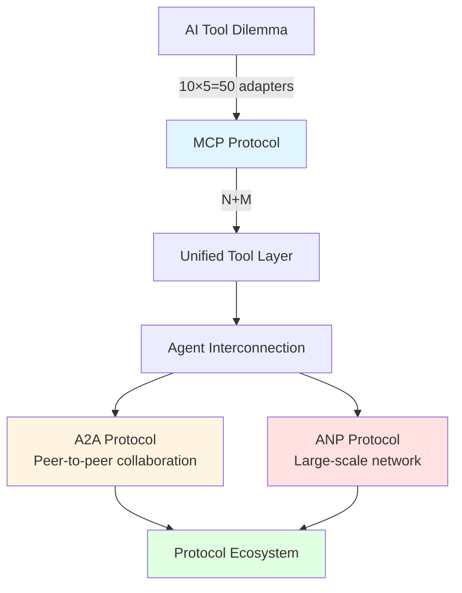
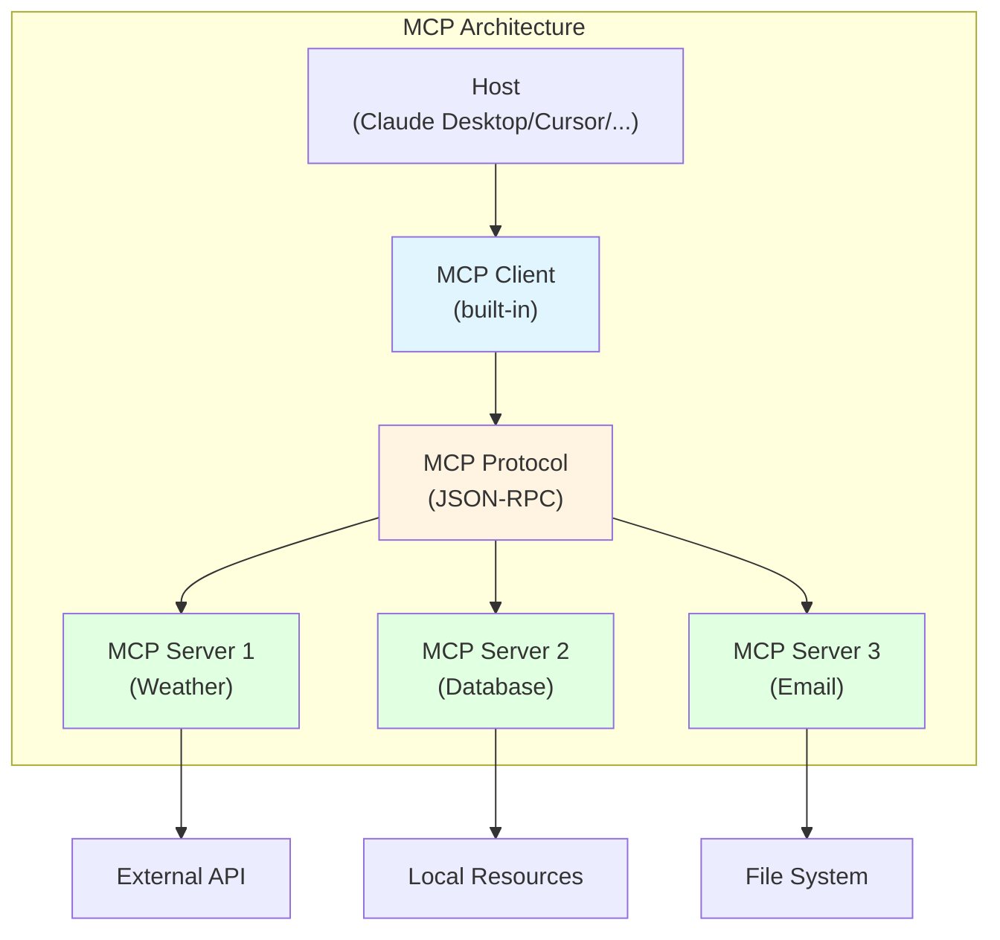
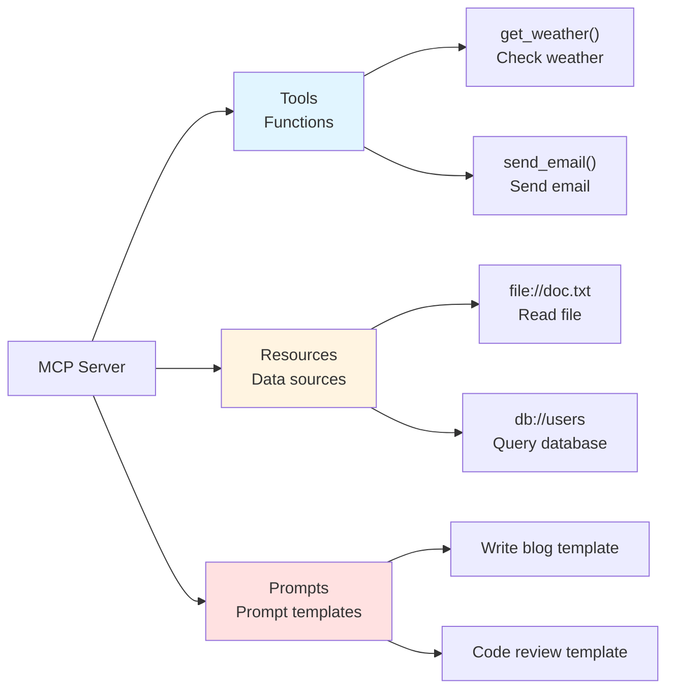

# Chapter 11: MCP / A2A / ANP

> After completing this chapter, you will: Understand the positioning and use cases of the three major protocols, and implement an MCP Server



**Chapter Overview:**

- **11.1 MCP Protocol Explained**: Understand MCP architecture and implement a calculator Server
- **11.2 A2A Protocol**: How Agents discover and collaborate with each other
- **11.3 ANP Protocol**: Large-scale Agent network interconnection
- **11.4 Protocol Ecosystem**: Three-layer model and selection guide

---

## 11.1 MCP Protocol Explained <DifficultyBadge level="intermediate" /> <CostBadge cost="$0" />

> Prerequisite: 7.1 Function Calling Principles

::: tip The Elevator Pitch
Imagine you have 10 appliances (tools) and 5 remote controls (AI platforms). Old way: each remote needs a unique code for each appliance = 50 adapters. MCP's way: everyone speaks Bluetooth = 15 adapters. **MCP is Bluetooth/USB-C for the AI world.**
:::

### Why Do We Need It? (Problem)

**Problem: The N×M Adapter Hell of AI Tools**

Suppose you have 10 tools (weather, database, email, calendar...) and want 5 AI platforms to use them all:

```
Traditional approach:
┌─────────────────────────────────────┐
│ Tool 1  →  OpenAI adapter            │
│ Tool 1  →  Claude adapter            │
│ Tool 1  →  Gemini adapter            │
│ Tool 1  →  Cursor adapter            │
│ Tool 1  →  Windsurf adapter          │
│                                     │
│ Tool 2  →  OpenAI adapter            │
│ Tool 2  →  Claude adapter            │
│ ...                                 │
└─────────────────────────────────────┘

Problem:
❌ 10 tools × 5 platforms = 50 adapters
❌ Each platform has different APIs (OpenAI, Anthropic, Google...)
❌ Tool updates require changing all adapters
❌ Adding a new platform requires rewriting all tools
```

::: info Soul-Searching Question
If you're the person maintaining 50 adapters... would you quit? Because MCP exists precisely so that nobody has to be that person.
:::

**Real-world Case: Developer's Nightmare**

```python
# Same weather tool, need to write multiple versions

# OpenAI version
def get_weather_openai():
    return {
        "type": "function",
        "function": {
            "name": "get_weather",
            "description": "Get weather information",
            "parameters": {...}
        }
    }

# Anthropic version
def get_weather_anthropic():
    return {
        "name": "get_weather",
        "description": "Get weather information",
        "input_schema": {...}  # Different format!
    }

# Google Gemini version
def get_weather_gemini():
    return FunctionDeclaration(
        name="get_weather",
        description="Get weather information",
        parameters={...}  # Yet another format!
    )
```

**MCP Solution: From N×M to N+M**

```
MCP approach:
┌──────────────────────┐      ┌──────────────────────┐
│   Tool 1 (MCP)       │◄─────┤   OpenAI (MCP Client) │
│   Tool 2 (MCP)       │◄─────┤   Claude (MCP Client) │
│   Tool 3 (MCP)       │◄─────┤   Gemini (MCP Client) │
│   ...                │◄─────┤   Cursor (MCP Client) │
│   Tool 10 (MCP)      │◄─────┤   Windsurf (MCP Client)│
└──────────────────────┘      └──────────────────────┘

Advantages:
✅ 10 tools + 5 platforms = 15 implementations (not 50!)
✅ Tools written once, work with all platforms
✅ Unified standard, simple maintenance
✅ Low cost to add platforms/tools
```

### What Is It? (Concept)

**MCP = Model Context Protocol**

MCP is an open protocol launched by Anthropic in November 2024, aimed at **standardizing the way AI connects to tools**.



**Core Components:**

| Component | Role | Example |
|-----|------|------|
| **Host** | AI application host | Claude Desktop, Cursor, Windsurf |
| **MCP Client** | Built into Host | Handles communication with MCP Server |
| **MCP Server** | Tool provider | Weather Server, Database Server, File Server |
| **Protocol** | Communication protocol | JSON-RPC 2.0 |
| **Transport** | Transport layer | stdio (local), SSE (remote) |

**MCP Server Provides Three Capabilities:**



**1. Tools:**

Similar to Function Calling, provides executable functions:

```json
{
  "name": "get_weather",
  "description": "Get weather for specified city",
  "inputSchema": {
    "type": "object",
    "properties": {
      "city": {
        "type": "string",
        "description": "City name"
      }
    },
    "required": ["city"]
  }
}
```

**2. Resources:**

Provides static or dynamic context data:

```json
{
  "uri": "file:///project/README.md",
  "name": "Project README",
  "description": "Project README documentation",
  "mimeType": "text/markdown"
}
```

**3. Prompts:**

Predefined prompt templates:

```json
{
  "name": "code_review",
  "description": "Code review template",
  "arguments": [
    {
      "name": "code",
      "description": "Code to review",
      "required": true
    }
  ]
}
```

**MCP Protocol Workflow:**

```mermaid
sequenceDiagram
    participant User as User
    participant Host as Claude Desktop
    participant Client as MCP Client
    participant Server as MCP Server
    participant API as External API
    
    User->>Host: "What's the weather in Beijing today?"
    Host->>Client: Need to call tool
    Client->>Server: tools/list (list available tools)
    Server->>Client: [{name: "get_weather", ...}]
    Client->>Server: tools/call (call get_weather)
    Server->>API: Call real weather API
    API->>Server: Return weather data
    Server->>Client: Return result
    Client->>Host: Tool result
    Host->>User: "Beijing is sunny today, 15°C"
    
    style Client fill:#e1f5ff
    style Server fill:#fff4e1
```

**Transport Layer:**

MCP supports two transport methods:

| Transport | Scenario | Implementation |
|-------|------|---------|
| **stdio** | Local tools | Communication via standard input/output |
| **SSE** | Remote tools | Server-Sent Events, HTTP long connection |

**stdio Example:**

```python
# MCP Server communicates with Client via stdin/stdout
import sys
import json

# Read request
request = json.loads(sys.stdin.readline())

# Process request
result = handle_request(request)

# Return response
print(json.dumps(result))
sys.stdout.flush()
```

**MCP Protocol Specification (JSON-RPC):**

```json
// Request
{
  "jsonrpc": "2.0",
  "id": 1,
  "method": "tools/call",
  "params": {
    "name": "get_weather",
    "arguments": {
      "city": "Beijing"
    }
  }
}

// Response
{
  "jsonrpc": "2.0",
  "id": 1,
  "result": {
    "content": [
      {
        "type": "text",
        "text": "Beijing is sunny today, temperature 15°C"
      }
    ]
  }
}
```

**MCP Ecosystem Status (February 2026):**

|| Supporter | Progress |
||-------|------|
|| **Claude Desktop** | ✅ Native support (first adopter) |
|| **Cursor** | ✅ Native support |
|| **Windsurf** | ✅ Native support |
|| **Zed Editor** | ✅ Native support |
|| **VS Code** | ✅ Native support (via GitHub Copilot) |
|| **Claude Code** | ✅ Native support |
|| **OpenAI** | ✅ Adopted (ChatGPT + API support) |
|| **Gemini** | ⚠️ Partial support |

::: tip MCP Ecosystem Growth
Since launch in November 2024, the MCP ecosystem has grown explosively:
- **5,000+** community-built MCP Servers on GitHub
- **Smithery.ai** and other MCP marketplaces for discovering and installing servers
- Major platforms (OpenAI, Google) joined the ecosystem in 2025, validating MCP as the de-facto standard
- The protocol has expanded from stdio-only to support SSE and Streamable HTTP transports
:::

**Official MCP Servers:**

- `@modelcontextprotocol/server-filesystem`: File system access
- `@modelcontextprotocol/server-postgres`: PostgreSQL database
- `@modelcontextprotocol/server-github`: GitHub API
- `@modelcontextprotocol/server-google-drive`: Google Drive
- `@modelcontextprotocol/server-slack`: Slack integration

### Hands-on Practice (Practice)

**Practice: Implement a Simple MCP Server in Python**

Let's implement a calculator MCP Server that provides four arithmetic operations.

**Step 1: Install MCP SDK**

```bash
pip install mcp
```

**Step 2: Implement MCP Server**

```python
# calculator_server.py
from mcp.server import Server
from mcp.server.stdio import stdio_server
from mcp.types import Tool, TextContent
import json

# Create MCP Server
app = Server("calculator-server")

# Define tool: addition
@app.list_tools()
async def list_tools() -> list[Tool]:
    return [
        Tool(
            name="add",
            description="Calculate the sum of two numbers",
            inputSchema={
                "type": "object",
                "properties": {
                    "a": {"type": "number", "description": "First number"},
                    "b": {"type": "number", "description": "Second number"}
                },
                "required": ["a", "b"]
            }
        ),
        Tool(
            name="subtract",
            description="Calculate the difference of two numbers",
            inputSchema={
                "type": "object",
                "properties": {
                    "a": {"type": "number", "description": "Minuend"},
                    "b": {"type": "number", "description": "Subtrahend"}
                },
                "required": ["a", "b"]
            }
        ),
        Tool(
            name="multiply",
            description="Calculate the product of two numbers",
            inputSchema={
                "type": "object",
                "properties": {
                    "a": {"type": "number", "description": "First number"},
                    "b": {"type": "number", "description": "Second number"}
                },
                "required": ["a", "b"]
            }
        ),
        Tool(
            name="divide",
            description="Calculate the quotient of two numbers",
            inputSchema={
                "type": "object",
                "properties": {
                    "a": {"type": "number", "description": "Dividend"},
                    "b": {"type": "number", "description": "Divisor"}
                },
                "required": ["a", "b"]
            }
        )
    ]

# Implement tool calls
@app.call_tool()
async def call_tool(name: str, arguments: dict) -> list[TextContent]:
    a = arguments["a"]
    b = arguments["b"]
    
    if name == "add":
        result = a + b
    elif name == "subtract":
        result = a - b
    elif name == "multiply":
        result = a * b
    elif name == "divide":
        if b == 0:
            return [TextContent(type="text", text="Error: Cannot divide by zero")]
        result = a / b
    else:
        return [TextContent(type="text", text=f"Unknown tool: {name}")]
    
    return [TextContent(type="text", text=str(result))]

# Start Server
async def main():
    async with stdio_server() as (read_stream, write_stream):
        await app.run(read_stream, write_stream, app.create_initialization_options())

if __name__ == "__main__":
    import asyncio
    asyncio.run(main())
```

**Step 3: Configure Claude Desktop**

Edit `~/Library/Application Support/Claude/claude_desktop_config.json`:

```json
{
  "mcpServers": {
    "calculator": {
      "command": "python",
      "args": ["/path/to/calculator_server.py"]
    }
  }
}
```

**Step 4: Restart Claude Desktop and Test**

Ask in Claude Desktop:

```
User: "Help me calculate 123 + 456"

Claude: [Calls add tool]
Result: 579
```

**Complete example in Notebook:**

<ColabBadge path="demos/11-protocols/mcp_server.ipynb" />

### Summary (Reflection)

- **What's solved**: Understood how MCP simplifies the N×M adapter problem to N+M, and implemented a simple MCP Server
- **What's not solved**: MCP solves "AI calling tools", but what about "AI calling AI"? — Next section introduces A2A protocol
- **Key Takeaways**:
  1. **MCP is a standardization protocol**: Unifies how AI connects to tools, avoiding N×M adapter hell
  2. **Three capabilities**: Tools (functions), Resources (data), Prompts (templates)
  3. **Transport layer**: stdio (local), SSE (remote)
  4. **Protocol format**: JSON-RPC 2.0, simple and clear
  5. **Ecosystem support**: Claude Desktop, Cursor, Windsurf and other mainstream tools natively support it
  6. **Easy to implement**: Official SDK enables quick MCP Server implementation

::: tip Protocol Analogies Cheat Sheet
- **MCP** = USB-C for AI tools (one standard, everything connects)
- **A2A** = WeChat group for Agents (they chat and collaborate on tasks)
- **ANP** = LinkedIn/Yellow Pages for Agents (find the right agent on the internet)
:::

**Key Insights:**
- MCP is not the only tool protocol, but its **openness and simplicity** led to rapid adoption
- MCP currently mainly solves **tool calling** problems, not Agent-to-Agent collaboration

::: tip Three-Layer Protocol Architecture
The three protocols (MCP, A2A, ANP) form a layered architecture for the AI agent ecosystem, as explored in [hello-agents Chapter 10](https://datawhalechina.github.io/hello-agents/#/):

| Protocol | Proposed By | Purpose | Scope |
|----------|-----------|---------|-------|
| **MCP** | Anthropic (2024) | AI ↔ Tools | Local/organization tools |
| **A2A** | Google (2025) | Agent ↔ Agent | Peer-to-peer agent collaboration |
| **ANP** | Community (2025) | Agent Network | Large-scale agent discovery & routing |

**MCP** = "How AI uses tools" (USB-C for AI)
**A2A** = "How agents talk to each other" (HTTP for agents)
**ANP** = "How to find agents on the internet" (DNS for agents)

These protocols are complementary, not competing. A production system might use all three: MCP for tool access, A2A for inter-agent communication, and ANP for agent discovery across organizations.
:::

---

*Last updated: 2026-02-20*
