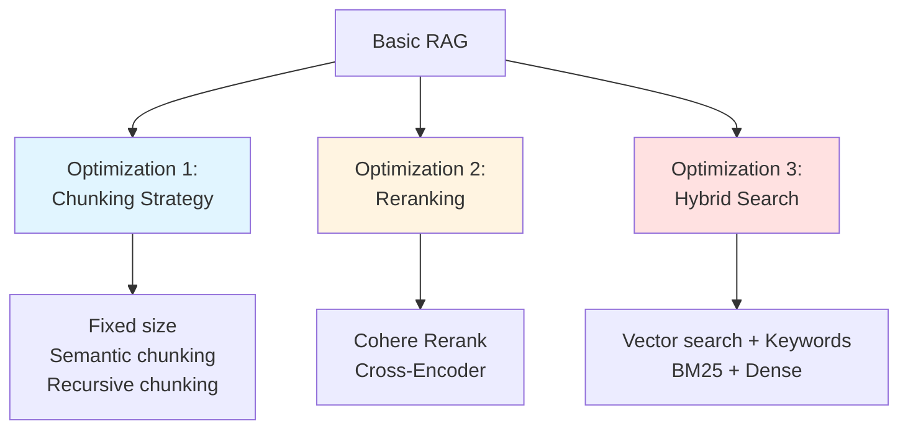
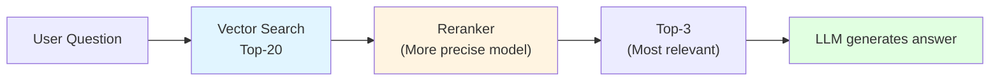

# 12.3 Advanced RAG <DifficultyBadge level="advanced" /> <CostBadge cost="$0.05" />

> Prerequisites: 12.1 RAG Basics, 12.2 Embedding

### Why Do We Need It? (Problem)

**Problem: Basic RAG Retrieval Quality Issues**

```python
# Scenario: User asks "How to handle exceptions in Python?"

Document library:
  - "Python uses try-except to handle exceptions. Syntax: try: code except Exception: handle"
  - "Java uses try-catch for exception handling"
  - "Python's history dates back to 1991..."
  - "In exceptional situations, the system will automatically restart"

Basic RAG retrieval results (Top-3):
  1. "In exceptional situations, the system will..." (contains "exceptional", but irrelevant!)
  2. "Python uses try-except to handle exceptions..." (Correct!)
  3. "Python's history..." (contains "Python", but irrelevant!)

Problems:
❌ Inaccurate retrieval: Relevant documents not ranked properly
❌ Rough chunking: Important context is cut off
❌ Single search: Only vector search, no keyword matching
```

### What Is It? (Concept)

**Three Major Optimization Directions for Advanced RAG:**



### Optimization 1: Chunking Strategy

**Problem: Flaws of Fixed-size Chunking**

```python
# Fixed 1000 character chunking
text = """
Python Exception Handling

Python uses try-except statements to handle exceptions. Basic syntax:

try:
    # Code that may error
    result = 10 / 0
except ZeroDivisionError:
    # Handle specific exception
    print("Cannot divide by zero")
except Exception as e:
    # Handle other exceptions
    print(f"Error occurred: {e}")
finally:
    # Always executes
    print("Clean up resources")
"""

# If cut at "Basic syntax:"
chunk1 = "Python Exception Handling\n\nPython uses try-except statements to handle exceptions. Basic syntax:"
chunk2 = "\n\ntry:\n    result = 10 / 0\nexcept..."

# Problem: Context is cut off!
```

**Three Improvement Strategies:**

| Strategy | Principle | Advantages | Disadvantages |
|-----|------|-----|------|
| **Fixed size + overlap** | Overlapping sections between chunks | Simple | May still cut context |
| **Semantic chunking** | Split by paragraph, sentence boundaries | Maintains semantic integrity | Needs NLP tools |
| **Recursive chunking** | First by chapter, then paragraph, then sentence | Clear hierarchy | High complexity |

**Practice: Recursive Chunking**

```python
from langchain.text_splitter import RecursiveCharacterTextSplitter

text_splitter = RecursiveCharacterTextSplitter(
    chunk_size=1000,
    chunk_overlap=200,
    separators=[
        "\n\n",  # First split by blank lines (paragraphs)
        "\n",    # Then split by newlines (sentences)
        "。",    # Chinese period
        " ",     # Space
        ""       # Finally by character
    ]
)

chunks = text_splitter.split_text(text)
```

### Optimization 2: Reranking

**Problem: Vector Search Not Precise Enough**

```
User question: "How to handle exceptions in Python?"

Vector search Top-5:
  1. Relevance 0.78 → "In exceptional situations, system will..." (irrelevant, but vector close)
  2. Relevance 0.76 → "Python uses try-except..." (Relevant!)
  3. Relevance 0.74 → "Java exception handling..." (irrelevant)
  4. Relevance 0.72 → "Python's history..." (irrelevant)
  5. Relevance 0.70 → "Exception handling best practices..." (Relevant!)

Problem: Truly relevant documents not ranked at top
```

**Reranking: Second Pass Sorting**



**Practice: Cohere Rerank**

```python
import cohere

co = cohere.Client("your-api-key")

# 1. Vector search Top-20
docs = vectorstore.similarity_search(question, k=20)

# 2. Rerank, keep only Top-3
results = co.rerank(
    query=question,
    documents=[doc.page_content for doc in docs],
    top_n=3,
    model="rerank-multilingual-v3.0"
)

# 3. Get reranked documents
reranked_docs = [docs[r.index] for r in results.results]
```

### Optimization 3: Hybrid Search

**Problem: Vector Search Not Sensitive to Exact Keywords**

```
User asks: "What is GPT-4's API pricing?"

Vector search:
  - May return "GPT-3.5 pricing..." (vector similar, but wrong model)
  - May return "API calling methods..." (topic related, but not pricing)

Need: Match both semantics + exact keywords ("GPT-4" + "pricing")
```

**Hybrid Search: Vector Search + BM25**

| Search Method | Principle | Suitable for |
|---------|------|-----|
| **Vector Search** | Semantic similarity | Understanding intent, synonyms |
| **BM25** | Keyword frequency | Exact matching, proper nouns |
| **Hybrid** | Combine both | Balance semantics and precision |

**Practice: LangChain + BM25**

```python
from langchain.retrievers import BM25Retriever, EnsembleRetriever
from langchain.vectorstores import Chroma

# 1. Vector retriever
vectorstore = Chroma.from_documents(documents, embeddings)
vector_retriever = vectorstore.as_retriever(search_kwargs={"k": 5})

# 2. BM25 retriever
bm25_retriever = BM25Retriever.from_documents(documents)
bm25_retriever.k = 5

# 3. Hybrid retriever
ensemble_retriever = EnsembleRetriever(
    retrievers=[vector_retriever, bm25_retriever],
    weights=[0.5, 0.5]  # 50% each
)

# Query
docs = ensemble_retriever.get_relevant_documents("GPT-4 pricing")
```

### Other Advanced Techniques

**1. Query Transformation (Query Rewriting)**

```python
# User question is vague
user_query = "How to use it?"

# LLM rewrites to clear question
improved_query = "How to use try-except exception handling in Python"

# Then retrieve
docs = vectorstore.similarity_search(improved_query)
```

**2. Metadata Filtering**

```python
# Only search documents after 2024
docs = vectorstore.similarity_search(
    query,
    k=5,
    filter={"year": {"$gte": 2024}}
)
```

**3. Parent Document Retrieval**

```python
# Small chunks for retrieval (precise)
# Large chunks for generation (complete context)

small_chunks = split_documents(docs, chunk_size=200)
large_chunks = split_documents(docs, chunk_size=1000)

# Retrieve small chunks, return corresponding large chunks
retrieved_small = search(small_chunks)
returned_large = get_parent_chunks(retrieved_small)
```

### Hands-on Practice (Practice)

Complete advanced RAG implementation, comparing effects of different strategies.

<ColabBadge path="demos/12-rag-memory/advanced_rag.ipynb" />

### Summary (Reflection)

- **What's solved**: Mastered three major optimization techniques for improving RAG retrieval quality
- **What's not solved**: RAG solves knowledge base problems, but what about chatbot "memory"? — Next section introduces memory management
- **Key Takeaways**:
  1. **Chunking strategy**: Recursive chunking maintains semantic integrity
  2. **Reranking**: Cohere Rerank improves Top-K quality
  3. **Hybrid search**: Vector + BM25, balances semantics and precision
  4. **Query rewriting**: Makes questions more explicit
  5. **Metadata filtering**: Narrows search scope

---

*Last updated: 2026-02-20*
