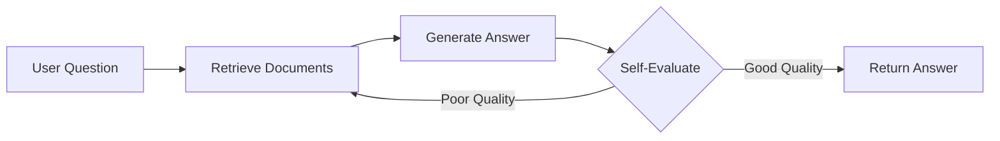
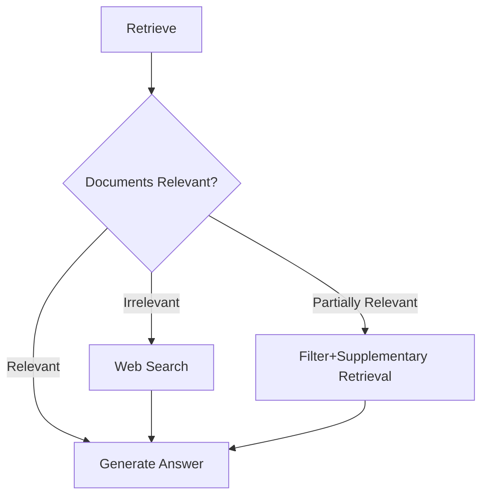
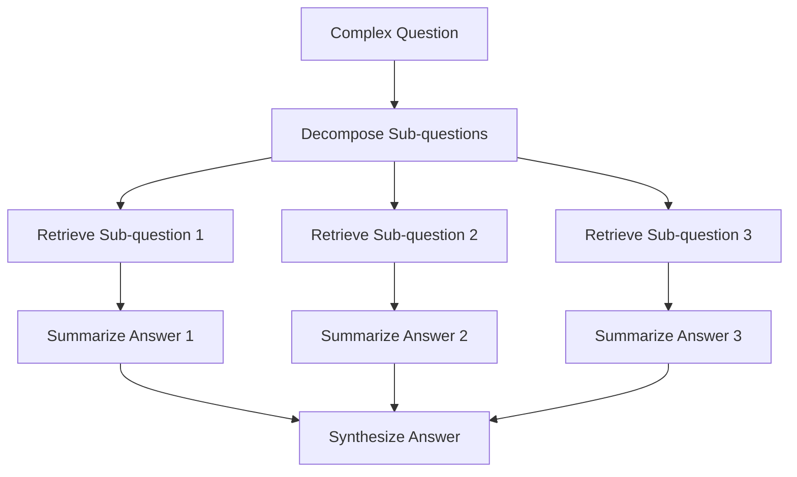
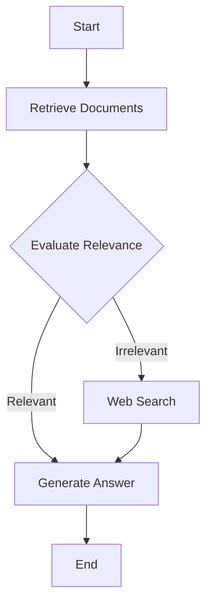

---
prev:
  text: '12.5 GraphRAG'
  link: '/12-rag-memory/graph-rag'
next:
  text: '12.7 AI Memory Product Landscape'
  link: '/12-rag-memory/memory-products'
---

# 12.6 Agentic RAG

## Opening: What if RAG Could Think for Itself?

Imagine you ask your assistant: "Why does my cat always meow at 3 AM?"

**Traditional RAG**:  
→ Retrieve "cat early morning meow"  
→ Return top 5 results  
→ Generate answer: "Probably hungry or bored"  
→ Done

**Agentic RAG**:  
→ "Hmm, let me first check the cat's biological clock..." (1st retrieval)  
→ "Wait, the user mentioned 3 AM specifically. Is this related to hunting instincts?" (2nd retrieval)  
→ "The results mention 'dusk/dawn active period', but 3 AM isn't in that range..." (self-reflection)  
→ "Let me re-search 'cat nighttime abnormal activity'..." (corrective retrieval)  
→ "Found it! Could be thyroid issues or anxiety. Recommend seeing a vet" (final answer)

This is Agentic RAG — **a retrieval system that thinks, questions, and iterates**.

::: tip Core Difference
- **Traditional RAG**: 🤖 "I'm just a porter, I fetch what you ask for"
- **Agentic RAG**: 🧠 "I'm a detective, let me investigate if the clues are reliable"
:::

---

## Three Fatal Flaws of Traditional RAG

### 1. One-Shot Blindness

**Scenario**: "Did SpaceX's Starship third flight succeed?"

```python
# Traditional RAG retrieval logic
query = "Starship third flight success"
docs = vector_db.search(query, top_k=5)  # Single retrieval
answer = llm.generate(docs)              # Direct generation

# Problem: What if it retrieves old news from the second flight?
# Answer: Doesn't care, generates anyway
```

**Result**: May return outdated information because it doesn't verify the timeline.

### 2. No Fact-Checking

**Scenario**: "What are the new features in Python 3.12?"

```python
# Traditional RAG
docs = retrieve("Python 3.12 features")  # Might retrieve 3.11 docs
answer = generate(docs)                  # Generates answer, right or wrong

# Agentic RAG
docs = retrieve("Python 3.12 features")
if not verify_relevance(docs, "3.12"):   # Verify relevance
    docs = retrieve("Python 3.12 release notes official")  # Re-retrieve
answer = generate(docs)
```

### 3. No Routing Capability

**Question types**:
- Factual query → Should use vector retrieval
- Code question → Should use code search engine
- Real-time info → Should call search API

**Traditional RAG**: Uses vector retrieval for everything, one-size-fits-all (then fails)

**Agentic RAG**: "Let me think which tool to use..."

---

## What is Agentic RAG?

### Definition

> **Agentic RAG** = Agent + RAG (Retrieval-Augmented Generation)

Hand over the RAG retrieval process to an **Agent with decision-making capability**, letting it decide:
- **WHEN** (when to retrieve): Do we need retrieval? Or use existing knowledge?
- **WHERE** (where to retrieve from): Vector DB? Search engine? SQL database?
- **HOW** (how to retrieve): Single query? Or multi-step reasoning?

### Core Architecture

```
User Question
   ↓
[Agent Planner]
   ↓
   ├─→ Need retrieval? → [Retrieval Tool Selection]
   │                   ↓
   │              [Execute Retrieval]
   │                   ↓
   │              [Verify Results]
   │                   ↓
   │              Reliable? ──No──→ [Re-retrieve/Adjust Strategy]
   │                   ↓ Yes
   └─→ No retrieval needed → [Generate Answer Directly]
```

---

## Four Agentic RAG Patterns

### 1. Self-RAG (Self-Reflective RAG)

**Core Idea**: After generating an answer, evaluate its quality and re-retrieve if necessary.



**Code Example** (pseudocode):

```python
def self_rag(query):
    max_iterations = 3
    
    for i in range(max_iterations):
        # Retrieve
        docs = retrieve(query)
        
        # Generate answer
        answer = llm.generate(f"Based on documents: {docs}\nAnswer: {query}")
        
        # Self-evaluate
        score = llm.evaluate(f"Answer: {answer}\nScore (1-10): ")
        
        if score >= 8:
            return answer  # Satisfied, return
        
        # Not satisfied, refine query
        query = llm.refine_query(query, answer, docs)
    
    return answer  # Max iterations reached, return last result
```

**Applicable Scenarios**:
- Scenarios requiring high-quality answers (medical, legal consulting)
- Can tolerate longer response times

::: warning Performance Warning
Self-RAG calls the LLM multiple times, increasing cost and latency. For production, recommend `max_iterations=2`.
:::

---

### 2. Corrective RAG

**Core Idea**: First judge if retrieval results are relevant; if not, change strategy and re-retrieve.



**Code Example**:

```python
from langchain.prompts import PromptTemplate
from langchain.chat_models import ChatOpenAI

def corrective_rag(query):
    # Step 1: Vector retrieval
    docs = vector_store.search(query, top_k=5)
    
    # Step 2: Relevance judgment
    relevance_prompt = PromptTemplate.from_template(
        "Documents: {docs}\nQuestion: {query}\n"
        "Are these documents relevant? Answer RELEVANT/IRRELEVANT/PARTIAL"
    )
    
    llm = ChatOpenAI(model="gpt-4")
    relevance = llm.predict(relevance_prompt.format(docs=docs, query=query))
    
    # Step 3: Decide based on relevance
    if relevance == "RELEVANT":
        return llm.generate(f"Based on documents: {docs}\nAnswer: {query}")
    
    elif relevance == "IRRELEVANT":
        # Completely irrelevant, use Web search
        web_results = tavily_search(query)  # Tavily API
        return llm.generate(f"Based on search: {web_results}\nAnswer: {query}")
    
    else:  # PARTIAL
        # Partially relevant, filter and supplement
        filtered_docs = [d for d in docs if is_relevant(d, query)]
        additional_docs = web_search(query, top_k=2)
        all_docs = filtered_docs + additional_docs
        return llm.generate(f"Based on documents: {all_docs}\nAnswer: {query}")

def is_relevant(doc, query):
    # Simple keyword matching or semantic similarity
    return semantic_similarity(doc, query) > 0.7
```

**Key Components**:
- **Relevance Classifier**: Can use a small model (like BERT) or LLM for judgment
- **Fallback Retrieval Strategy**: Web search, SQL query, API calls, etc.

---

### 3. Adaptive RAG

**Core Idea**: Automatically select retrieval strategy based on question type.

```python
from enum import Enum

class QueryType(Enum):
    SIMPLE = "simple"          # Simple factual query
    COMPLEX = "complex"        # Requires reasoning
    RECENT = "recent"          # Real-time information
    CODE = "code"              # Code question

def adaptive_rag(query):
    # Step 1: Classify question type
    query_type = classify_query(query)
    
    # Step 2: Route to different strategies
    if query_type == QueryType.SIMPLE:
        # Simple query → Single vector retrieval
        docs = vector_store.search(query, top_k=3)
        return llm.generate(f"Based on: {docs}\nAnswer: {query}")
    
    elif query_type == QueryType.COMPLEX:
        # Complex query → Multi-hop RAG
        return multi_hop_rag(query)
    
    elif query_type == QueryType.RECENT:
        # Real-time info → Direct Web search
        web_results = tavily_search(query)
        return llm.generate(f"Based on: {web_results}\nAnswer: {query}")
    
    elif query_type == QueryType.CODE:
        # Code question → Code search engine
        code_results = github_code_search(query)
        return llm.generate(f"Based on code: {code_results}\nAnswer: {query}")

def classify_query(query):
    """Use LLM to classify question type"""
    prompt = f"""
    Question: {query}
    
    What type of question is this?
    - SIMPLE: Simple factual query (e.g., "What is RAG?")
    - COMPLEX: Requires multi-step reasoning (e.g., "Compare pros and cons of RAG vs fine-tuning")
    - RECENT: Real-time information (e.g., "Today's weather")
    - CODE: Code question (e.g., "How to implement quicksort in Python?")
    
    Return only the type name:
    """
    
    response = llm.predict(prompt).strip()
    return QueryType(response.lower())
```

**Routing Decision Tree**:

```
Question
 ├─ Contains time words (today/latest/now) → Web search
 ├─ Contains code keywords (implement/code/function) → Code search
 ├─ Contains comparison/analysis words → Multi-hop RAG
 └─ Other → Vector retrieval
```

---

### 4. Multi-hop RAG

**Core Idea**: A question requires multiple retrievals, with each retrieval's result as input for the next.

**Scenario**: "Which is better for building Agentic RAG: LangChain or LlamaIndex?"

```python
def multi_hop_rag(query):
    # Step 1: Decompose question
    sub_queries = decompose_query(query)
    # Output: ["LangChain advantages", "LlamaIndex advantages", "Agentic RAG requirements"]
    
    # Step 2: Retrieve each
    all_contexts = []
    for sub_q in sub_queries:
        docs = vector_store.search(sub_q, top_k=3)
        summary = llm.summarize(docs)  # Summarize sub-answer
        all_contexts.append(summary)
    
    # Step 3: Synthesize final answer
    final_context = "\n".join(all_contexts)
    return llm.generate(f"Based on the following:\n{final_context}\n\nAnswer: {query}")

def decompose_query(query):
    """LLM decomposes question"""
    prompt = f"""
    Decompose the following question into 3-5 sub-questions:
    {query}
    
    Return in list format:
    1. ...
    2. ...
    """
    response = llm.predict(prompt)
    return parse_list(response)
```

**Flowchart**:



**Applicable Scenarios**:
- Comparison questions ("A vs B")
- Causal reasoning ("Why does X lead to Y?")
- Comprehensive analysis ("Summarize pros and cons of X")

---

## Complete Code Example: Building Agentic RAG with LangGraph

LangGraph is LangChain's state machine framework, best suited for building Agentic RAG.

### Install Dependencies

```bash
pip install langgraph langchain langchain-openai faiss-cpu
```

### Complete Code

```python
from typing import TypedDict, Annotated, List
from langgraph.graph import StateGraph, END
from langchain_openai import ChatOpenAI, OpenAIEmbeddings
from langchain_community.vectorstores import FAISS
from langchain_core.documents import Document

# ============ 1. Define State ============
class AgentState(TypedDict):
    query: str                    # User question
    documents: List[Document]     # Retrieved documents
    answer: str                   # Generated answer
    needs_web_search: bool        # Whether Web search is needed
    iteration: int                # Iteration count

# ============ 2. Initialize Tools ============
llm = ChatOpenAI(model="gpt-4o-mini", temperature=0)
embeddings = OpenAIEmbeddings()

# Create sample vector store
docs = [
    Document(page_content="RAG is retrieval-augmented generation, combining retrieval and generation"),
    Document(page_content="Agentic RAG lets Agents control the retrieval process, enabling multiple retrievals"),
    Document(page_content="LangGraph is a state machine framework for building Agent workflows"),
]
vector_store = FAISS.from_documents(docs, embeddings)

# ============ 3. Define Node Functions ============
def retrieve(state: AgentState) -> AgentState:
    """Retrieve node"""
    query = state["query"]
    docs = vector_store.similarity_search(query, k=3)
    state["documents"] = docs
    print(f"📚 Retrieved {len(docs)} documents")
    return state

def evaluate_relevance(state: AgentState) -> AgentState:
    """Evaluate relevance"""
    docs = state["documents"]
    query = state["query"]
    
    prompt = f"""
    Question: {query}
    Documents: {[d.page_content for d in docs]}
    
    Are these documents sufficient to answer the question? Only answer YES or NO:
    """
    
    response = llm.predict(prompt).strip()
    state["needs_web_search"] = (response == "NO")
    
    if state["needs_web_search"]:
        print("❌ Documents irrelevant, need Web search")
    else:
        print("✅ Documents relevant")
    
    return state

def web_search(state: AgentState) -> AgentState:
    """Web search node (simulated)"""
    query = state["query"]
    # Should actually call Tavily API or other search engines
    fake_results = [
        Document(page_content=f"Web results: Latest info about {query}...")
    ]
    state["documents"] = fake_results
    print("🌐 Executing Web search")
    return state

def generate_answer(state: AgentState) -> AgentState:
    """Generate answer node"""
    docs = state["documents"]
    query = state["query"]
    
    context = "\n".join([d.page_content for d in docs])
    prompt = f"Based on the following documents:\n{context}\n\nAnswer question: {query}"
    
    answer = llm.predict(prompt)
    state["answer"] = answer
    print(f"💡 Generated answer: {answer[:50]}...")
    return state

# ============ 4. Build Graph ============
workflow = StateGraph(AgentState)

# Add nodes
workflow.add_node("retrieve", retrieve)
workflow.add_node("evaluate", evaluate_relevance)
workflow.add_node("web_search", web_search)
workflow.add_node("generate", generate_answer)

# Define edges
workflow.set_entry_point("retrieve")
workflow.add_edge("retrieve", "evaluate")

# Conditional edge: decide next step based on relevance
workflow.add_conditional_edges(
    "evaluate",
    lambda state: "web_search" if state["needs_web_search"] else "generate",
    {
        "web_search": "web_search",
        "generate": "generate"
    }
)

workflow.add_edge("web_search", "generate")
workflow.add_edge("generate", END)

# Compile graph
app = workflow.compile()

# ============ 5. Run ============
if __name__ == "__main__":
    initial_state = {
        "query": "What is Agentic RAG?",
        "documents": [],
        "answer": "",
        "needs_web_search": False,
        "iteration": 0
    }
    
    result = app.invoke(initial_state)
    print("\n" + "="*50)
    print("Final answer:", result["answer"])
```

### Run Results

```bash
📚 Retrieved 3 documents
✅ Documents relevant
💡 Generated answer: Agentic RAG is an enhanced version of RAG where...

==================================================
Final answer: Agentic RAG is an enhanced version of RAG where Agents 
control the retrieval process, enabling multiple retrievals, result verification, 
and adaptive selection of retrieval strategies.
```

### Process Visualization



---

## Agentic RAG Tool Ecosystem

### 1. LangGraph (Recommended)

**Advantages**:
- 🎯 Designed for Agent workflows, clear state management
- 🔄 Supports loops and conditional branches
- 🛠️ Seamless integration with LangChain tool ecosystem

**Applicable Scenarios**: Agentic RAG requiring complex decision logic

**Code Structure**:
```python
StateGraph → Define nodes → Add edges → Compile → Run
```

---

### 2. LlamaIndex Agents

**Advantages**:
- 📦 Out-of-the-box Agent templates
- 🔗 Native support for multiple vector stores and LLMs
- 📊 Built-in Observability

**Code Example**:

```python
from llama_index.core.agent import ReActAgent
from llama_index.tools import QueryEngineTool

# Create retrieval tool
query_engine = index.as_query_engine()
query_tool = QueryEngineTool.from_defaults(
    query_engine=query_engine,
    name="vector_search",
    description="Search information in document library"
)

# Create Agent
agent = ReActAgent.from_tools([query_tool], llm=llm, verbose=True)

# Run
response = agent.chat("What is Agentic RAG?")
```

**ReAct Pattern**:
```
Thought: I need to search for the definition of Agentic RAG
Action: vector_search("Agentic RAG")
Observation: [Retrieval results]
Thought: Results look incomplete, I need more info
Action: vector_search("Agentic RAG examples")
Observation: [Retrieval results]
Thought: Now I have enough information
Answer: Agentic RAG is...
```

---

### 3. DSPy (Stanford)

**Feature**: Define Agent logic through **programming**, not prompts.

```python
import dspy

class AgenticRAG(dspy.Module):
    def __init__(self):
        self.retrieve = dspy.Retrieve(k=3)
        self.generate = dspy.ChainOfThought("context, question -> answer")
    
    def forward(self, question):
        context = self.retrieve(question).passages
        return self.generate(context=context, question=question)

# Compile (automatically optimize prompts)
compiled_rag = dspy.teleprompt.BootstrapFewShot().compile(
    AgenticRAG(),
    trainset=my_trainset
)
```

**Advantage**: Automatic prompt optimization, suitable for research and experiments.

---

## When to Use Agentic RAG?

### Usage Decision Tree

```
Question Characteristics
 ├─ Need multi-step reasoning? ──Yes──→ Multi-hop RAG
 ├─ Need to verify answer? ──Yes──→ Self-RAG
 ├─ Need real-time info? ──Yes──→ Adaptive RAG (route to Web)
 ├─ Unstable retrieval quality? ──Yes──→ Corrective RAG
 └─ None of the above ──→ Traditional RAG (faster and cheaper)
```

### Cost Comparison

| Solution | LLM Calls | Latency | Cost | Accuracy |
|----------|-----------|---------|------|----------|
| Traditional RAG | 1 time | Low | $ | ⭐⭐⭐ |
| Corrective RAG | 2-3 times | Medium | $$ | ⭐⭐⭐⭐ |
| Self-RAG | 3-5 times | High | $$$ | ⭐⭐⭐⭐⭐ |
| Multi-hop RAG | 4-6 times | High | $$$ | ⭐⭐⭐⭐⭐ |

### Recommended Strategy

::: tip Production Environment Recommendations
1. **Default to Traditional RAG**: Good enough for 80% of scenarios
2. **Corrective RAG for Critical Questions**: Verification + fallback retrieval
3. **Multi-hop RAG for Complex Analysis**: Multi-step reasoning
4. **Self-RAG for Experimental Scenarios**: Pursuing ultimate quality

**Hybrid Strategy**: Use Adaptive RAG to automatically route based on question type!
:::

---

## Real-World Case: Agentic RAG for Customer Service

**Requirement**: Build an intelligent customer service that can handle complex customer questions.

### Question Types

1. **Simple Questions**: "What's your return policy?"  
   → Traditional RAG, query knowledge base

2. **Need Verification**: "When will my order #12345 ship?"  
   → Corrective RAG, query database to verify order number exists

3. **Multi-step Reasoning**: "Why was my order canceled? How do I appeal?"  
   → Multi-hop RAG:
   - Step 1: Check order status
   - Step 2: Check cancellation reason
   - Step 3: Check appeal process

### Architecture

```python
def customer_service_rag(query, user_id):
    # Classify question
    query_type = classify_query(query)
    
    if query_type == "simple":
        # Query knowledge base
        docs = kb_search(query)
        return generate(docs)
    
    elif query_type == "order_related":
        # Extract order ID
        order_id = extract_order_id(query)
        
        # Verify order ID
        order_exists = db.check_order(order_id, user_id)
        if not order_exists:
            return "Order number doesn't exist, please check"
        
        # Query order info
        order_info = db.get_order(order_id)
        
        # Generate answer
        return generate(f"Order info: {order_info}\nQuestion: {query}")
    
    elif query_type == "complex":
        # Multi-hop RAG
        return multi_hop_rag(query, user_id)
```

---

## Summary

### Key Points

1. **Agentic RAG** = Agent-controlled intelligent retrieval system
2. **Four Patterns**:
   - Self-RAG: Self-reflection, iterative improvement
   - Corrective RAG: Verify results, correct errors
   - Adaptive RAG: Route strategies, adapt to situation
   - Multi-hop RAG: Multi-step reasoning, comprehensive analysis
3. **Tools**: LangGraph (flexible), LlamaIndex (easy), DSPy (research)
4. **Trade-off**: Accuracy ↑, Cost/Latency ↑

### One-liner Summary

> **Agentic RAG upgrades RAG from "porter" to "detective" — thinks, questions, and investigates multiple times until finding the truth.**

---

## Extended Reading

- [LangGraph Official Documentation](https://langchain-ai.github.io/langgraph/)
- [Self-RAG Paper](https://arxiv.org/abs/2310.11511)
- [Corrective RAG Paper](https://arxiv.org/abs/2401.15884)
- [LlamaIndex Agents Tutorial](https://docs.llamaindex.ai/en/stable/module_guides/deploying/agents/)

---

::: info Next Section Preview
**12.7 AI Memory Product Landscape** — From Mem0 to Langbase, explore the out-of-the-box memory systems available.
:::
