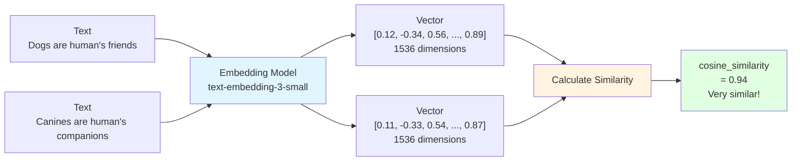

# 12.2 Embedding & Vector Database <DifficultyBadge level="intermediate" /> <CostBadge cost="$0.01" />

> Prerequisite: 12.1 RAG Basics

### Why Do We Need It? (Problem)

**Problem: How to calculate text similarity?**

```python
# Scenario: User searches "how to train dogs"
Document A: "Dog training methods include rewards and punishments..."
Document B: "Cat dietary habits are..."
Document C: "Canine training techniques involve positive reinforcement..."

# Keyword matching:
"train dogs" vs Document A → Hit "train" and "dog" ✅
"train dogs" vs Document B → No hits ❌
"train dogs" vs Document C → No hits ("canine", "training", no "dog" and "train") ❌

# Problem: Keyword matching cannot understand semantics
"dog" = "canine"?
"train" = "training"?
```

**Embedding's Role: Convert Semantics to Numbers**

```
Text → Embedding Model → Vector (numerical array)

"dog training"     → [0.8, 0.1, -0.3, ...]
"canine training"  → [0.78, 0.12, -0.28, ...]  # Vectors are close!
"cat diet"         → [-0.2, 0.9, 0.5, ...]     # Vectors are far!

Similarity = cosine_similarity(vector1, vector2)
```

### What Is It? (Concept)

**Embedding: Numerical Representation of Text**



**Mainstream Embedding Models:**

| Model | Provider | Dimensions | Cost | Performance |
|-----|-------|-----|------|-----|
| **text-embedding-3-small** | OpenAI | 1536 | $0.02/1M tokens | ⭐⭐⭐⭐ |
| **text-embedding-3-large** | OpenAI | 3072 | $0.13/1M tokens | ⭐⭐⭐⭐⭐ |
| **text-embedding-ada-002** | OpenAI | 1536 | $0.10/1M tokens | ⭐⭐⭐ |
| **embed-english-v3.0** | Cohere | 1024 | $0.10/1M tokens | ⭐⭐⭐⭐ |
| **bge-large-zh-v1.5** | BAAI | 1024 | Free (self-hosted) | ⭐⭐⭐⭐ |

**Similarity Calculation: Cosine Similarity**

```python
import numpy as np

def cosine_similarity(vec1, vec2):
    """Calculate cosine similarity between two vectors"""
    dot_product = np.dot(vec1, vec2)
    norm1 = np.linalg.norm(vec1)
    norm2 = np.linalg.norm(vec2)
    return dot_product / (norm1 * norm2)

# Example
vec_dog = [0.8, 0.1, -0.3]
vec_puppy = [0.78, 0.12, -0.28]
vec_cat = [-0.2, 0.9, 0.5]

print(cosine_similarity(vec_dog, vec_puppy))  # 0.998 (very similar)
print(cosine_similarity(vec_dog, vec_cat))    # -0.15 (not similar)
```

**Vector Database: Designed for Vector Search**

Traditional database vs Vector database:

```
MySQL (Traditional):
SELECT * FROM docs WHERE title LIKE '%dog%';
→ Exact matching, cannot understand semantics

Chroma (Vector Database):
SELECT * FROM docs ORDER BY vector_distance(embedding, query_vector) LIMIT 3;
→ Semantic search, find most similar content
```

**Mainstream Vector Database Comparison:**

| Database | Type | Features | Use Cases |
|-------|------|-----|---------|
| **Chroma** | Local/Cloud | Lightweight, easy to use, Python-friendly | Development, small-scale |
| **Pinecone** | Cloud Service | Managed, high performance, maintenance-free | Production |
| **Milvus** | Open Source | High performance, distributed, enterprise-grade | Large-scale deployment |
| **Weaviate** | Open Source/Cloud | GraphQL, hybrid search | Complex queries |
| **Qdrant** | Open Source/Cloud | Written in Rust, high performance | High performance requirements |
| **FAISS** | Local Library | Facebook open source, extremely fast | Research, prototyping |

### Hands-on Practice (Practice)

**Practice: Build Local Vector Search with ChromaDB**

```python
# 1. Installation
!pip install chromadb openai

# 2. Create vector store
import chromadb
from chromadb.utils import embedding_functions

# Use OpenAI Embedding
openai_ef = embedding_functions.OpenAIEmbeddingFunction(
    api_key="your-api-key",
    model_name="text-embedding-3-small"
)

client = chromadb.Client()
collection = client.create_collection(
    name="my_collection",
    embedding_function=openai_ef
)

# 3. Add documents
documents = [
    "Dogs are humans' most loyal friends, they are smart and friendly",
    "Cats are independent animals, they like quiet environments",
    "Canines need regular training and socialization",
    "Cat dietary habits are completely different from dogs"
]

collection.add(
    documents=documents,
    ids=["doc1", "doc2", "doc3", "doc4"]
)

# 4. Query
results = collection.query(
    query_texts=["How to train dogs?"],
    n_results=2
)

print("Relevant documents:")
for doc in results['documents'][0]:
    print(f"  - {doc}")

# Output:
# Relevant documents:
#   - Canines need regular training and socialization
#   - Dogs are humans' most loyal friends, they are smart and friendly
```

**Complete example in Notebook:**

<ColabBadge path="demos/12-rag-memory/vector_search.ipynb" />

### Summary (Reflection)

- **What's solved**: Understood Embedding principles and vector database functionality
- **What's not solved**: What if basic RAG retrieval performance is unsatisfactory? — Next section introduces advanced RAG techniques
- **Key Takeaways**:
  1. **Embedding converts semantics to vectors**: Semantic similarity → Vector proximity
  2. **Vector search is efficient**: Million-scale documents, millisecond-level retrieval
  3. **Mainstream Embedding models**: OpenAI, Cohere, open-source models
  4. **Vector databases**: Chroma (simple), Pinecone (managed), Milvus (enterprise-grade)
  5. **Similarity calculation**: Cosine Similarity, Euclidean distance, dot product

---

*Last updated: 2026-02-20*
