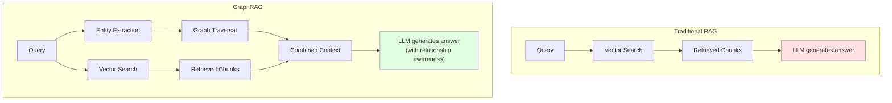

# 12.5 GraphRAG

<DifficultyBadge level="advanced" />
<CostBadge cost="$0.05" />

> Prerequisites: 12.1 RAG Basics, 12.2 Embeddings

### Why Do We Need It? (Problem)

Traditional RAG has a dirty secret: it's **terrible at answering questions about relationships**.

```
Your knowledge base:
  Doc 1: "Alice is the CTO of Acme Corp"
  Doc 2: "Acme Corp acquired Beta Inc in 2025"
  Doc 3: "Beta Inc's main product is CloudDB"

User: "What products does Alice's company have?"

Traditional RAG: Retrieves Doc 1 (Alice → Acme) and maybe Doc 3 (CloudDB)
But MISSES the connection: Alice → Acme → acquired Beta → CloudDB

GraphRAG: Builds a knowledge graph, follows the chain of relationships,
and correctly answers: "Alice's company Acme Corp acquired Beta Inc, 
which makes CloudDB."
```

::: tip Analogy
Traditional RAG is like a librarian who can find any book in the library, but doesn't understand that "the author of Book A" is the same person as "the professor mentioned in Book B." GraphRAG is the librarian who also maintains a mental map of how everything connects.
:::

### What Is It? (Concept)

**GraphRAG** = Knowledge Graph + Vector Retrieval working together.



**How it works:**

1. **Indexing Phase**: Extract entities and relationships from documents → Build a knowledge graph
2. **Query Phase**: Extract entities from the question → Traverse the graph for related entities → Combine with vector-retrieved chunks → Generate answer

**When to Use What:**

| Scenario | Traditional RAG | GraphRAG |
|----------|---------------|----------|
| "What's our refund policy?" | Great | Overkill |
| "How is project X related to team Y?" | Poor | Great |
| "Who approved the budget for feature Z?" | Miss connections | Follows the chain |
| Simple fact lookup | Perfect | Unnecessary overhead |
| Multi-hop reasoning | Struggles | Shines |

::: warning Honest Take
GraphRAG adds significant complexity and cost to your RAG pipeline. If 90% of your queries are simple fact lookups ("What's the API rate limit?"), stick with regular RAG. GraphRAG is for when your users ask questions that require connecting dots across documents.
:::

### Microsoft's GraphRAG Implementation

Microsoft open-sourced [graphrag](https://github.com/microsoft/graphrag) in 2024, and it's become the reference implementation.

**Core concept**: Uses LLMs to automatically extract entities and relationships from your documents, building a knowledge graph without manual annotation.

```python
# Simplified GraphRAG concept
# Step 1: Extract entities and relationships using LLM
prompt = """
Extract all entities and their relationships from this text:
"Alice joined Acme Corp as CTO in 2024. Acme Corp is headquartered in SF."

Output as JSON:
"""
# LLM returns:
# entities: [Alice, Acme Corp, CTO, SF, 2024]
# relations: [(Alice, ROLE_AT, Acme Corp), (Acme Corp, LOCATED_IN, SF)]

# Step 2: Store in graph database
# Step 3: At query time, traverse graph + vector search
```

### Summary (Reflection)

- **What we solved**: Understood when regular RAG fails and how GraphRAG fills the gap
- **Key takeaways**:
  1. Traditional RAG retrieves **chunks**, GraphRAG understands **relationships**
  2. Use GraphRAG when queries require **multi-hop reasoning** across documents
  3. **Don't over-engineer** — most Q&A systems work fine with regular RAG
  4. Microsoft's open-source implementation is the go-to starting point

> *"GraphRAG is the difference between knowing where all the puzzle pieces are and actually seeing the picture they form."*

---

*Last updated: 2026-02-22*
