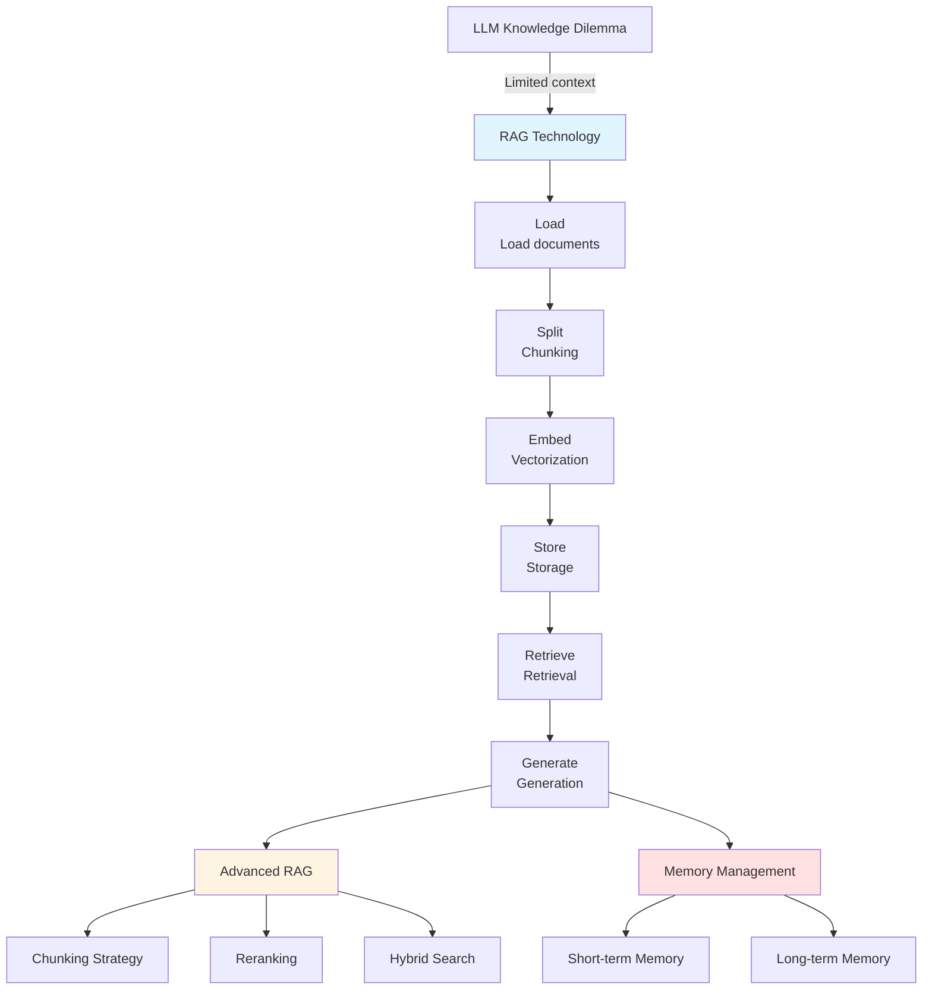
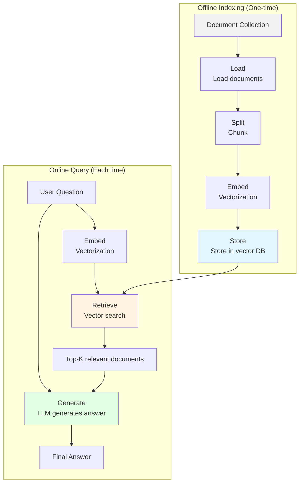

# Chapter 12: RAG & Memory Storage

> After completing this chapter, you will: Build RAG systems, use vector databases, implement AI memory management



**Chapter Overview:**

- **12.1 RAG Basics**: Understand RAG principles, build RAG system from scratch
- **12.2 Embedding & Vector Database**: Vectorization and vector search
- **12.3 Advanced RAG**: Chunking strategies, reranking, hybrid search
- **12.4 Memory & Storage**: AI memory management, maintaining conversational context

---

## 12.1 RAG Basics <DifficultyBadge level="intermediate" /> <CostBadge cost="$0.02" />

> Prerequisite: 3.1 LLM Fundamentals

### Why Do We Need It? (Problem)

**Problem: Three Knowledge Dilemmas of LLMs**

```
Dilemma 1: Outdated Knowledge
─────────────────
LLMs have training data cutoffs (e.g., GPT-4.1: June 2024, Claude Sonnet 4.6: Jan 2026)
User: "What happened at last week's conference?"
LLM: "I don't have information about recent events"

Dilemma 2: Private Data
─────────────────
Internal company documents, user data, codebase
LLM hasn't seen during training, cannot answer

Dilemma 3: Limited Context Length
─────────────────
GPT-4.1: 1M tokens (~2500 pages)
GPT-5: 400K tokens (~1000 pages)
But stuffing everything into Prompt:
  ❌ High cost (long context pricing adds up fast)
  ❌ Poor performance (information overload, attention dispersed)
  ❌ High latency (long processing time)
```

**Three Solution Comparison:**

| Solution | Principle | Advantages | Disadvantages | Use Cases |
|-----|------|-----|------|---------|
| **Long Context** | Stuff into Prompt | Simple | Expensive, slow, poor performance | Small-scale, one-time |
| **Fine-tuning** | Retrain model | Good performance | High cost, data becomes outdated, slow training | Specialized domains, stable knowledge |
| **RAG** | External knowledge base | Low cost, real-time updates, flexible | Retrieval quality affects performance | General scenarios, dynamic data |

**What is RAG?**

RAG = **R**etrieval **A**ugmented **G**eneration

```
Traditional LLM:
User question → LLM → Answer
(Only relies on training knowledge)

RAG:
User question → [Retrieve relevant knowledge] → LLM + knowledge → Answer
(Dynamically inject external knowledge)
```

**Real Case: Customer Service Chatbot**

```python
# Traditional way: Stuff everything into Prompt
prompt = f"""
You are a customer service chatbot, please answer user questions.

Company information:
{all product manuals}  # Assume 500,000 words
{all FAQs}             # Assume 100,000 words
{all policy documents} # Assume 50,000 words

User question: {question}
"""

Problems:
❌ 650,000 words ≈ 1.6 million tokens
❌ Cost: $16/query (GPT-4)
❌ Latency: 10+ seconds
❌ Performance: LLM overwhelmed by irrelevant information

# RAG way: Only retrieve relevant content
prompt = f"""
You are a customer service chatbot, please answer user questions.

Relevant information:
{3 retrieved relevant passages}  # Assume 2000 words

User question: {question}
"""

Advantages:
✅ 2000 words ≈ 500 tokens
✅ Cost: $0.005/query
✅ Latency: 1 second
✅ Performance: LLM focuses on relevant information
```

### What Is It? (Concept)

**RAG Workflow:**



**Six Core Steps:**

### 1. Load (Load Documents)

```python
# Support multiple formats
from langchain.document_loaders import (
    TextLoader,       # .txt
    PyPDFLoader,      # .pdf
    UnstructuredMarkdownLoader,  # .md
    CSVLoader,        # .csv
    JSONLoader,       # .json
    WebBaseLoader     # Web pages
)

# Example: Load PDF
loader = PyPDFLoader("document.pdf")
documents = loader.load()
```

### 2. Split (Chunk)

Why chunk?
- Embedding models have length limits (usually 512 tokens)
- Smaller chunks are more precise (during retrieval)
- Control costs (each query only returns a few small chunks)

```python
from langchain.text_splitter import RecursiveCharacterTextSplitter

text_splitter = RecursiveCharacterTextSplitter(
    chunk_size=1000,        # 1000 characters per chunk
    chunk_overlap=200,      # 200 characters overlap between chunks
    length_function=len,
    is_separator_regex=False,
)

chunks = text_splitter.split_documents(documents)
```

### 3. Embed (Vectorization)

Convert text to vectors (numerical arrays):

```python
from openai import OpenAI

client = OpenAI()

# Text → Vector
response = client.embeddings.create(
    model="text-embedding-3-small",
    input="This is a text"
)

vector = response.data[0].embedding
# [0.123, -0.456, 0.789, ...] (1536 dimensions)
```

**Why vectorization?**

```
Text A: "Dogs are human's best friend"
Text B: "Canines are human's good companions"

If using keyword matching:
  → No match (no common words)

If using vectors:
  → Vector A and Vector B are close (semantically similar)
  → cosine_similarity(A, B) = 0.92
```

### 4. Store (Storage)

Store vectors in vector database:

```python
from langchain.vectorstores import Chroma

vectorstore = Chroma.from_documents(
    documents=chunks,
    embedding=OpenAIEmbeddings(),
    persist_directory="./chroma_db"
)
```

### 5. Retrieve (Retrieval)

Based on question vector, retrieve most relevant document chunks:

```python
# User question
question = "What are the characteristics of dogs?"

# Retrieve Top-3 relevant documents
docs = vectorstore.similarity_search(question, k=3)

for doc in docs:
    print(doc.page_content)
```

### 6. Generate (Generate Answer)

Combine retrieved documents + question → LLM generates answer:

```python
from openai import OpenAI

client = OpenAI()

# Construct Prompt
context = "\n\n".join([doc.page_content for doc in docs])
prompt = f"""
Please answer the question based on the following information:

{context}

Question: {question}
"""

# Generate answer
response = client.chat.completions.create(
    model="gpt-4.1-mini",
    messages=[{"role": "user", "content": prompt}]
)

print(response.choices[0].message.content)
```

**Complete RAG Flow Code:**

```python
from langchain.document_loaders import TextLoader
from langchain.text_splitter import RecursiveCharacterTextSplitter
from langchain.embeddings import OpenAIEmbeddings
from langchain.vectorstores import Chroma
from openai import OpenAI

# 1. Load
loader = TextLoader("knowledge.txt")
documents = loader.load()

# 2. Split
text_splitter = RecursiveCharacterTextSplitter(
    chunk_size=1000,
    chunk_overlap=200
)
chunks = text_splitter.split_documents(documents)

# 3. Embed + 4. Store
vectorstore = Chroma.from_documents(
    documents=chunks,
    embedding=OpenAIEmbeddings()
)

# 5. Retrieve
question = "User's question"
docs = vectorstore.similarity_search(question, k=3)

# 6. Generate
client = OpenAI()
context = "\n\n".join([doc.page_content for doc in docs])
prompt = f"Answer based on the following information:\n\n{context}\n\nQuestion: {question}"

response = client.chat.completions.create(
    model="gpt-4.1-mini",
    messages=[{"role": "user", "content": prompt}]
)

print(response.choices[0].message.content)
```

**RAG vs Fine-tuning vs Long Context:**

| Dimension | RAG | Fine-tuning | Long Context |
|-----|-----|-------------|-------------|
| **Cost** | Low ($0.01/query) | High ($100-$10,000) | Medium ($0.30/query) |
| **Real-time** | Real-time updates | Need retraining | Real-time |
| **Data volume** | Unlimited (external DB) | Limited (training set) | Limited (128K tokens) |
| **Accuracy** | Medium (depends on retrieval) | High | Medium (attention dispersed) |
| **Latency** | Medium (retrieval + generation) | Low (direct generation) | High (long text processing) |
| **Use cases** | Dynamic knowledge, general | Specialized domains, fixed knowledge | Single document analysis |

::: tip Fun Fact
The "R" in RAG stands for "Retrieval" — but most RAG failures are actually retrieval failures. A RAG system is only as good as its search quality. It's like having a genius assistant who can answer anything... but the filing cabinet they search through is a total mess.
:::

### Hands-on Practice (Practice)

Complete RAG system implementation, build knowledge base from text files and answer questions.

<ColabBadge path="demos/12-rag-memory/basic_rag.ipynb" />

### Summary (Reflection)

- **What's solved**: Understood how RAG solves LLM knowledge dilemmas, mastered basic RAG flow
- **What's not solved**: RAG core is vector search, but what are vectors? How do vector databases work? — Next section explains in detail
- **Key Takeaways**:
  1. **RAG solves three dilemmas**: Outdated knowledge, private data, context length
  2. **Six-step flow**: Load → Split → Embed → Store → Retrieve → Generate
  3. **Core principle**: Retrieve relevant knowledge, dynamically inject into Prompt
  4. **Cost advantage**: Only retrieve relevant content, no need for full training or full input
  5. **Real-time updates**: Knowledge base updates take effect immediately
  6. **RAG vs other solutions**: Each has pros and cons, choose based on scenario

**Key Insights:**
- RAG doesn't replace Fine-tuning, they're **complementary**: Fine-tuning improves model capability, RAG provides latest knowledge
- RAG effectiveness **highly depends on retrieval quality**: Poor retrieval makes even strong LLMs useless

::: tip Agent Memory Systems
Beyond RAG, agents need memory management for continuous interactions (see [hello-agents Chapter 8](https://datawhalechina.github.io/hello-agents/#/)):

| Memory Type | Purpose | Implementation |
|-------------|---------|---------------|
| **Short-term Memory** | Current conversation context | Message history in context window |
| **Long-term Memory** | Persistent knowledge across sessions | Vector DB + retrieval |
| **Episodic Memory** | Past interaction experiences | Structured logs with semantic search |

Modern agent frameworks combine RAG (for knowledge) with episodic memory (for experience) to create agents that learn and improve over time.
:::

---

*Last updated: 2026-02-20*
