---
prev:
  text: '12.6 Agentic RAG'
  link: '/12-rag-memory/agentic-rag'
next:
  text: '13.1 Guardrails'
  link: '/13-production/'
---

# 12.7 AI Memory Product Landscape

## The Difference Between Goldfish and Great Assistants

If you've ever had a conversation with an AI chatbot for more than five minutes, you've probably experienced this frustration:

> **You**: "I just said I'm allergic to seafood."  
> **AI**: "Okay! Then I recommend this amazing seafood restaurant..."  

Goldfish supposedly have a 7-second memory (though that's a myth), but at least they won't actively recommend foods you're allergic to.

**Memory is the key difference between a goldfish and a great assistant.**

In 2024, AI memory was a "nice to have" premium feature; by 2026, it has become a **necessity** for AI applications. An AI Agent without a memory system is like a secretary with amnesia — every conversation is a first meeting, every question needs to be explained from scratch.

This chapter will take you through the 2026 AI memory product landscape, from open-source frameworks to enterprise solutions, exploring how these tools can transform your AI from a "one-question-one-answer vending machine" into an intelligent partner that truly "remembers you."

## Why AI Memory Matters So Much in 2026

### From Optional to Essential

**2023-2024**: Memory was an experimental feature
- LangChain's `ConversationBufferMemory` was mainstream
- Most apps relied on cramming history into context windows
- Memory management was a "nice to have" bonus

**2025-2026**: Memory became core infrastructure
- Users expect AI to remember cross-session preferences and context
- Enterprise apps need compliant memory storage and retrieval
- Multi-agent collaboration requires shared memory pools
- Personalized recommendations depend on long-term memory accumulation

::: tip Real Case
A customer service AI that doesn't remember a customer already complained about the same issue last week will make them explain the problem 3 times. That's not "intelligent customer service," that's "intelligence-challenged service."
:::

### Memory vs Context Window: Not the Same Thing

Many people mistakenly think "GPT-4 has a 128K context window, do we still need a memory system?"

| Feature | Context Window | Memory System |
|---------|---------------|---------------|
| **Lifecycle** | Single session | Cross-session persistence |
| **Capacity** | Model-limited (e.g., 128K tokens) | Theoretically unlimited |
| **Cost** | Per-token billing, long context expensive | Independent storage, controllable cost |
| **Retrieval** | Sequential reading, no structured queries | Vector retrieval, graph queries, temporal filtering |
| **Update** | Not editable | Add, delete, modify |

**Context window** is like your work desk — limited space, cleared after the session.  
**Memory system** is like your filing cabinet — categorized storage, retrieve anytime, permanent preservation.

## AI Memory Classification

Before diving into product comparisons, we need to understand basic memory classification. This framework borrows from cognitive psychology and neuroscience:

### 1. Short-term Memory

**Time Range**: Current session  
**Typical Usage**: Conversation context, temporary task state  
**Technical Implementation**: Context window, Redis cache

```python
# Short-term memory example: maintaining conversation history
short_term = {
    "messages": [
        {"role": "user", "content": "I want to buy a laptop"},
        {"role": "assistant", "content": "What's your budget?"}
    ]
}
```

### 2. Long-term Memory

**Time Range**: Cross-session, permanent  
**Typical Usage**: User profiles, knowledge base, interaction history  
**Technical Implementation**: Vector databases, relational databases

```python
# Long-term memory example: user preference profile
long_term = {
    "user_id": "user_123",
    "preferences": {
        "budget_range": "5000-8000 RMB",
        "brand_preference": ["Apple", "ThinkPad"],
        "allergies": ["seafood", "peanuts"]
    }
}
```

### 3. Episodic Memory

**Content Type**: Specific events, interaction history  
**Typical Usage**: "That restaurant you recommended last time", "The project we discussed in March"  
**Technical Implementation**: Timestamped event streams, retrieval-augmented generation

### 4. Semantic Memory

**Content Type**: Abstract knowledge, conceptual relationships  
**Typical Usage**: "User likes Japanese cuisine", "Customer A and Customer B have a partnership"  
**Technical Implementation**: Knowledge graphs, vector embeddings

::: info Memory Hierarchy Analogy
- **Short-term Memory** = Computer RAM
- **Long-term Memory** = Hard drive
- **Episodic Memory** = Photo album (with timestamps)
- **Semantic Memory** = Wikipedia (structured knowledge)
:::

## 2026 Mainstream AI Memory Product Comparison

### Product Comparison Table

| Product | Maintainer | Core Features | Use Cases | Open/Commercial | Pricing Model |
|---------|-----------|---------------|-----------|-----------------|---------------|
| **Mem0** | Mem0 AI | Auto memory extraction, multi-tier storage | Conversational AI, Agent memory | Open + Managed | Free tier + per-call billing |
| **Letta** | Letta (formerly MemGPT) | Self-editing memory, layered architecture | Complex Agents, long-term tasks | Open + Cloud | Open free, cloud from $49/mo |
| **MemOS** | Tencent | AI memory OS | Enterprise multi-agent | Beta | Enterprise pricing |
| **Graphiti** | Zep | Temporal knowledge graph | Relationship-intensive apps | Open | Free |
| **LangMem** | LangChain | LangGraph native memory | LangGraph Agents | Open | Free |
| **A-MEM** | Academic | Multimodal memory framework | Research prototype | Open | Free |

### Detailed Product Analysis

#### 🧠 Mem0: The Most Accessible Memory Layer

**Website**: https://mem0.ai  
**GitHub**: https://github.com/mem0ai/mem0

**Core Selling Points**:
- **Auto Memory Extraction**: No manual tagging, AI automatically extracts key info from conversations
- **Multi-tier Storage**: L1 (working memory) → L2 (short-term memory) → L3 (long-term memory)
- **Managed Service**: Don't want to self-host? Use the official API

**Typical Workflow**:
```
User conversation → Mem0 auto-extracts key info → Store in vector DB → Subsequent conversations auto-retrieve relevant memories
```

**Advantages**:
- Simple onboarding, 5-minute integration
- Official managed service eliminates ops costs
- Supports multi-user, multi-agent memory isolation

**Disadvantages**:
- Memory extraction accuracy depends on underlying LLM
- Managed service pricing can be expensive in high-concurrency scenarios

::: code-group
```python [Mem0 Integration Example]
from mem0 import Memory

# Initialize memory system
memory = Memory()

# Add memory (auto-extraction)
messages = [
    {"role": "user", "content": "My name is Zhang Wei, I work in Beijing"},
    {"role": "assistant", "content": "Hello Zhang Wei!"},
    {"role": "user", "content": "I like Sichuan cuisine but no chili"}
]

memory.add(messages, user_id="user_001")

# Retrieve relevant memories
query = "Recommend a restaurant"
relevant_memories = memory.search(
    query=query, 
    user_id="user_001",
    limit=3
)

print(relevant_memories)
# Output:
# [
#   {"memory": "User's name is Zhang Wei", "score": 0.85},
#   {"memory": "User likes Sichuan cuisine", "score": 0.92},
#   {"memory": "User doesn't eat chili", "score": 0.88}
# ]

# Integrate memories into prompt
prompt = f"""
User query: {query}

Relevant memories:
{chr(10).join([f"- {m['memory']}" for m in relevant_memories])}

Please recommend restaurants based on memories.
"""
```

```typescript [TypeScript Version]
import { Memory } from '@mem0/sdk';

const memory = new Memory({ apiKey: process.env.MEM0_API_KEY });

// Add memory
await memory.add(
  [
    { role: 'user', content: 'My name is Zhang Wei, I work in Beijing' },
    { role: 'user', content: 'I like Sichuan cuisine but no chili' }
  ],
  { userId: 'user_001' }
);

// Retrieve memory
const memories = await memory.search({
  query: 'Recommend a restaurant',
  userId: 'user_001',
  limit: 3
});

console.log(memories);
```
:::

#### 🤖 Letta (formerly MemGPT): Academic Self-Evolving Memory

**Website**: https://letta.ai  
**GitHub**: https://github.com/letta-ai/letta

**Core Idea**: Inspired by OS virtual memory, let AI manage its own memory

**Layered Architecture**:
```
┌─────────────────────────────────────────┐
│  Recall Memory                          │  ← Active retrieval
├─────────────────────────────────────────┤
│  Archival Memory                        │  ← Long-term storage
├─────────────────────────────────────────┤
│  Core Memory                            │  ← Always loaded
│  - Persona                              │
│  - Human Info                           │
└─────────────────────────────────────────┘
```

**Unique Features**:
- **Self-editing Memory**: Agent can actively modify its own core memory
- **Memory Paging**: Auto-paging when exceeding context limits
- **Function Call Driven**: Operate memory via function calling

**Applicable Scenarios**:
- Long-running Agents (e.g., personal assistant, project manager Agent)
- Scenarios requiring Agent autonomous learning and behavior adjustment

**Example**:
```python
from letta import create_client

client = create_client()

# Create Agent with memory
agent = client.create_agent(
    name="personal_assistant",
    persona="You are a thoughtful personal assistant",
    human="User is a software engineer who likes efficient workflows"
)

# Agent auto-manages memory during conversation
response = agent.send_message(
    "I'm going to Shanghai next week, remember this"
)

# Agent's internal operations (automatic):
# 1. Call core_memory_append("User going to Shanghai next week")
# 2. Generate reply: "Noted, should I help you check flights?"
```

#### 🏢 MemOS: Tencent's Enterprise Memory OS

**Release Time**: Late 2025 beta, early 2026 public launch  
**Positioning**: "Memory OS" for AI applications

**Core Architecture**:
- **Unified Memory Bus**: All Agents share a memory pool
- **Permission Management**: Fine-grained memory access control
- **Multimodal Support**: Unified memory representation for text, images, audio
- **Compliance**: Built-in data desensitization, audit logs

**Enterprise Features**:
- Private deployment
- Compliant with China data security regulations
- Integration with WeChat Work, Tencent Meeting ecosystems

**Typical Customers**:
- Large enterprise customer service systems
- Government AI assistants
- Financial industry risk control Agents

::: warning Commercial Product
MemOS currently doesn't provide a public open-source version, only for enterprise customers. Pricing reportedly uses dual-track billing based on "memory storage volume" and "API call count."
:::

#### 🕸️ Graphiti (by Zep): Graph Database Enthusiasts' Blessing

**GitHub**: https://github.com/getzep/graphiti  
**Maintainer**: Zep (famous LangChain memory plugin developer)

**Core Features**:
- **Temporal Knowledge Graph**: Every memory node has a timestamp
- **Relationship Reasoning**: Auto-discover implicit relationships between entities
- **Time Travel**: "In March 2025, what was the relationship between Customer A and Supplier B?"

**Data Model**:
```
(User:Zhang Wei)-[:WORKS_AT {since: "2024-01"}]->(Company:TechCorp)
(User:Zhang Wei)-[:LIKES {intensity: 0.9}]->(Food:Sichuan Cuisine)
(Food:Sichuan Cuisine)-[:CONTAINS]->(Ingredient:Chili)
(User:Zhang Wei)-[:AVOIDS {reason: "allergy"}]->(Ingredient:Seafood)
```

**Query Example**:
```python
# Query: "Sichuan restaurants Zhang Wei can eat"
query = """
MATCH (user:User {name: 'Zhang Wei'})-[:LIKES]->(cuisine:Cuisine {name: 'Sichuan Cuisine'})
MATCH (user)-[:AVOIDS]->(avoid:Ingredient)
MATCH (restaurant:Restaurant)-[:SERVES]->(cuisine)
WHERE NOT (restaurant)-[:USES]->(avoid)
RETURN restaurant
"""
```

**Applicable Scenarios**:
- Social relationship-intensive apps (e.g., recommendation systems)
- Agents requiring complex reasoning (e.g., detective, investigation Agents)
- Knowledge-intensive scenarios (e.g., enterprise knowledge graphs)

#### 🦜 LangMem: LangChain's Official Memory Solution

**GitHub**: https://github.com/langchain-ai/langmem  
**Release Time**: October 2025

**Design Philosophy**:
- **LangGraph Native**: Seamless integration with LangGraph state management
- **Modular**: Pluggable memory backends (PostgreSQL, Pinecone, Qdrant...)
- **Out-of-the-box**: Zero-config default memory strategy

**Integration Example**:
```python
from langgraph.graph import StateGraph
from langmem import LangMem

# Initialize memory layer
memory = LangMem(backend="postgresql://localhost/memories")

# Use in LangGraph
def chatbot_node(state):
    # Auto-retrieve relevant memories
    memories = memory.retrieve(
        query=state["user_input"],
        user_id=state["user_id"]
    )
    
    # Enhance prompt
    enriched_prompt = f"{state['user_input']}\n\nMemories:{memories}"
    
    # ... Call LLM
    
    # Auto-save new memories
    memory.save(
        content=state["assistant_response"],
        user_id=state["user_id"]
    )
    
    return state

workflow = StateGraph()
workflow.add_node("chat", chatbot_node)
# ...
```

**Advantages**:
- Zero learning curve for LangChain ecosystem users
- Official maintenance, long-term support guaranteed

**Disadvantages**:
- Relatively basic features, advanced capabilities (like knowledge graphs) need self-extension

#### 🔬 A-MEM & GAM: Academic Exploration

**A-MEM (Associative Memory Framework)**:
- Inspired by human associative memory
- Supports multimodal memory (text + images + audio)
- Paper: [ArXiv 2024](https://arxiv.org/abs/2401.12345)

**GAM (General Agentic Memory)**:
- Unified memory representation format
- Cross-framework memory migration protocol
- Goal: Enable memory interoperability between Mem0, Letta, LangMem

::: tip Academic Project Usage Advice
These projects are better suited for research and prototype validation. For production, recommend waiting for maturity or choosing commercial products.
:::

## How to Choose the Right Memory Solution

### Decision Tree

```mermaid
graph TD
    A[Start Selection] --> B{Need enterprise deployment?}
    B -->|Yes| C{In China?}
    C -->|Yes| D[MemOS]
    C -->|No| E[Letta Cloud or self-host]
    
    B -->|No| F{Using LangChain?}
    F -->|Yes| G[LangMem]
    F -->|No| H{Budget and technical capability?}
    
    H -->|Quick launch, have budget| I[Mem0 Managed Service]
    H -->|Self-host, pursue performance| J{Need knowledge graph?}
    
    J -->|Yes| K[Graphiti + Vector DB]
    J -->|No| L[Mem0 Open Source]
```



### Scenario Recommendations

| Scenario | Recommended Solution | Reason |
|----------|---------------------|--------|
| **MVP/Quick Prototype** | Mem0 Managed Service | 5-min integration, no ops |
| **Personal Assistant Agent** | Letta | Self-editing memory, strong long-term learning |
| **Enterprise Customer Service** | MemOS (China) / Letta (Global) | Compliance + Multi-Agent collaboration |
| **Social Recommendation** | Graphiti | Strong relationship reasoning |
| **LangGraph Project** | LangMem | Ecosystem consistency |
| **Academic Research** | A-MEM / GAM | Latest research |

### Cost Considerations

**Managed Service Cost Estimate** (Mem0 example):

| User Scale | Monthly Active Memory Ops | Estimated Cost |
|-----------|---------------------------|----------------|
| Small (< 1000 users) | 100K ops | $29/mo |
| Medium (1K-10K users) | 1M ops | $299/mo |
| Large (> 10K users) | 10M ops | $2999/mo or self-host |

**Self-hosting Cost**:
- Vector DB (Qdrant/Pinecone): $100-500/mo
- Computing resources: $50-200/mo
- Personnel maintenance: Depends on team size

::: tip Cost Optimization Tips
- **Small projects**: Use managed service, saved time value > hosting fee
- **Large projects**: Self-host, lower long-term cost and controllable
- **Hybrid**: Managed for dev, self-hosted for production
:::

## Real-World: Building Memory-Driven Customer Service Agent with Mem0

Let's use a complete example to show how to integrate Mem0 to build a customer service AI that "truly remembers customers."

### Requirement Scenario

An e-commerce customer service system needs to:
1. Remember customer order history
2. Remember customer complaints and preferences
3. Maintain cross-session context

### Code Implementation

::: code-group
```python [Complete Implementation]
import os
from mem0 import Memory
from openai import OpenAI

# Initialize
memory = Memory()
openai_client = OpenAI(api_key=os.environ["OPENAI_API_KEY"])

def customer_service_agent(user_id: str, user_message: str) -> str:
    """Customer service Agent with memory"""
    
    # 1. Retrieve relevant memories
    relevant_memories = memory.search(
        query=user_message,
        user_id=user_id,
        limit=5
    )
    
    # 2. Build enhanced prompt
    memory_context = "\n".join([
        f"- {m['memory']}" for m in relevant_memories
    ])
    
    system_prompt = f"""
You are a thoughtful e-commerce customer service rep.

Historical memories about this customer:
{memory_context if memory_context else "(No historical memories yet)"}

Please provide personalized service based on memories. If customer complained before, proactively mention and ask if issue is resolved.
"""
    
    # 3. Call LLM
    response = openai_client.chat.completions.create(
        model="gpt-4",
        messages=[
            {"role": "system", "content": system_prompt},
            {"role": "user", "content": user_message}
        ]
    )
    
    assistant_reply = response.choices[0].message.content
    
    # 4. Save new memory
    memory.add(
        [
            {"role": "user", "content": user_message},
            {"role": "assistant", "content": assistant_reply}
        ],
        user_id=user_id
    )
    
    return assistant_reply

# Test conversation
if __name__ == "__main__":
    user_id = "customer_12345"
    
    # First conversation
    print("Customer:", msg1 := "My earphones have static noise")
    print("Service:", customer_service_agent(user_id, msg1))
    # Output: "Very sorry for the inconvenience. Which model? We'll handle it immediately."
    
    print("\n--- Three days later ---\n")
    
    # Second conversation (new session)
    print("Customer:", msg2 := "I want to check my order")
    print("Service:", customer_service_agent(user_id, msg2))
    # Output: "Sure! By the way, is the earphone static issue resolved? Need me to check after-sales progress?"
    # ☝️ Notice: Agent proactively mentioned the previous issue!
```

```python [Memory Management Tools]
def view_customer_memories(user_id: str):
    """View all memories for a customer"""
    all_memories = memory.get_all(user_id=user_id)
    print(f"\n=== Customer {user_id} Memory Profile ===")
    for idx, mem in enumerate(all_memories, 1):
        print(f"{idx}. {mem['memory']} (relevance: {mem['score']:.2f})")

def delete_outdated_memories(user_id: str, days: int = 90):
    """Delete memories older than N days"""
    from datetime import datetime, timedelta
    cutoff_date = datetime.now() - timedelta(days=days)
    
    all_memories = memory.get_all(user_id=user_id)
    for mem in all_memories:
        if mem['created_at'] < cutoff_date:
            memory.delete(memory_id=mem['id'])
            print(f"Deleted expired memory: {mem['memory']}")

# Usage example
view_customer_memories("customer_12345")
delete_outdated_memories("customer_12345", days=90)
```
:::

### Effect Comparison

**Without Memory System**:
```
Customer: "Where's my order?"
Service: "Please provide order number."
Customer: "I just said it!" 😡
```

**With Memory System**:
```
Customer: "Where's my order?"
Service: "You mean yesterday's earphone order (Order #12345)? It's shipped, arriving tomorrow." ✅
```

## Advanced Topics in Memory Systems

### 1. Memory Conflict Resolution

What to do when new memory contradicts old memory?

**Case**:
- Old memory: "User likes spicy food"
- New info: "User says no more spicy food"

**Handling Strategies**:
- **Time Priority**: New memory overwrites old (Mem0 default)
- **Confidence Weighting**: Decide based on source reliability
- **Version Control**: Keep history, mark "expired"

### 2. Multi-Agent Memory Sharing

**Scenario**: Info recorded by Customer Service Agent A, Sales Agent B also needs to know.

**Solution**:
```python
# Global memory pool
memory.add(
    content="Customer is price-sensitive",
    user_id="customer_123",
    metadata={
        "visibility": "global",  # All Agents can see
        "created_by": "customer_service_agent"
    }
)

# Agent B auto-retrieves
memories = memory.search(
    query="Recommend products",
    user_id="customer_123",
    filters={"visibility": "global"}
)
```

### 3. Privacy & Compliance

**GDPR / China Personal Information Protection Law** requirements:
- ✅ Users have right to view their memory data
- ✅ Users have right to delete their memory
- ✅ Sensitive info (like ID numbers) needs desensitization

**Implementation**:
```python
# User requests data deletion
def handle_deletion_request(user_id: str):
    memory.delete_all(user_id=user_id)
    print(f"Deleted all memories for user {user_id}")

# Sensitive info desensitization
def sanitize_memory(text: str) -> str:
    import re
    # Desensitize ID numbers
    text = re.sub(r'\d{17}[\dXx]', '***ID***', text)
    # Desensitize phone numbers
    text = re.sub(r'1[3-9]\d{9}', '***Phone***', text)
    return text
```

## One-Liner Summary

**The core of AI memory products is "making AI remember the right thing at the right time"** — Choose Mem0 for quick start, Letta for deep customization, MemOS for compliance, Graphiti for relationship mastery; whichever you pick, test "memory retrieval accuracy" not "storage capacity," because an assistant with good memory but always off-topic answers is no better than a goldfish.

---

::: info Related Resources
- [Mem0 Official Docs](https://docs.mem0.ai)
- [Letta Quickstart](https://docs.letta.ai/quickstart)
- [Graphiti GitHub](https://github.com/getzep/graphiti)
- [LangMem Integration Guide](https://python.langchain.com/docs/modules/memory/)
:::

::: tip Next Steps
After learning about memory systems, the next chapter will cover a critical production topic: **Guardrails** — How to prevent your AI from remembering what it shouldn't, or saying what it shouldn't.
:::
